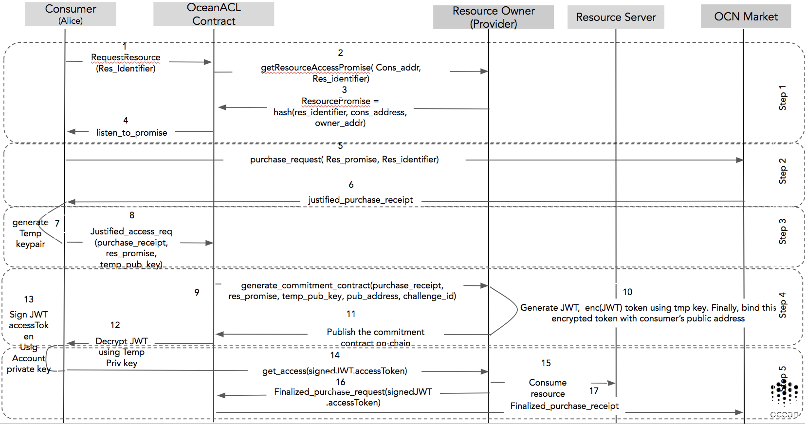

```
shortname: 10/AUTH
name: On-chain Access Control
type: Standard
status: Raw
editors: 
contributors: Ahmed Ali <ahmed@oceanprotocol.com>, 
              Samer Sallam <samer@oceanprotocol.com>
```
***DISCLAIMER: THIS IS A WORK IN PROGRESS***

Table of Contents
=================

  * [Table of Contents](#table-of-contents)
  * [On Chain Access Control](#on-chain-access-control)
     * [Change Process](#change-process)
     * [Language](#language)
     * [Motivation](#motivation)
     * [Design Requirements](#design-requirements)
     * [Introduction](#introduction)
        * [Json Web Token](#json-web-token)
        * [Json Resource Decriptor](#json-resource-descriptor)
        * [OAuth 2.0 Flow](#oauth-2.0-flow)
        * [Factory Design Pattern](#factory-design-pattern)
     * [Key Technologies](#key-technologies)  
     * [Access Control Components](#access-control-components)
        * [Resource](#resource)
        * [Resource Promise](#resource-promise)
        * [Justified Purchase Receipt](#justified-purchase-receipt)
        * [Challenge Identifier](#challenge-identifier)
        * [JWT Token](#jwt-token)
        * [Commitment Contract](#commitment-contract)
        * [Temp KeyPair](#temp-keypair)
        * [Finalized Purchase Receipt](#finalized-purchase-receipt)
     * [Access Control Flow](#access-control-flow)
     * [Threat Models](#threat-models)
        * [Censorship Attacks](#censorship-attack)
        * [Fake and Delayed Access](#fake-and-delayed-access)
     * [References](#references)
     


# On Chain Access Control

This document describes the On chain access control: the main [requirements](https://github.com/oceanprotocol/OEPs/tree/master/4#access-control), 
functions, components and implementation details.

## Change Process
This document is governed by the [2/COSS](../2/README.md) (COSS).

## Language
The key words "MUST", "MUST NOT", "REQUIRED", "SHALL", "SHALL NOT", "SHOULD", "SHOULD NOT", "RECOMMENDED", "NOT RECOMMENDED", "MAY", and "OPTIONAL" in this document are to be interpreted as described in [BCP 14](https://tools.ietf.org/html/bcp14) \[[RFC2119](https://tools.ietf.org/html/rfc2119)\] \[[RFC8174](https://tools.ietf.org/html/rfc8174)\] when, and only when, they appear in all capitals, as shown here.

## Motivation

The goal of this document is to provide a technical details about on-chain access control in ocean protocol.

In the Ocean network, entities, individuals and organizations have challenging problems 
of effectively managing their resources on-chain. As the advent of outsourcing data, 
the need for verifiable access control through public blockchains is dramatically increasing. 


## Design Requirements

Ocean's on-chain access control SHOULD provide the following responsibilities: 

- Verifiable on-chain Access control.
- Accountability (bad actors abusing the system)
- Integrity of different Authentication mechanisms
- Unlinkability and anonymity of users's transaction
- Expose on-chain/off-chain interfaces for access control 

## Introduction

In this section, we are going to list the most key technologies that will be used as building blocks in order to develop 
on-chain based access control for ocean. You can skip this introductory part if you already 
familiar with [Json Web Token](#json-web-token), [Json Resource Descriptor](#json-resource-descriptor),
 [OAuth 2.0 Flow](#oauth-2.0-flow), and [Factory Design Pattern](#factory-design-pattern).
 
### Json Web Token

Json web token (JWT) is used to represent claims securely between parties. It could be stored on 
local storage. It uses
Open Standard [RFC7519](https://tools.ietf.org/html/rfc7519). The key point is that every token is digitally signed by 
the issuer (resource owner) using different supported schemes such as [RSA](https://en.wikipedia.org/wiki/RSA_(cryptosystem)#Signing_messages), 
[ECDSA](https://en.wikipedia.org/wiki/Elliptic_Curve_Digital_Signature_Algorithm), [HMAC](https://en.wikipedia.org/wiki/HMAC). 
The json is stored in an encoded form such as [Base64URL](https://tools.ietf.org/html/rfc7515#appendix-C) where it is easy to 
 be verified by the authorization server. The JWT is fully compatible with [OAuth 2.0](#oauth-2.0-flow) standard.

#### Use cases
The main two use cases are the authorization, and information exchange. Authorization could be conducted in case of 
a user logged in, as a resource owner you can include this token for each the request sent to the client. 
Also, it could be used for information exchange where JWT uses pub/priv 
key pairs to sign claims as shown below.

#### JWT structure:

JWT structure includes three components:
- Header:

This part includes the name of hashing algorithm and the type of token itself. It includes the name of hashing algorithm due to the wide range of 
hashing algorithms, so we don't know which one exactly will be used by the authorization server.
```json
{
  "alg": "HS256", // hashing algorithm
  "typ": "JWT"   // type of the token
}
```

- Payload:

This part includes all claims that authorization server will provide for access in the future. There are three
types of claims the first one is <code>*[Registered claims](https://tools.ietf.org/html/rfc7519#section-4.1)*</code> 
. It is not a  <code>mandatory</code> but it is preferable to be included. Registered claims section has the following items:

    - "iss" (Issuer) Claim
    - "sub" (Subject) Claim
    - "aud" (Audience) Claim
    - "exp" (Expiration Time) Claim
    - "nbf" (Not Before) Claim
    - "iat" (Issued At) Claim
    - "jti" (JWT ID) Claim

There is another type of claims called <code>*Public claims*</code> which is basically, any claim 
that could be either registered in [IANA "JSON Web Token Claims"](https://www.iana.org/assignments/jwt/jwt.xhtml) registry  or 
any public name but it must be a collision resistant name. 
Finally, the last one is <code>Private claims</code>
where any claim could be used by the consumer and provider (shared between parties). 

An example for payload:

```json
{
  "sub": "1234567890",
  "name": "John Smith",
  "admin": true
}
```

- Signature:

Signature is verifiable way to prove for the authorization server that he is the one who signed this token. The signature includes
the header and payload as shown below:

```bash
HMACSHA256(
  base64UrlEncode(header) + "." +
  base64UrlEncode(payload),
  secret)
```

For more information check out this article [introduction to JWT](https://self-issued.info/docs/draft-ietf-oauth-json-web-token.html). 


### Json Resource Descriptor

Json resource descriptor or JRD is a standard which is based on [Extensible Resource Descriptor](https://www.packetizer.com/rfc/rfc6415/). It has been used 
as meta data description for resources on the web where a discovery service such as [WebFinger](https://www.techabulary.com/w/webfinger/) 
could be used to return public information published about an account, organization, or entity. JRD has the following components:

- expires
- subject
- aliases
- properties
- links

An example for JRD:

```json
{
  "subject" : "acct:jsmith@myapp.com",
  "properties" :
  {
    "http://myapp.com/ns/name" : "John E. Smith"
  },
  "links" :
  [
    {
      "rel" : "http://webfinger.net/rel/profile-page",
      "href" : "http://www.myapp.com/people/jsmith/"
    },
    {
      "rel" : "http://myapp.com/rel/blog",
      "type" : "text/html",
      "href" : "http://www.myapp.com/people/paulej/blog/",
      "titles" :
      {
        "en-us" : "John Smith's Blog"
      }
    }
  ]
}
```
You can find more details about JRD [RFC6415](https://www.packetizer.com/rfc/rfc6415/).


### OAuth 2.0 Flow

The following Figure describes the flow of OAuth 2.0:


####  OAuth actors and components:

- client: TBC
- Authorization Server: TBC
- Authorization Grant : TBC
- Access Token: TBC
- Scope: TBC
- Resource Owner: TBC
- Resource Server: TBC
- Redirect URI
- Consent: TBC
- Front Channel: TBC
- Back Channel: TBC


OAuth 2.0 protocol is not designed for authentication but mainly Authorization. 

TBC 


### Factory Design Pattern

TBC


## Key Technologies

This survey provides a list of projects. We are going to discuss and curate the available systems that already had been developed. These projects 
provide an on-chain/off-chain identity management. 
The following table lists some of them:

 

For more information check out this [List of Blockchain based Identity Management systems](https://github.com/peacekeeper/blockchain-identity/).


You can find the curated list of these projects here [keytechnologies.md](keytechnologies.md). It has a detailed description about [Jolocom IMS](keytechnologies.md#jolocom-ims), 
[Blockstack IMS](keytechnologies.md#blockstack-ims), [Permissioned Blocks](keytechnologies.md#permissioned-blocks), [Consensys UPort](keytechnologies.md#consensys-uport), [DID Project](keytechnologies.md#did-project),
[Kimono Secret Sharing](keytechnologies.md#kimono-secret-sharing), [Secret Store Parity](keytechnologies.md#secret-store-parity) [WebID OIDC](keytechnologies.md#webid-oidc)

## Access Control Components

This section shows the key components that will be used to build the access control in ocean.

### Resource

It uses something similar to the Json Resource Descriptor or [JRD](#json-resource-descriptor) object. It is based on Key/Value pairs that include
 the following sections:

    - Name
    - Properties
    - Links
    - Access

For instance the below json is a sample resource description (THIS IS NOT THE FINAL RESOURCE TEMPLATE):

```json

{
  "name" : "1000Genome_dataset_snp_genotyping",
  "properties" :
  {
    "sample_id" : "Exfe23def23jx1flshu3mx",
    "sample_owner": "John E. Smith"
  },
  "access": {
    "permissioned": true,
    "discovery": "https://accounts.test.com/.well-known/openid-configuration",
    "method": "HTTP/HTTPS",
    "expire_period": 1233339
  },
  "links" :{
      "sample1" : "ftp://ftp.1000genomes.ebi.ac.uk/vol1/ftp/sample1.tree",
      "sample2" : "ftp://ftp.1000genomes.ebi.ac.uk/vol1/ftp/sample2.tree"
    },
}
```

And the resource identifier is <code>hash(JRD) = 2BEDD341F1851A9C9DE53F1A1A9CBA5AABC9BE299734886316868FE139E3033B
</code>. Also, you can notice <code>discovery</code> that enables the user to discover public information about the 
resource publisher/provider. For instance, you will find here more entity discovery details about 
[Google Entity OpenID](https://accounts.google.com/.well-known/openid-configuration).


### Resource Promise

Resource promise represents a signed commitment by resource owner in order to deliver the access tokens in the future.
The promise itself should be public for everyone to verify in the future that this promise is hashed and signed by the resource owner.
It includes the following data:

    - Consumer public address hash
    - Resource owner public address hash
    - Resource identifier hash
    - Expected delivery date (in seconds)
    - Access Policy

the resource promise should return:
 
```javascript
sign (hash(cons_addr_hash || Owner_addr_hash || Res_id || expected_date || access_policy), owner_secret)
```

An example for access policy:

```json
{
  "id": "${PROVIDER_PUBLIC_ADDRESS_HASH}policies:${CONSUMER_PUBLIC_ADDRESS_HASH}",
  "subjects": [
    "${PROMISE_ID}${CONSUMER_PUBLIC_ADDRESS_HASH}"
  ],
  "effect": "allow",
  "resources": [
    "${RESOURCE_ID}"
  ],
  "actions": [
    "READ"
  ]
}
```
This policy could be reconstructed from the [commitment contract](#commitment-contract). Policy might include more advanced features such as updating asset metadata, modifying permissions and privilege grants.

The idea behind resource promise is to provide the resource owner the ability to accept/reject based on its 
resource [capacity planning](https://en.wikipedia.org/wiki/Capacity_planning). 

### Justified Purchase Receipt

Once, the user has a resource promise, now he is able to get a justified purchase receipt. This receipt includes:

    - Receipt ID: receipt number
    - From: consumer address hash
    - Amount: amount of locked tokens
    - Locked: True
    - To: resource owner address hash
    - Sig: consumer signature (signing this purchase receipt)
    - Resource_id: Resource identifier
    - Promise: Resource promise
    - Date: timestamp
    - AccessExpireDate: timestamp + expire in seconds


This receipt is issued by the <code>Ocean's Market contract</code> which is the payment mechanism in ocean protocol.
### Challenge Identifier

Challenge identifier is a unique identifier for each resource request.
This identifier is generated by <code>Ocean access control contract</code>. The identifier is generated using the below information:

    - Justified purchase receipt
    - Resource promise 
    - Timestamp
    - Consumer address hash
    - Resource owner address hash

The Ocean's access control contract is going to send this challenge identifier to resource owner, 
which in turn will generate JWT (it has the challenge identifier claim).

### JWT Token

Json Web Token as mentioned before it is used as a means to represent claims securely between parties. 
For instance the below <code>json</code> shows an example for  JWT issued by resource owner for particular consumer.

```json
// header
{
  "alg": "HS256",
  "typ": "JWT"
},
// payload
{
  "iss": "resourceowner.com",
  "sub": "WorldCupDatasetForAnalysis",
  "iat": 1516239022,
  "exp": 1526790800,
  "cons_pubkey": "fb9028b59401a200ff82fa550a292ce0ab2eeeec",
  "challenge_id":"c998d4906f51ee0677aeda1828cfcf171c88bdc6d35caf",
  "permissions": {
    "read": true,
    "write": false
  }
},
// signature
HMACSHA256(
  base64UrlEncode(header) + "." +
  base64UrlEncode(payload),
  Resource_owner_secret
)
``` 
And the encoded version of JWT:

```bash
eyJhbGciOiJIUzI1NiIsInR5cCI6IkpXVCJ9.eyJpc3MiOiJyZXNvdXJjZW93bmVyLmNvbSIsInN1YiI6Ildvc
mxkQ3VwRGF0YXNldEZvckFuYWx5c2lzIiwiaWF0IjoxNTE2MjM5MDIyLCJleHAiOjE1MjY3OTA4MDAsImNvbnN
fcHVia2V5IjoiMHhmYjkwMjhiNTk0MDFhMjAwZmY4MmZhNTUwYTI5MmNlMGFiMmVlZWVjIiwiY2hhbGxlbmdlX
2lkIjoiYzk5OGQ0OTA2ZjUxZWUwNjc3YWVkYTE4MjhjZmNmMTcxYzg4YmRjNmQzNWNhZiIsInBlcm1pc3Npb25
zIjp7InJlYWQiOnRydWUsIndyaXRlIjpmYWxzZX19.R96vtPzTQ59qc2YR9f_uMonxuF2c5bU3ftPHm6k9HP8
```
You can see that the parts are separated by dot<code>(.)</code>. Check out this section for more details about [Json Web Token](#json-web-token).
Also, you can notice that the JWT contains two important claims, first is the consumer public key hash (or public address hash), second the challenge identifier issued by Ocean Access Control contract: <code>"cons_pubkey": "fb9028b59401a200ff82fa550a292ce0ab2eeeec",
  "challenge_id":"c998d4906f51ee0677aeda1828cfcf171c88bdc6d35caf" </code>. **These claims state that the authorization server (off-chain server) is aware about 
  what is going on in on-chain. No way to deny it!**
  
  
### Commitment Contract

Its architecture is similar to the [Factory Design Pattern](#factory-design-pattern) where the ocean access control (the factory) works as an authority 
that generates instances of the <code>*standard commitment contract*</code>, and deploys it on-chain. This contract should 
include <code>*publicly verifiable functions*</code> that commit the grant of resource access to a particular consumer.
Moreover, It should be assigned to the resource owner (provider) only to sign it.
Finally, it assesses the traceability of access control in the future (for different assigned access control policies to the same asset).

An example about how to implement this type of factory pattern in terms to deploy the commitment contract on chain. The Ocean Access Control 
contract is going to refers to separate function called <code>newCommitmentContract</code> in order to create the product object 
or <code>CommitmentContract</code>.

```javascript
pragma solidity ^0.4.23;

contract Ocnacl {
    .....
    .....
    mapping(bytes32 => address) public chanllenge_contracts;

    function newCommitmentContract(address _consumer, address _provider, bytes32 _challenge) public returns (address){
        require(msg.sender == provider);
        CommitmentContract c = new CommitContract(_consumer, _provider, _challenge);
        chanllenge_contracts[_challenge] = c;
        return c;
    }
    
    ....
    ....
}

// sample commitment contract 
// it needs more updates in the future in order to include the policy, privileges and rules.
contract CommitmentContract{
    address consumer;
    address provider;
    bytes32 challenge;
    bool deployed = false;
    string [] policy_actions;
    bool policy_effect;

    event RaiseCommitment(address consumer, address provider, bytes32 challenge, bytes resource, bytes _jwt_hash);

    function CommitmentContract(address _consumer, address _provider, bytes32 _challenge){
        require(deployed == false);
        consumer = _consumer;
        provider = _provider;
        challenge = _challenge;
        deployed = true;
    }

    function commit(bytes _resource, bytes _jwt_hash,string _policy_actions, bool _policy_effect) public {
        require(msg.sender == provider);
        policy_actions = [_policy_actions];
        policy_effect = true;
        emit RaiseCommitment(consumer, provider, challenge, _resource, _jwt_hash);
    }
}
```

***Please do note that all public addresses in this contract are hashed.***

### Temp KeyPair

Temporary keypair is meant to be used as cryptographically secure tool in order to share secrets (ie. JWT) between parties.
It is generated by consumer ocean client (created on the fly). 
Even if an attacker managed to steal the temp private key 
(ie. by bruteforcing keys such as using weak encryption schemes) in order to reveal the JWT, the resource owner (provider) will only accept signed JWT by the consumer 
(where the hash of his account public key is hardcoded in the CommitmentContract).

Here is a list of encryption scheme: [Cryptographic schemes and protocols](https://github.com/JHUISI/charm/wiki/Cryptographic-schemes-and-protocols)


### Finalized Purchase Receipt

This receipt is the same justified purchase receipt except it should be signed by the two parties (resource owner, and consumer).  It will be issued as proof for delivery, where consumer and provider commits the delivery of resource. 
This final state of access control triggers the ocean market contract to pay back the resource owner.  


## Access Control Flow

The following steps describe the workflow of access control:




- **Step 1**: As a consumer, you got a [resource identifier](#resource) from a marketplace, you are going to 
initiate <code>ResourceRequest</code> call to Ocean Access Control contract which in turn will call the provider/resource owner in order
to get the promise <code>getResourceAccessPromise(consumer_address, resource_identifier)</code>. It will raise an event where the resource owner can catches it and returns a promise. 
This promise works as initial agreement for service delivery in 
the future. Find more details about the promise [here](#resource-promise). The below event is kind of emitted events that raise
    ```javascript
    // resource owner (using ocean client)
    ...
    resource_promise = sign(hash(consumer_pub_address_hash,
                                 owner_pub_address_hash,
                                 resource_identifier,
                                 expect_date_in_seconds),
                                 owner_secret_key);
    // invoke publish resource promise function in Ocean ACL contract
    this.OceanACLContractInstance.publishPromise(resource_promise,  
                                                 {
                                                     from: this.state.UserAddress, 
                                                     gas: 1500000
                                                 });
    ...
    ```
    ```javascript
    // OceanACL contract
    
    function publishPromise(bytes32 _promise) public returns(bool){
        require(msg.sender == provider);
        ...
        ... 
        emit GenerateResourcePromise(_promise);
        return true;
    }
    ```
- **Step 2**: The resource consumer uses this promise as means to make <code>purchaseRequest</code> call to <code>OceanMarket</code>
contract where he includes the promise in this request (generated by resource owner) and the resource identifier. The <code>OceanMarket</code> returns <code>[justified_purchase_receipt](#justified-purchase-receipt)</code> to resource consumer.
    ```javascript
    // Ocean Market solidity contract
    
    function issueJustifiedPurchaseReceipt(bytes32 _resource_promise, bytes32 _resource_identifier) public payable returns(bool){
        ...
        // get all data of resource_promise and resource_identifier
        // issue the justified receipt and publish it on the network
        emit JustifiedPurchaseReceipt(purchase_receipt);
        return true;
    }
    ```
    ```javascript
    // consumer (using ocean client)
    ...
    // listen to JustifiedPurchaseReceipt event
      this.OceanMarketContractInstance.JustifiedPurchaseReceipt({}, {
          fromBlock: 0,
          toBlock: 'latest'
      }).watch((error, event) => {
          if(event.consumer == my_address){
            // generate temporary keypair  
            this.generateTempKeyPair(event.receipt);
          }
      });
     ...

    ```
- **Step 3**: Now, the resource consumer will generate [temporary keypair](#temp-keypair) in order to use them for the encryption of 
the access tokens. Once the keypair is ready, the conumser initiates <code>justified_access_request</code> in OceanACL and send
the promise, justified receipt, and temp public key.

    ```javascript
    // OceanACL contract
    
    ...
    function getJustifiedAccessRequest(bytes32 justified_receipt,
                                       bytes32 resource_promise,
                                       bytes temp_pub_key) public returns (bool) {
        ...
        emit GenerateCommitmentContractByOwner(resource_owner, temp_pub_key, consumer, resource_owner);
        return true;
    }
    ```

- **Step 4**: OceanACL contract generates binding or [commitment contract](#commitment-contract) on the fly which works as publicly verifiable 
and final agreement between the resource consumer and resource owner concerning this [resource](#resource). the commitment contract is
deployed per each purchase request by OceanACL contract (see <code>CommitmentContract</code> function). We can add a verification game at anytime 
in the future because we already include the [challenge identifier](#challenge-identifier). The resource owner generates new [JWT](#json-web-token), then encrypt it and put the <code>hash(JWT)</code> in the [commitment contract](#commitment-contract) by calling
 the <code>commit</code> function.
 
    ```javascript
    // Commitment Contract 
    ...
    function commit(bytes _resource, bytes _jwt_hash,string _policy_actions, bool _policy_effect) public {
        require(msg.sender == provider);
        policy_actions = ["READ"];
        policy_effect = true;
        emit RaiseCommitment(consumer, provider, challenge, _resource, _jwt_hash);
    }
    ```
   Please do note that the resource owner will only accept signed JWT, so even
 if any adversary has access to the JWT, and tried to get access from the resource server, the resource owner will reject the call, because it should
 be signed by the consumer <code>account private key</code>(which its pub key mentioned in commitment contract) not the temporary private key.
- **Step 5**: The consumer will decrypt the JWT sign it, then make the get access call (off-chain), and resource owner sends 
<code>finalizedPurchaseRequest</code> signal using the consumer's <code>signedJWT hash</code>. Finally, the OceanACL contract calls 
the Ocean Market contract in order to issue [finalized_purchase_receipt](#finalized-purchase-receipt).

## Threat Models

This section lists the expected threat models for access control. The current threat models exclude the problem of [data integrity](https://en.wikipedia.org/wiki/Data_integrity) in terms of 
data quality and validation (it should be handled by service integerity proofs and curation markets). However there are some expected attacks to be discussed:

### Censorship Attacks

Usually, smart contracts in public blockchain expose all transaction be verified publicly. This will allow any attacker to correlate the generated transactions 
in order to track the consumer's activity. So, in order to preserve the consumer's privacy , we might need to include one of these technologies in the access control layer:

- **Zero knowledge proofs**: such as [ZKSNARK](https://blog.z.cash/zsl/) (it needs trusted setup), [ZKSTARK](https://eprint.iacr.org/2018/046.pdf), and [BulletProofs](https://web.stanford.edu/~buenz/pubs/bulletproofs.pdf). We can see the 
    potential behind zero knowledge based proofs especially when it comes to confidential transactions. Find here more information about implementation details of [BulletProofs-lib](https://github.com/bbuenz/BulletProofLib),
    [LibSTARK](https://github.com/elibensasson/libSTARK).
    - LIST LIMITATIONS HERE
- **Generalized State Channels**: This idea was introduced in Bitcoin which called [payment channel](https://bitcoin.org/en/developer-guide#micropayment-channel)
    where it is used for micropayments. In general, state channel is way to outsource the state transition where the state is locked using multisig contract, outsourced to off-chain channel (where the 
     transaction processing will be done), finally unlock by updating the state on-chain. Now, there are two main research branch in order to investigate and develop more advanced techniques
     such as [Counterfactual: Generalized State Channels](https://l4.ventures/papers/statechannels.pdf) and [Pisa: Arbitration Outsourcing for State Channels](http://www0.cs.ucl.ac.uk/staff/P.McCorry/pisa.pdf). The limitation 
     of the generalized state channels are 
        
     -  LIST OF LIMITATIONS HERE
    
### Fake and Delayed Access  

The following type of attacks was inspired by [Dimi's research guide for ocean](https://docs.google.com/presentation/d/1Z6Acq2LD3eHPD1SoH_bxHH-XaOKLWemgFiKgWICekys/edit#slide=id.g3c8f40bdce_0_298). 
It includes different byzantine based attacks on the access control. Access delay might be a result of different scenarios:
    
   - If the consumer was granted an access to any arbitrary resource, but he never made the request. At this time, as 
    a resource owner have the right to revoke the access after <code>AccessExpireDate</code> where it is already predefined 
    in the [resource](#resource) for more info checkout [justified purchase receipt](#justified-purchase-receipt). You can find more details about different case scenarios
    
   
   - If the consumer is unable to get access to the resource, he should deliver the <code>AccessErrorMessage</code> he
    received from resource owner, then the resource owner has to provide the signed JWT from the consumer, that will be considered as proof 
    that a consumer already tried to access. But we don't 
    know if this access token is valid or not, at this time, we will run <code>OceanWittnessVerificationGame</code> (***Future Work***). 
    The same thing could happen in case of fake access. This type of attacks should include ***[Skin-in-the-game](http://nassimtaleb.org/tag/skin-in-the-game/)*** strategies in order 
    to maintain commitment approach by consumer and provider.

## References

- [JWT Registered claims](https://tools.ietf.org/html/rfc7519#section-4.1)
- [Json Resource Description - RFC6415](https://www.packetizer.com/rfc/rfc6415/)
- [List of Blockchain based Identity Management systems](https://github.com/peacekeeper/blockchain-identity/)
- [Cryptographic schemes and protocols](https://github.com/JHUISI/charm/wiki/Cryptographic-schemes-and-protocols)
- [Pisa: Arbitration Outsourcing for State Channels](http://www0.cs.ucl.ac.uk/staff/P.McCorry/pisa.pdf)
- [Counterfactual: Generalized State Channels](https://l4.ventures/papers/statechannels.pdf)
- [BulletProofs](https://web.stanford.edu/~buenz/pubs/bulletproofs.pdf)
- [ZKSTARK](https://eprint.iacr.org/2018/046.pdf)
- [ZKSNARK](https://blog.z.cash/zsl/) 
- [Json Web Tokens](https://jwt.io/introduction/)
- [Json Resource Description](https://www.packetizer.com/json/jrd/)
- [Factory Method Pattern](https://en.wikipedia.org/wiki/Factory_method_pattern)   