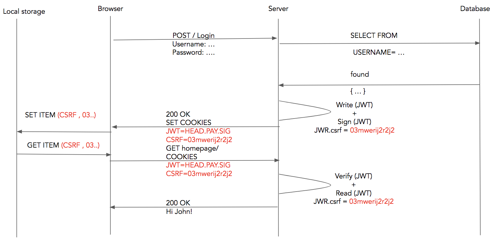
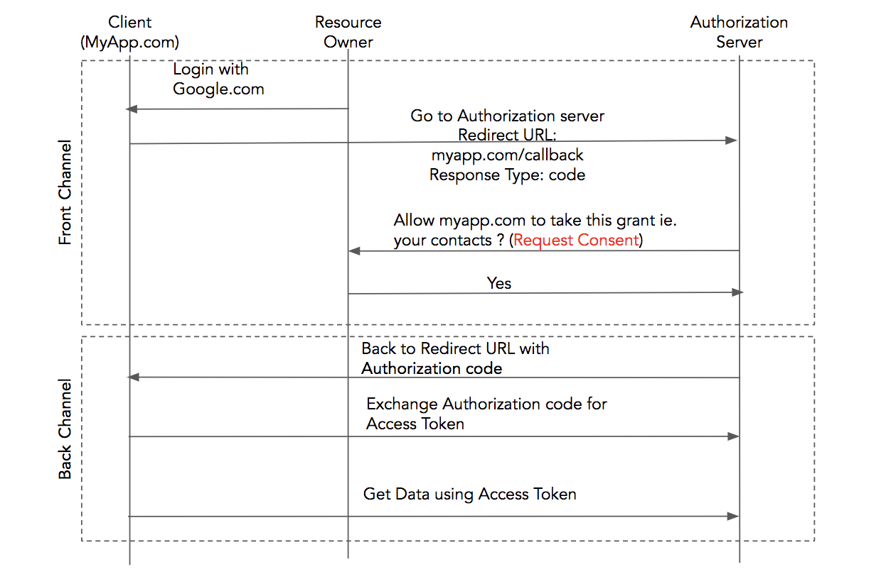
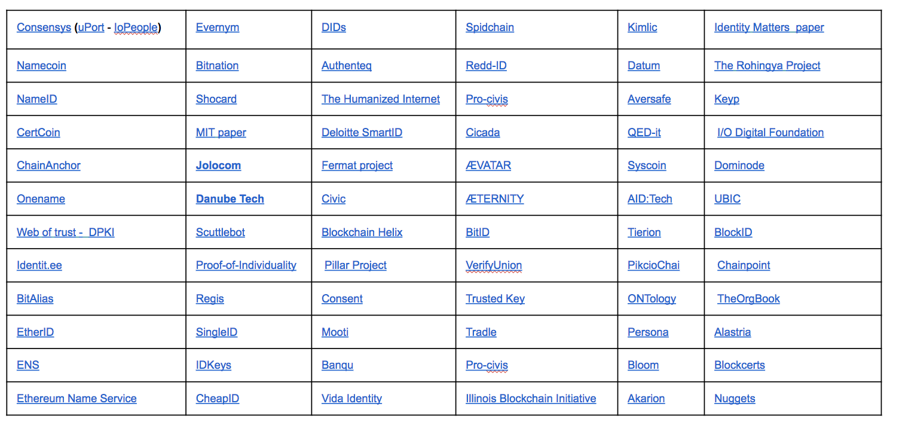
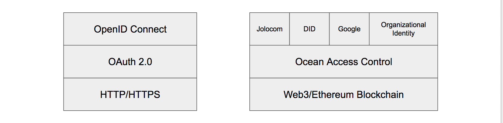
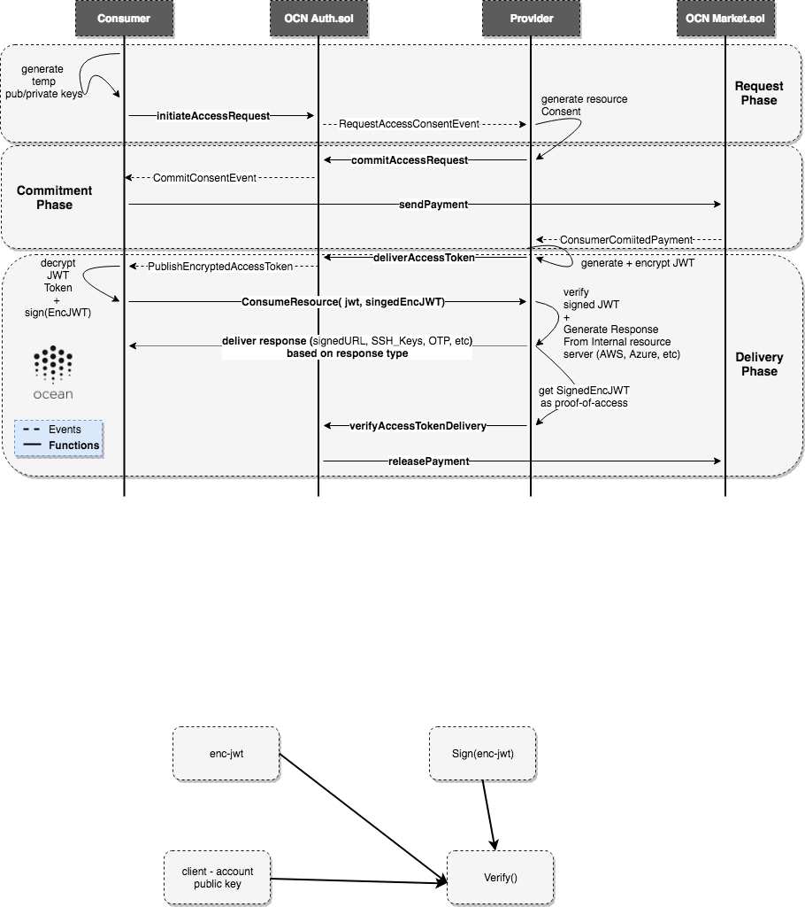
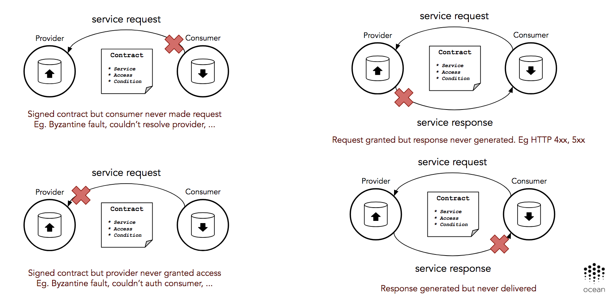
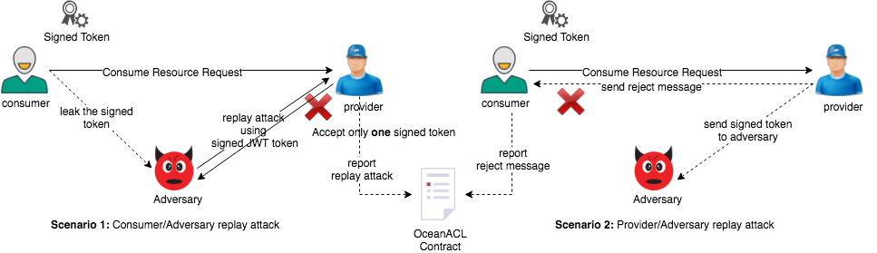

```
shortname: 10/AUTH
name: On-chain Access Control
type: Standard
status: Raw
editors: Ahmed Ali <ahmed@oceanprotocol.com>,
         Samer Sallam <samer@oceanprotocol.com>,
         Fang Gong <fang@oceanprotocol.com>,
         Sebastian Gerske  <sebastian@oceanprotocol.com>,
         Aitor Argomaniz <aitor@oceanprotocol.com>,
contributors: Ahmed Ali <ahmed@oceanprotocol.com>, 
              Samer Sallam <samer@oceanprotocol.com>
```
***DISCLAIMER: THIS IS A WORK IN PROGRESS***

Table of Contents
=================

  * [Table of Contents](#table-of-contents)
  * [On Chain Access Control](#on-chain-access-control)
     * [Change Process](#change-process)
     * [Language](#language)
     * [Motivation](#motivation)
     * [Design Requirements](#design-requirements)
     * [Introduction](#introduction)
        * [Json Web Token](#json-web-token)
        * [Json Resource Decriptor](#json-resource-descriptor)
        * [OAuth 2.0 Flow](#oauth-2.0-flow)
     * [Key Technologies](#key-technologies)  
     * [Access Control Components](#access-control-components)
        * [Resource](#resource)
        * [Resource Consent](#resource-consent)
        * [Justified Purchase Receipt](#justified-purchase-receipt)
        * [Request Identifier](#request-identifier)
        * [JWT Token](#jwt-token)
        * [Service Level Agreement](#service-level-agreement)
        * [Commitment](#commitment)
        * [Temp Encryption Keys](#temp-encryption-keys)
        * [Finalized Purchase Receipt](#finalized-purchase-receipt)
     * [Access Control Flow](#access-control-flow)
     * [Interfaces](#interfaces)
        * [Access Control Contract](#access-control-contract)
        * [Market Contract](#market-contract)
     * [Threat Models](#threat-models)
        * [Censorship Attacks](#censorship-attacks)
        * [Fake and Delayed Access](#fake-and-delayed-access)
        * [Replay Like Attack](#replay-like-attack)
     * [References](#references)
     


# On Chain Access Control

This document describes the On chain access control: the main [requirements](https://github.com/oceanprotocol/OEPs/tree/master/4#access-control), 
functions, components and implementation details.

## Change Process
This document is governed by the [2/COSS](../2/README.md) (COSS).

## Language
The key words "MUST", "MUST NOT", "REQUIRED", "SHALL", "SHALL NOT", "SHOULD", "SHOULD NOT", "RECOMMENDED", "NOT RECOMMENDED", "MAY", and "OPTIONAL" in this document are to be interpreted as described in [BCP 14](https://tools.ietf.org/html/bcp14) \[[RFC2119](https://tools.ietf.org/html/rfc2119)\] \[[RFC8174](https://tools.ietf.org/html/rfc8174)\] when, and only when, they appear in all capitals, as shown here.

## Motivation

The goal of this document is to provide a technical details about on-chain access control in ocean protocol.

In the Ocean network, entities, individuals and organizations have challenging problems 
of effectively managing their resources on-chain. As the advent of outsourcing data, 
the need for verifiable access control through public blockchains is dramatically increasing. 


## Design Requirements

Ocean's on-chain access control SHOULD provide the following responsibilities: 

- Verifiable on-chain Access control.
- Accountability (bad actors abusing the system)
- Integrity of different Authentication mechanisms
- Unlinkability and anonymity of users's transaction
- Expose on-chain/off-chain interfaces for access control 

## Introduction

In this section, we are going to list the most key technologies that will be used as building blocks in order to develop 
on-chain based access control for ocean. You can skip this introductory part if you already 
familiar with [Json Web Token](#json-web-token), [Json Resource Descriptor](#json-resource-descriptor),
 and [OAuth 2.0 Flow](#oauth-2.0-flow).
 

### Json Web Token

Json web token (JWT) is used to represent claims securely between parties. It could be stored on 
local storage. It uses
Open Standard [RFC7519](https://tools.ietf.org/html/rfc7519). The key point is that every token is digitally signed by 
the issuer (resource owner) using different supported schemes such as [RSA](https://en.wikipedia.org/wiki/RSA_(cryptosystem)#Signing_messages), 
[ECDSA](https://en.wikipedia.org/wiki/Elliptic_Curve_Digital_Signature_Algorithm), [HMAC](https://en.wikipedia.org/wiki/HMAC). 
The json is stored in an encoded form such as [Base64URL](https://tools.ietf.org/html/rfc7515#appendix-C) where it is easy to 
 be verified by the authorization server. The JWT is fully compatible with [OAuth 2.0](#oauth-2.0-flow) standard.

#### Use cases
The main two use cases are the authorization, and information exchange. Authorization could be conducted in case of 
a user logged in, as a resource owner you can include this token for each the request sent to the client. 
Also, it could be used for information exchange where JWT uses pub/priv 
key pairs to sign claims as shown below.

#### JWT structure:

JWT structure includes three components:
- Header:

This part includes the name of hashing algorithm and the type of token itself. It includes the name of hashing algorithm due to the wide range of 
hashing algorithms, so we don't know which one exactly will be used by the authorization server.
```json
{
  "alg": "HS256", // hashing algorithm
  "typ": "JWT"   // type of the token
}
```

- Payload:

This part includes all claims that authorization server will provide for access in the future. There are three
types of claims the first one is <code>*[Registered claims](https://tools.ietf.org/html/rfc7519#section-4.1)*</code> 
. It is not a  <code>mandatory</code> but it is preferable to be included. Registered claims section has the following items:

    - "iss" (Issuer) Claim
    - "sub" (Subject) Claim
    - "aud" (Audience) Claim
    - "exp" (Expiration Time) Claim
    - "nbf" (Not Before) Claim
    - "iat" (Issued At) Claim
    - "jti" (JWT ID) Claim

There is another type of claims called <code>*Public claims*</code> which is basically, any claim 
that could be either registered in [IANA "JSON Web Token Claims"](https://www.iana.org/assignments/jwt/jwt.xhtml) registry  or 
any public name but it must be a collision resistant name. 
Finally, the last one is <code>Private claims</code>
where any claim could be used by the consumer and provider (shared between parties). 

An example for payload:

```json
{
  "sub": "1234567890",
  "name": "John Smith",
  "admin": true
}
```

- Signature:

Signature is verifiable way to prove for the authorization server that he is the one who signed this token. The signature includes
the header and payload as shown below:

```bash
HMACSHA256(
  base64UrlEncode(header) + "." +
  base64UrlEncode(payload),
  secret)
```

For instance, the below figure shows how to add more claims such as [Cross-site request forgery](https://en.wikipedia.org/wiki/Cross-site_request_forgery) or <code>CSRF token</code>.
This token is meant to be used by the server in order to trust only requests that have specific token. For example if an attacker tricked a victim to use a fake login page, the server 
will only accept the request if this login page has a token issued by its web framework.




For more information check out this article [introduction to JWT](https://self-issued.info/docs/draft-ietf-oauth-json-web-token.html). 


### Json Resource Descriptor

Json resource descriptor or JRD is a standard which is based on [Extensible Resource Descriptor](https://www.packetizer.com/rfc/rfc6415/). It has been used 
as meta data description for resources on the web where a discovery service such as [WebFinger](https://www.techabulary.com/w/webfinger/) 
could be used to return public information published about an account, organization, or entity. JRD has the following components:

- expires
- subject
- aliases
- properties
- links

An example for JRD:

```json
{
  "subject" : "acct:jsmith@myapp.com",
  "properties" :
  {
    "http://myapp.com/ns/name" : "John E. Smith"
  },
  "links" :
  [
    {
      "rel" : "http://webfinger.net/rel/profile-page",
      "href" : "http://www.myapp.com/people/jsmith/"
    },
    {
      "rel" : "http://myapp.com/rel/blog",
      "type" : "text/html",
      "href" : "http://www.myapp.com/people/paulej/blog/",
      "titles" :
      {
        "en-us" : "John Smith's Blog"
      }
    }
  ]
}
```
You can find more details about JRD [RFC6415](https://www.packetizer.com/rfc/rfc6415/).


### OAuth 2.0 Flow

The following Figure describes the flow of OAuth 2.0:




####  OAuth actors and components:

- client: Any app or service you (as a user) want to grant it to a private information.
- Authorization Server: The server that will generate the access token for client
- Authorization Grant :  Permission
- Access Token: The token that will be used to allow client get access.
- Scope: The scope includes what type of data client will be able to access ie. profile, contacts.
- Resource Owner: Any one who has actually the right to share the data.
- Resource Server: Where we store or hold the actual data
- Redirect URI: Also, it is known as the call back. The link that authorization server uses to send the authorization code to the client 
- Consent: The message you get from the authorization server 
- Front Channel: This channel runs in the browser level.
- Back Channel: This is more secure where communication will be between the authorization server and client in order to share the access token

Find [here](https://oauth2.thephpleague.com/terminology/) more information about the OAuth2.0 terminology.


OAuth 2.0 protocol is not designed for authentication but mainly Authorization. It is provides a 
a deligated authorization mechanism in which client (myapp.com) could have access to private information such as your contacts list
by delegating the authorization method to another third party called authorization server. The authorization server will return 
a consent to the resource owner in order to get accept/reject the request. If yes, the authorization server will use the redirect URL 
to send the authorization code. The client will use the authorization code in order to get the access token through the back channel. 


## Key Technologies

This survey provides a list of projects. We are going to discuss and curate the available systems that already had been developed. These projects 
provide an on-chain/off-chain identity management. 
The following table lists some of them:

 

For more information check out this [List of Blockchain based Identity Management systems](https://github.com/peacekeeper/blockchain-identity/).


You can find the curated list of these projects here [keytechnologies.md](keytechnologies.md). It has a detailed description about [Jolocom IMS](keytechnologies.md#jolocom-ims), 
[Blockstack IMS](keytechnologies.md#blockstack-ims), [Permissioned Blocks](keytechnologies.md#permissioned-blocks), [Consensys UPort](keytechnologies.md#consensys-uport), [DID Project](keytechnologies.md#did-project),
[Kimono Secret Sharing](keytechnologies.md#kimono-secret-sharing), [Secret Store Parity](keytechnologies.md#secret-store-parity), and [WebID OIDC](keytechnologies.md#webid-oidc)

## Access Control Components

This section shows the key components that will be used to build the access control in ocean.
As shown in the below figure, the current scenario in ocean access control is trying to provide some sort of analogy for
 the traditional access control systems:




In the traditional access control mechanisms, one of the most popular standards in the web is OAuth2.0. It is used as a means for authorization
delegation in modern applications. On the other hand the blockchain does not have the third party (a trusted party) in which operates as authorization authority
 but we have the smart contract (single source of truth) where in our case is 
the ocean access control contract and rather than using the HTTP/HTTPS protocol, we use the web3 on top of Ethereum blockchain. 
### Resource

It uses something similar to the Json Resource Descriptor or [JRD](#json-resource-descriptor) object. It is based on Key/Value pairs that include
 the following sections:

    - Name
    - Properties
    - Links
    - Access

For instance the below json is a sample resource description (THIS IS NOT THE FINAL RESOURCE TEMPLATE):

```json

{
  "name" : "1000Genome_dataset_snp_genotyping",
  "properties" :
  {
    "sample_id" : "Exfe23def23jx1flshu3mx",
    "sample_owner": "John E. Smith"
  },
  "access": {
    "permissioned": true,
    "discovery": "https://accounts.test.com/.well-known/openid-configuration",
    "method": "HTTP/HTTPS",
    "expire_period": 1233339
  },
  "links" :{
      "sample1" : "ftp://ftp.1000genomes.ebi.ac.uk/vol1/ftp/sample1.tree",
      "sample2" : "ftp://ftp.1000genomes.ebi.ac.uk/vol1/ftp/sample2.tree"
    },
}
```

And the resource identifier is <code>hash(JRD) = 2BEDD341F1851A9C9DE53F1A1A9CBA5AABC9BE299734886316868FE139E3033B
</code>. Also, you can notice <code>discovery</code> that enables the user to discover public information about the 
resource publisher/provider. For instance, you will find here more entity discovery details about 
[Google Entity OpenID](https://accounts.google.com/.well-known/openid-configuration).


### Resource Consent

Resource consent represents a signed commitment by resource owner in order to deliver the access in the future.
The consent itself should be public for everyone to verify in the future that this consent is hashed and signed by the resource owner.
It includes the following data:

    - Resource Id
    - Policies and Permissions
    - Service Level Agreement
    - Available 
    - Current Timestamp (in seconds)
    - Expiration time (in seconds)
    - Discoverable link (this is for internal authorization server configuration)
    - Timeout (defined by access control contract).

the resource consent should return:
 
```javascript
sign (hash(Resource_consent_data), owner_secret)
```

The policy should be mentioned in the metadata. Policy might include more advanced features such as updating asset metadata, modifying permissions and privilege grants.

The idea behind resource consent is to provide the resource owner the ability to accept/reject based on its 
resource [capacity planning](https://en.wikipedia.org/wiki/Capacity_planning). 

An example for access policy:

```json
{
  "id": "${PROVIDER_PUBLIC_ADDRESS_HASH}policies:${CONSUMER_PUBLIC_ADDRESS_HASH}",
  "subjects": [
    "${PROMISE_ID}${CONSUMER_PUBLIC_ADDRESS_HASH}"
  ],
  "effect": "allow",
  "resources": [
    "${RESOURCE_ID}"
  ],
  "actions": [
    "READ"
  ]
}
```

### Justified Purchase Receipt

Once, the user has a resource consent, now he is able to get a justified purchase receipt. This receipt includes:

    - Receipt ID: receipt number
    - From: consumer address hash
    - Amount: amount of locked tokens
    - Locked: True
    - To: resource owner address hash
    - Sig: consumer signature (signing this purchase receipt)
    - Resource_id: Resource identifier
    - Promise: Resource promise
    - Date: timestamp
    - AccessExpireDate: timestamp + expire in seconds


This receipt is issued by the <code>Ocean's Market contract</code> which implements the escrow payment mechanism in ocean protocol.
### Request Identifier

Request identifier is a unique identifier for each resource request.
This identifier is generated by <code>Ocean access control contract</code>. The identifier is generated using the below information:

    - Resource id
    - Consumer address 
    - Provider address
    - Consumer temp public key 

The Ocean's access control contract is going to send this request identifier to resource owner, 
which in turn will generate JWT (it has the request identifier claim).

### JWT Token

Json Web Token as mentioned before it is used as a means to represent claims securely between parties. 
For instance the below <code>json</code> shows an example for  JWT issued by resource owner for particular consumer.

```json
// header
{
  "alg": "HS256",
  "typ": "JWT"
},
// payload
{
  "iss": "resourceowner.com",
  "sub": "WorldCupDatasetForAnalysis",
  "iat": 1516239022,
  "exp": 1526790800,
  "consumer_pubkey": "Consumer Public Key",
  "temp_pubkey": "Temp. Public Key for Encryption",
  "request_id":"Request Identifier",
  "consent_hash":"Consent Hash",
  "resource_id": "Resource Identifier",
  "timeout": "Timeout comming from AUTH contract",
  "response_type": "Signed_URL",
  "Resource_Server_plugin": "Azure",
},
// signature
HMACSHA256(
  base64UrlEncode(header) + "." +
  base64UrlEncode(payload),
  Resource_owner_secret
)
``` 
And the encoded version of JWT:

```bash
eyJhbGciOiJIUzI1NiIsInR5cCI6IkpXVCJ9.eyJpc3MiOiJyZXNvdXJjZW93bmVyLmNvbSIsInN1YiI6Ildvc
mxkQ3VwRGF0YXNldEZvckFuYWx5c2lzIiwiaWF0IjoxNTE2MjM5MDIyLCJleHAiOjE1MjY3OTA4MDAsImNvbnN
fcHVia2V5IjoiMHhmYjkwMjhiNTk0MDFhMjAwZmY4MmZhNTUwYTI5MmNlMGFiMmVlZWVjIiwiY2hhbGxlbmdlX
2lkIjoiYzk5OGQ0OTA2ZjUxZWUwNjc3YWVkYTE4MjhjZmNmMTcxYzg4YmRjNmQzNWNhZiIsInBlcm1pc3Npb25
zIjp7InJlYWQiOnRydWUsIndyaXRlIjpmYWxzZX19.R96vtPzTQ59qc2YR9f_uMonxuF2c5bU3ftPHm6k9HP8
```
You can see that the parts are separated by dot<code>(.)</code>. Check out this section for more details about [Json Web Token](#json-web-token).
Also, you can notice that the JWT contains two important claims, first is the consumer public key, second the request identifier issued 
by Ocean Access Control contract: <code>"cons_pubkey", "request_id" </code>. **These claims state that 
the authorization server (off-chain server) is aware about what is going on in on-chain. No way to deny it!**
  
### Service Level Agreement

Service level agreement is publicly accessible and immutable that includes a 
detailed description of the service quality, availability, responsibilities. 
The provider imports an immutable IPFS hash reference for the SLA in the commitment.
  
### Commitment

In order to let the commitment be authentic, it should include an encrypted JWT (committed by the provider) and purchase 
receipt (committed by consumer). *The current implementation puts the JWT in an encrypted form on-chain which will be 
changed to be more secure in the next release implementation.* 

### Temp Encryption Keys

Temporary keypair is meant to be used as cryptographically secure tool in order to share secrets (ie. JWT) between parties.
It is generated by consumer ocean client (created on the fly). 
Even if an attacker managed to steal the temp private key 
(ie. by brute-forcing keys such as using weak encryption schemes) in order to reveal the JWT, the resource owner (provider) will only accept signed JWT by the consumer 
(where is stored in the Commitment).


#### Generate and revoke keypairs

Generating temporary keypairs should include the revocation certificates where the expiration date of these keys will be the same as <code>AccessExpireDate</code> field in 
[Resource Consent](#resource-consent). As a consumer you should never share private key and revocation certificate to any one. In case of
your private key is compromised you should use the revocation certificate to revoke your key. At this time if the [encrypted JWT](#json-web-token) is not 
committed yet, the consumer can revoke the whole contract and refund the payment  by calling <code>revoke</code> function.


### Finalized Purchase Receipt

This receipt is the same justified purchase receipt except it should be signed by the two parties (resource owner, and consumer).  It will be issued as proof for delivery, where consumer and provider commits the delivery of resource. 
This final state of access control triggers the ocean market contract to pay back the resource owner. 
The market contract issues the finalized receipt once the delivery of resource is consumed. This includes that the provider should deliver a signed message by the consumer <code>
(sign(enc(JWT)by_consumer) </code>in order to release the payment.  


## Access Control Flow

The following steps describe the workflow of access control:




The flow is composed of three phases:
- Request Resource phase
- Consent and Commit phase
- Delivery and verification phase


### Phase 1: Request Resource
In this phase consumer and provider work on generating initial agreement as follows:

- Consumer generates temp public/private keys, then calls an <code>initialAccessRequest</code> which in turn
emits an event <code>RequestAccessConsent</code>.
- The provider will listen to this event and generate the corresponding [resource consent](#resource-consent).  

### Phase 2: Commit Phase

- This phase implements the provider commitment by calling <code>CommitAccessRequest</code> including the 
 final [resource consent](#resource-consent).
- The Consumer listens to <code>CommitmentConsent</code> Event which indicates the acceptance of the provider for 
delivering the resource. 
Consequently, the consumer will call <code>sendPayment</code> in the market contract in order to issue a [justified purchase receipt](#justified-purchase-receipt).
- Finally, The provider listens to <code>ConsumerCommitedPayment</code> in order deliver the access tokens.


### Phase 3: Delivery Phase

- The provider generates and encrypt [jwt](#json-web-token) using the consumer's temp public key and sends it back to the consumer
by calling <code>deliverAccessToken</code>.
- The consumer will be signalled by listening to <code>PublishEncryptedAccessToken</code> event. He/she is going to 
decrypt [jwt](#json-web-token) and calls <code>consumeResource</code> that make a off-chain call to provider using <code>discovery url</code>.

- The provider should receive <code>signedEncJWT</code>, verify the signed message and JWT, then generate the 
response based on the response type and the internal resource server and returns the expected output. 

- Finally, the provider sends <code>signedEncJWT</code> as a proof-of-access to <code>Auth.sol</code> in order to verify 
the delivery of access token by calling <code>verifyAccessTokenDelivery</code>, the contract will verify the signed message and 
send release payment signal to the <code>market.sol</code> contract.


## Interfaces

### Access Control Contract

```javascript

    // Sevice level agreement published on immutable storage
    struct SLA {
        string slaRef; // reference link or i.e IPFS hash
        string slaType; // type such as PDF/DOC/JSON/XML file.
    }

    // final agreement
    struct Commitment {
        string encJWT;  // encrypted JWT using consumer's temp public key
        bytes32 receiptId;
    }

    // consent (initial agreement) provides details about the service availability given by the provider.
    struct Consent {
        bytes32 resource; // resource id
        string permissions; // comma sparated permissions in one string
        SLA serviceLevelAgreement;
        bool available; // availability of the resource
        uint256 timestamp; // in seconds
        uint256 expire;  // in seconds
        string discovery; // this is for authorization server configuration in the provider side
        uint256 timeout; // if the consumer didn't receive verified claim from the provider within timeout
        // the consumer can cancel the request and refund the payment from market contract
    }

    struct ACL {
        address consumer;
        address provider;
        bytes32 resource;
        Consent consent;
        string pubkey; // temp public key for access token encryption
        Commitment commitment;
        AccessStatus status; // Requested, Committed, Delivered, Revoked
    }

    mapping(bytes32 => ACL) private aclEntries;

    ...
    
    
    // Access Control Status
    enum AccessStatus {Requested, Committed, Delivered, Revoked};
    
    // modifiers and access control
    modifier isAccessRequested(bytes32 id) {
        require(aclEntries[id].status == AccessStatus.Requested);
        _;
    }

    modifier isAccessComitted(bytes32 id) {
        require(aclEntries[id].status == AccessStatus.Committed);
        _;
    }
    
    
    ...
    
    // phase 1
    function initiateAccessRequest(bytes32 id, bytes32 resourceId, address provider, string pubKey, uint256 timeout)
    public {
        //TODO: initialize SLA, Commitment, and claim
        //TODO: initialize acl handler
        ...
        emit RequestAccessConsent(id, msg.sender, provider, resourceId, timeout);
    }
    
    // phase 2
    function commitAccessRequest(bytes32 id, bool available, uint256 expire, string discovery, string permissions, string slaLink, string slaType, bytes32 jwtHash)
    public onlyProvider(id) isAccessRequested(id){
        if (available && now < expire) {
            ...
            emit CommitConsent(id, expire, discovery, permissions, slaLink);
        }else{
            aclEntries[id].status = AccessStatus.Revoked;
            emit RefundPayment(aclEntries[id].consumer, aclEntries[id].provider, id);
        }
    }
    
    function cancelConsent(bytes32 id)
    public
    isAccessRequested(id) {
        ...
    }
    
    // phase 3
    function deliverAccessToken(bytes32 id, string encryptedJWT) public onlyProvider(id) isAccessComitted(id) {
    
        emit PublishEncryptedToken(id, encryptedJWT);
    }
    
    
    function verifyAccessTokenDelivery(bytes32 id, bytes32 proofJWTHash) public onlyProvider(id) isAccessComitted(id) {
        
        
    }
    
    function verifyAccessStatus(bytes32 id, AccessStatus status) public view returns (bool) {
        
    }
    
```


### Market Contract

```javascript

struct Payment {
       address sender; 	      // consumer or anyone else would like to make the payment (automatically set to be msg.sender)
       address receiver;      // provider or anyone (set by the sender of funds)
       PaymentState state;		// payment state
       uint256 amount; 	      // amount of tokens to be transferred
       uint256 date; 	        // timestamp of the payment event (in sec.)
       uint256 expiration;    // consumer may request refund after expiration timestamp (in sec.)
    }
    enum PaymentState {Locked, Released, Refunded}
    mapping(bytes32 => Payment) mPayments;  // mapping from id to associated payment struct

    event PaymentReceived(bytes32 indexed _paymentId, address indexed _receiver, uint256 _amount, uint256 _expire);
    event PaymentReleased(bytes32 indexed _paymentId, address indexed _receiver);
    event PaymentRefunded(bytes32 indexed _paymentId, address indexed _sender);

    // the sender makes payment
    function sendPayment(bytes32 _paymentId, address _receiver, uint256 _amount, uint256 _expire) public validAddress(msg.sender) returns (bool){
      // consumer make payment to Market contract
      require(mToken.transferFrom(msg.sender, address(this), mAssets[assetId].price));
      mPayments[_paymentId] = Payment(msg.sender, _receiver, string(PaymentState.Paid), _amount, now, _expire);
      emit PaymentReceived(_paymentId, _receiver, _amount, _expire);
      return true;
    }

    // the consumer release payment to receiver
    function releasePayment(bytes32 _paymentId) public onlySenderAccount isPaid(_paymentId) returns (bool){
      // update state to avoid re-entry attack
      mPayments[_paymentId].state == string(PaymentState.Released);
      require(mToken.transfer(mPayments[_paymentId].receiver, mPayments[_paymentId].amount));
      emit PaymentReleased(_paymentId, mPayments[_paymentId].receiver);
      return true;
    }

    // refund payment
    function refundPayment(bytes32 _paymentId) public isLocked(_paymentId) returns (bool){
      mPayments[_paymentId].state == string(PaymentState.Refunded);
      require(mToken.transfer(mPayments[_paymentId].sender, mPayments[_paymentId].amount));
      emit PaymentRefunded(_paymentId, mPayments[_paymentId].sender);
      return true;
    }

    // utitlity function - verify the payment
    function verifyPayment(bytes32 _paymentId, string _status) public view returns(bool){
        if(mPayments[_paymentId].state == _status){
            return true;
        }
        return false;
    }

```

## Threat Models

This section lists the expected threat models for access control. The current threat models exclude the problem of [data integrity](https://en.wikipedia.org/wiki/Data_integrity) in terms of 
data quality and validation (it should be handled by service integrity proofs and curation markets). However there are some expected attacks to be discussed:

### Censorship Attacks

Usually, smart contracts in public blockchain expose all the transactions to be verified publicly. This will allow any attacker to correlate the generated transactions 
in order to track the consumer's activity. So, in order to preserve the consumer's privacy , we might need to include one of these technologies in the access control layer:

- **Zero knowledge proofs**: such as [ZKSNARK](https://blog.z.cash/zsl/) (it needs trusted setup), [ZKSTARK](https://eprint.iacr.org/2018/046.pdf), and [BulletProofs](https://web.stanford.edu/~buenz/pubs/bulletproofs.pdf). We can see the 
    potential behind zero knowledge based proofs especially when it comes to confidential transactions. Find here more information about implementation details of [BulletProofs-lib](https://github.com/bbuenz/BulletProofLib),
    [LibSTARK](https://github.com/elibensasson/libSTARK).
    - LIST LIMITATIONS HERE
- **Generalized State Channels**: This idea was introduced in Bitcoin which called [payment channel](https://bitcoin.org/en/developer-guide#micropayment-channel)
    where it is used for micropayments. In general, state channel is way to outsource the state transition where the state is locked using multisig contract, outsourced to off-chain channel (where the 
     transaction processing will be done), finally unlock by updating the state on-chain. Now, there are two main research branch in order to investigate and develop more advanced techniques
     such as [Counterfactual: Generalized State Channels](https://l4.ventures/papers/statechannels.pdf) and [Pisa: Arbitration Outsourcing for State Channels](http://www0.cs.ucl.ac.uk/staff/P.McCorry/pisa.pdf). The limitation 
     of the generalized state channels are 
        
     -  LIST OF LIMITATIONS HERE
    
### Fake and Delayed Access  

The following type of attacks was inspired by [Dimi's research guide for ocean](https://docs.google.com/presentation/d/1Z6Acq2LD3eHPD1SoH_bxHH-XaOKLWemgFiKgWICekys/edit#slide=id.g3c8f40bdce_0_298). 
It includes different byzantine based attacks on the access control. Access delay might be a result of different scenarios:
    
   - If the consumer was granted an access to any arbitrary resource, but he never made the request. At this time, as 
    a resource owner have the right to revoke the access after <code>AccessExpireDate</code> where it is already predefined 
    in the [resource](#resource) for more info checkout [justified purchase receipt](#justified-purchase-receipt). You can find more details about different case scenarios
    
   
   
   - If the consumer is unable to get access to the resource, he should deliver the <code>AccessErrorMessage</code> he
    received from resource owner, then the resource owner has to provide the signed JWT from the consumer, that will be considered as proof 
    that a consumer already tried to access. But we don't 
    know if this access token is valid or not, at this time, we will run <code>OceanWittnessVerificationGame</code> (***Future Work***). 
    The same thing could happen in case of fake access. This type of attacks should include ***[Skin-in-the-game](http://nassimtaleb.org/tag/skin-in-the-game/)*** strategies in order 
    to maintain commitment approach by consumer and provider.
    
### Replay Like Attack

In this attack we have two scenarios. The first scenario could happen if the consumer tried to leak the <code>signed JWT token</code> to an adversary where they can run a replay attack and consume the 
[resource](#resource) twice. At this time, *First, the resource owner should signal the ocean ACL contract, 
that he got the signed token (first time) and accept only one request (which is the first request)* and report a replay attack to <code>Ocean ACL contract</code>.



The second scenario, if the resource owner (provider) gets the signed token and sends it back to another adversary. We have two cases, if the consumer received the 
reject message from the resource owner, he should report this to ocean acl contract. The second case if the consumer did not receive a reject message and was able to 
consume the resource, at this moment leaking signed token to adversary does not make any sense. 

## References

- [JWT Registered claims](https://tools.ietf.org/html/rfc7519#section-4.1)
- [Json Resource Description - RFC6415](https://www.packetizer.com/rfc/rfc6415/)
- [List of Blockchain based Identity Management systems](https://github.com/peacekeeper/blockchain-identity/)
- [Cryptographic schemes and protocols](https://github.com/JHUISI/charm/wiki/Cryptographic-schemes-and-protocols)
- [Pisa: Arbitration Outsourcing for State Channels](http://www0.cs.ucl.ac.uk/staff/P.McCorry/pisa.pdf)
- [Counterfactual: Generalized State Channels](https://l4.ventures/papers/statechannels.pdf)
- [BulletProofs - Short Proofs for Confidential Transactions and More](https://web.stanford.edu/~buenz/pubs/bulletproofs.pdf)
- [ZKSTARK - Scalable, transparent, and post-quantum secure computational integrity](https://eprint.iacr.org/2018/046.pdf)
- [ZKSNARK - Zero Knowledge Security Layer ZSL](https://blog.z.cash/zsl/) 
- [Introduction to Json Web Tokens](https://jwt.io/introduction/)
- [Json Resource Description](https://www.packetizer.com/json/jrd/)
- [Factory Method Pattern - Wikipedia](https://en.wikipedia.org/wiki/Factory_method_pattern) 
- [Skin-in-the-game by Nassim Nicholas Taleb](http://nassimtaleb.org/tag/skin-in-the-game/)
- [IANA - JSON Web Token Claims](https://www.iana.org/assignments/jwt/jwt.xhtml)
- [The OAuth 2.0 Authorization Framework](https://tools.ietf.org/html/rfc6749) 