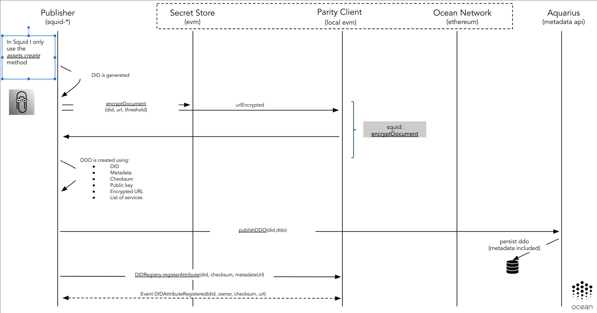
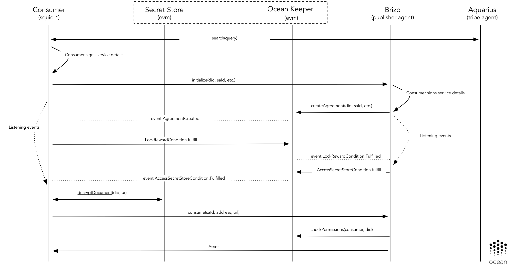

```text
shortname: 11/ACL
name: On-Chain Access Control using Service Execution Agreements
type: Standard
status: Raw
editor: Aitor Argomaniz <aitor@oceanprotocol.com>
contributors: Lev Berman <ldmberman@gmail.com>,
              Ahmed Ali <ahmed@oceanprotocol.com>, 
              Samer Sallam <samer@oceanprotocol.com>,
              Dimitri De Jonghe <dimi@oceanprotocol.com>
```

**Table of Contents**

<!--ts-->
   * [Abstract](#abstract)
   * [Change Process](#change-process)
   * [Language](#language)
   * [Motivation](#motivation)
   * [Actors](#actors)
      * [Technical Components](#technical-components)
   * [Flow](#flow)
      * [Publishing](#publishing)
         * [EscrowAccessSecretStore Service Agreement Template](#escrowaccesssecretstore-service-agreement-template)
      * [Consuming](#consuming)
         * [Execution of the SEA](#execution-of-the-sea)
            * [Lock Payment Condition](#lock-payment-condition)
            * [Grant Access Condition](#grant-access-condition)
            * [Release Payment Condition](#release-payment-condition)
      * [Consuming the Data](#consuming-the-data)
         * [Consuming without direct integration of Secret Store](#consuming-without-direct-integration-of-secret-store)
         * [Abort Conditions](#abort-conditions)
      * [Encryption and Decryption](#encryption-and-decryption)
         * [Secret Store](#secret-store)
         * [Encryption Using Brizo](#encryption-using-brizo)
   * [Implementation Details](#implementation-details)

<!--te-->

---

# Abstract

This OEP introduces an integration pattern for the use of **Service Execution Agreements (SEAs)** 
(also called "Service Agreements" or "Agreements") as contracts between parties interacting in a transaction.
This OEP evolves the existing [OEP-10](../10/README.md), using the SEA as the core element to orchestrate the 
publish/consume transactions for multiple services.

This OEP doesn't detail the implementation of SEAs; see [the dev-ocean repository](https://github.com/oceanprotocol/dev-ocean).

# Change Process

The process to change this document is described in [OEP-2 (COSS)](../2/README.md).

# Language

The key words "MUST", "MUST NOT", "REQUIRED", "SHALL", "SHALL NOT", "SHOULD", "SHOULD NOT", "RECOMMENDED", 
"NOT RECOMMENDED", "MAY", and "OPTIONAL" in this document are to be interpreted as 
described in [BCP 14](https://tools.ietf.org/html/bcp14) \[[RFC2119](https://tools.ietf.org/html/rfc2119)\]
 \[[RFC8174](https://tools.ietf.org/html/rfc8174)\] when, and only when, they appear in all capitals, as shown here.

# Motivation

The main motivations of this OEP are:

* Evolve [OEP-10](../10/README.md) to support more complex contract interactions between consumers and publishers of services
* Detail the main characteristics of this interaction
* Introduce an alternative negotiation mechanism to the one described in [OEP-10](../10/README.md)
* List the pros and cons of this approach
* Identify the modifications required to integrate this approach
* Identify the API methods exposed via the different libraries
* Develop a more secure/stable approach overall

# Actors

The different actors interacting in this flow are:

* PUBLISHERS - Create/publish assets and/or services
* PROVIDERS - Provide assets data files and/or services (PUBLISHER can also be a PROVIDER)
* CONSUMERS - Want to get access to assets and/or services
* MARKETPLACES or DOMAINS - Store the DDO/metadata associated with the assets and/or services

Note: Below, we write "assets" to mean "assets and/or services."

## Technical Components

The following technical components are involved in an end-to-end publishing and consumption flow:

* MARKETPLACE - Exposes a web interface allowing users to publish and purchase assets. Also facilitates 
the discovery of assets. An example MARKETPLACE web interface is [Pleuston](https://github.com/oceanprotocol/pleuston).
* [SQUID](https://github.com/oceanprotocol/dev-ocean/blob/master/doc/architecture/squid.md) - Software library 
encapsulating the Ocean Protocol business logic. It's used to interact with all the components & APIs of the 
system. It's currently implemented in the following packages:
  * [squid-js](https://github.com/oceanprotocol/squid-js) - JavaScript version of SQUID to be integrated with front-end applications.
  * [squid-py](https://github.com/oceanprotocol/squid-py) - Python version of SQUID to be integrated with 
  back-end applications. The primary users are data scientists.
  * [squid-java](https://github.com/oceanprotocol/squid-java) - Java version of SQUID to be integrated with 
  [JVM](https://en.wikipedia.org/wiki/Java_virtual_machine) applications. The primary users are data engineers.
* [KEEPER CONTRACTS](https://github.com/oceanprotocol/keeper-contracts) - Provide the Service Agreement business logic.
* [SECRET STORE](https://github.com/oceanprotocol/parity-ethereum) - Included as part of the Parity Ethereum client. 
Allows the PUBLISHER to encrypt the asset URL. Integrates with the SA to authorize (on-chain) the decryption of the asset URL by the CONSUMER.
* [BRIZO](https://github.com/oceanprotocol/brizo) - Microservice to be executed by PROVIDERs. It exposes 
an HTTP REST API permitting access to PUBLISHER assets or additional services such as computation.
* [AQUARIUS](https://github.com/oceanprotocol/aquarius) - Microservice to be executed by MARKETPLACES. Facilitates 
creating, updating, deleting and searching the asset metadata registered by the PUBLISHERS. This metadata is 
included as part of a DDO (see [OEP-7](../7/README.md) and [OEP-8](../8/README.md)) and also includes the services 
associated with the asset (consumption, computation, etc.).


# Flow

This section describes the asset publishing and purchasing flow in detail. It should be straightforward to 
implement the flow by reading this description, although the actual implementation may deviate slightly.
The detailed description is an attempt to account for important edge cases and to create a good reference 
for the authors of particular implementations.

There are some parameters used in this flow:

* **did** - Decentralized Identifier (DID). See [OEP-7](../7/README.md).
* **agreementId** or **serviceAgreementId** - The unique ID referring to a Service Agreement established 
between a PUBLISHER and a CONSUMER. The CONSUMER (via SQUID) is the one creating this unique ID.
* **serviceDefinitionId** - Identifies one service in the array of services included in the DDO. It is 
created by the PUBLISHER (via SQUID) upon DDO creation.
* **templateId** - Identifies a unique Service Agreement template. All supported templates are deployed 
on-chain by Ocean Protocol and the addresses or templateIds can be found in the ABIs. The following 
templates are supported: `EscrowAccessSecretStoreTemplate`

## Publishing

Using only one SQUID call, the PUBLISHER should be able to register an asset. For example, a squid-js call might look like this:

```javascript
const asset = ocean.assets.create(metadata, publisherAccount, services=[ocean.services.createAccessService(...)], [providerAddress, ])
```

The high-level summary of what that does is that it constructs a new DDO (JSON object describing the asset), 
registers it on-chain through 
[the DIDRegistry smart contract (Keeper contract)](https://github.com/oceanprotocol/keeper-contracts/tree/develop/contracts/registry), 
and stores it off-chain in an AQUARIUS instance's database.

To see _exactly_ what the asset-publishing SQUID call does, see the implementations in:

* [squid-js: the OceanAssets.create() method](https://github.com/oceanprotocol/squid-js/blob/develop/src/ocean/OceanAssets.ts) (TypeScript)
* [squid-py: the OceanAssets.create() method](https://github.com/oceanprotocol/squid-py/blob/develop/squid_py/ocean/ocean_assets.py)
* [squid-java: the OceanManager.registerAsset() method](https://github.com/oceanprotocol/squid-java/blob/develop/src/main/java/com/oceanprotocol/squid/manager/OceanManager.java) 
(The Assets API create() method calls that.)

Below we outline the steps in the asset-publishing SQUID call.

Please note that the following outline might be out-of-sync with the current implementations. We intend to fix that, 
but until we do, please treat the implementations as the source of truth.

1. PUBLISHER generates a DID. See [How to generate a DID](https://github.com/oceanprotocol/OEPs/tree/master/7#length-of-a-did). 
Currently the DID is a UUID. Later on, this might be computed as a DDO hash.
1. PUBLISHER optionally can encrypt the URLs using different encryption plugins. If that's the case, in the DDO will 
be added an **encryption** service describing the procedure used. There are two options for encryption:
  1. PUBLISHER encrypts the URLs list using the SECRET STORE identified by a DID.
  1. If PUBLISHER is running a client not supporting direct integration with SECRET STORE (for example because is using 
   Metamask and can't provide the account password), it's possible to use the Brizo encryption method.
1. PUBLISHER creates a DDO including the following information:
   - DID
   - Metadata
     Contains asset name, description, etc. For details see [OEP-8](../8/README.md).
   - Public key of the PUBLISHER
   - Encrypted URL; this URL, when decrypted, is not used by the CONSUMER directly, but as an identifier to request data from PROVIDER
   - A list of services (Access, Compute, etc)

   Each service in the list contains certain information depending on its type. Here we document two types of services 
   required for purchasing and consuming an asset. 

   A service of type "Access" contains:
   - Service Definition ID (`serviceDefinitionId`); this helps PUBLISHER find the service definition of a DDO signed by CONSUMER
   - Service Agreement Template ID (`templateId`); has to be whitelisted, can be hardcoded in Trilobite; points to 
   a deployed on-chain Service Agreement contract
   - Service endpoint (`serviceEndpoint`); CONSUMERS signing this service send their signatures to this endpoint
   - A list of condition keys; condition key is the `keccak256` hash of the following:
     * SLA template ID
     * controller contract address (obtained from the solidity contract json file matching the contract name in the SLA condition)
     * controller contract function fingerprint (referred to as function signature or selector)

```python
def build_condition_key(contract_address, fingerprint, template_id):
    assert isinstance(fingerprint, bytes), f'Expecting `fingerprint` of type bytes, ' \
        f'got {type(fingerprint)}'
    return generate_multi_value_hash(
        ['address', 'address', 'bytes4'],
        [template_id, contract_address, fingerprint]
    ).hex()
    
```

   - For each condition, a list is required of its parameter values, a timeout, a set of fields determining what 
   conditions depend on other conditions, and a mapping of events emitted by the condition to the off-chain 
   handlers of these events
   - Each event is identified by name. Each event handler is a function from a whitelisted module
   - Service Agreement contract address and the event mapping in the same format as the condition events, for off-chain listeners
   - An integer defining when the agreement is fulfilled in case there are multiple terminal conditions, 
   according to the Service Agreement smart contract

   A service of type "Access" contains 2 different endpoints:
   - **serviceEndpoint** - A URL to fetch data decryption keys from
   - **purchaseEndpoint** - A URL to initialize the Service Agreement

    An example of a complete DDO can be found [here](./ddo.example.json). Please do note that the condition's 
    order in the DID document should reflect the same order in on-chain service agreement.

1. PUBLISHER computes the key attributes of the DDO, generates a `checksum` and signs. The signature is added 
in the `proof` attribute.
   More information about this process can be found in the 
   [How to Compute a DID section](https://github.com/oceanprotocol/OEPs/tree/master/7#how-to-compute-a-did).

1. PUBLISHER publishes the DDO in the Metadata Store (OceanDB) using AQUARIUS.

1. PUBLISHER registers the DID:
  * Associating the asset DID to the Aquarius Metadata URL that resolves the DID to a DDO
  * (optionally) Associating the asset DID to a list of PROVIDER addresses. A PROVIDER address must match 
  the ethereum address used by the PROVIDER's Brizo instance whose endpoints are specified in the DDO's services.
To do that, SQUID needs to integrate the `DIDRegistry` contract using the `registerAttribute` method.

```javascript
function registerAttribute (
    bytes32 _did,
    bytes32 _checksum,
    address[] memory _providers,
    string memory _value
)
```

The parameters to pass are:
  - **bytes32 _did** - The hash part of the DID, the part just after `did:op:`
  - **bytes32 _checksum** - The checksum generated after [compute the DID](https://github.com/oceanprotocol/OEPs/tree/master/7#how-to-compute-a-did)
  - **address[] _providers** - The list of providers which PUBLISHER delegates URL decryption capabilities, SEA management and asset consumption
  - **string _value** - The Metadata service endpoint. In the above DDO its: http://myaquarius.org/api/v1/provider/assets/metadata/{did}



1. The KEEPER will emit the `DIDAttributeRegistered` including the `did`, `checksum` and `url` registered.

### EscrowAccessSecretStore Service Agreement Template

1. The EscrowAccessSecretStore Service Agreement template has the following shape:

```javascript
const agreement = {
    did: did,
    conditionIds: [
        conditionIdAccess,
        conditionIdLock,
        conditionIdEscrow
    ],
    timeLocks: [timeLockAccess, 0, 0],
    timeOuts: [timeOutAccess, 0, 0],
    consumer: receiver
}
```   

1. For the different conditionIds, the CONSUMER needs to generate those and add them to the agreement to be defined on-chain.
   This requires to generate the hash including the **agreementId** and all the values of the specific condition:
   
```javascript
const conditionIdAccess = await accessSecretStoreCondition.generateId(
    agreementId, await accessSecretStoreCondition.hashValues(did, receiver))
const conditionIdLock = await lockRewardCondition.generateId(
    agreementId, await lockRewardCondition.hashValues(escrowReward.address, escrowAmount))
const conditionIdEscrow = await escrowReward.generateId(
    agreementId, await escrowReward.hashValues(escrowAmount, receiver, sender, conditionIdLock, conditionIdAccess))
```

## Consuming

Using SQUID calls, a CONSUMER can discover, purchase and get access to assets.

Steps for leveraging SQUID:

1. The CONSUMER uses the search method to find relevant assets related with his query. It returns a list of DDO's.
   `assets = ocean.assets.search("weather Germany 2017")`

1. The CONSUMER chooses a service inside a DDO (the CONSUMER selects a `serviceDefinitionId`).

1. The Service Agreement needs to have an associated unique `serviceAgreementId` that can be generated/provided by the CONSUMER.    
   In the Smart Contracts, this `serviceAgreementId` will be stored as a `bytes32`. This `serviceAgreementId` 
   is random and is represented by a 64-character hex string (using the characters 0-9 and a-f).
   The CONSUMER can generate the `serviceAgreementId` using any kind of implementation providing enough 
   randomness to generate this ID (64-characters hex string).

1. Deploying the agreement on-chain. There are two methods that can be used to create/initialize the agreement:

  1. The CONSUMER sends `(did, serviceAgreementId, serviceDefinitionId, signature, consumerAddress`) 
     to the service endpoint (BRIZO). The DID tells the PUBLISHER which asset to serve under these terms.
`serviceDefinitionId` tells the PUBLISHER where to find the preimage to verify the signature. 

```
HTTP POST /api/v1/brizo/services/access/initialize

{
 "did": "did:op:08a429b8529856d59867503f8056903a680935a76950bb9649785cc97869a43d",
 "serviceAgreementId": "bb23s87856d59867503f80a690357406857698570b964ac8dcc9d86da4ada010",
 "serviceDefinitionId": "0",
 "signature": "cade376598342cdae231321a0097876aeda656a567a67c6767fd8710129a9dc1",
 "consumerAddress": "0x00a329c0648769A73afAc7F9381E08FB43dBEA72"
}

```

   * The execution of this endpoint should return a `HTTP 201` if everything goes okay. Satisfactory conditions include:

   - When BRIZO receives a signature from the service endpoint and verifies the signature.

   - Having the `did`, BRIZO fetches the DDO related with this `did`.

   - BRIZO records the `serviceAgreementId` as corresponding to the given `did`.

   - BRIZO executes the Service Agreement by calling `EscrowAccessSecretStoreTemplate.createAgreement`, providing 
     it with the agreementId and all the agreement values

   - BRIZO starts listening for the `publisher` events from the events section of the service definition.

   * The CONSUMER signature contains `(templateId, conditionIds, timelockValues, timeoutValues, agreementId)`. 
    The `agreementId` is provided by the CONSUMER and has to be globally unique.
    * Each ith item in `conditionIds` list corresponds to the ith condition in conditions list. The conditions and their order 
     is specified in the agreement template `EscrowAccessSecretStoreTemplate`. 
```python

def generate_condition_id(agreement_id, condition_contract_address, types, values):
    values_hash = Web3.soliditySha3(types, values)
    return Web3.soliditySha3(
        ['bytes32', 'address', 'bytes32'],
        [agreement_id, condition_contract_address, values_hash])
        
```
 
```python
def generate_service_agreement_hash(template_id, condition_ids, timelocks, timeouts, agreement_id):
    return Web3.soliditySha3(
            ['address', 'bytes32[]', 'uint256[]', 'uint256[]', 'bytes32'],
            [template_id, condition_ids, timelocks, timeouts, agreement_id]
    )
    
# Sign the agreement hash
Web3.personal.sign(generate_service_agreement_hash(...), address, password)

#The content of condition_ids list is generated calling this method:
    def generate_agreement_condition_ids(self, agreement_id, asset_id, consumer_address,
                                         publisher_address, keeper):
        lock_cond_id = keeper.lock_reward_condition.generate_id(
            agreement_id,
            self.condition_by_name['lockReward'].param_types,
            [keeper.escrow_reward_condition.address, self.get_price()]).hex()

        access_cond_id = keeper.access_secret_store_condition.generate_id(
            agreement_id,
            self.condition_by_name['accessSecretStore'].param_types,
            [asset_id, consumer_address]).hex()

        escrow_cond_id = keeper.escrow_reward_condition.generate_id(
            agreement_id,
            self.condition_by_name['escrowReward'].param_types,
            [self.get_price(), publisher_address, consumer_address,
             lock_cond_id, access_cond_id]).hex()

        return access_cond_id, lock_cond_id, escrow_cond_id
```

    This signature is used to correlate events and to prevent the PUBLISHER from instantiating multiple 
    Service Agreements from a single request.

   * After receiving the HTTP response confirmation from BRIZO, the CONSUMER starts listening for the `AgreementCreated` 
events specified in the corresponding service definition, filtering them by `_agreementId`.

  1. The CONSUMER initialize the agreement directly via `ocean.agreements.create` from the Squid library. 
     This in turn calls `EscrowAccessSecretStoreTemplate.createAgreement` which emits the `AgreementCreated` event
     
   * CONSUMER signature is not necessary in this case.
   * This requires that the PUBLISHER/PROVIDER Brizo instance is listening to the `AgreementCreated` event 
     filtering by either the PUBLISHER or PROVIDER address using the `_accessProvider` event argument
      
   * Once Brizo detects an agreement referencing its ethereum address it can start listening for the `publisher` 
     events from the events section of the service definition. PUBLISHER/PROVIDER (Brizo instance) must handle 
     the following actions:
     * Grant authorization to CONSUMER by calling the `AccessSecretStoreCondition.fulfill` function
     * Finalize the agreement and release the token reward by calling the `EscrowReward.fulfill` function
     * Serve consume requests from the CONSUMER after checking access authorization
     
   * The CONSUMER starts listening for the `AgreementCreated` events specified in the corresponding service definition, 
     filtering by `_agreementId`. CONSUMER must handle the following actions:
     * Lock token payment using the `LockRewardCondition.fulfill` function
     * Download the asset data files using the consume endpoint in the DDO's service definition. The consume 
       endpoint should be invoked once for each data file url 

### Execution of the SEA

Consider an asset purchase example. CONSUMER locks the payment. Then PUBLISHER grants access to the document. 
Then payment is released. Now CONSUMER may decrypt the document.

In general, there is a broad range of conditions which can be implemented and integrated into the described workflow.

#### Lock Payment Condition

Consider a sample of a service definition.

```
"serviceAgreementTemplate": {
		"contractName": "EscrowAccessSecretStoreTemplate",
		"events": [{
			"name": "AgreementCreated",
			"actorType": "consumer",
			"handler": {
				"moduleName": "escrowAccessSecretStoreTemplate",
				"functionName": "fulfillLockRewardCondition",
				"version": "0.1"
			}
		}]
  }
```

According to this sample, the CONSUMER listens for the `AgreementCreated` event emitted in the very beginning of 
Service Agreement execution, filtering by `_agreementId`.

Note that the structure of `serviceAgreementContract.events` is identical to `conditions.events` 
(in the DDO service json). SQUID needs to offer a utility that subscribes the specified callbacks to the events 
from both lists.

When the CONSUMER receives this event it means the agreement is in place and can perform the lock reward: 

```
await oceanToken.approve(lockRewardCondition.address, escrowAmount, { from: sender })
await lockRewardCondition.fulfill(agreementId, escrowReward.address, escrowAmount)
```

If everything goes right, it will emit `LockRewardCondition.Fulfilled` and thus will trigger the next condition. 

#### Grant Access Condition

PUBLISHER (via BRIZO) listens for `LockRewardCondition.Fulfilled` event filtered by `_agreementId` to confirm 
the reward was locked by the CONSUMER.

```
"conditions": [{
  "events": [{
        "name": "Fulfilled",
        "actorType": "publisher",
        "handler": {
            "moduleName": "lockRewardCondition",
            "functionName": "fulfillAccessSecretStoreCondition",
            "version": "0.1"
        }
    }]
}]
```

In this case the PUBLISHER can grant access to the CONSUMER for a specific `agreementId` and `documentId` 
using in this case the `AccessSecretStoreCondition.fulfill`:

```
await accessSecretStoreCondition.fulfill(agreementId, agreement.did, receiver)
```

If everything goes right, the Smart Contract will emit the `AccessSecretStoreCondition.Fulfilled` event.

#### Release Payment Condition

PUBLISHER (via BRIZO) listens for `AccessSecretStoreCondition.Fulfilled` event to transfer tokens to PUBLISHER's account.

```
"conditions": [{
    "events": [{
        "name": "Fulfilled",
        "actorType": "publisher",
        "handler": {
            "moduleName": "accessSecretStore",
            "functionName": "fulfillEscrowRewardCondition",
            "version": "0.1"
        }
    }]
}]
```

So when the PUBLISHER receives the `AccessSecretStoreCondition.Fulfilled` event he can call the `EscrowReward.fulfill` 
method to receive the reward:

```
await escrowReward.fulfill(agreementId, escrowAmount, receiver, sender, agreement.conditionIds[1], agreement.conditionIds[0])
```

## Consuming the Data

CONSUMER (via SQUID) listens for `AccessSecretStoreCondition.Fulfilled` event to access the document.

```
"conditions": [{
    "events": [{{
        "name": "TimedOut",
        "actorType": "consumer",
        "handler": {
            "moduleName": "accessSecretStore",
            "functionName": "fulfillEscrowRewardCondition",
            "version": "0.1"
        }
    }]
}]
```

The following are steps that have to be performed by the CONSUMER to receive the data.

1. CONSUMER decrypts the URL using SQUID. This only requires the encryptedUrl existing in the DDO and the DID. 
   A Parity EVM client (local or remote) and SECRET STORE cluster can be used for that.

1. CONSUMER retrieves data by calling the dedicated Brizo endpoint (`serviceEndpoint` in the service definition) 
providing it with Consumer ethereum address, service agreement ID, and decrypted URL.

The consume URL may look like:

```
HTTP GET /api/v1/brizo/services/access/consume?consumerAddress=${consumerAddress}&serviceAgreementId={serviceAgreementId}&url={url}`
```

This method will return a HTTP 200 status code if everything was okay and the data file.

When CONSUMER requests purchased data, BRIZO gets 3 parameters:

* Consumer ethereum address: `consumerAddress`
* Service Agreement ID: `serviceAgreementId`
* Decrypted URL: `url`. This URL is only valid if BRIZO acts as a proxy. CONSUMER cannot download using the URL 
if it's not done through BRIZO.

Using those parameters, BRIZO does the following things:

* Find the `did` by the given `serviceAgreementId`

* Verify the given service is allowed to be consumed by the given `consumerAddress` and `did` using 
the `checkPermissions` method of the `SLA` Smart Contract.

* If CONSUMER has permissions to consume, download and provide data for the given DID



### Consuming without direct integration of Secret Store

If the CONSUMER (via SQUID) can't integrate directly SECRET STORE for decryption (squid-js using 
Metamask can't provide the account password), it's possible to call Brizo with an alternative `consume` method.

In this scenario, it's BRIZO as provider the one in charge of decrypting the content in behalf of the CONSUMER.

The consume URL may look like:

```
HTTP GET /api/v1/brizo/services/access/consume?pubKey=${pubKey}&serviceAgreementId={serviceAgreementId}&signature={signature}&index={index}`
```

This method will return an HTTP 200 status code if everything was okay, plus the URL required to get access to the data.

When CONSUMER requests purchased data, BRIZO gets 3 parameters:

* Consumer public key: `pubKey`
* Service Agreement ID: `serviceAgreementId`
* Signature: `signature`. The signed `serviceAgreementId` value by the CONSUMER to validate his/her identity
* Index: `index`. Integer value representing the position of the content to download in the `DDO.files` array

### Abort Conditions

Every condition can be fulfilled or aborted using the configured timeout.
For example it would allows to the CONSUMER to cancel the payment after locking it but not receiving 
access to the asset for a long period of time.
Mechanisms implemented in the Service Agreement contract ensure there are no race conditions.

## Encryption and Decryption

The PUBLISHER can define how they want to encrypt the URLs in the DDO. This information added to the DDO 
allows the CONSUMERs (via SQUID) to understand how to deal with the URLs.
To support this, in the Services section of the DDO can be specified this configuration as a DDO service. Example:

```json
service": [{
    "type": "Authorization",
    "service": "SecretStore",
    "serviceDefinitionId": "0",
    "serviceEndpoint": "http://secretstore.org:12001"
  },
  
  {"type": "Access"},
  {"type": "Metadata"}
]
```

This new Service encapsulate one object with the following attributes:

* type - Differentiate this kind of service with the word **Authorization**
* service - The authorization service type.
* serviceEndpoint (optional) - Url used during the encryption and decryption process.
* serviceDefinitionId - Existing in all the DDO services to differentiate one entry in the `services` list

The authorization service is optional. If it's not provide the usual SECRET STORE cluster defined in 
the SQUID configuration will be used.

The different encryption procedures supported are:

### Secret Store

This is the case when PUBLISHER wants to encrypt the URLs using a SECRET STORE cluster.
The cluster to use during the encryption and decryption is specified in the **serviceEndpoint** attribute.

Example:

```json
service": [{
    "type": "Authorization",
    "service": "SecretStore",
    "serviceDefinitionId": "0",
    "serviceEndpoint": "http://secretstore.org:12001"
  }
```

All the urls in this scenario are encrypted at once. It means if a DDO has multiple URLs, an array in JSON 
format will be created with all the URLs.
This array will be encrypted and the HASH returned will be added as one entry of the files attribute. Example:

A DDO with 3 urls as input:

```json
   "files": [
          {
            "url": "234ab87234acbd09543085340abffh21983ddhiiee982143827423421",
            "checksum": "efb2c764274b745f5fc37f97c6b0e761",
            "contentLength": "4535431",
            "resourceId": "access-log2018-02-13-15-17-29-18386C502CAEA932"
          },
          {
            "url": "234ab87234acbd6894237582309543085340abffh21983ddhiiee982143827423421",
            "checksum": "085340abffh21495345af97c6b0e761",
            "contentLength": "12324"
          },
          {
            "url": "80684089027358963495379879a543085340abffh21983ddhiiee982143827abcc2"
          }
   ]
```

In this case, the following text will be encrypted:

```
[
  {
    "url":"234ab87234acbd09543085340abffh21983ddhiiee982143827423421",
    "checksum":"efb2c764274b745f5fc37f97c6b0e761",
    "contentLength":"4535431",
    "resourceId":"access-log2018-02-13-15-17-29-18386C502CAEA932" }, 
  {
    "url":"234ab87234acbd6894237582309543085340abffh21983ddhiiee982143827423421",
    "checksum":"085340abffh21495345af97c6b0e761",
    "contentLength":"12324"},
  {
    "url":"80684089027358963495379879a543085340abffh21983ddhiiee982143827abcc2"}
]
```

After the encryption, the previous URLs will be removed and the encrypted HASH added to the DDO.

```json
 "encryptedFiles": "ihfuewufhwieuhcciweuhiweucnksdcnksdncksdvndksjn3u34n3unnfrunf4u3"
```

More information about the integration of the SECRET STORE can be found 
[in the Dev-Ocean repository](https://github.com/oceanprotocol/dev-ocean/blob/master/doc/architecture/secret-store.md).

### Encryption Using Brizo

For those clients not able to integrate SECRET STORE directly, Brizo will support and encryption endpoint supporting the following parameters:

```http
HTTP POST /api/v1/brizo/services/encrypt

{
 "id": "did:op:08a429b8529856d59867503f8056903a680935a76950bb9649785cc97869a43d",
 "document": "[{"url":"234ab87234acbd09543085340abffh21983ddhiiee982143827423421",
   "checksum":"efb2c764274b745f5fc37f97c6b0e761",
   "contentLength":"4535431",
   "resourceId":"access-log2018-02-13-15-17-29-18386C502CAEA932" }, 
   { "url":"234ab87234acbd6894237582309543085340abffh21983ddhiiee982143827423421",
     "checksum":"085340abffh21495345af97c6b0e761",
     "contentLength":"12324"},
   {"url":"80684089027358963495379879a543085340abffh21983ddhiiee982143827abcc2"}]"
}
```

This endpoint will return the content encrypted. In the SECRET STORE, this will be encrypted using the `provider` (Brizo) account.

# Implementation Details

- SQUID: An utility to compute CONSUMER signatures.

    ```
    signature = sign(service)
    ```

- SQUID, BRIZO: A generic event handler which:
   * listens for the given web3 events
   * filters them by the given service ID
   * calls provided event handlers, passing them event payload and given service definition

- Event handlers:
   * SQUID: payments : lock payment
   * BRIZO: payment : release payment
   * BRIZO: SECRET STORE : grant access
   * SQUID: consumer: retrieve data

- SQUID: A function for cancelling payments
- SQUID: A function for publishing an asset
- SQUID: A function for purchasing an asset, which consists of:
   * signing the given service
   * registering service ID locally
   * calling the purchase endpoint
   * subscribing to events

- BRIZO: An endpoint for accepting purchases and instantiating service agreements
- BRIZO: Consume endpoints for providing decrypted keys and purchased data
