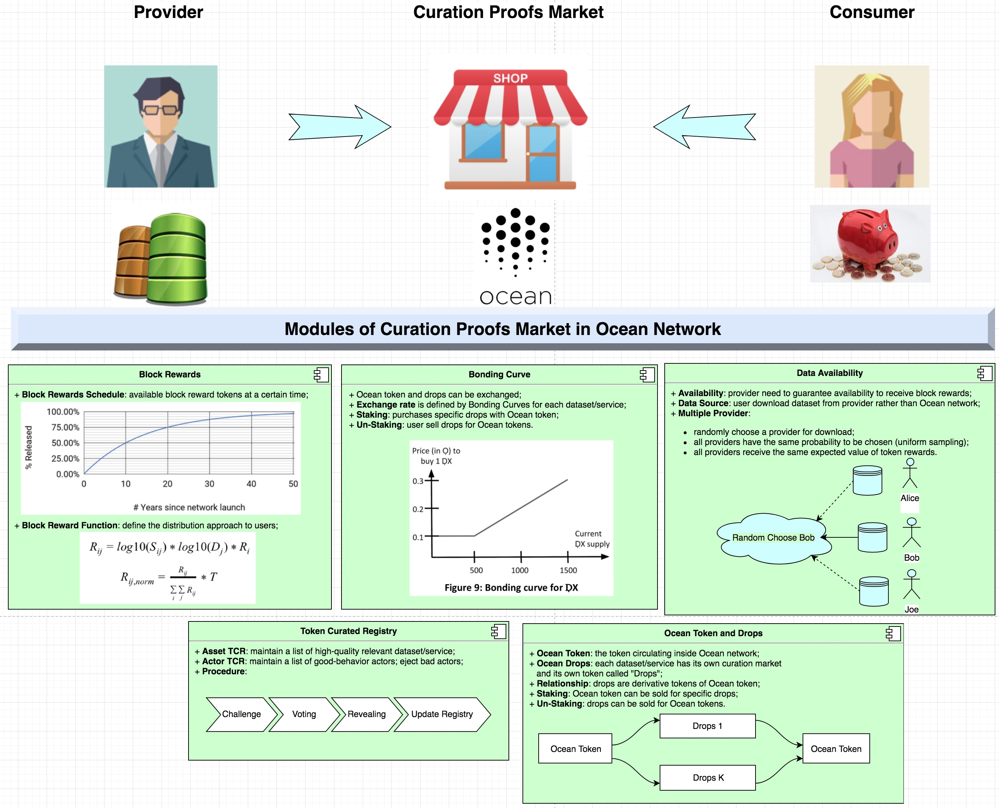

```
shortname: 11/MKT
name: Ocean Curation Market
type: Standard
status: Raw
editor: Fang Gong <fang@oceanprotocol.com>
```

<!--ts-->

Table of Contents
=================

   * [Ocean Curation Market](#ocean-curation-market)
      * [Change Process](#change-process)
      * [Language](#language)
      * [Motivation](#motivation)
      * [Specification](#specification)
         * [Proposed Solution](#proposed-solution)
         * [Registering a new Actor](#registering-a-new-actor)
         * [Retrieve information of an existing actor](#retrieve-actor)
         * [Updating Actor metadata](#updating-actor-metadata)
         * [Retire an Actor](#retire-an-actor)
      * [TODO: Events](#events)
      * [Copyright Waiver](#copyright-waiver)
      
<!--te-->

# Ocean Curation Market <a name="ocean-curation-market"></a>


The Ocean Curation Market (**MKT**) is a specification for Ocean Protocol to  in the Ocean Network.


This specification is based on [Ocean Protocol technical whitepaper](https://github.com/oceanprotocol/whitepaper), [3/ARCH](../3/README.md) and [4/KEEPER](../4/README.md).

This specification is called **MKT** henceforth.

## 1. Change Process <a name="change-process"></a>
This document is governed by the [2/COSS](../2/README.md) (COSS).

## 2. Language <a name="language"></a>
The key words "MUST", "MUST NOT", "REQUIRED", "SHALL", "SHALL NOT", "SHOULD", "SHOULD NOT", "RECOMMENDED", "NOT RECOMMENDED", "MAY", and "OPTIONAL" in this document are to be interpreted as described in [BCP 14](https://tools.ietf.org/html/bcp14) \[[RFC2119](https://tools.ietf.org/html/rfc2119)\] \[[RFC8174](https://tools.ietf.org/html/rfc8174)\] when, and only when, they appear in all capitals, as shown here.


## 3. Motivation <a name="motivation"></a>

Ocean network aims to power marketplaces for relevant AI-related data services.
Different actors and stakeholders are necessary to interact between them using the Ocean Protocol defined.  


## 4. Achitecture <a name="architecture"></a>




## 5. Modules <a name="modules"></a>


## 6. TODO: Events <a name="events"></a>


### Assignee(s)
Primary assignee(s): @gongf05


### Targeted Release

The implementation of the full Keeper functionality it's planned for the [Alpha release](https://github.com/oceanprotocol/ocean/milestone/4)


### Status
unstable


## 6. Copyright Waiver  <a name="copyright-waiver"></a>
To the extent possible under law, the person who associated CC0 with this work has waived all copyright and related or neighboring rights to this work.
