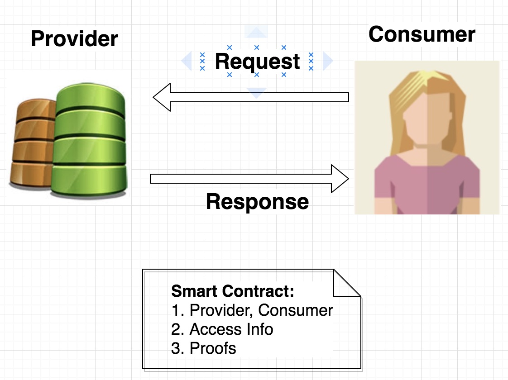
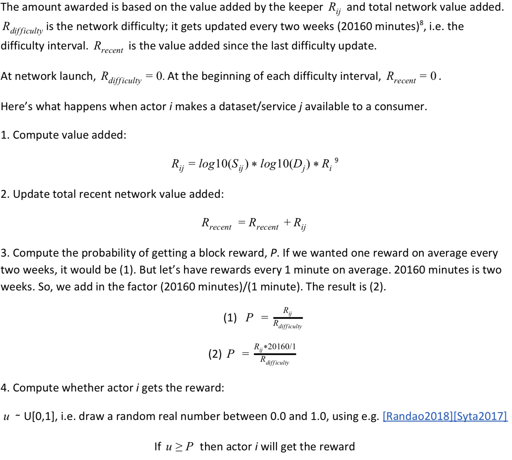
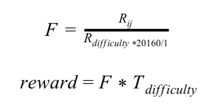
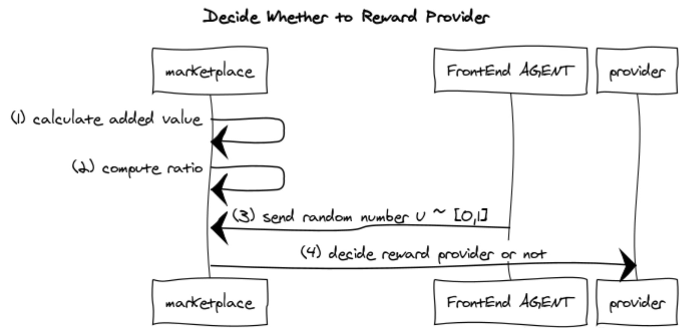

```
shortname: 11/CPM
name: Ocean Curated Proofs Market
type: Standard
status: Raw
editor: Fang Gong <fang@oceanprotocol.com>
contributors: Aitor Argomaniz <aitor@oceanprotocol.com>
```

<!--ts-->

Table of Contents
=================

   * [Ocean Curated Proofs Market](#ocean-curation-market)
      * [Change Process](#change-process)
      * [Language](#language)
      * [Motivation](#motivation)
      * [Architecture](#architecture)
      * [Modules](#modules)
      * [TODO: Events](#events)
      * [Reference](#reference)
      * [Copyright Waiver](#copyright-waiver)
      

# Ocean Curated Proofs Market <a name="ocean-curation-market"></a>


The Ocean Curated Proofs Market is a critical cornerstone of Ocean Protocol. This document bridges the theory in technical whitepaper[1] and the smart contract implementation in practice. 

The proposed solutions are based on Ocean Protocol technical whitepaper [1], Trent's talk [2] & blog [3], [3/ARCH](../3/README.md) and [4/KEEPER](../4/README.md).

## 1. Change Process <a name="change-process"></a>
This document is governed by the [2/COSS](../2/README.md) (COSS).

## 2. Language <a name="language"></a>
The key words "MUST", "MUST NOT", "REQUIRED", "SHALL", "SHALL NOT", "SHOULD", "SHOULD NOT", "RECOMMENDED", "NOT RECOMMENDED", "MAY", and "OPTIONAL" in this document are to be interpreted as described in [BCP 14](https://tools.ietf.org/html/bcp14) \[[RFC2119](https://tools.ietf.org/html/rfc2119)\] \[[RFC8174](https://tools.ietf.org/html/rfc8174)\] when, and only when, they appear in all capitals, as shown here.


## 3. Motivation: Why we need Curated Proofs Market? <a name="motivation"></a>

Ocean network aims to build a marketplace for relevant AI data. Curated proofs market coordinates participants to maintain high-quality assets (mainly datasets) and the normal operations of marketplace. 

The **minimum viable application** (MVA) of the marketplace is below: consumer requests access to dataset from provider, while provider responses with access information along with proofs. 



Curated proofs market helps customers to discover and acess the **relevant** datasets:

* Providers are motivated to publish relevant dataset and provide availability by block rewards. So the generation and distribution of **block rewards** are the most important building block.
* Providers are encouraged to curate relevant dataset with staking, and **drops along with bonding curves** are created to this purpose.
* There exist multiple providers for the same dataset, curated proofs market randomly pick one provider to guarantee the **data availability**.
* Markeplace relies on the coordination of users to maintain the high quality assets, and **token curated registry (TCR)** is used to this end.


## 4. Architecture Overview<a name="architecture"></a>

The architecture of curated proofs market is illustrated in the below, which includes five essential modules. 


* **Block Rewards**: Ocean network emits Ocean tokens continuously to incentivize providers according to the pre-defined schedule, which are called "block rewards". The distributed amount of block rewards SHOULD be determined by following factors: 
	* *Predicted popularity*: number of provider's stake on the dataset;
	* *Proofed popularity*: number of times made dataset available;
	* *dispensed tokens*： the emitted Ocean tokens based on mining schedule;
	* *ratio of download and uploads*: aims to mitigate the "Sybil downloading" attack [1].

	Details of the Block Rewards are discussed in [#TODO:OEP-BR]()
	
* **Ocean Token and Drops**: 
	* Ocean network creates a *dedicated* curated proofs market for each dataset.
	* Derivative tokens of Ocean Tokens are produced for each market, which is called "**drops** of curated proofs market for the particular dataset". 
	* Providers purchase drops with their Ocean tokens to stake on the asset.
	* Providers can un-stake by selling their drops for Ocean tokens and realize the profit.

	Details of the Drops are discussed in [#TODO:OEP-DROPS]()
 
* **Bonding Curve**: Bonding curve defines the relationship between price and total supply of drops. 
	* The drops price shoots up when more users purchase drops using Ocean token and increase the total supply. 
	* Increased supply indicates more users bet on the popularity of asset. 

	Details of the Bonding Curves are discussed in [#TODO:OEP-BC]()


* **Data Availability**: To earn block rewards, providers MUST make assets available when requested. 
	* It is desired to have multiple providers for the same asset so that to guarantee data availability. 
	* When an asset is requested, one provider SHOULD be randomly chosen to transfer the asset. 
	* All providers MUST have the same probability to be chosen regardless of their stakes on the dataset.
	* They SHOULD receive equal block rewards if they have the same stakes.  

	Details of the Data Availability are discussed in [#TODO:OEP-DA]()


* **Token Curation Registry (TCR)**: TCR is a powerful mechanism to maintain the high quality of the asset in the curated proofs market. 
	* Everyone can challenge any asset or user, which triggers a voting process. 
	* Participants in the curated proofs market can vote according to their own opinions. 
	* Depends on the voting result, the asset or actor will be either kept in the marketplace or ejected from the system. 

	Details of the TCR are discussed in [#TODO:OEP-TCR]()


---

## --- Below materials will be spreaded out into different OEPs ---

---

## 5. Modules <a name="modules"></a>

### 5.1 Block Rewards

**(1) Bock Reward Generation**

The 45% of total Ocean tokens are used for block rewards and the schedule determines the amount of block rewards available to be emitted at any timepoint [1]:


With **H=10**, the figure below shows the speed of releasing block rewards over years:


**(2) Block Reward Distribution**

The block reward function determines the amount of block reward that providers expect to receive[1]: 


**(3) Practical Implementation of Block Reward Distribution**

Ocean network SHOULD NOT reward providers at fixed time intervals, which has high complexity and expensive computational cost. Simply imagine the complexity to transfer Ocean block rewards to each provider through token-transfer transactions. 

To resolve the complexity issue, we adopt the following 2-stage implementation as describe in [1]:

* **Whether this provider should be rewarded?** In Ocean network, every time a dataset is requested, a provider will be randomly chosen to deliver the dataset. At this time, Ocean network calculates a probability whether to give block rewards to this provider. The probability is proportional to value added by the provider, compared to the network difficulty. 

	

* **What is the reward amount if provider will be rewarded?** If Ocean network chooses to reward this provider, Ocean network calculates the reward amount based on value added by this provider and the total network value added. In other words, all dataset providers split the block rewards according to their contributions of adding value to the network in the difficulty interval.
	* *R{ij}* is the value added by the provider;
	* *F* is the reward amount to this provider;
	* *T{difficulty}* is the total Ocean Token reward emitted during the two week difficulty period.

<div style="text-align:center"></div> 


To be more clear, the practical 2-stage strategy to distribute block rewards is following:

* *Stage 1: Marketplace decides whether to reward this provider*:
	* The value added by the provider is calculated as *R{ij}*;
	* Compute the ratio of *R{ij}* and *R{difficulty}*;
	* AGENTs submit their locally-generated random number to the Marketplace (similar to the appraoch in Randao [4]);
	* Marketplace calculates the XOR (exclusive OR) of those random numbers and determines whether to reward this provider.




* *Stage 2: Marketplace distributes rewards to provider*:
	* Marketplace requests block rewards from token contract;
	* Token contract MUST release block rewards according to schedule and transfers tokens to marketplace;
	* Marketplace SHOULD calculate the block reward distribution to current provider with formula;
	* It SHOULD increase the balance of provider accordingly without token transfer which avoids the cost of token-transfer transactions;
	* Marketplace only transfer tokens to provider's account upon the withdraw-token request.


When Ocean network distributes the block rewards, **"lazy transfer"** strategy is used to significantly reduce the transaction cost:

* The curated proofs market serves as a escrow account and holds the block rewards for providers. 
* It maintains the correct balance for each provider. 
* When the provider requests to withdraw Ocean tokens, curated proofs market transfer tokens to provider which SHOULD match the balance amount.
* curated proofs market avoids frequent token transfer to providers and saves transaction cost. 


**(4) Smart Contract Interface Functions**

The curated proofs market smart contract SHOULD include data structure to keep the records of providers and balances for each asset:

```solidity
// Asset struct has an array of providers Id
struct Asset {
	...
	uint[] providerId;
	...
}

// Provider struct has balance of Ocean Tokens
struct Provider {
	...
	uint balance;
	...

}

// Hashtable to map provider Id to provider struct
mapping(uint => Provider) id2provider

```

The contract SHOULD expose the following public methods:

```solidity
	// request token contract to release block rewards
    function requestBlockReward() public returns (bool success) { }
    
    // calculate block rewards distribution and credit to provider
    function calcBlockReward(uint _provider, uint _assetId) public returns (uint reward) { }
    
    // transfer block rewards to provider upon his request of withdraw
    function withdrawBlockReward(uint _provider) public returns (bool success) { }
```

### 5.2 Ocean Token and Drops

Each asset creates its own curated proofs market in Ocean network and needs its native tokens, which is called "drops". In fact, drops are *derivative tokens* of Ocean Tokens which means drops can be exchanged from/to Ocean Tokens. 

As shown in the figure: 

* Ocean tokens can be used to purchase drops for different asset (i.e., Drops 1, ..., Drops K) which represent user's stakes on asset / service. 
* These drops can be sold for Ocean tokens so that users can un-stake and realize their profits.


curated proofs market smart contract SHOULD record the drops balance for each provider. 

```solidity
// Asset struct can map provider id to his drops balance
struct Asset {
	...
	uint[] providerId;
	...
	mapping(uint => uint) id2drops;
	...
}
```

To implement the exchange between Ocean tokens and Drops, we adopt the **2-Way peg approach** similar to the mechanism behind [RootStock](https://faq.rsk.co/hrf_faq/what-is-the-2-way-peg/):

* There is no single transaction to transfer Ocean tokens or Drops;
* To purchase Drops, some Ocean tokens are locked and the corresponding Drops with the same value are unlocked.
* To sell Drops, the Drops get locked again and the Ocean tokens with the same value are unlocked.
* Both procedures are handled by smart contract to ensure the security.

In the practical implementation, curated proofs market smart contract MUST execute following operations:

* Lock the Ocean tokens that are used to purchases drops;
* Reduce user's balance of Ocean token by the same amount;
* Increase user's balance of drops by the amount that has an equal value with the locked Ocean tokens; 
* Reverse above operations when users un-stake.

The process can be illustrated with [below figure](diagrams/drops-and-ocean-tokens.md):


The smart contract SHOULD have interface functions:

```solidity
// purchase drops using Ocean token
function purchaseDrops(uint _assetId, uint _providerId, uint _amount) public returns (bool success) { }

// sell drops for Ocean token
function sellDrops(uint _assetId, uint _providerId, uint _amount) public returns (bool success) { }
```    

To lock and unlock Ocean tokens, it can be implemented with `Allowance` variable, which represents the available amount of Ocean tokens to be transferred by curation market. 

* **Purchase drops**: lock Ocean tokens by reducing the `allowance` value;
* **Sell drops**: unlock Ocean tokens by increasing `allowance` with the same value as locked Drops.


### 5.3 Bonding Curve

The rate between Ocean tokens and Drops is determined by Bonding Curve as shown in the below:


Clearly, the price of drops depends on the total supply:

* More users buy drops and total supply increases => drops price shoots up;
* More users sell drops and total supply decreases => drops price plummets;

One possible implementation is to use Bancor formula [5]:

* It models bonding curves as a parameterized power function.
* The integral of power function has analytical formula and computation is much easier. 

curated proofs market smart contract SHOULD have bonding curve function as:

```solidity
struct Asset {
	...
	uint drops_supply;
	...
}

// query the price of drops at current supply
function bondingCurve(uint _supply) public returns (uint price) { }
```


### 5.4 Data Availability

There are multiple providers for the same asset, which provide better data availability. When data is requested, one provider SHOULD be randomly chosen with **uniform-distributed sampling** to provide the dataset.

Since all providers have the same probability to be chosen, they SHOULD receive equal block rewards with the same amount of stakes on dataset.


<!--
Note that *random number generator is not available* in Ethereum Virtual Machine, as the code will be ran on multiple nodes, on different time. It does not make sense to generate different random numbers on different nodes at different time in Ethereum network. 
-->


To randomly choose the specific provider, a random number shall be generated. Note that random number generation is extrenely difficult in Ethereum Virtual Machine (EVM) which is a deterministic state machine. 

We take similar approach to Randao[4] as a commit-and-reveal approach:

* AGENT clients generate their own local uniform-distributed random numbers and submit to the EVM;
* EVM computes the XOR (exclusive OR) on all those numbers to compute the final random number;
* The final random number follows the uniform distribution as well.


```solidity
// Asset has provider list and their corresponding download times 
struct Asset {
	...
	uint[]	providerId;
	unit	totalDownload;
	unit	lastProvider;
	...
}

// hashtable mapping assetId to asset struct
mapping(uint => Asset) id2asset;

// return the list of all providers
function queryProviders(uint _assetId) public returns (uint[] _list) { }

// log the provider for current download and increment the counter of #download
function updateDownload(uint _assetId, uint _providerId) public returns (bool success) { }
```

* The function `queryProviders ` SHOULD return the list of providers to AGENT client so that AGENT can randomly choose one provider (i.e., unifrom-distributed sampling) to request the dataset. 
* The function `updateDownload` SHOULD increment `totalDownload` of the dataset and log the provider Id into `lastProvider`. 

### 5.5 Token Curation Registry

Curated proofs market coordinates the community to maintain the high-quality data together and Token Curation Registry (TCR) is used for that purpose in Ocean network:


The [workflow of TCR](diagrams/tcr-workflow.md) can be illustrated as below:
 


* Any user can apply for adding new asset or challenge existing assets or actors;
* All participants can vote to support or against the asset or actor;
* curated proofs market reveals the result after the voting period is closed;
* The majority party win the voting and rewards;
* curated proofs market keep or eject the asset or actor according to the voting result.


Smart contract SHOULD have data struct and interface functions to implement TCR in Ocean network:

```solidity
// Challenge data struct
struct Challenge {
	uint		id;
	address		owner;
	uint		stake;
	bool		resolved;
	mapping(address => bool) claimedToken; //whether a voter has claimed token reward
}

// hashtable mapping the changeId to associated Challenge data
mapping(uint => Challenge) id2challenges;

// apply for new dataset with deposit
function apply(uint _amount, bytes32 _dataHash) returns (uint challengeId) { }

// start a poll for challenging dataset / actor and send deposit
function challenge(uint _amount, bytes32 _dataHash) returns (uint challengeId) { }

// vote for or against 
function voteChallenge(uint _challengeId, uint _opinion) returns (bool success) { }

// reveal voting result and resolve the challenge
function resolveChallenge(uint _challengeId) returns (bool success) { }

// determine rewards to the winning party in a challenge
function determineReward(uint _challengeId) returns (uint tokens) { } 
```


## 6. TODO: Events <a name="events"></a>


### Assignee(s)
Primary assignee(s): @gongf05


### Targeted Release

The implementation of the full Keeper functionality it's planned for the [Alpha release](https://github.com/oceanprotocol/ocean/milestone/4)


### Status
unstable

## 7. Reference <a name="reference"></a>

* [1][Ocean Protocol Technical Whitepaper](https://oceanprotocol.com/tech-whitepaper.pdf)
* [2][Trent McConaghy, Co-Founder - Curated Proof Markets & Token-Curated Identities](https://www.youtube.com/watch?v=LxkvJmh7t0Y)
* [3][Curated Proofs Markets: A Walk-Through of Ocean’s Core Token Mechanics](https://blog.oceanprotocol.com/curated-proofs-markets-a-walk-through-of-oceans-core-token-mechanics-3d50851a8005)
* [4] [Randao: blockchain based verifiable random number generator](http://randao.org/)
* [5] [Bancor formula](https://github.com/relevant-community/bonding-curve/blob/master/contracts/BancorFormula.sol)


## 8. Copyright Waiver  <a name="copyright-waiver"></a>
To the extent possible under law, the person who associated CC0 with this work has waived all copyright and related or neighboring rights to this work.
