```
shortname: 11/MKT
name: Ocean Curation Market
type: Standard
status: Raw
editor: Fang Gong <fang@oceanprotocol.com>
```

<!--ts-->

Table of Contents
=================

   * [Ocean Curation Market](#ocean-curation-market)
      * [Change Process](#change-process)
      * [Language](#language)
      * [Motivation](#motivation)
      * [Architecture](#architecture)
      * [Modules](#modules)
      * [TODO: Events](#events)
      * [Reference](#reference)
      * [Copyright Waiver](#copyright-waiver)
      

# Ocean Curation Market <a name="ocean-curation-market"></a>


The Ocean Curation Market is a fundamental component of Ocean Protocol to  in the Ocean Network.


This component is based on [Ocean Protocol technical whitepaper](https://github.com/oceanprotocol/whitepaper), [3/ARCH](../3/README.md) and [4/KEEPER](../4/README.md).

## 1. Change Process <a name="change-process"></a>
This document is governed by the [2/COSS](../2/README.md) (COSS).

## 2. Language <a name="language"></a>
The key words "MUST", "MUST NOT", "REQUIRED", "SHALL", "SHALL NOT", "SHOULD", "SHOULD NOT", "RECOMMENDED", "NOT RECOMMENDED", "MAY", and "OPTIONAL" in this document are to be interpreted as described in [BCP 14](https://tools.ietf.org/html/bcp14) \[[RFC2119](https://tools.ietf.org/html/rfc2119)\] \[[RFC8174](https://tools.ietf.org/html/rfc8174)\] when, and only when, they appear in all capitals, as shown here.


## 3. Motivation <a name="motivation"></a>

Ocean network aims to buld a marketplace for relevant AI-related data. In particular, a curation market is constructed to curate high-quality dataset. The key components include:

* **block rewards**: Ocean network generates block rewards to incentivize users who put stakes on high-quality datasets and guarantee the data availability when requested. 
* **bonding curve**: Curation market adjusts the staking cost (i.e., price of drops  for a specific dataset) using bonding curve, therefore, encouraging earlier curations of high-quality dataset due to lower staking cost. 
* **TCR**: Curation market uses Token Curation Registry (TCR) to maintain a list of high-quality dataset and eject bad actors with malicious behavior. 


## 4. Achitecture <a name="architecture"></a>

The architecture of curation market is illustrated in the below, which includes five essential modules. 


* **Block Rewards**: Ocean network emits Ocean tokens continously according to the pre-defined schedule, which are block rewards for data providers. The distributed amount of block rewards SHOULD be determined by two factors: 
	* *predicted popularity*: number of provider's stake on the specific dataset;
	* *proofed popularity*: number of times made dataset available.
	
* **Ocean Token and Drops**: Ocean network creates derivative tokens of Ocean Token for each dataset curation market, which is called "drops". 
	* Providers purcahse drops with their Ocean tokens to stake on the dataset.
	* Providers can un-stake by selling their drops for Ocean tokens and pocket the profit.
 
* **Bonding Curve**：Bonding curve defines the relationship between price and total supply for drops. 
	* The drops price shoots up when users purchase drops using Ocean token and increase total supploy. 
	* Increased supply indicates more users bet on the popularity of this dataset. 


* **Data Avaliability**: To earn block rewards, providers MUST make dataset available when requested. 
	* It is desired to have multiple providers for the same dataset so that to guarantee data availability. 
	* When dataset is requested, one provider SHOULD be randomly chosen to transfer the dataset. 
	* All providers MUST have the same probability to be chosen.
	* they SHOULD receive equal block rewards if they have the same stakes.  


* **Token Curation Registry (TCR)**: TCR is a powerful mechanism to maintain the high quality of the dataset in the curation market. 
	* Everyone can challenge any dataset or user, which triggers a voting process. 
	* Every participant in the curation market can vote according to his own opinion. 
	* Depends on the voting result, the dataset or user will be either kept in the marketplace or ejected from the system. 


## 5. Modules <a name="modules"></a>

### 5.1 Block Rewards

**(1) Bock Reward Generation**

The 45% of Ocean tokens are used for block rewards and the schedule defines the amount of block rewards to be emitted:

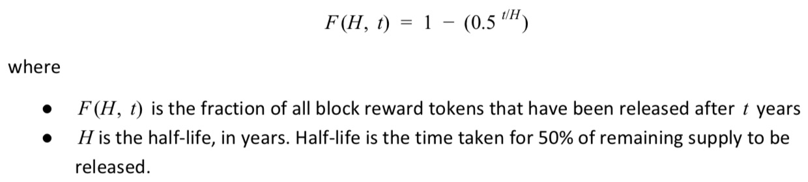

With H=10, the figure in the below shows the releasing speed of block rewards over years:

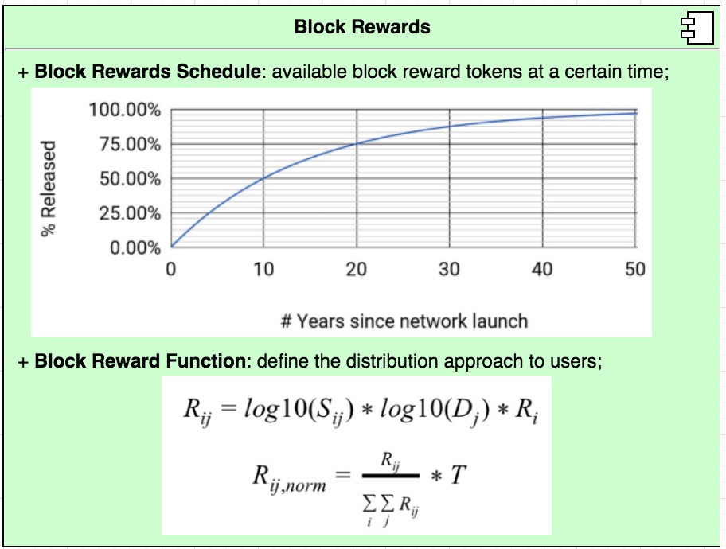

**(2) Block Reward Distribution**

The block reward function defines the amount of block reward that providers receive from a dataset. 
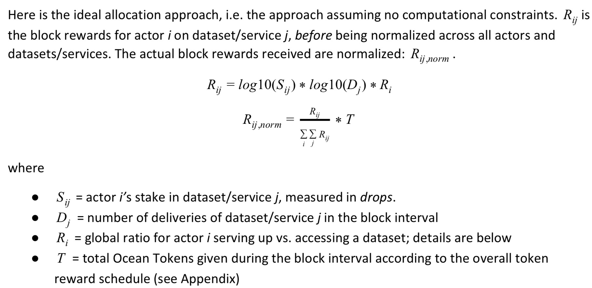


**(3) Practical Implementation of Block Reward Distribution**

Ocean network SHOULD NOT reward providers at fixed time intervals, which has high complexity and expensive computational cost. Simply imagine the complexity to transfer Ocean block rewards to each dataset curator through on-chain transaction.  

The practical strategy to distribute block rewards is following:

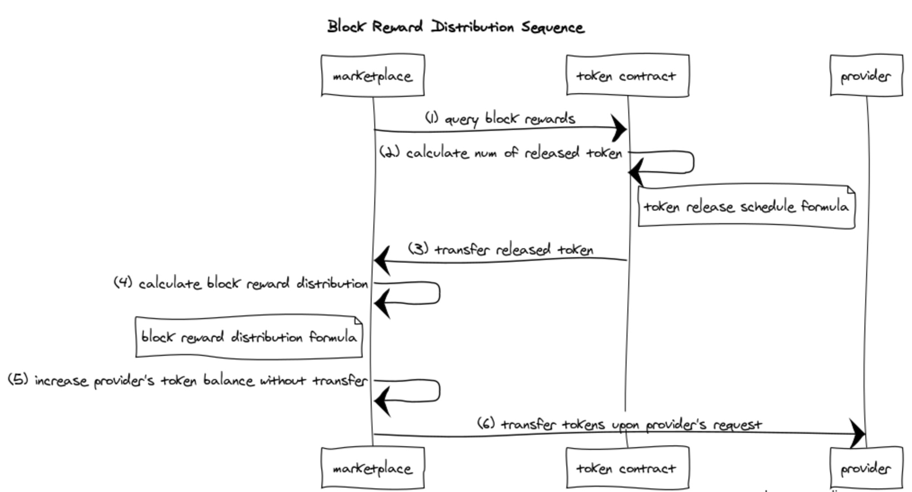

<!-- 
https://www.websequencediagrams.com/

title Block Reward Distribution Sequence

marketplace->token_contract: (1) query block rewards
token_contract->token_contract: (2) calculate num of released token
note right of token_contract: token release schedule formula
token_contract->marketplace: (3) transfer released token

marketplace->marketplace: (4) calculate block reward distribution
note left of marketplace: block reward distribution formula
marketplace->marketplace: (5) increase provider's token balance without transfer

marketplace->provider: (6) transfer tokens upon provider's request
--> 

* every time a provider makes dataset available to a consumer, marketplace SHOULD distribute block rewards;
* marketplace requests block rewards from token contract;
* token contract MUST release block rewards according to schedule and transfers tokens to marketplace;
* marketpalce SHOULD calculate the block reward distribution to current provider with formula;
* it SHOULD increase the balance of provider accordingly without real transfer so that to avoid the cost of transaction;
* marketplace MUST transfer tokens to provider's account upon the received withdraw request.

Here, ``lazy transfer`` strategy is used to significantly reduce the transaction cost:

* the curation market serves as a escrow account and holds the block rewards for providers. 
* it maintains the balance record for each provider. 
* When the provider requests to withdraw Ocean tokens, curation market initiates the real token transfer transaction.
* As such, curation market avoids frequent transfer of tokens to providers. 


**(4) Smart Contract Interface Functions**

The curation market smart contract SHOULD include data structure to record provider list and their balances for each dataset:

```solidity
// Asset struct has an array of providers Id
struct Asset {
	...
	uint[] providerId;
	...
}

// Provider struct has balance of Ocean Tokens
struct Provider {
	...
	uint balance;
	...

}

// Hashtable to map provider Id to provider struct
mapping(uint => Provider) id2provider

```

The contract SHOULD expose the following public methods:

```solidity
	// request token contract to release block rewards
    function requestBlockReward() public returns (bool success) { }
    
    // calculate block rewards distribution and credit to provider
    function calcBlockReward(uint _provider, uint _assetId) public returns (uint reward) { }
    
    // transfer block rewards to provider upon his request of withdraw
    function withdrawBlockReward(uint _provider) public returns (bool success) { }
```

### 5.2 Ocean Token and Drops

Each dataset creates its own curation market and needs its native tokens, which is called "drops" in Ocean network. In fact, drops are derivative tokens of Ocean Tokens which means drops can be exchanged from/to Ocean Tokens. 

As shown in the figure: 

* Ocean tokens can be used to purcahse drops for different dataset (i.e., Drops 1, ..., Drops K) which represent user's stakes on dataset / service. 
* These drops can be sold for Ocean tokens so that users can un-stake and realize their profits.

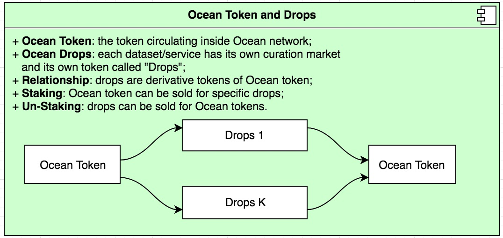


Curation market smart contract SHOULD record the drops balance for each provider. 

```solidity
// Asset struct can map provider id to his drops balance
struct Asset {
	...
	uint[] providerId;
	...
	mapping(uint => uint) id2drops;
	...
}
```

To implement the exchange between Ocean tokens and Drops without transfer transaction, we adopt the **2-Way peg approach** similar to the mechanism behind [RootStock](https://faq.rsk.co/hrf_faq/what-is-the-2-way-peg/):

* there is no single transaction to transfer Ocean tokens or Drops;
* To purchase Drops, some Ocean tokens are locked and the corresponding Drops with the same value are unlocked.
* To sell Drops, the Drops get locked again and the Ocean tokens with the same value are unlocked.
* both procedures are handled by smart contract to ensure the security.

In the practical implementation, curation market smart contract MUST execute following operations:

* lock the Ocean tokens that are used to purchases drops;
* reduce user's balance of Ocean token by the same amount;
* increase user's balance of drops by the amount that has an equal value with the locked Ocean tokens; 
* reverse above operatins when users un-stake.

The process can be illustrated with below figure:

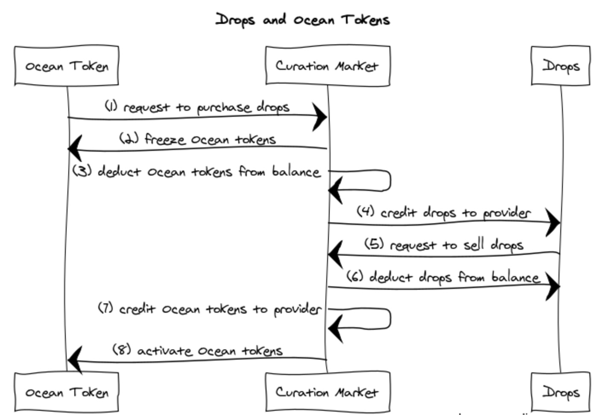

<!-- 
title Drops and Ocean Tokens


Ocean_Token->Curation_Market: (1) request to purchase drops
Curation_Market->Ocean_Token: (2) freeze Ocean tokens
Curation_Market->Curation_Market: (3) deduct Ocean tokens from balance
Curation_Market->Drops: (4) credit drops to provider

Drops->Curation_Market: (5) request to sell drops
Curation_Market->Drops: (6) deduct drops from balance
Curation_Market->Curation_Market: (7) credit Ocean tokens to provider
Curation_Market->Ocean_Token: (8) activate Ocean tokens
-->

The smart contract SHOULD have interface functions:

```solidity
// purchase drops using Ocean token
function purchaseDrops(uint _assetId, uint _providerId, uint _amount) public returns (bool success) { }

// sell drops for Ocean token
function sellDrops(uint _assetId, uint _providerId, uint _amount) public returns (bool success) { }
```    

To freeze and activate Ocean tokens, it can be implemented with `Allowance` variable, which represents the available amount of Ocean tokens to be transferred by curation market. 

* **purchase drops**: freeze Ocean tokens by reducing the allowance;
* **sell drops**: activate Ocean tokens by increasing allowance with corresponding amount.


### 5.3 Bonding Curve

The rate between Ocean tokens and Drops is determined by Bonding Curve as shown in the below:
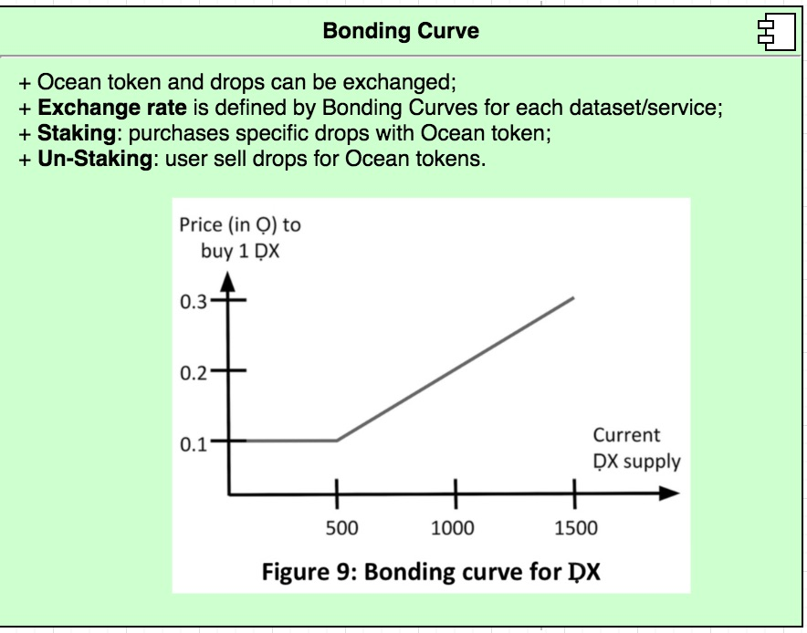

Clearly, the price of drops depends on the total supply:

* more users buy drops and total supply increases => drops price shoots up;
* more users sell drops and total supply decreases => drops price plummets;

Curation market smart contract SHOULD have bonding curve function as:

```solidity
struct Asset {
	...
	uint drops_supply;
	...
}

// query the price of drops at current supply
function bondingCurve(uint _supply) public returns (uint price) { }
```


### 5.4 Data Availability

There are multiple providers for the same dataset, which provide better data availability. When data is requested, curation market SHOULD randomly choose one provider with **uniform sampling** to provide the data.

Since all providers have the same probability to be chosen, they SHOULD receive equal expected block rewards if their bet the same stakes on dataset as well.

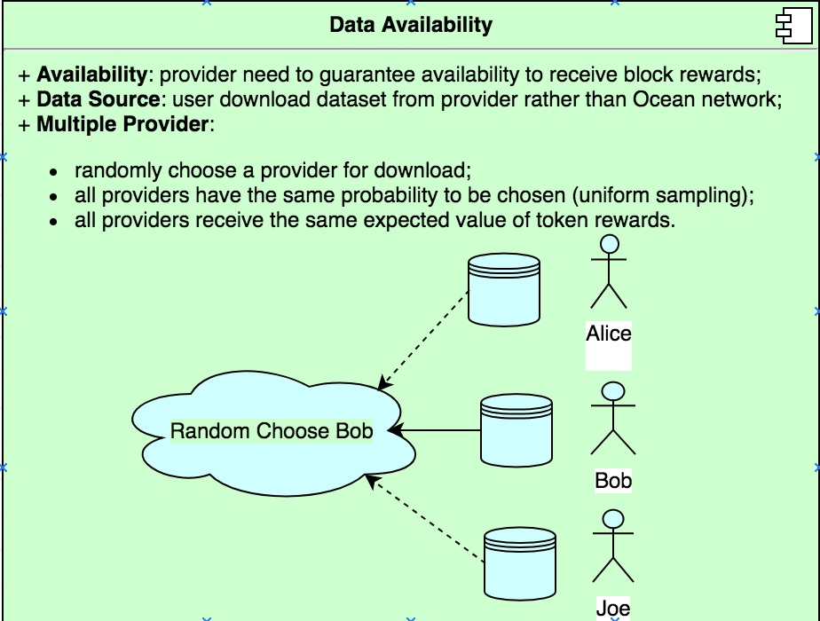

The curation market smart contract SHOULD have a function to choose the provider:

```solidity
// Asset struct has full list of providers 
struct Asset {
	...
	uint[]	providerId;
	...
}

// hashtable mapping assetId to asset struct
mapping(uint => Asset) id2asset;

// choose the provider from the list with uniform sampling
function selectProvider(uint _assetId) public returns (uint _providerId) { }
```

If there are many providers for `asset`, the function `selectProvider` SHOULD: 

* select provider for dataset `asset = id2asset[_assetId]`;
* generate an uniform-distributed random number `k` within the range of `[0, asset.providerId.length - 1]`;
* the provider `asset.providerId[k]` is chosen to provide the data. 

The following tweak SHALL guarantee that providers are chosen with equal probability:

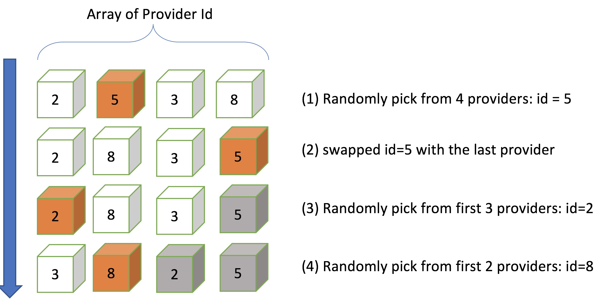

* randomly choose a provider from the list of *N* providers with uniform-distributed sampling;
* swap the chosen provider with the last unchosen provider in the list;
* randomly choose the next provider from the first *N-1* providers;
* swap the second provider with the last unchosen provider in the list;
* repeat the process...until all providers had been chosen;
* start it over and randomly choose from the entire list again.

### 5.5 Token Curation Registry

Curation market needs the community to maintain the high-quality data and keep the normal operation of the system together. Towards this purpose, the Token Curation Registry (TCR) is used in Ocean network.

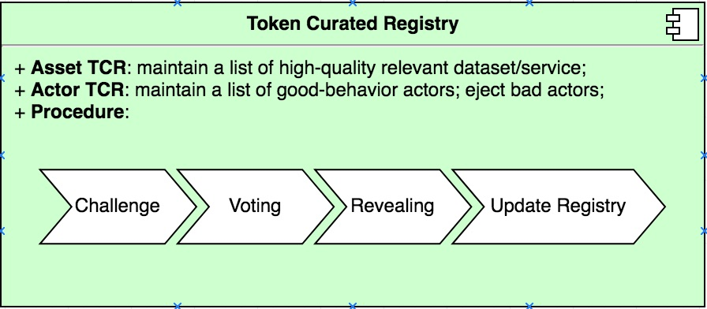

The workflow of TCR can be illustrated as below:
 
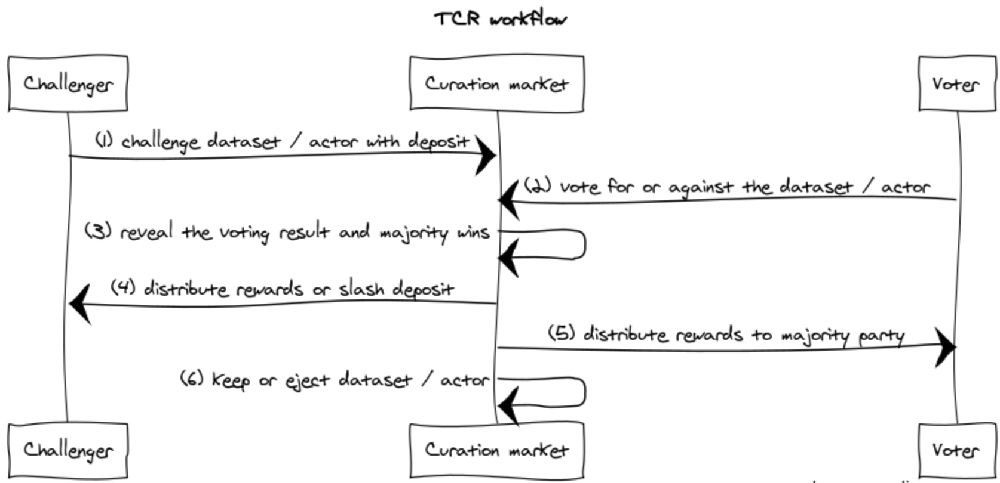

<!--
title TCR workflow


Challenger->Curation_market: (1) challenge dataset / actor with deposit
Voter->Curation_market: (2) vote for or against the dataset / actor
Curation_market->Curation_market: (3) reveal the voting result and majority wins
Curation_market->Challenger: (4) distribute rewards or slash deposit
Curation_market->Voter: (5) distribute rewards to majority party
Curation_market->Curation_market: (6) keep or eject dataset / actor
-->


* any user can apply for adding new dataset or challenge other datasets or actors;
* all participants can vote to support or against the dataset or actor;
* curation market reveals the result after the voting period is closed;
* the majority party win the voting and rewards;
* curation market keep or eject the dataset or actor according to the voting result.


Smart contract SHOULD have data struct and interface functions to implement TCR in Ocean network:

```solidity
// Challenge data struct
struct Challenge {
	uint		id;
	address		owner;
	uint		stake;
	bool		resolved;
	mapping(address => bool) claimedToken; //whether a voter has claimed token reward
}

// hashtable mapping the changeId to associated Challenge data
mapping(uint => Challenge) id2challenges;

// apply for new dataset with deposit
function apply(uint _amount, bytes32 _dataHash) returns (uint challengeId) { }

// start a poll for challenging dataset / actor and send deposit
function challenge(uint _amount, bytes32 _dataHash) returns (uint challengeId) { }

// vote for or against 
function voteChallenge(uint _challengeId, uint _opinion) returns (bool success) { }

// reveal voting result and resolve the challenge
function resolveChallenge(uint _challengeId) returns (bool success) { }

// determine rewards to the winning party in a challenge
function determineReward(uint _challengeId) returns (uint tokens) { } 
```


## 6. TODO: Events <a name="events"></a>


### Assignee(s)
Primary assignee(s): @gongf05


### Targeted Release

The implementation of the full Keeper functionality it's planned for the [Alpha release](https://github.com/oceanprotocol/ocean/milestone/4)


### Status
unstable

## 7. Reference <a name="reference"></a>

* [1][Ocean Protocol Technical Whitepaper](https://oceanprotocol.com/tech-whitepaper.pdf)
* [2][Trent McConaghy, Co-Founder - Curated Proof Markets & Token-Curated Identities](https://www.youtube.com/watch?v=LxkvJmh7t0Y)
* [3][Curated Proofs Markets: A Walk-Through of Ocean’s Core Token Mechanics](https://blog.oceanprotocol.com/curated-proofs-markets-a-walk-through-of-oceans-core-token-mechanics-3d50851a8005)


## 8. Copyright Waiver  <a name="copyright-waiver"></a>
To the extent possible under law, the person who associated CC0 with this work has waived all copyright and related or neighboring rights to this work.
