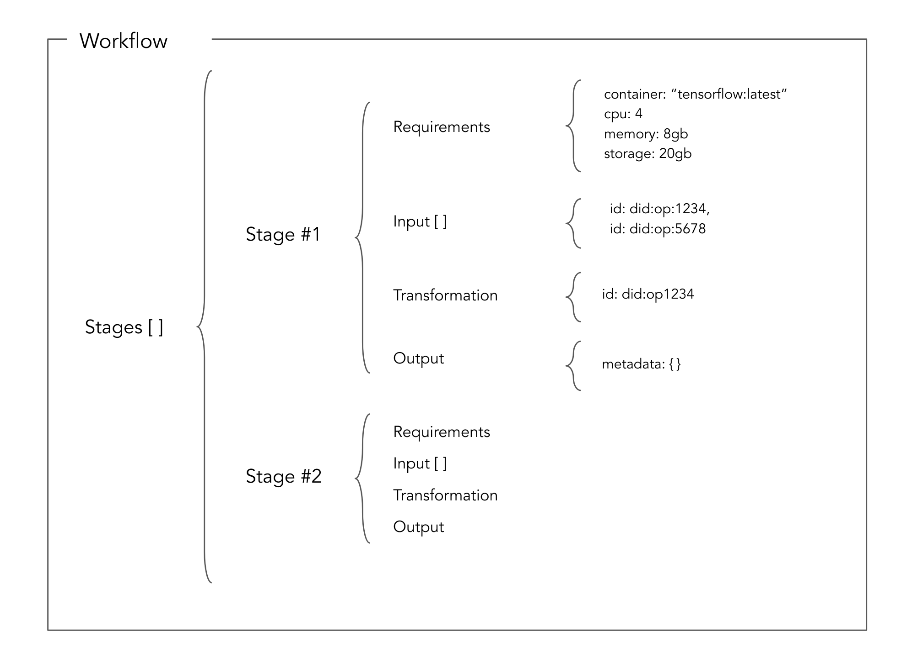
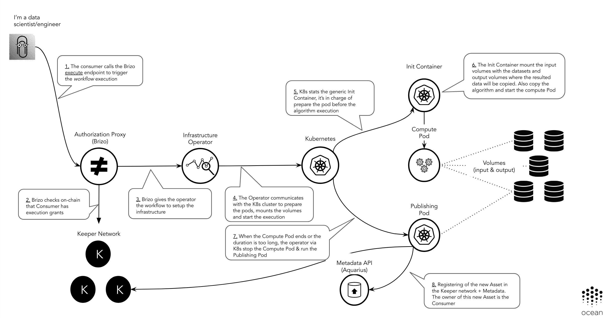

```
shortname: 12/EXEC
name: Execution of Compute Services
type: Standard
status: Raw
editor: Aitor Argomaniz <aitor@oceanprotocol.com>
contributors:
        Javier Cortejoso <javier@oceanprotocol.com>,
        Enrique Ruiz <enrique@oceanprotocol.com>, 
        Troy <troy@oceanprotocol.com>,
        Dimitri De Jonghe <dimi@oceanprotocol.com>,
        Ahmed Ali <ahmed@oceanprotocol.com>,
        Jose Pablo Fernandez <jose@oceanprotocol.com>

```

Table of Contents
=================

   * [Table of Contents](#table-of-contents)
   * [Execution of Compute Services using Service Agreements](#execution-of-computing-services-using-service-agreements)
      * [Change Process](#change-process)
      * [Language](#language)
      * [Motivation](#motivation)
      * [Actors](#actors)
      * [Technical components](#technical-components)
      * [Flow](#flow)
         * [Terminology](#terminology)
         * [Requirements](#requirements)
         * [Workflows](#workflows)
         * [Publishing an Asset including Compute Services](#publishing-an-asset-including-computing-services)
         * [Setting up the Service Execution Agreement](#setting-up-the-service-execution-agreement)
         * [Execution phase](#execution-phase)
      * [Infrastructure Orchestration](#infrastructure-orchestration)
         * [Services Provided by the Operator](#services-provided-by-the-operator)
         * [Orchestration Steps](#orchestration-steps)
         * [Infrastructure Operator](#infrastructure-operator)
            * [Volumes](#volumes)
         * [Network isolation](#network-isolation)


---


# Execution of Compute Services using Service Agreements

This OEP introduces the integration pattern for the usage of **Service Execution Agreements (SEA)** 
(also called Service Agreements or Agreements) as contracts between parties interacting in the execution of a Compute Service transaction.
This OEP using the SEA as core element, orchestrates the publishing/execution of this type of compute services.

The intention of this OEP is to describe the flow and integration pattern independently of the infrastructure Cloud Compute Service.
This OEP MUST be valid for integrating classical infrastructure cloud providers like Amazon EC2 or Azure, 
but also can be used to integrate web3 compute providers or On-Premise infrastructure.

It's out of the scope to detail the Service Execution Agreements implementation. 
Service Agreements are described as part of the [Dev-Ocean repository](https://github.com/oceanprotocol/dev-ocean).

## Change Process

This document is governed by the [2/COSS](../2/README.md) (COSS).


## Language

The key words "MUST", "MUST NOT", "REQUIRED", "SHALL", "SHALL NOT", "SHOULD", "SHOULD NOT", "RECOMMENDED", "NOT RECOMMENDED", "MAY", and "OPTIONAL" in this document are to be interpreted as described in [BCP 14](https://tools.ietf.org/html/bcp14) \[[RFC2119](https://tools.ietf.org/html/rfc2119)\] \[[RFC8174](https://tools.ietf.org/html/rfc8174)\] when, and only when, they appear in all capitals, as shown here.


## Motivation

The main motivations of this OEP are:

* Identify the actors involved on the definition and execution of an Ocean Compute service
* Detail the main characteristics of this interaction
* Specify the pros and cons of this approach
* Identify the modifications required to integrate in the Ocean stack
* Identify the API methods exposed via the different libraries

## Actors

The different actors interacting in this flow are:

* PROVIDERS - Give access to the Compute Services
* CONSUMERS - Want to make use of the Compute Services
* MARKETPLACES or DOMAINS - Store the DDO/Metadata related with the Assets/services
* INFRASTRUCTURE - Cloud or on-premise infrastructure services providing computing. Typically Amazon, Azure, etc.


## Technical components

The following technical components are involved in an end-to-end publishing and consumption flow:

* [MARKETPLACE](https://github.com/oceanprotocol/pleuston) - Exposes a web interface allowing the users to publish and purchase assets and services associated to those assets. Also facilitates the discovery of those assets.
* SQUID - Library encapsulating the Ocean Protocol business logic. Interacts with all the different components/APIs of the system. Currently it's provided in the following languages:
  - [Squid Javascript](https://github.com/oceanprotocol/squid-js) - Javascript version of Squid to be integrated with Frontend applications.
  - [Squid Python](https://github.com/oceanprotocol/squid-py) - Python version of Squid to be integrated with Backend applications. The primary users are data scientists.
  - [Squid Java](https://github.com/oceanprotocol/squid-java) - Java version of Squid to be integrated with Backend applications. The primary users are data engineers.
* [KEEPER CONTRACTS](https://github.com/oceanprotocol/keeper-contracts) - Provides the Service Execution Agreement (SA) business logic.
* [BRIZO or GATEWAY](https://github.com/oceanprotocol/brizo) - Micro-service to be executed by a PROVIDER. It exposes the HTTP REST API permitting access to PUBLISHER Assets or additional services like computation.
* [AQUARIUS](https://github.com/oceanprotocol/aquarius) - Micro-service to be executed by the MARKETPLACES. Facilitates creating, updating, deleting and searching the Asset's metadata registered by the PUBLISHERS. This Metadata, is included as part of a [DDO](../7/README.md), which also includes the Services associated with the Asset (Consumption, Computation, etc.).


## Flow

This section describes the Asset Compute Service flow in detail.
There are some parameters used in this flow:

* **DID** - See [OEP-7](../7/README.md).
* **serviceAgreementId** - Is the unique ID referring to a Service Execution Agreement established between a PUBLISHER and a CONSUMER. The CONSUMER (via Squid) is the one creating this random unique serviceAgreementId.
* **serviceDefinitionId** - Identifies one service in the array of services included in the DDO. It is created by the PUBLISHER (via Squid) upon DDO creation and is associated with different services.
* **templateId** - Identifies a unique Service Agreement template. The Service Agreement is an instance of one existing template. In the scenario described in this OEP, the templateId is `hash(2):ad7c5bef027816a800da1736444fb58a807ef4c9603b7848673f7e3a68eb14a5`

### Terminology

* Compute Provider - Entity providing a compute service for a price (or for free).
* Compute Service - Service offered by a Compute Provider. It could have different conditions like the type of services, price, etc. 
* Workflow - It describes an execution pipeline where you put together input data and an algorithm to process this data and you run using a Compute Service. 
  

### Requirements

* A COMPUTE PROVIDER or PROVIDER define the conditions that a Compute service supports. It includes:
  - What kind of image (Docker container) can be deployed in the infrastructure
  - What are the infrastructure resources available (CPU, memory, storage)  
  - What is the price of using the infrastructure resources
* A COMPUTE PROVIDER defines a Compute Service in the scope of the Asset (DID/DDO) of the dataset that can be computed
* A CONSUMER defines the task to execute modeling it in a Workflow (including configuration, input, transformations and output)
* A workflow is a new type of Asset. It can be resolvable and be used across multiple independent compute services
* A CONSUMER purchasing a compute service defines which Workflow (DID) is going to execute
* A CONSUMER can purchase a service given by a PROVIDER and execute multiple times till the timeout expires
* A CONSUMER could purchase a service and execute later, the purchase MUST be totally decoupled of execution
* The previous two points could support to buy once a compute service and execute for example the service every night at 3 am


### Workflows

From a high-level point of view, a workflow may be considered a view or representation of a real work.
A workflow consists of an orchestrated and repeatable pattern of activities 
transformed into tasks that transform or process information.

In Ocean we use the concept of workflow to represent a list of tasks to accomplish with the intention of process data.

From a technical point of view, a workflow is a type of Asset 
(it takes advantage of all the Ocean plumbing of registering, metadata publishing, resolving, etc.). 
The main objective of a workflow is to describe an execution pipeline.
 A workflow can be split in sequential stages, having each stage an input, transformation (via algorithm) and output.

In the below example, a workflow is modeled in a JSON document with the following characteristics:

* It has a list of sorted stages by the `stages.index` parameter to be executed sequentially
* Each stage has a list of minimum requirements, like the image required to support the execution of the algorithm, minimum cpu, memory, etc.
* Each stage has an array of sorted input parameters. Each input parameter may be: 
  - A DID (example: `"id": "did:op:12345"`)
  - The output of a previous stage (example: `"previousIndexStage": 0`)
* Each stage has one transformation entry. It includes the id (DID) of the asset in charge of process the input to generate some output
* Each stage includes an entry with some additional output details. This could be a DID or a specific detail about the expected output.




Example of a Workflow:

```json
{
	"service": [{
		"index": "0",
		"type": "metadata",
		"serviceEndpoint": "https://service/api/v1/metadata/assets/ddo/did:op:0ebed8226ada17fde24b6bf2b95d27f8f05fcce09139ff5cec31f6d81a7cd2ea",
		"attributes": {
			"main": {
        "type": "workflow",
        "workflow": {
          "stages": [{
						"index": 0,
						"stageType": "Filtering",
						"requirements": {
							"serverInstances": 1,
							"container": {
								"image": "tensorflow/tensorflow",
								"tag": "latest",
								"checksum": "sha256:cb57ecfa6ebbefd8ffc7f75c0f00e57a7fa739578a429b6f72a0df19315deadc"
							}
						},
						"input": [{
							"index": 0,
							"id": "did:op:12345"
						}, {
							"index": 1,
							"id": "did:op:67890"
						}],
						"transformation": {
							"id": "did:op:abcde"
						},
						"output": {}
					}, {
						"index": 1,
						"stageType": "Transformation",
						"requirements": {
							"serverInstances": 1,
							"container": {
								"image": "tensorflow/tensorflow",
								"tag": "latest",
								"checksum": "sha256:cb57ecfa6ebbefd8ffc7f75c0f00e57a7fa739578a429b6f72a0df19315deadc"
							}
						},
						"input": [{
							"index": 0,
							"previousStage": 0
						}],
						"transformation": {
							"id": "did:op:999999"
						},
						"output": {}
          }]
      }
      },
      "additional": {},
      "curation": {}
    }
  },
  {}
  ]
}

```

A Workflow is a new type of Asset (a part of datasets, algorithms, etc.).  
You can find a complete DDO of type workflow in the [ddo.workflow.json example file](ddo.workflow.json).

As a new kind of asset, the workflow details will be persisted inside a DDO as part of the "Metadata" service where the **type** is **workflow**. 
An Asset of type workflow, will include in the DDO the following information:

* The Workflow model as part of the `DDO.services["metadata"].main.workflow` entity
* The rest of the Workflow metadata information (title, author, ect.) as part of the existing Metadata service

A workflow, as every DDO in Ocean, can be resolved using the Asset Id (DID).

By the time being, the workflow definition supports the execution of sequential stages. 
It's not supported yet the execution of parallel stages. 

### Publishing an Asset including Compute Services

The Compute services are published as part of the asset (dataset) metadata as an additional service offered for that specific asset.

The complete flow of publishing an asset with a compute service attached is:

1. PUBLISHER generates a DID. See [How to compute a DID](https://github.com/oceanprotocol/OEPs/tree/master/7#how-to-compute-a-did).
1. PUBLISHER creates a DDO including the following information:
   - DID
   - Metadata. It contains the asset name, description, etc. For more details see [OEP-8](../8/README.md).
   - Public key of the PUBLISHER
   - A list of services (Access, etc). For more details see [OEP-11](../11/README.md).

   Each service in the list contains certain information depending on its type.
   Here we document the **Compute** service. The **Access** and **Metadata** services where discussed in the scope of the [OEP-11](../11/README.md).

   A service of type "compute" contains:

   - Service Definition ID (`serviceDefinitionId`); this helps PUBLISHER find the service definition of a DDO signed by CONSUMER
   - Service Agreement Template ID (`templateId`); points to a deployed on-chain SEA Template Smart Contract. In this case is a template implementing the Compute end to end flow
   - Service endpoint (`serviceEndpoint`); CONSUMERS signing this service send their signatures to this endpoint to request the execution of a workflow

   - A list of condition keys; condition key is the `keccak256` hash of the following:
     * SLA template ID
     * controller contract address (obtained from the solidity contract json file matching the contract name in the SLA condition)
     * controller contract function fingerprint (referred to as function signature or selector)

   - For each condition, a list is required of its parameter values, a timeout, a set of fields determining what conditions depend on other conditions, and a mapping of events emitted by the condition to the off-chain handlers of these events
   - Each event is identified by name. Each event handler is a function from a whitelisted module
   - Service Agreement contract address and the event mapping in the same format as the condition events, for off-chain listeners
   - An integer defining when the agreement is fulfilled in case there are multiple terminal conditions, according to the Service Agreement smart contract

   A service of type "compute" contains one endpoint:
   - **serviceEndpoint** - A URL to call when the CONSUMER request the execution of a workflow

    An example of a complete DDO can be found [here](./ddo.example.json). Please do note that the condition's order in the DID document should reflect the same order in on-chain service agreement.

1. PUBLISHER publishes the DDO in the Metadata Store (OceanDB) using AQUARIUS. This DDO must include at least one service of type "compute".

[Here](ddo.computing.json) you have an example of the DDO including a Compute service. Below you can find a small fraction of this:

"container": 

```json
  "service": [{
		"type": "compute",
		"serviceDefinitionId": "2",
		"serviceEndpoint": "http://mybrizo.org/api/v1/brizo/services/exec",
		"templateId": "804932804923850985093485039850349850439583409583404534231321131a",

		"attributes": {
			
		
		"main": {

			"creator": "0x00Bd138aBD70e2F00903268F3Db08f2D25677C9e",
			"datePublished": "2019-04-09T19:02:11Z",
			"price": "10",
			"timeout": 86400,
			"provider": {
				"type": "Azure",
				"description": "",
				"environment": {
					"cluster": {
						"type": "Kubernetes",
						"url": "http://10.0.0.17/xxx"
					},
					"supportedContainers": [{
						"image": "tensorflow/tensorflow",
						"tag": "latest",
						"checksum": "sha256:cb57ecfa6ebbefd8ffc7f75c0f00e57a7fa739578a429b6f72a0df19315deadc"
					}, {
						"image": "tensorflow/tensorflow",
						"tag": "latest",
						"checksum": "sha256:cb57ecfa6ebbefd8ffc7f75c0f00e57a7fa739578a429b6f72a0df19315deadc"
					}],
					"supportedServers": [{
						"serverId": "1",
						"serverType": "xlsize",
						"price": "5000000000000000000",
						"cpu": "16",
						"gpu": "0",
						"memory": "128gb",
						"disk": "160gb",
						"maxExecutionTime": 86400
					}, {
						"containerId": "2",
						"typeContainer": "medium",
						"price": "1000000000000000000",
						"cpu": "2",
						"gpu": "0",
						"memory": "8gb",
						"disk": "80gb",
						"maxExecutionTime": 86400
					}]

				}
			},

			"serviceAgreementTemplate": {
				"contractName": "ServiceExecutionTemplate",
				"events": [{
					"name": "AgreementCreated",
					"actorType": "consumer",
					"handler": {
						"moduleName": "serviceExecutionTemplate",
						"functionName": "fulfillLockRewardCondition",
						"version": "0.1"
					}
				}],
				"fulfillmentOrder": [
					"lockReward.fulfill",
					"serviceExecution.fulfill",
					"escrowReward.fulfill"
				],
				"conditionDependency": {
					"lockReward": [],
					"serviceExecution": [],
					"releaseReward": [
						"lockReward",
						"serviceExecution"
					]
				},
				"conditions": [{
						"name": "lockReward",
						"timelock": 0,
						"timeout": 0,
						"contractName": "LockRewardCondition",
						"functionName": "fulfill",
						"parameters": [{
								"name": "_rewardAddress",
								"type": "address",
								"value": ""
							},
							{
								"name": "_amount",
								"type": "uint256",
								"value": ""
							}
						],
						"events": [{
							"name": "Fulfilled",
							"actorType": "publisher",
							"handler": {
								"moduleName": "lockRewardCondition",
								"functionName": "fulfillServiceExecutionCondition",
								"version": "0.1"
							}
						}]
					},
					{
						"name": "execCompute",
						"timelock": 0,
						"timeout": 0,
						"contractName": "ComputeExecutionCondition",
						"functionName": "fulfill",
						"parameters": [{
								"name": "_documentId",
								"type": "bytes32",
								"value": ""
							},
							{
								"name": "_grantee",
								"type": "address",
								"value": ""
							}
						],
						"events": [{
								"name": "Fulfilled",
								"actorType": "publisher",
								"handler": {
									"moduleName": "execCompute",
									"functionName": "fulfillServiceExecutionCondition",
									"version": "0.1"
								}
							},
							{
								"name": "TimedOut",
								"actorType": "consumer",
								"handler": {
									"moduleName": "execCompute",
									"functionName": "fulfillServiceExecutionCondition",
									"version": "0.1"
								}
							}
						]
					},
					{
						"name": "escrowReward",
						"timelock": 0,
						"timeout": 0,
						"contractName": "EscrowReward",
						"functionName": "fulfill",
						"parameters": [{
								"name": "_amount",
								"type": "uint256",
								"value": ""
							},
							{
								"name": "_receiver",
								"type": "address",
								"value": ""
							},
							{
								"name": "_sender",
								"type": "address",
								"value": ""
							},
							{
								"name": "_lockCondition",
								"type": "bytes32",
								"value": ""
							},
							{
								"name": "_releaseCondition",
								"type": "bytes32",
								"value": ""
							}
						],
						"events": [{
							"name": "Fulfilled",
							"actorType": "publisher",
							"handler": {
								"moduleName": "escrowRewardCondition",
								"functionName": "verifyRewardTokens",
								"version": "0.1"
							}
						}]
					}
				]
			}
		}
		}
	}]
```

1. PUBLISHER registers the DID, associating the Asset DID to the Aquarius Metadata URL that resolves the DID to a DDO.
To do that, SQUID needs to integrate the `DIDRegistry` contract using the `registerAttribute` method.


### Setting up the Service Execution Agreement

#### Registering Asset

Using only one Squid call `registerAsset(asset_metadata, services_description, publisher_public_key)`, 
the PUBLISHER should be able to register an Asset including a **Compute** service.
The `services_description` attribute includes the different services (like compute) associated to this asset.

#### Consuming Asset

During this phase, through the CONSUMER and the PROVIDER (via BRIZO) negotiation, 
the Service Execution Agreement (SEA) is created and initialized.

Using Squid calls, a CONSUMER can discover, purchase and use the PROVIDER Compute services.

The complete flow for setting up the SEA is:

1. The CONSUMER chooses a service inside a DDO (the CONSUMER selects a `serviceDefinitionId`).

1. The Service Agreement needs to have an associated unique `serviceAgreementId` that can be generated/provided by the CONSUMER.
In the Smart Contracts, this `serviceAgreementId` will be stored as a `bytes32`. This `serviceAgreementId` is random and is represented by a 64-character hex string (using the characters 0-9 and a-f).
The CONSUMER can generate the `serviceAgreementId` using any kind of implementation providing enough randomness to generate this ID (64-characters hex string).

1. The CONSUMER signs the service details. 
The signature contains `(templateId, conditionTypes, valuesHashList, timeoutValues, serviceAgreementId)`. `serviceAgreementId` is provided by the CONSUMER and has to be globally unique.
  * Each ith item in `values_hash_list` and `timeoutValues` lists corresponds to the ith condition in conditionKeys
  * `values_hash_list`: a hash of the parameters types and values of each condition
  * `timeoutValues`: list of numbers to specify a timeout value for each condition.

It is used to correlate events and to prevent the PUBLISHER from instantiating multiple Service Agreements from a single request.

1. The CONSUMER initializes the SEA on-chain `(did, serviceAgreementId, serviceDefinitionId, signature, consumerAddress, workflowId`).

1. The CONSUMER locks the payment on-chain through the `LockRewardCondition` Smart Contract

1. The PROVIDER via BRIZO receives the `LockReward.Fulfilled` event where he/she is the provider for this agreement

1. The PROVIDER grants the execution permissions for the computation on-chain calling the `executeComputeCondition.Fullfill` method  

1. The CONSUMER gets the `executeComputeCondition.Fullfilled` event. When he/she receives the event, 
   can call the BRIZO `serviceEndpoint` url added in the DDO to start the execution of the computation workflow.
   Typically: `HTTP POST /api/v1/brizo/services/exec`

1. BRIZO receives the CONSUMER request, and calls the `checkPermissions` method to validate if the CONSUMER address is granted to execute the service
   If user is granted, BRIZO triggers the Execute Algorithm action in the infrastructure


### Execution phase

During this phase, if and only if the CONSUMER is granted, 
the CONSUMER can request the start of the Computation in the PUBLISHER infrastructure via BRIZO.

The complete flow for the Execution phase is:

1. BRIZO, after receiving the `execution` request from CONSUMER and validating the permissions using the `checkPermissions` function

1. If the CONSUMER is authorized, BRIZO starts the operations in the INFRASTRUCTURE (cloud or on-premise).

1. BRIZO resolves the DID of the Workflow associated with the Service Agreement. The workflow includes the details of the pipeline to execute, including the different stages, inputs and outputs.

1. BRIZO sends a "Workflow Registration" HTTP REST request to the Infrastructure Operator (aka OPERATOR). 
   This request must include the serviceAgreementId and the Workflow (JSON)

1. The OPERATOR receives a "Workflow Registration" request and:
   - Validates in K8s there is no an existing/running workflow with the same `serviceAgreementId`
   - Creates an unique `workflowExecutionId` identifying a unique execution of the service
   - Validates the container flavour defined by the CONSUMER in the Workflow is supported in the compute service (DDO) 
   - Starts the Orchestration Flow

1. All the actions made by the OPERATOR in the infrastructure via K8s MUST include the `serviceAgreementId` and `workflowExecutionId` as tags/labels

1. For each stage in the workflow, the OPERATOR orchestrates [Orchestration Steps](#orchestration-steps)

1. The OPERATOR requests the deletion of all the containers and volumes created in the Kubernetes cluster

1. The OPERATOR retrieves from the INFRASTRUCTURE (if it's available) a receipt demonstrating the execution of the service

1. The CONSUMER receives an event including the DID of the new ASSET created

1. BRIZO or any other user may requests the `releasePayment` through the KEEPER. It commit on-chain the HASH of the receipt ticket collected from the INFRASTRUCTURE provider.


## Infrastructure Orchestration

To facilitate the infrastructure orchestration BRIZO integrates with Kubernetes (aka K8s) via the OPERATOR component. 
The OPERATOR allows to abstract the execution of Docker containers with compute services independently of the backend (Amazon, Azure, On-Premise).
To support that OPERATOR includes the kubernetes driver allowing to wrap the complete execution including:

- Download of the container images
- Setting up the pods
- Creation of volumes
- Starting and stopping the service
- Retrieval of logs
- Registering the new Asset
- Destroy the pods

The OPERATOR handles 3 types of K8s Pods:

a. `Configuration Pod` is in charge of resolve the Workflow resources necessary for the execution of the algorithm. It copy the data and algorithm in volumes
b. `Compute Pod` is in charge of run the algorithm. This pod has access in read-only mode to the volumes with the input data and write mode to the output volume
c. `Publishing Pod` is in charge of having all the data and logs generated in the output volume to publish this data in Ocean as a new asset and handover the ownership to the CONSUMER

### Services Provided by the Operator

The services provided by the OPERATOR are:

1. Registering a new Workflow execution. Given a `serviceAgreementId` and a `Workflow` payload, starts the execution of the Workflow. 
   It returns a `workflowExecutionId` valid to track the execution of the Workflow.
1. Retrieve logs. Given a `serviceAgreementId` and `workflowExecutionId` retrieve the logs associated to that execution
1. Stop workflow execution. Given a `serviceAgreementId` and `workflowExecutionId` stop/delete all the containers associated with those 

### Orchestration Steps 

The compute scenario requires a complete orchestration of different stages in order to provide an end to end flow.
The steps included in this scenario are:

1. The CONSUMER send a request to BRIZO using the **compute/exec** method in order to trigger the Workflow execution

1. BRIZO receives this request and check on-chain via KEEPER if the CONSUMER has grants to execute the Workflow. 
   If the CONSUMER has grants will continue the Infrastructure Operation integration, if not will return an error message. 

1. BRIZO calls the Infrastructure Operator (aka OPERATOR) giving the Workflow that needs to be executed

1. The OPERATOR communicates with the K8s cluster to prepare the pods

1. The OPERATOR via K8s starts a generic [Configuration Pod](https://github.com/oceanprotocol/pod-configuration). The responsibilities of the configuration pod are:
   - Parses the Workflow document
   - Resolves the DID resources necessary to run the Workflow
   - Pulls the docker image from the Docker registry
   - Plugs the different data inputs as volumes in the Compute Pod
   - Plugs the output for data and logs as volumes in the Compute Pod

1. After all the above steps the `Configuration Pod` must die

1. If the `Configuration Pod` ends successfully the OPERATOR via K8s starts the `Compute Pod` using the flavour specifid in the Workflow definition

1. The `Compute Pod` starts and runs the `ocean-entrypoint.sh` part of the algorithm downloaded by the `Configuration Pod`

1. When the `Compute Pod` ends or the duration is too long (timeout), the OPERATOR via K8s stop and delete the Compute Pod

1.  If the `Compute Pod ends, the OPERATOR start a new instance of the Publishing Pod. The responsibilities of the Publishing Pod are:
   - List of the Log files generated in the Log volume and copy to the output
   - List of the Output data generated in the Output volume
   - Generate a new Asset Metadata using the information provided by the CONSUMER
   - Register a new Asset in Ocean including the Output & Log data generated
   - Transfer the ownership of the new Asset created to the CONSUMER    

1. At this point the CONSUMER could get an event of a new created asset where he/she is the owner 




### Infrastructure Operator

In the described OEP, the PUBLISHER of computation services is in charge of defining the 
requirements to allow the execution of algorithms on top of of the data assets.
It means only the images specified in the DDO by the publisher with a specific DID and checksum
 will be allowed to be executed in the Runtime environment.
  
BRIZO is in charge of setting up the runtime environment speaking with the infrastructure provider via Kubernetes.

The images defined in the DDO and defined by the PUBLISHER only SHOULD include the minimum libraries specified,
it will reduce the risk of executing unexpected software via external libraries.
In addition to this, it's recommended that the images running in the runtime environment don't have network connectivity
a part of the minimum required to get access to the Assets.

#### Volumes

The input assets will be added to the runtime environment as **read only** volumes. 
The complete paths to the folders where the volumes are mounted will be given to the algorithm as parameters, using the same order of the parameters specified in the Workflow definition.
The new derived Asset generated as a result of the execution of the algorithm MUST be written in the output volume. 
The pods will be **destroyed** after the execution, so only the data stored in the **output** or **logs** volumes should be used.

| Type  | Permissions  | CLI Parameter  |
|-------|--------------|----------------|
| Input | Read         | --input1=/mnt/volume1 --input2=/mnt/volume2 |
| Output| Read, Write  | --output=/mnt/output |
| Logs  | Read, Write  | --logs=/mnt/logs |

### Network isolation

The runtime environment doesn't need to have network connectivity to external networks to be executed. 
To avoid sending the internal information about the data, it's recommended to restrict the output connectivity. 
   
 
