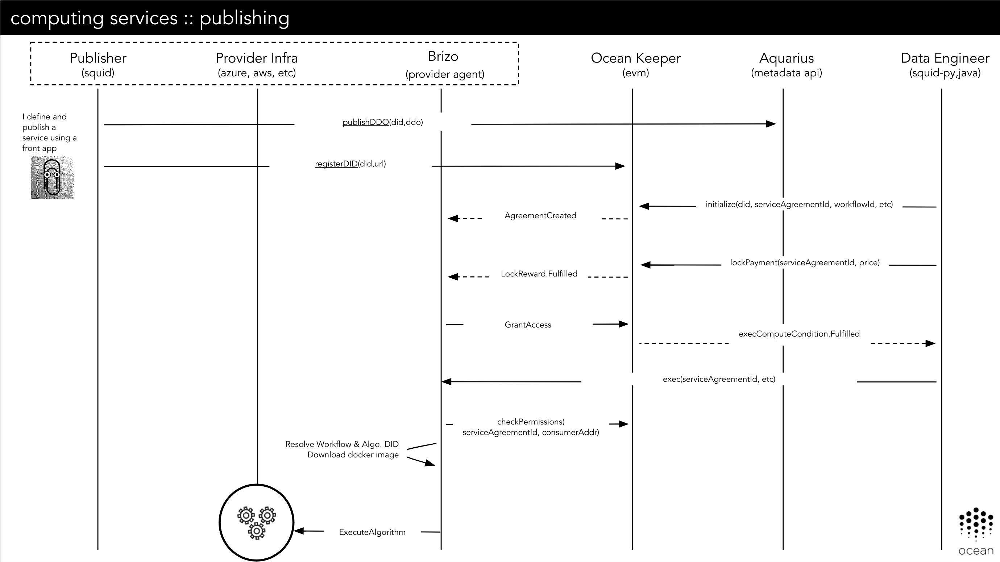

```
shortname: 12/EXEC
name: Execution of Computing Services
type: Standard
status: Raw
editor: Aitor Argomaniz <aitor@oceanprotocol.com>
contributors: Dimitri De Jonghe <dimi@oceanprotocol.com>,
			  Ahmed Ali <ahmed@oceanprotocol.com>

```


Table of Contents
=================

   * [Table of Contents](#table-of-contents)
   * [Execution of Computing Services using Service Agreements](#execution-of-computing-services-using-service-agreements)
      * [Change Process](#change-process)
      * [Language](#language)
      * [Motivation](#motivation)
      * [Actors](#actors)
         * [Technical components](#technical-components)
      * [Flow](#flow)
         * [Publishing an Asset including Computing Services](#publishing-an-asset-including-computing-services)
         * [Setting up the Service Execution Agreement](#setting-up-the-service-execution-agreement)
         * [Execution phase](#execution-phase)


---


# Execution of Computing Services using Service Agreements

This OEP introduces the integration pattern for the use **Service Execution Agreements (SEA)** as contracts between parties interacting in the execution of a Compute Service transaction.
This OEP using the SEA as core element to orchestrate the publishing/execution of this type of computing services.

The intention of this OEP is to describe the flow and integration pattern independently of the Cloud Computing Service.
This could happen using a classical cloud provider like Amazon EC2 and Azure, On-chain services like Fitchain or On-Premise infrastructure.

It's out of the scope to detail the Service Agreements implementation. Service Agreements are described as part of the Dev-Ocean repository.

## Change Process

This document is governed by the [2/COSS](../2/README.md) (COSS).


## Language

The key words "MUST", "MUST NOT", "REQUIRED", "SHALL", "SHALL NOT", "SHOULD", "SHOULD NOT", "RECOMMENDED", "NOT RECOMMENDED", "MAY", and "OPTIONAL" in this document are to be interpreted as described in [BCP 14](https://tools.ietf.org/html/bcp14) \[[RFC2119](https://tools.ietf.org/html/rfc2119)\] \[[RFC8174](https://tools.ietf.org/html/rfc8174)\] when, and only when, they appear in all capitals, as shown here.


## Motivation

The main motivations of this OEP are:

* Identify the actors involved
* Detail the main characteristics of this interaction
* Specify the pros and cons of this approach
* Identify the modifications required to integrate this approach
* Identify the API methods exposed via the different libraries

## Actors

The different actors interacting in this flow are:

* PROVIDERS - Provide access to the Computing Services
* CONSUMERS - Want to make use of the Computing Services
* MARKETPLACES or DOMAINS - Store the DDO/Metadata related with the Assets/services
* COMPUTE PROVIDER - Cloud or on-premise provider of computation. Typically Azure, Fitchain, etc.


### Technical components

The following technical components are involved in an end-to-end publishing and consumption flow:

* [MARKETPLACE](https://github.com/oceanprotocol/pleuston) - Exposes a web interface allowing the users to publish and purchase assets and services associated to those assets. Also facilitates the discovery of those assets.
* SQUID - Library encapsulating the Ocean Protocol business logic. Interacts with all the different components/APIs of the system. Currently it's provided in the following languages:
  - [Squid Javascript](https://github.com/oceanprotocol/squid-js) - Javascript version of Squid to be integrated with Frontend applications.
  - [Squid Python](https://github.com/oceanprotocol/squid-py) - Python version of Squid to be integrated with Backend applications. The primary users are data scientists.
  - [Squid Java](https://github.com/oceanprotocol/squid-java) - Java version of Squid to be integrated with Backend applications. The primary users are data engineers.
* [KEEPER CONTRACTS](https://github.com/oceanprotocol/keeper-contracts) - Provides the Service Execution Agreement (SA) business logic.
* [BRIZO](https://github.com/oceanprotocol/brizo) - Microservice to be executed by a PROVIDER. It exposes the HTTP REST API permitting access to PUBLISHER Assets or additional services like computation.
* [AQUARIUS](https://github.com/oceanprotocol/aquarius) - Microservice to be executed by the MARKETPLACES. Facilitates creating, updating, deleting and searching the Asset's metadata registered by the PUBLISHERS. This Metadata, is included as part of a [DDO](../7/README.md), which also includes the Services associated with the Asset (Consumption, Computation, etc.).


## Flow

This section describes the Asset Compute Service flow in detail.
There are some parameters used in this flow:

* **did** - See [OEP-7](../7/README.md).
* **serviceAgreementId** - Is the unique ID referring to a Service Execution Agreement established between a PUBLISHER and a CONSUMER. The CONSUMER (via Squid) is the one creating this random unique serviceAgreementId.
* **serviceDefinitionId** - Identifies one service in the array of services included in the DDO. It is created by the PUBLISHER (via Squid) upon DDO creation and is associated with different services.
* **templateId** - Identifies a unique Service Agreement template. The Service Agreement is an instance of one existing template. In the scenario described in this OEP, the templateId is `hash(2):ad7c5bef027816a800da1736444fb58a807ef4c9603b7848673f7e3a68eb14a5`


### Publishing an Asset including Computing Services


1. PUBLISHER generates a DID. See [How to generate a DID](https://github.com/oceanprotocol/OEPs/tree/master/7#length-of-a-did).
1. PUBLISHER creates a DDO including the following information:
   - DID
   - Metadata
     Contains Asset name, description, etc. For details see [OEP-8](../8/README.md).
   - Public key of the PUBLISHER
   - A list of services (Access, Compute, etc)

   Each service in the list contains certain information depending on its type.
   Here we document the **Computing** service. The **Access** and **Metadata** services where discussed in the scope of the [OEP-11](../11/README.md).

   A service of type "Computing" contains:

   - Service Definition ID (`serviceDefinitionId`); this helps PUBLISHER find the service definition of a DDO signed by CONSUMER
   - Service Agreement Template ID (`templateId`); points to a deployed on-chain Service Agreement contract
   - Service endpoint (`initializeEndpoint`); CONSUMERS can call the BRIZO endpoint to initialize the SEA
   - Service endpoint (`uploadEndpoint`); CONSUMERS send the algorithm (using a DID or binary) to this endpoint to be executed later
   - Service endpoint (`serviceEndpoint`); CONSUMERS signing this service send their signatures to this endpoint to execute the computing

   - A list of condition keys; condition key is the `keccak256` hash of the following:
     * SLA template ID
     * controller contract address (obtained from the solidity contract json file matching the contract name in the SLA condition)
     * controller contract function fingerprint (referred to as function signature or selector)

   - For each condition, a list is required of its parameter values, a timeout, a set of fields determining what conditions depend on other conditions, and a mapping of events emitted by the condition to the off-chain handlers of these events
   - Each event is identified by name. Each event handler is a function from a whitelisted module
   - Service Agreement contract address and the event mapping in the same format as the condition events, for off-chain listeners
   - An integer defining when the agreement is fulfilled in case there are multiple terminal conditions, according to the Service Agreement smart contract

   A service of type "Computing" contains 2 different endpoints:
   - **serviceEndpoint** - A URL call when user want's to execute the computation
   - **uploadEndpoint** - A URL call when user want's to upload an algorithm to the PUBLISHER
   - **initializeEndpoint** - A URL to initialize the Service Agreement

    An example of a complete DDO can be found [here](./ddo.example.json). Please do note that the condition's order in the DID document should reflect the same order in on-chain service agreement.

1. PUBLISHER publishes the DDO in the Metadata Store (OceanDB) using AQUARIUS. This DDO must include at least one service of type "Computing".

[Here](ddo.computing.json) you have an example of the DDO including a Computing service. Below you can find a small fraction of this:

```json
  "service": [{
    "type": "Computing",
    "serviceDefinitionId": "0",
    "initializeEndpoint": "http://mybrizo.org/api/v1/brizo/services/computing/initialize",
    "serviceEndpoint": "http://mybrizo.org/api/v1/brizo/services/computing/exec?pubKey=${pubKey}&serviceId={serviceId}&container={container}",
    "templateId": "044852b2a670ade5407e78fb2863c51000000000000000000000000000000002",
    "provider": {
      "type": "Azure",
      "description": "",
      "environment": {
        "flavour": "tensorflow/tensorflow:latest",
        "typeContainer": "xlsize",
        "cpu": "16",
        "gpu": "0",
        "memory": "128gb",
        "disk": "160gb"
      }
    },
    "serviceAgreementContract": {
      "contractName": "ServiceAgreement",
      "fulfillmentOperator": 1,
      "events": [{
        "name": "ExecuteAgreement",
        "actorType": "consumer",
        "handler": {
          "moduleName": "compute",
          "functionName": "submitAlgorithmHash",
          "version": "0.1"
        }
      }]
    },
    "conditions": [ ]
  }]
```

1. PUBLISHER registers the DID, associating the Asset DID to the Aquarius Metadata URL that resolves the DID to a DDO.
To do that, SQUID needs to integrate the `DIDRegistry` contract using the `registerAttribute` method.





### Setting up the Service Execution Agreement

Using only one Squid call `registerAsset(asset_metadata, services_description, publisher_public_key)`, the PUBLISHER should be able to register an Asset including a **Computing** service.
The `services_description` attribute includes the different services (like computing) associated to this asset.

During this phase, through the CONSUMER and the PUBLISHER (via BRIZO) negotiation, the Service Execution Agreement (SEA) is created and initialized.

Using Squid calls, a CONSUMER can discover, purchase and use the PUBLISHER Computing services.

The complete flow for setting up the SEA is:

1. The CONSUMER chooses a service inside a DDO (the CONSUMER selects a `serviceDefinitionId`).

1. The Service Agreement needs to have an associated unique `serviceAgreementId` that can be generated/provided by the CONSUMER.
In the Smart Contracts, this `serviceAgreementId` will be stored as a `bytes32`. This `serviceAgreementId` is random and is represented by a 64-character hex string (using the characters 0-9 and a-f).
The CONSUMER can generate the `serviceAgreementId` using any kind of implementation providing enough randomness to generate this ID (64-characters hex string).

1. The CONSUMER signs the service details. There is a particular way of building the signature documented elsewhere.
The signature contains `(templateId, conditionKeys, valuesHashList, timeoutValues, serviceAgreementId)`. `serviceAgreementId` is provided by the CONSUMER and has to be globally unique.
  * Each ith item in `values_hash_list` and `timeoutValues` lists corresponds to the ith condition in conditionKeys
  * `values_hash_list`: a hash of the parameters types and values of each condition
  * `timeoutValues`: list of numbers to specify a timeout value for each condition.

It is used to correlate events and to prevent the PUBLISHER from instantiating multiple Service Agreements from a single request.

1. The CONSUMER sends `(did, serviceAgreementId, serviceDefinitionId, signature, consumerAddress`) to the service endpoint (BRIZO).
`serviceDefinitionId` tells the PUBLISHER where to find the preimage to verify the signature. The DID tells the PUBLISHER which Asset to serve under these terms.

```
HTTP POST /api/v1/brizo/services/compute/initialize

{
 "did": "did:op:08a429b8529856d59867503f8056903a680935a76950bb9649785cc97869a43d",
 "serviceAgreementId": "bb23s87856d59867503f80a690357406857698570b964ac8dcc9d86da4ada010",
 "serviceDefinitionId": "0",
 "signature": "cade376598342cdae231321a0097876aeda656a567a67c6767fd8710129a9dc1",
 "consumerAddress": "0x00a329c0648769A73afAc7F9381E08FB43dBEA72"
}

```

The execution of this endpoint should return a `HTTP 201` if everything goes okay. Satisfactory conditions include:

   - When BRIZO receives a signature from the service endpoint and verifies the signature.

   - Having the `did`, BRIZO fetches the DDO related with this `did`.

   - BRIZO records the `serviceAgreementId` as corresponding to the given `did`.

   - BRIZO executes the Service Agreement by calling `ServiceAgreement.executeAgreement`, providing it with `serviceAgreementId`, `conditionKeys`, `valuesHashList`, and `timeouts`.

   - BRIZO starts listening for the `publisher` events from the events section of the service definition.

1. Before receiving the HTTP response confirmation from BRIZO, the CONSUMER starts listening for `consumer` events specified in the corresponding service definition (in this case `ExecuteAgreement`), filtering them by `serviceAgreementId`.

1. BRIZO, just after receive the `HTTP /api/v1/brizo/services/compute/initialize` request, validate all the input parameters (See [OEP-11](../11/README.md) for more details) and initialize the SEA on-chain.
   If SEA is initialized correctly, will raise the `ExecuteAgreement` event.

1. The CONSUMER get the `ExecuteAgreement` filtering by the `serviceAgreementId`. When he/she receives the event, call the Brizo `uploadEndpoint` url added in the DDO.
   Typically: `HTTP POST /api/v1/brizo/services/computing/upload`
   This is in charge of uploading the algorithm to the PUBLISHER passing the following parameters:

   - serviceAgreementId
   - signedChecksum - This is the off-chaing chekcksum of the algorithm file (md5sum) signed by the CONSUMER
   - serviceDefinitionId
   - did or binary of the algorithm

1. BRIZO implements in the `upload` method the logic to persist the algorithm:

   - If the CONSUMER specifies the did, BRIZO will need to resolve this did to retrieve the algorithm and persist in is local infrastructure (cloud or on-premise).
   - If the user pass the content binary, BRIZO will persist the algorithm in the infrastructure.

  BRIZO will call the KEEPER SEA `ComputeConditions.fulfillAlgorithmUpload` method specifing the:

   - serviceAgreementId
   - signedChecksum
   - serviceDefinitionId
   - did if was provided by the CONSUMER

  The KEEPER `ComputeConditions.fulfillAlgorithmUpload` will emit the event `FulfillUpload` if everything works good.

1. LOCK PAYMENT. The CONSUMER listens for the `ExecuteAgreement` event emitted in the very beginning of Service Agreement execution, filtering it by `serviceAgreementId`.

  After receiving that event, the CONSUMER using the `payment` module call the `lockPayment` method.
  This function call the KEEPER to look the payment on-chain. This is part of SEA - PaymentConditions.
  If everything works properly, this will trigger the `PaymentLocked` event.

1. BRIZO is listening for the `PaymentLocked` event, when this event is received BRIZO calls the `authorizeComputation` method.
   This method in the KEEPER triggers the `ComputeGranted` event.

1. The CONSUMER is listening the `ComputeGranted` event filtering by his/her own address and serviceAgreementId.
   When this happens, the CONSUMER is aware he/she can execute the computation when he or she wants.
   The execution could be scheduled and triggered depending of the user needs. For example every night 3 am.

1. The CONSUMER send to BRIZO the Execute request (the endpoint is defined in the DDO.Service["Computing"].serviceEndpoint
   The CONSUMER includes in this request:

   - serviceAgreementId
   - serviceDefinitionId
   - address

1. BRIZO receives the CONSUMER request, and calls the `checkPermissions` method to validate if the CONSUMER address is granted to execute the service
   If user is granted, BRIZO triggers the Execute Algorithm action in the infrastructure

### Execution phase

During this phase, if and only if the CONSUMER is granted, the CONSUMER can request the start of the Computation in the PUBLISHER infrastructure via BRIZO.

The complete flow for the Execution phase is:

1. BRIZO, after receiving the `execution` request from CONSUMER and validate the permissions using the `checkPermissions` function

1. If the CONSUMER is authorized, BRIZO starts the operations in the INFRASTRUCTURE (cloud or on-premise).
   It includes:

   - Copy the algorithm to a volume or bucket
   - Start the container of the flavour & type defined in the DDO (service["Computing"].provider.environment{flavour, typeContainer})
     This container will have attached 3 different volumes. The first one is for the algorithm, the second is for the input data, the third is for the output data
   - After the container is running, the algorithm is executed. The input and output volumes are passed as the first and second parameter to the algorithm
   - The execution logs are retrieved and stored in the output volume
   - After the algorithm finish, the output should be written in the output volume

1. After finalize the execution of the algorithm, BRIZO request the stop and deletion of the container

1. BRIZO retrieve from the INFRASTRUCTURE (if it's available) a receipt demonstrating the execution of the contanier

1. The new ASSET created after the execution is registered as a new ASSET. It should includes the Metadata of the new Asset created.
   The OWNER of this new asset must be the CONSUMER.

1. BRIZO requests the `releasePayment` through the KEEPER. It commit on-chain the HASH of the receipt ticket collected from the INFRASTRUCTURE provider.

1. The Consumer receives an event specifing the DID of the new ASSET created


