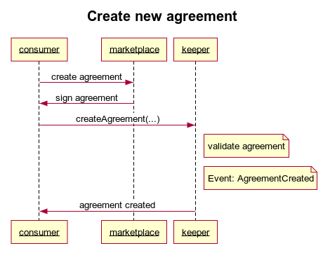
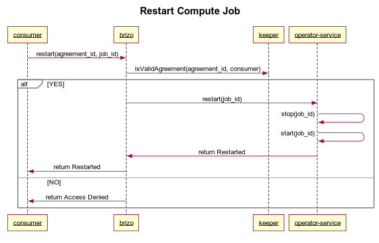
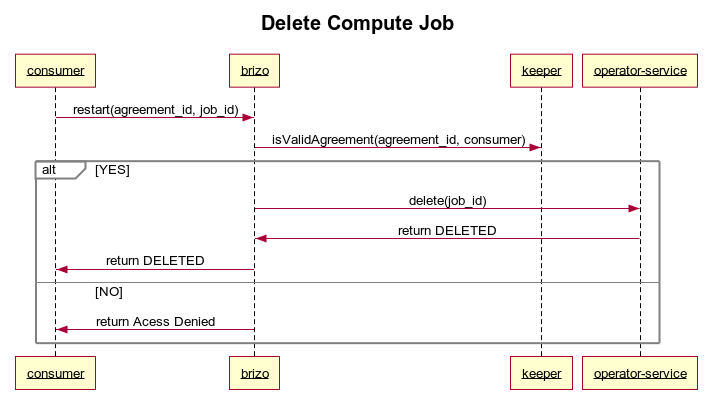

```
shortname: 12/EXEC
name: Execution of Compute Services
type: Standard
status: Raw
editor: Ahmed Ali <ahmed@oceanprotocol.com>
contributors:
        Aitor Argomaniz <aitor@oceanprotocol.com>,
        Samer Sallam <samer@oceanprotocol.com>,
        Javier Cortejoso <javier@oceanprotocol.com>,
        Enrique Ruiz <enrique@oceanprotocol.com>, 
        Troy <troy@oceanprotocol.com>,
        Dimitri De Jonghe <dimi@oceanprotocol.com>,
        Ahmed Ali <ahmed@oceanprotocol.com>,
        Jose Pablo Fernandez <jose@oceanprotocol.com>,
        Alex Coseru <alex@oceanprotocol.com>

```

Table of Contents
=================

  
  * [Introduction](#introduction)
  * [Change Process](#change-process)
  * [Language](#language)
  * [Motivation](#motivation)
  * [Actors](#actors)
  * [Technical components](#technical-components)
  * [Compute Flow](#compute-flow)
 	* [Requirements](#requirements)
	* [Publishing an Asset including Compute Services](#publishing-an-asset-including-computing-services)
 	* [Setting up the Service Execution Agreement](#setting-up-the-service-execution-agreement)
 		* [Execution phase](#execution-phase)
			* [Infrastructure Orchestration](#infrastructure-orchestration)
 			* [Infrastructure Operator](#infrastructure-operator)
    		* [Volumes](#volumes)
 			* [Network isolation](#network-isolation)


---


# Introduction

This OEP introduces the integration pattern for the usage of **Service Execution Agreements (SEA)** 
(also called Service Agreements or Agreements) as contracts between parties interacting in the execution of a Compute Service transaction.
This OEP using the SEA as core element, orchestrates the publishing/execution of this type of compute services.

The intention of this OEP is to describe the flow and integration pattern independently of the infrastructure Cloud Compute Service.
This OEP MUST be valid for integrating classical infrastructure cloud providers like Amazon EC2 or Azure, 
but also can be used to integrate web3 compute providers or On-Premise infrastructure.

It's out of the scope to detail the Service Execution Agreements implementation. 
Service Agreements are described as part of the [Dev-Ocean repository](https://github.com/oceanprotocol/dev-ocean).

>**Disclaimer**: The current focus of this OEP is to bring compute data which assumes that the DATA PROVIDER trusts the COMPUTE PROVIDER and hence COMPUTE PROVIDER has access to data in case they are not the same entity. For this OEP, we will assume that DATA PROVIDER and COMPUTE PROVIDER are the same entity.

# Change Process

This document is governed by the [2/COSS](../2/README.md) (COSS).


# Language

The key words "MUST", "MUST NOT", "REQUIRED", "SHALL", "SHALL NOT", "SHOULD", "SHOULD NOT", "RECOMMENDED", "NOT RECOMMENDED", "MAY", and "OPTIONAL" in this document are to be interpreted as described in [BCP 14](https://tools.ietf.org/html/bcp14) \[[RFC2119](https://tools.ietf.org/html/rfc2119)\] \[[RFC8174](https://tools.ietf.org/html/rfc8174)\] when, and only when, they appear in all capitals, as shown here.


# Motivation

The main motivations of this OEP are:

* Identify the actors involved in the Compute service
* Define the execution procedures of this interaction
* Identify the modifications required to integrate in the Ocean stack
* Identify the API methods exposed via the different libraries

# Actors

The different actors interacting in this flow are:

* DATA PROVIDERS - one who provides access to Data
* CONSUMERS - one who wants to use Compute Services
* MARKETPLACES OR DAPPS- one who facilitates this data and compute exchange and stores the DDO/Metadata related with the Assets/services
* COMPUTE PROVIDERS - one who provides compute services via cloud or on-premise infrastructure services.


# Technical components

The following technical components are involved in an end-to-end publishing and consumption flow:

* [MARKETPLACE](https://github.com/oceanprotocol/commons) - Exposes a web interface for asset discovery and allowing users to publish / consume assets and data related services such as compute.
* SQUID - Library encapsulating the Ocean Protocol business logic. Interacts with all the different components/APIs of the system. Currently it's provided in the following languages:
  - [Squid Javascript](https://github.com/oceanprotocol/squid-js) - Javascript version of Squid to be integrated with Frontend applications.
  - [Squid Python](https://github.com/oceanprotocol/squid-py) - Python version of Squid to be integrated with Backend applications. The primary users are data scientists.
  - [Squid Java](https://github.com/oceanprotocol/squid-java) - Java version of Squid to be integrated with Backend applications. The primary users are data engineers.
* [KEEPER CONTRACTS](https://github.com/oceanprotocol/keeper-contracts) - Provides the Service Execution Agreement (SA) business logic.
* [BRIZO or GATEWAY](https://github.com/oceanprotocol/brizo) - Micro-service to be executed by a PROVIDER. It exposes the HTTP REST API permitting access to data assets or additional services like computation.
* [AQUARIUS](https://github.com/oceanprotocol/aquarius) - Micro-service to be executed by the MARKETPLACES. Facilitates creating, updating, deleting and searching the Asset's metadata registered by the asset PROVIDERS. This Metadata, is included as part of a [DDO](../7/README.md), which also includes the Services associated with the Asset (Consumption, Computation, etc.).
* [OPERATOR SERVICE](https://github.com/oceanprotocol/operator-service) - a micro-service in charge of managing the workflow executing requests. Typically the Operator Service is integrated from the Brizo proxy, but can be called independently if it.
* [OPERATOR ENGINE](https://github.com/oceanprotocol/operator-engine) - a backend agent in charge of orchestrate the compute infrastructure using Kubernetes as backend. Typically the Operator Engine retrieve the Workflows created by the OPERATOR SERVICE, in Kubernetes and manage the infrastructure necessary to complete the execution of the compute workflows.


# Compute Flow

This section describes the Asset Compute Service flow in detail.
Below are some parameters and their significance used in this flow:

* **DID** - See [OEP-7](../7/README.md).
* **serviceAgreementId** - Is the unique ID referring to a Service Execution Agreement established between a PROVIDER and a CONSUMER. The CONSUMER (via Squid) is the one creating this random unique serviceAgreementId.
* **index** - Identifies one service in the array of services included in the DDO. It is created by the PROVIDER (via Squid) upon DDO creation and is associated with different services.
* **templateId** - Identifies a unique Service Agreement template. The Service Agreement is an instance of one existing template. Please refer to this [documentation](https://github.com/oceanprotocol/keeper-contracts/blob/develop/doc/TEMPLATE_LIFE_CYCLE.md) for more info.

  

## Requirements

* A COMPUTE PROVIDER or PROVIDER define the conditions that a Compute service supports. It includes:
  - What kind of image (Docker container) can be deployed in the infrastructure
  - What are the infrastructure resources available (CPU, memory, storage)  
  - What is the price of using the infrastructure resources
* A COMPUTE PROVIDER defines a Compute Service in the scope of the Asset (DID/DDO) of the dataset that can be computed
* A CONSUMER defines the task to execute modeling it in a Workflow (including configuration, input, transformations and output)
* A CONSUMER purchasing a compute service defines which Workflow (DID) is going to execute
* A CONSUMER can purchase a service given by a PROVIDER and execute multiple times till the timeout expires
* A CONSUMER could purchase a service and execute later, the purchase MUST be totally decoupled of execution
* The previous two points could support to buy once a compute service and execute for example the service every night at 3 am


## Publishing an Asset including Compute Services
The following figure describes the exposed services for publishing assets through
marketplace using [squid-js](https://github.com/oceanprotocol/squid-js), [aquarius](https://github.com/oceanprotocol/aquarius) and [keeper contracts](https://github.com/oceanprotocol/keeper-contracts).


Compute service is described as a part of metadata of the **dataset** type asset. You can find a service definition sample for compute service below -

```
{
      "type": "compute",
      "index": 2,
      "serviceEndpoint": "http://mybrizo.org/api/v1/brizo/services/compute",
      "templateId": "",
      "attributes": {
        "main": {
          "name": "dataAssetComputingServiceAgreement",
          "creator": "0x00Bd138aBD70e2F00903268F3Db08f2D25677C9e",
          "datePublished": "2019-04-09T19:02:11Z",
          "price": "10",
          "timeout": 86400,
          "provider": {
            "type": "Azure",
            "description": "",
            "environment": {
              "cluster": {
                "type": "Kubernetes",
                "url": "http://10.0.0.17/xxx"
              },
              "supportedContainers": [
                {
                  "image": "tensorflow/tensorflow",
                  "tag": "latest",
                  "checksum": "sha256:cb57ecfa6ebbefd8ffc7f75c0f00e57a7fa739578a429b6f72a0df19315deadc"
                },
                {
                  "image": "tensorflow/tensorflow",
                  "tag": "latest",
                  "checksum": "sha256:cb57ecfa6ebbefd8ffc7f75c0f00e57a7fa739578a429b6f72a0df19315deadc"
                }
              ],
              "supportedServers": [
                {
                  "serverId": "1",
                  "serverType": "xlsize",
                  "price": "50",
                  "cpu": "16",
                  "gpu": "0",
                  "memory": "128gb",
                  "disk": "160gb",
                  "maxExecutionTime": 86400
                },
                {
                  "serverId": "2",
                  "serverType": "medium",
                  "price": "10",
                  "cpu": "2",
                  "gpu": "0",
                  "memory": "8gb",
                  "disk": "80gb",
                  "maxExecutionTime": 86400
                }
              ]
            }
          }
        },
        "additionalInformation": {},
        "serviceAgreementTemplate": {
          "contractName": "EscrowComputeExecutionTemplate",
          "events": [
            {
              "name": "AgreementActorAdded",
              "actorType": "provider",
              "handler": {
                "moduleName": "",
                "functionName": "fulfillLockRewardCondition",
                "version": "0.1"
              }
            }
          ],
          "fulfillmentOrder": [
            "lockReward.fulfill",
            "computeExecution.fulfill",
            "escrowReward.fulfill"
          ],
          "conditionDependency": {
            "lockReward": [],
            "computeExecution": [],
            "releaseReward": [
              "lockReward",
              "computeExecution"
            ]
          },
          "conditions": [
            {
              "name": "lockReward",
              "timelock": 0,
              "timeout": 0,
              "contractName": "LockRewardCondition",
              "functionName": "fulfill",
              "parameters": [
                {
                  "name": "_rewardAddress",
                  "type": "address",
                  "value": ""
                },
                {
                  "name": "_amount",
                  "type": "uint256",
                  "value": ""
                }
              ],
              "events": [
                {
                  "name": "Fulfilled",
                  "actorType": "publisher",
                  "handler": {
                    "moduleName": "lockRewardExecutionCondition",
                    "functionName": "fulfillComputeExecutionCondition",
                    "version": "0.1"
                  }
                }
              ]
            },
            {
              "name": "computeExecution",
              "timelock": 0,
              "timeout": 0,
              "contractName": "ComputeExecutionCondition",
              "functionName": "fulfill",
              "parameters": [
                {
                  "name": "_documentId",
                  "type": "bytes32",
                  "value": ""
                },
                {
                  "name": "_grantee",
                  "type": "address",
                  "value": ""
                }
              ],
              "events": [
                {
                  "name": "Fulfilled",
                  "actorType": "publisher",
                  "handler": {
                    "moduleName": "accessSecretStore",
                    "functionName": "fulfillEscrowRewardCondition",
                    "version": "0.1"
                  }
                },
                {
                  "name": "TimedOut",
                  "actorType": "consumer",
                  "handler": {
                    "moduleName": "accessSecretStore",
                    "functionName": "refundReward",
                    "version": "0.1"
                  }
                }
              ]
            },
            {
              "name": "escrowReward",
              "timelock": 0,
              "timeout": 0,
              "contractName": "EscrowReward",
              "functionName": "fulfill",
              "parameters": [
                {
                  "name": "_amount",
                  "type": "uint256",
                  "value": ""
                },
                {
                  "name": "_receiver",
                  "type": "address",
                  "value": ""
                },
                {
                  "name": "_sender",
                  "type": "address",
                  "value": ""
                },
                {
                  "name": "_lockCondition",
                  "type": "bytes32",
                  "value": ""
                },
                {
                  "name": "_releaseCondition",
                  "type": "bytes32",
                  "value": ""
                }
              ],
              "events": [
                {
                  "name": "Fulfilled",
                  "actorType": "publisher",
                  "handler": {
                    "moduleName": "escrowRewardCondition",
                    "functionName": "verifyRewardTokens",
                    "version": "0.1"
                  }
                }
              ]
            }
          ]
        }
      }
    }
```

## Setting up the Service Execution Agreement
The compute to data use case follows the same pattern of agreement initialization like that of dataset publish and consume,
by pointing to the DID, consumer address, provider address and the agreement template (set of 
predefined conditions, and actor types).

### Creation phase 
To create new agreement, the consumer should follow the below sequence diagram:


For a given agreement, consumers are allowed to create ***N*** compute jobs based on the agreement conditions.
## Execution phase

The execution of the agreement starts prior the agreement creation. This is described as follows:

### Part-1: On-chain
The compute to data agreement uses `EscrowComputeExecutionTemplate` which is defined by three conditions:

- **LockRewardCondition**: allows CONSUMER to lock ERC20 tokens/OCEAN tokens.
- **ComputeExecutionCondition**: allows COMPUTE PROVIDER to confirm and fulfill the computation request.
- **Release/RefundRewardCondition**: allows COMPUTE PROVIDER to release the payment after timeout-timeLock window or allows CONSUMER
to withdraw their payments after timeout if the computation service wasn't confirmed. Check out ([part-2]()) for more details


### Part-2: Off-chain

In this part, the trigger of the agreement execution goes from on-chain (the keeper) to [Brizo](https://github.com/oceanprotocol/brizo) in order to handle the compute job 
by calling the operator service. Moreover, [Brizo](https://github.com/oceanprotocol/brizo) exposes the same endpoints of the operator service which will be discussed in the section below.

#### Infrastructure Orchestration
The infrastructure is orchestrated by [operator service](https://github.com/oceanprotocol/operator-service) 
which in turn starts [operator-engine](https://github.com/oceanprotocol/operator-engine), configures pods (workers), and manages the life cycle of compute 
jobs. The APIs are as follows:

- **start**: starts a new job within the context of the new/current agreement.
- **stop**: stop running job. This requires valid agreement Id, job id, and job ownership proof (signature).
- **status**: For a given agreement Id, and (job id -- optional) returns job status(es). Status code description below.
- **restart**: calls stop API, then starts the compute job again.
- **delete**: deletes a compute job and all resources associated with the job. If job is running it will be stopped first.

***Starting new compute job***


***Stop Existing Job***


***Get Job Status***


The following table lists all the possible status codes for a compute job

| status   | Description        |
|----------|--------------------|
|  10       | Job started        |
|  20       | Configuring volumes|
|  30       | Provisioning success |
|  31       | Data provisioning failed |
|  32       | Algorithm provisioning failed |
|  40       | Running algorithm   |
|  50       | Filtering results  |
|  60       | Publishing results |
|  70       | Job completed      |

***Restart Compute Job***



***Delete Compute Job***



For more details, please refer to [operator service APIs documentation](https://github.com/oceanprotocol/operator-service/blob/develop/API.md)

#### Infrastructure Operator

The PUBLISHER of computation services is in charge of defining the 
requirements to allow the execution of algorithms on top of of the data assets.
It means only the images specified in the DDO by the publisher with a specific DID and checksum
 will be allowed to be executed in the Runtime environment.
  
[BRIZO](https://github.com/oceanprotocol/brizo) is in charge of setting up the runtime environment speaking with the infrastructure provider via Kubernetes.

The images defined in the DDO and defined by the PUBLISHER only SHOULD include the minimum libraries specified,
it will reduce the risk of executing unexpected software via external libraries.
In addition to this, it's recommended that the images running in the runtime environment don't have network connectivity
a part of the minimum required to get access to the Assets.

##### Volumes

The input assets will be added to the runtime environment as **read only** volumes. 
The complete paths to the folders where the volumes are mounted will be given to the algorithm as parameters, using the same order of the parameters specified in the Workflow definition.
The new derived Asset generated as a result of the execution of the algorithm MUST be written in the output volume. 
The pods will be **destroyed** after the execution, so only the data stored in the **output** or **logs** volumes should be used.

| Type  | Permissions  | ENV Parameter  | Default Value  | Comment       |
|-------|--------------|----------------|----------------|---------------|
| Input | Read         | INPUTS         | /data/inputs   |               |
| Output| Read, Write  | OUTPUTS        | /data/outputs  |               |
| Logs  | Read, Write  | LOGS           | /data/logs     |               |
| Input DIDS|  -       | DIDS           | []             | List of input DIDS|

##### Compute image details

Every algorithm has some required attributes
```
          "container": {
            "image": "node",
            "tag": "10",
            "entrypoint": "node $ALGO"
          }
```

Entrypoint:  It contains a macro ($ALGO) that gets replaced in the compute server with the actual location of the algo (usually /data/transformations/algorithm).

So, if you want to run a python script, you can have the following:

```
          "container": {
            "image": "python",
            "tag": "3.7",
            "entrypoint": "python3.7 $ALGO"
          }

```

or a php script

```
algorithm": {
          "container": {
            "image": "php",
            "tag": "cli",
            "entrypoint": "/usr/bin/php $ALGO"
          }
```
Or a simple bash script:
```
          "container": {
            "image": "ubuntu",
            "tag": "18.04",
            "entrypoint": "$ALGO"
          }
```


#### Network isolation

The runtime environment doesn't need to have network connectivity to external networks to be executed. 
To avoid sending the internal information about the data, it's recommended to restrict the output connectivity. 
   
### Part-3: Agreement Finality

