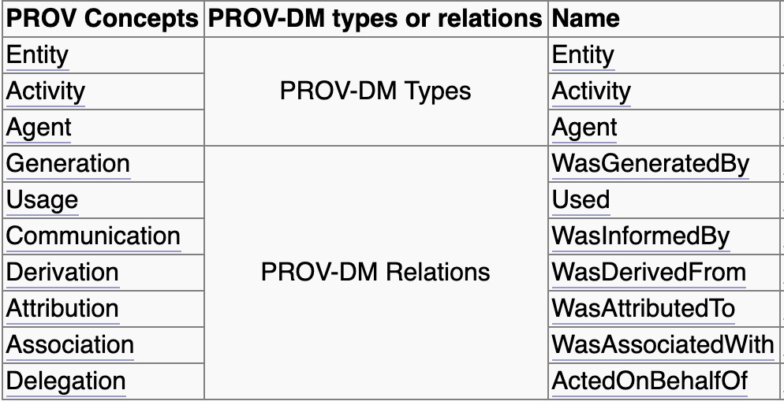
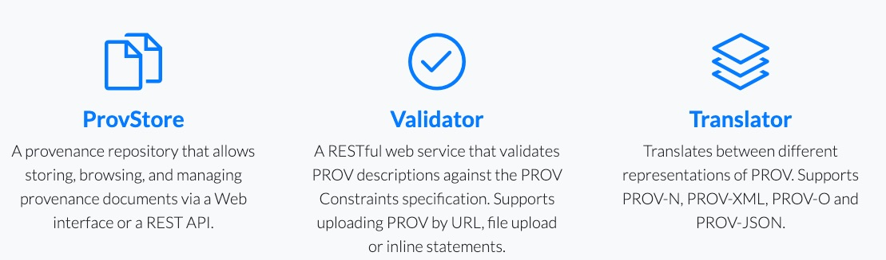

```text
shortname: DEC-PROV
name: Decentralized Data Provenance
type: Standard
status: Raw
editor: Aitor Argomaniz <aitor@oceanprotocol.com>
contributors: Fang Gong <fang@oceanprotocol.com>
```


Table of Contents
=================

   * [Table of Contents](#table-of-contents)
   * [Abstract](#abstract)
   * [Change Process](#change-process)
   * [Language](#language)
   * [Motivation](#motivation)
   * [Decentralized Data Provenance](#decentralized-data-provenance)
      * [W3C PROV Model](#w3c-prov-model)
         * [Provenance Types](#provenance-types)
            * [Entities](#entities)
            * [Agents](#agents)
            * [Activities](#activities)
         * [Provenance Relations](#provenance-relations)
            * [Generation: Register a new entity generated by an agent](#generation-register-a-new-entity-generated-by-an-agent)
            * [Derivation: register relationship between source and derived entities](#derivation-register-relationship-between-source-and-derived-entities)
            * [Activity: Register activities](#activity-register-activities)
   * [Integration of Data Provenance in Ocean Protocol](#integration-of-data-provenance-in-ocean-protocol)
      * [Assets Provenance Modeling](#assets-provenance-modeling)
         * [Elements](#elements)
            * [Entity](#entity)
            * [Agent](#agent)
            * [Activity](#activity)
         * [Relations](#relations)
      * [Provenance integrity](#provenance-integrity)
         * [How to compute the provenance checksum](#how-to-compute-the-provenance-checksum)
      * [Links](#links)
         * [Resource: Open Provenance Model (OPM)](#resource-open-provenance-model-opm)


# Abstract

This OEP introduces of Data Provenance in Ocean Protocol assets based in
 the W3C Provenance specification.
 
# Change Process

The process to change this document is described in 
[OEP-2 (COSS)](../2/README.md).

# Language

The key words "MUST", "MUST NOT", "REQUIRED", "SHALL", "SHALL NOT", 
"SHOULD", "SHOULD NOT", "RECOMMENDED", "NOT RECOMMENDED", "MAY", and 
"OPTIONAL" in this document are to be interpreted as described in 
[BCP 14](https://tools.ietf.org/html/bcp14) 
\[[RFC2119](https://tools.ietf.org/html/rfc2119)\] 
\[[RFC8174](https://tools.ietf.org/html/rfc8174)\] when, and only when, 
they appear in all capitals, as shown here.

# Motivation

The intention of this document is how the data provenance can be 
establish in a decentralized system, allowing to validate the integrity 
of this provenance information.

The main objectives of this OEP are:

* Understand what provenance information needs to be tracked
* Specify how the provenance integrity check is stored on-chain
* Identify the actors involved in the publishing and visualization of 
provenance information
* Detail how to register relationships between source and derived 
entities
* Detail how to register activities
* Understand how to associate activities to the input and output 
entities in a workflow
* Validate cryptographically that entity was generated from a specific 
input entity in a specific activity


# Decentralized Data Provenance

The W3C PROV specification defines the Provenance as:

```
Provenance is information about entities, activities, and people 
involved in producing a piece of data or thing, which can be used to 
form assessments about its quality, reliability or trustworthiness. 
```

## W3C PROV Model

The W3C PROV data model includes a core set of types and relations 
commonly found in provenance for more specific uses.

In particular, the data model includes both `Type` and `Relation` 
categories.

`Type` category contains `entity`, `activity` and `agent`, which are 
core components.
`Relations` category defines key relationships between different type of
 components, which can be mapped into specific PROV model relations.



### Provenance Types

Provenance information can be modeled as the the interaction between 
Agents and Entities related via the Activities between them: 

#### Entities
In PROV, physical, digital, conceptual, or other kinds of thing are 
called entities. Examples of such entities are assets, a web page, a 
chart, or a spellchecker. 

#### Agents
An agent takes a role in an activity such that the agent can be assigned
 some degree of responsibility for the activity taking place. An agent 
 can be a person, a piece of software, an inanimate object, an 
 organization, or other entities that may be ascribed responsibility. 

#### Activities
Activities are how entities come into existence and how their attributes
 change to become new entities, often making use of previously existing 
 entities to achieve this. They are dynamic aspects of the world, such 
 as actions, processes, etc. For example, if the second version of 
 document D was generated by a translation from the first version of the
  document in another language, then this translation is an activity. 


### Provenance Relations

#### Generation: Register a new entity generated by an agent

`Generation` is the completion of production of a new entity by an 
activity. This entity did not exist before generation and becomes 
available for usage after this generation.

`Generation`, written `wasGeneratedBy(id; e, a, t, attrs)` in PROV-N 
(a notation for provenance aimed at human consumption), has:

* `id`: an optional identifier for a generation;
* `entity`: an identifier (e) for a created entity. In Ocean a **DID**;
* `activity`: an optional identifier (a) for the activity that creates 
the entity. In Ocean a **DID**;
* `time`: an optional "generation time" (t), the time at which the 
entity was completely created;
* `attributes`: an optional set (attrs) of attribute-value pairs 
representing additional information about this generation.

While each of `id`, `activity`, `time`, and `attributes` are optional, 
at least one of them must be present.

**PROV** uses qualified names to identify things in the data provenance, 
which essentially a shortened representation of a URI in the form of 
`prefix:localpart`.

Example:

```text
  wasGeneratedBy(did:op:e1, did:op:a1, 2001-10-26T21:32:52)
  wasGeneratedBy(did:op:e2, did:op:a1, 2001-10-26T10:00:00)
```

The above example shows the existence of two generations (with 
respective times 2001-10-26T21:32:52 and 2001-10-26T10:00:00), at which 
new entities, identified by `did:op:e1` and `did:op:e2`, were created 
by an activity, identified by `did:op:a1`.


#### Derivation: register relationship between source and derived entities

`Derivation` is a transformation of an entity into another, an update of
 an entity resulting in a new one, or the construction of a new entity 
 based on a pre-existing entity.


A `derivation`, written `wasDerivedFrom(id; e2, e1, a, g2, u1, attrs)` 
in PROV-N, has:

* `id`: an optional identifier for a derivation;
* `generatedEntity`: the identifier (e2) of the **derived entity** 
generated by the derivation. In Ocean a **DID**;
* `usedEntity`: the identifier (e1) of the **source entity** used by the
 derivation. In Ocean a **DID**;
* `activity`: an optional identifier (a) for the activity using and 
generating the above entities. In Ocean a **DID**;
* `generation`: an optional identifier (g2) for the generation involving
 the generated entity (e2) and activity (a). In Ocean a **DID**;
* `usage`: an optional identifier (u1) for the usage involving the used 
entity (e1) and activity (a). In Ocean a **DID**;
* `attributes`: an optional set (attrs) of attribute-value pairs 
representing additional information about this derivation.


The following descriptions are about derivations between `did:op:e1` and
 `did:op:e2`, but no information is provided as to the identity of the 
 activity (and usage and generation) underpinning the derivation. 
 In the second line, a type attribute is also provided.

```
wasDerivedFrom(did:op:e2, did:op:e1)
wasDerivedFrom(did:op:e2, did:op:e1, [ prov:type="physical transform" ])
```

The following description expresses that activity `did:op:a`, using the 
entity `did:op:e1` according to usage `did:op:01`, derived the entity 
`did:op:e2` and generated it according to generation `did:op:02`. 
It is followed by descriptions for generation `did:op:02` and usage `did:op:01`.

```
wasDerivedFrom(did:op:e2, did:op:e1, did:op:a, did:op:02, did:op:01)
wasGeneratedBy(did:op:02; did:op:e2, did:op:a, -)
used(did:op:01; did:op:a, did:op:e1, -)
```

With such a comprehensive description of derivation, a program that 
analyzes provenance can identify the activity underpinning 
the derivation, it can identify how the preceding entity `did:op:e1` was
 used by the activity (e.g. for instance, which argument it was passed 
 as, if the activity is the result of a function invocation), and which 
 output the derived entity `did:op:e2` was obtained from (say, for a 
 function returning multiple results).

#### Activity: Register activities

An `activity` is something that occurs over a period of time and acts 
upon or with entities; it may include consuming, processing, 
transforming, modifying, relocating, using, or generating entities.

An `activity`, written `activity(id, st, et, [attr1=val1, ...])` in 
PROV-N, has:

* `id`: an identifier for an activity;
* `startTime`: an optional time (st) for the start of the activity;
* `endTime`: an optional time (et) for the end of the activity;
* `attributes`: an optional set of attribute-value pairs 
((attr1, val1), ...) representing additional information about this 
activity.

Example:

```
activity(a1, 2011-11-16T16:05:00, 2011-11-16T16:06:00,
        [ ex:host="server.example.org", prov:type='ex:edit' ])
```

Te above example shows the existence of an activity with identifier `a1`
, `start time 2011-11-16T16:05:00`, and `end time 2011-11-16T16:06:00`, 
running on `host server.example.org`, and of `type edit`.

The activities could be mapped to the Ocean Protocol 
[Workflows](../12/README.md#workflows). 


# Integration of Data Provenance in Ocean Protocol

## Assets Provenance Modeling

To support the inclusion of the PROV information into a W3C 
Decentralized Document (DDO), the PROV modeling of Assets is using the 
[W3C PROV-JSON spec](https://www.w3.org/Submission/prov-json).  

From the PROV-JSON spec, each type of PROV assertions (e.g. entity, 
activity, generation, usage, etc.) is organised into a separate property
 with the same name in the top-level object as follows.

```json
{
    "entity": { // Map of entities by entities' IDs
    },
    "activity": { // Map of activities by IDs
    },
    "agent": { // Map of agents by IDs
    },
    <relationName>: { // A map of relations of type relationName by their IDs
    }
}
```

Each property itself is a JSON object, which is a map-like structure to 
hold all the PROV-JSON representation of assertions of the same type 
indexed by their identifiers. Hence, a PROV-JSON document is an indexed 
representation of a PROV document, in which PROV assertions are indexed 
by their types and by their identifiers. 

### Elements

This section describes the JSON representations for all PROV elements: 
entity, activity, and agent. 

#### Entity

Each entity is represented as a property in the entity object, 
identified by the entity's id. The property's value itself is an object 
structure containing the entity's attribute-values pairs.

```json
...

"entity": {
    "did:op:1234": {
        "prov:type": "dataset",
        "ex:version": "5"
    }
},
...

```


#### Agent

```json
...

"agent": {
    "did:op:abcd": {
        "prov:type": {
            "$": "prov:Person",
            "type": "xsd:QName"
        }
    }
    ...
},
...

```

#### Activity

```json
...
"activity": {
    "a1": {
        "prov:startTime": "2011-11-16T16:05:00",
        "prov:endTime": "2011-11-16T16:06:00",
        "ehost": "server.example.org",
        "prov:type": {
            "$": "ex:edit",
            "type": "xsd:QName"
        }
    }
},
...

```

### Relations

In general, a PROV relation expression follows the following construct:

`relationExpression := relationName (relationID; identifier1, identifier2, [additionalProperties])`

where identifier1 and identifier2 are identifiers to PROV elements. 
Relations are grouped by relationName in a PROV-JSON structure.

```json

{
    ...
    "wasGeneratedBy": {
        "8989": {
            "prov:entity": "did:op:1234",
            "prov:activity": "a1",
            "prov:time": "2001-10-26T21:32:52",
            "ex:port": "p1"
        },
        "8990": {
            "prov:entity": "did:op:1235",
            "prov:activity": "a1",
            "prov:time": "2001-10-26T10:00:00",
            "ex:port": "p1"
        },
    },
    ...
}

```

Different types of relations are:

* wasGeneratedBy
* used
* wasDerivedFrom
* wasInformedBy
* wasStartedBy
* wasEndedBy
* wasInvalidatedBy
* wasAttributedTo
* wasAssociatedWith
* actedOnBehalfOf
* wasInfluencedBy
* specializationOf
* alternateOf
* hadMember

All the provenance information will be stored as part of the DDO as a an
 independent service:

```json
{
  "@context": "https://w3id.org/future-method/v1",
  "authentication": [{}],
  "created": "2019-02-08T08:13:49Z",
  "id": "did:op:0000",
  "proof": {},
  "publicKey": [{}],
  "service": [
  {
    "type": "Provenance",
    "serviceDefinitionId": "x",
    "serviceEndpoint": "http://localhost:5000/api/v1/aquarius/assets/provenance/{did}",
    "checksum": "0abcd8226ada17fde24b6bf2b95d27f8f05fcce09139ff5cec31f6d81a7cd2ea",
    
    "provenance": {
    
        "prefix": {
            "did": "https://w3c-ccg.github.io/did-spec/",
            "ex": "http://example.org",
            "tr": "http://www.w3.org/TR/2011/"
        },
    
        "entity": {
            "did:op:1234": {
                "ex:version": "5",
                "prov:type": "dataset"
          }
        },

        "activity": {
            "ex:edit1": {
                "prov:type": "edit"
            }
        },
 
        "comment": {
            "ex:comment1": {
                "prov:type": "comment"
            }
        },
        
        "wasGeneratedBy": {
            "did:op:abcd": {
                "prov:activity": "ex:edit1",
                "prov:entity": "did:op:1234"
            }
        },        
        
       "wasAssociatedWith": {
            "did:op:eeff": {
                "prov:activity": "ex:comment1",
                "prov:entity": "did:op:1234"
            }
        },        
        
        "agent": {
            "did:op:abcd": {
                "prov:type": {
                    "$": "prov:Person",
                    "type": "xsd:QName"
                }
            },
            "did:op:eeff": {
                "prov:type": {
                    "$": "prov:Person",
                    "type": "xsd:QName"
                }
            }
        }
    }
  }
  
  ]
}
```

In the above example you can see a DDO including a **Provenance** 
service. It details how the entity `did:op:1234` **wasGeneratedBy** 
`did:op:abcd` the activity of `edit1` by the agent `did:op:abcd` and 
**wasAssociatedWith** the activity of `comment1` by the agent 
`did:op:eeff`.

## Provenance integrity

To guarantee the integrity of the provenance information, the complete 
`provenance` JSON object inside of the `Provenance` service is 
serialized and hashed using `Hash.sha3`. 

This checksum generated will be stored as part of the Provenance 
service in the `checksum` attribute.

A part of that, this checksum can be registered on-chain to prevent the 
tampering of provenance information. Also this checksum can be used as 
part of the DID computation.

### How to compute the provenance checksum 

To generate the checksum in a way that can be computed and verified 
multiple times, the JSON object must be serialized using the following 
rules:

* All the \n, \t, \r characters must be removed
* All the whitespaces out of the Json entities names or values must be 
removed
* The Json document and all the nested objects must be sort 
alphabetically

This must generate a JSON object of only one line that can be hashed and
 the verification of the hash can be repeated.


## Links

* W3C PROV-O - The Provenance Ontology: https://www.w3.org/TR/2013/NOTE-prov-xml-20130430/
* W3C PROV-DM - The Provenance Data Model: https://www.w3.org/TR/2013/REC-prov-dm-20130430/
* W3C PROV-XML: https://www.w3.org/TR/2013/NOTE-prov-xml-20130430/
* W3C PROV-JSON Serialization: https://www.w3.org/Submission/prov-json/

### Resource: Open Provenance Model (OPM)

The Open Provenance Model ([OPM](https://openprovenance.org/)) defines a
 data model that is open from an inter-operability viewpoint but also 
 with respect to the community of its contributors, reviewers and users.



It has several tools & libraries:

* [ProvToolbox](https://github.com/lucmoreau/ProvToolbox) - a Java toolbox for handling PROV [Tutorial](https://lucmoreau.github.io/ProvToolbox/)
* [Prov Python](http://pypi.python.org/pypi/prov) - a Python implementation of the PROV data model 
	* [tutorial](https://trungdong.github.io/prov-python-short-tutorial.html) 
	* [ipynb notebook example](https://nbviewer.jupyter.org/github/trungdong/notebooks/blob/master/PROV%20Tutorial.ipynb)
	* [document](https://prov.readthedocs.io/en/latest/)
* [ProvJS](https://bitbucket.org/provenance/provjs) - a JavaScript implementation of the PROV data model
* [ProvStore](https://openprovenance.org/store/) - Provenance storage and distribution
* [ProvExtract](https://openprovenance.org/tools/extract/) - for dealing with PROV embedded in web pages
* [ProvVis](https://openprovenance.org/vis/) - experimental visualizations of PROV
* [PROV-N Editor](https://openprovenance.org/tools/editor/) - a text editor with PROV-N syntax highlighted

