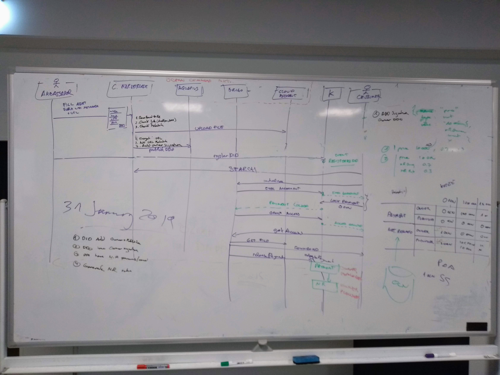

```
shortname: 13/COMMONS-MKT
name: Ocean Commons Marketplace
type: Standard
status: Raw
editor: Aitor Argomaniz <aitor@oceanprotocol.com>
contributors:
release: Tethis (v1.0)

```


Table of Contents
=================

   * [Table of Contents](#table-of-contents)
   * [Ocean Commons Marketplace use case](#ocean-commons-marketplace-use-case)
      * [Motivation](#motivation)
      * [Actors](#actors)
      * [Flow](#flow)
         * [Publishing](#publishing)
         * [Importing from Google Dataset](#importing-from-google-dataset)
         * [Consuming](#consuming)
         * [Rating](#rating)
         * [Commenting](#commenting)
      * [Network Reward](#network-reward)

-----


# Ocean Commons Marketplace use case

The intention of this document is to describe the scenario of a working Ocean Commons Marketplace. There the users should be able to publish and discover free/commons assets (datasets). 

It's out of the scope to detail the detailed implementation of components (can be found in the [OEP-11](https://github.com/oceanprotocol/OEPs/tree/master/11)

## Motivation

The motivations of this use case are:

* Get contents. Populate of Commons/Free datasets the first live environment release of Ocean
* Provide a end to end scenario where users can discover and get access to publicly available datasets
* Implement and Validate the network rewards function of the Ocean network in the case of free assets
* Integrate all the components and validate the architecture


## Actors

The different actors interacting in this flow are:

* **AMBASSADORS** - The discover public available datasets on internet, and to the Commons Marketplace with the intention of getting a reward.
* **PROVIDER** - Ocean Protocol Foundation will be the entity running all the provider capabilities. It includes the following components:
  - **COMMONS MARKETPLACE** (aka **MKT**) - Frontend application where users can publish and discover commons/free datasets
  - **AQUARIUS** - Metadata API storing the commons datasets metadata
  - **BRIZO** - Proxy in charge of validate the Service Execution Agreements (SEA)
* **KEEPER** - Running the Solidity Smart Contracts on Ethereum VM. It includes the Ocean Token, Network Reward function and SEA logic.
* **CONSUMER** - A user, typically a data scientist or data engineer, looking for data to use in their data pipelines


## Flow

### Publishing

The Publishing flow describe the procedure to put in place allowing to an Ocean Protocol AMBASSADOR to register new commons assets in the OCEAN COMMONS MARKETPLACE and get a reward for it. The complete flow is the following:

1. The AMBASSADOR, search on the internet and discover a relevant free/commons asset, get the publicly available information of the asset, metadata and license information.

1. The AMBASSADOR goes to the Ocean Commons Marketplace frontend application, and open the form of "Register a new Commons/Free Asset"

1. The AMBASSADOR fill the following information:
   - List of public URL's where the Asset is located
   - Title
   - Description
   - Category (categories can be predefined upfront)
   - Author
   - Tags
   
   A complete list of attributes can be found in the [OEP-8](https://github.com/oceanprotocol/OEPs/tree/master/8).
   
1. The MKT validate that URL's are correct and contents are available in those URL's initiating the download of the contents. Contents are not persisted in any place, the MKT application only validate that content exist in the URL's provided. If any URL is invalid, the processed is cancelled and the user is informed of the error.

1. The MKT validate the input fields provided by the user. If information is missing, the process is cancelled and the user is informed of the error.

1. The MKT, using SQUID-JS do the following:
   - Create a new DDO for the Asset
   - Encrypt the URL's using the PROVIDER Keys
   - Add the encrypted URL's and Metadata to the DDO
   - The AMBASSADOR signature is added to the DDO in the **publicKey** section. Type `OwnerAddress`
   - The PROVIDER signature is added to the DDO in the **publicKey** section. Type `ProviderAddress`
   - The DDO should include include the conditions for the access service including:
     - The price condition set to zero
     - The network reward condition value related with the OWNER (ownerReward) set to X
     - The network reward condition value related with the PROVIDER (providerReward) set to Y
   - Persist the DDO in the Provider AQUARIUS instance

1. The MKT, using SQUID-JS register the DID on-chain associating the public URL where the DDO just published is available

[Here](./ddo-commons.example.json) you can find an example of the subset of the DDO to be used. The main characteristics are:

- The `publicKey` section includes the Owner and Provider addresses:

```
{
  ...

  "publicKey": [{
    "id": "did:op:123456789abcdefghi",
    "type": "OwnerAddress",
    "owner": "did:op:123456789abcdefghi"
  }, {
    "id": "did:op:0987654321abcdefghi",
    "type": "ProviderAddress",
    "owner": "did:op:0987654321abcdefghi"
  }

  ...
}
```

- The price in the Access conditions is zero

- The releasePayment condition includes the ownerReward and providerReward attributes

```
    "conditions": [{

        ...

      },{
        "name": "releasePayment",
        "dependencies": [{
            "name": "grantAccess",
            "timeout": 0
          }
        ],
        "timeout": 0,
        "isTerminalCondition": 1,
        "conditionKey": "0x477f516713f4b0de54d0e0f4429f593c63f2dd2ca4789633e02a446c7978f3cb",
        "contractName": "PaymentConditions",
        "functionName": "releasePayment",
        "index": 2,
        "parameters": [
            {
             "name": "assetId",
             "type": "bytes32",
             "value": "08a429b8529856d59867503f8056903a680935a76950bb9649785cc97869a43d"
            }, {
             "name": "price",
             "type": "uint",
             "value": 0
            }, {
             "name": "ownerReward",
             "type": "uint",
             "value": 1
            }, {
             "name": "providerReward",
             "type": "uint",
             "value": 1
            }
        ],
        "events": [{
          "name": "PaymentReleased",
          "actorType": "publisher",
          "handler": {
            "moduleName": "serviceAgreement",
            "functionName": "fulfillAgreement",
            "version": "0.1"
          }
        }]
      }, {

        ...

      }
    ]
```

### Importing from Google Dataset

This flow is similar to the previous one. The main intention of this flow is to re-use the existing contents in Google Dataset service making them available in the Commons Marketplace.

The main differences of this flow are:

1. The AMBASSADOR, search on [Google Datasets](https://toolbox.google.com/datasetsearch/) website  and discover a relevant free/commons asset

1. The AMBASSADOR goes to the Ocean Commons Marketplace frontend application, and open the form of "Import a Commons/Free Asset from Google Datasets"

1. The AMBASSADOR fill the following information:
   - URL of the Google Dataset to import (i.e: https://toolbox.google.com/datasetsearch/search?query=Weather%20in%20Australia&docid=gEf986q6CT26lj9yAAAAAA%3D%3D)
   - List of URL's of the contents associated (can't be imported directly)

1. The MKT app retrieve the metadata from the Google Dataset URL

1. The MKT app validate that all contents provided in the URL's are available 

The rest of the flow is the same to the one described previosly.


### Consuming

The Consuming flow describe the procedure to put in place allowing to an Ocean Protocol CONSUMER (typically a data engineer or data scientings) to discover and get access to free/commons assets using the OCEAN COMMONS MARKETPLACE. 

The complete flow is the following:

1. The CONSUMER using the MKT application write a search query

1. The MKT send the search query to AQUARIUS to retrieve the list of results (pending to define the ranking)

1. The MKT frontend application draw the list of results showing the most relevant information (title, tags, category, etc)

1. The CONSUMER select one of the ASSETS and open the **detailed view page** using the MKT app

1. The MKT app draw in the **detailed view page** all the metadata associated to the asset. The asset URL must be unique, and include the DID in the URL. Example: 
   `http://commons.oceanprotocol.com/asset/did:op:4d517500da0acb0d65a716f61330969334630363ce4a6a9d39691026ac7908ea`

   Also should include all the metadata tagged in the page allowing an easy SEO for the contents.

1. The **detailed view page** shows a button or download link for each of the content urls existing in the DDO. 
 
1. When the CONSUMER clicks on the "DOWNLOAD" link of any of the contents, the CONSUMER using SQUID-JS initialize the purchase process.

1. SQUID-JS calls to BRIZO to initialize the Service Executing Agreement (SEA)

1. BRIZO initialize the SEA on-chain using the KEEPER

1. The KEEPER after to initialize emit the `ExecuteAgreement` event

1. The CONSUMER listens for the `ExecuteAgreement` event and when it's received call the `LockPayment` function on the KEEPER

1. The `LockPayment` function on the KEEPER emit the `PaymentLocked` event

1. BRIZO listens for the `PaymentLocked` event and when it's received call the `GrantAccess` function in the KEEPER

1. The Keeper emit the `AccessGranted` event

1. The CONSUMER listens for the `AccessGranted` event and when it's received call BRIZO sending the encrypted URL

1. BRIZO valide on-chain using the `checkPermissions` function in the KEEPER Access Conditions if the user has access. If not cancel the request returning a `HTTP 401 Unathorized` answer.

1. BRIZO, after validate the permissions decrypt the encrypted URL using the PROVIDER Keys

1. BRIZO, working as a PROXY, return the Asset content to the CONSUMER

The complete PUBLISH and CONSUME flows can be shown in the below image:




### Rating

To be defined

### Commenting

To be defined


## Network Reward

To be defined


