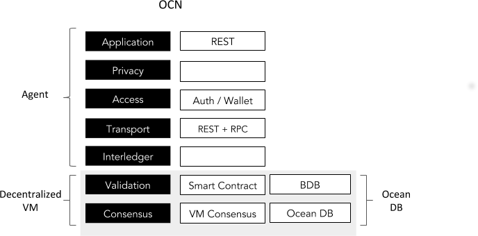
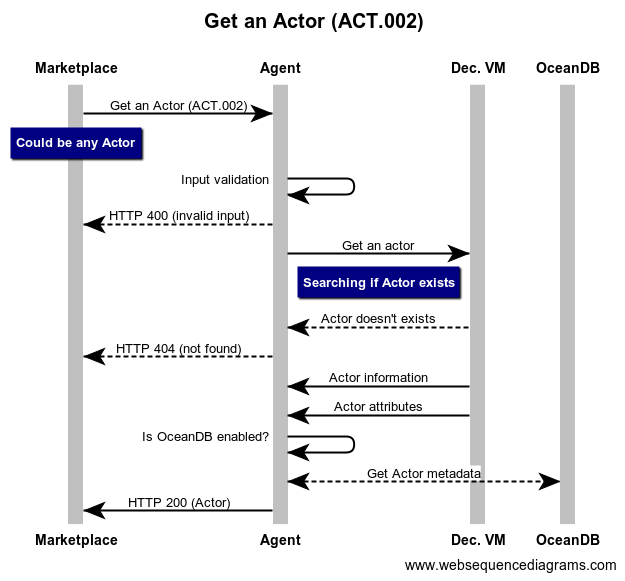
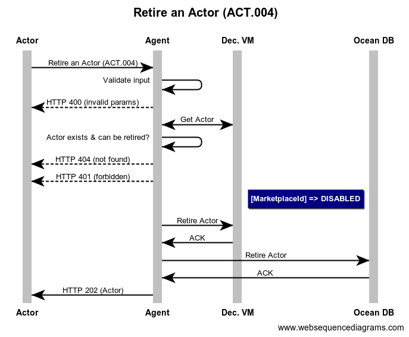

```
shortname: 13/REG
name: Ocean Actors Registry
type: Standard
status: Raw
editor: Aitor Argomaniz <aitor@oceanprotocol.com>
contributors: Dimitri De Jonghe <dimi@oceanprotocol.com>, Fang Gong<fang@oceanprotocol.com>
```

<!--ts-->

Table of Contents
=================

   * [Ocean Actors Registry](#ocean-actors-registry)
      * [Change Process](#change-process)
      * [Language](#language)
      * [Motivation](#motivation)
      * [Specification](#specification)
         * [Proposed Solution](#proposed-solution)
         * [Registering a new Actor](#registering-a-new-actor)
         * [Retrieve information of an existing actor](#retrieve-actor)
         * [Updating Actor metadata](#updating-actor-metadata)
         * [Retire an Actor](#retire-an-actor)
      * [TODO: Events](#events)
      * [Copyright Waiver](#copyright-waiver)
      
<!--te-->

# Ocean Actors Registry <a name="ocean-actors-registry"></a>

The Ocean Actors Registry (**REG**) is a specification for Ocean Protocol to register to all the actors interacting in the Ocean Network.

This OEP does not focus on actor attributes, whitelisting or curation. It's purely the mechanics of registering and basic handling of actors.

This specification is based on [Ocean Protocol technical whitepaper](https://github.com/oceanprotocol/whitepaper), [3/ARCH](../3/README.md), [4/KEEPER](../4/README.md) and [5/AGENT](../5/README.md).

This specification is called **REG** henceforth.

## Change Process <a name="change-process"></a>
This document is governed by the [2/COSS](../2/README.md) (COSS).

## Language <a name="language"></a>
The key words "MUST", "MUST NOT", "REQUIRED", "SHALL", "SHALL NOT", "SHOULD", "SHOULD NOT", "RECOMMENDED", "NOT RECOMMENDED", "MAY", and "OPTIONAL" in this document are to be interpreted as described in [BCP 14](https://tools.ietf.org/html/bcp14) \[[RFC2119](https://tools.ietf.org/html/rfc2119)\] \[[RFC8174](https://tools.ietf.org/html/rfc8174)\] when, and only when, they appear in all capitals, as shown here.


## Motivation <a name="motivation"></a>

Ocean network aims to power marketplaces for relevant AI-related data services.
Different actors and stakeholders are necessary to interact between them using the Ocean Protocol defined.  


Each of those having different motivations and interacting:

* **Publishers** - They publish/register assets (data, algorithms) or services into the network. Data published by those actors can make it available through Ocean for a price or for free. When their data or services are used by Consumers, Publishers receive tokens in return.
* **Providers** - They provide access to assets and services to the network making it accessible. When their data or services are accessed by Consumers, Providers receive tokens in return.
* **Consumers** - Actors who want to consume assets or services. They use the marketplace capabilities to find those assets or services. Depending on the element to consume the user will have to pay a price for it.
* **Keepers** - These actors maintain core protocol functionality, ensure correct token mechanics, and provide cryptographic proof capabilities. Keepers receive tokens to perform their function. 
* **Curators** - Curators are incentivized to promote and bet on relevance, they signal their opinion to the network using the network token, hence facilitating discovery. Data Curators put a number of tokens at stake to signal that a certain dataset is of high quality. Every time they correctly do this, they receive newly minted tokens in return.
* **Verifiers** - Verifiers provide assets and service verifications, getting tokens on reward. Verifiers will challenge the service providers, requiring for them to provide Proofs of Service. 
* **Marketplaces** - Marketplaces expose all the information about the assets, reputation, pricing, etc. They work as the  interface where the consumers can search for datasets suitable for their requirements. Marketplaces include the information provided by the curators.

An Ocean ACTOR is a user playing one of multiple of the above roles described.


## Specification <a name="specification"></a>

To allow a Token Curated Registry (TCR) of actors, enabling to curate the users behavior interaction with the system, the actors or users interaction with the system SHOULD be registered.
This will allow to **Whitelist** or **Ban** the good/bad actors of the system. More information about this will be provided in the [Token Curated Registry OEP](../11/README.md). 
To allow that, the information available in the system MUST be as minimal as possible. 

The system MUST be designed and developed with PRIVACY and ANONYMITY as core principles. 

The **Actors** information should be managed using an API. This API should exposes the following capabilities:

* Registering an Actor
* Get an Actor
* Update an Actor
* Retire an Actor

Key requirements:

* Only the essential information about Actors will be stored on-chain to allow the implementation of a TCR.
* AGENT MUST NOT store any information about the accounts (public keys, private keys, passwords or recovery phrases) in any other place than the system KMS.
* After to be registered, the new Actors MUST have a valid Account Id and a Wallet.
* If a complementary Ocean DB is given as parameter, the information or Metadata about the Actors will be stored in Ocean DB.
* The storage of Actors Metadata is totally optional.
* The location of the KMS SHOULD be provided as parameter in the Ocean AGENT initialization script.
* The AGENT will use Parity Wallet as technology component to manage the user Wallets.
* Through the standard Parity tools, will be possible to export the Wallet information generated in the system.

It's out of the scope of this OEP to discuss the Wallet management, this will defined in the scope of the [Wallet OEP](https://github.com/oceanprotocol/OEPs/issues/32).

### Proposed Solution <a name="proposed-solution"></a>

The proposed solution is composed by the interaction of different elements:

* A high level RESTful API exposing the methods required to manage the Actors Registry (AGENT)
* A Keeper node registering the Actors metadata on-chain (KEEPER)

We can show the interaction between layers and components using a stack view:



The following sections will describe the end to end implementation using a top to bottom approach, starting from the API interface to the Keeper implementation.


The above diagram shows the high level interactions between the components involved:

* The ACTOR interacting with the Actors Registry will send an API request to the AGENT
* The AGENT MUST validate the basic parameters sent by the ACTOR
* The AGENT MUST authenticate the ACTOR sending the request (but in the new actor method)
* The AGENT MUST orchestrate the ACTOR authorization using the KEEPER
* The AGENT MUST handle the account management (creation,unlock,etc.)
* The DECENTRALIZED VM store the ACTOR essential information (public key)
* If OCEAN DB is enabled by the user, will store the ACTOR metadata


In the following sections you can find the end to end implementation details of the complete REG functionality.


### Smart Contracts <a name="smart-contracts"></a>

The KEEPER::Decentralized VM will store the essential user information to allow the implementation of the Actors TCR.
It means the system MUST NOT store any personal information, enabling PRIVACY and ANONYMITY.

Taking this into account, the skeleton of main implementation should provide the following structs and interfaces:

```solidity

contract ActorsRegistry {

    uint256 constant STATE_CREATED = 0; // Actor just created in the system
    uint256 constant STATE_WHITELISTED = 1; // Actor whitelisted after a curation/verification process
    uint256 constant STATE_BANNED = 2; // Actor banned from the system
    uint256 constant STATE_DISABLED = 3; // Actor retired or disabled of the system

    struct Actor {
        address id;
        uint256 state;
    }
    
    /////// EVENTS //////////////////////////////
    event ActorRegistered(address indexed _id, uint256 _state);    
    
    event ActorAttributeChanged(address indexed _id, bytes32 _name, bytes32 _value, bool _isValid);    
    
    
    /////// FUNCTIONS ///////////////////////////
    function register(address _id) external returns (bool success);
    
    function getState(address _id) external view returns (uint state);
    
    function canUpdate(address _id) external view returns (bool success);
    
    function canRetire(address _id) external view returns (bool success);
    
    function updateState(address _id, uint256 _newState) external returns (bool success);
    
    function retire(address _id) external returns (bool success);

    function setAttribute(address _id, bytes32 _key, bytes32 _value) external onlyOwner returns (bool success);

    function revokeAttribute(address _id, bytes32 _name, bytes32 _value) external onlyOwner returns (bool success);
    
}
```

Different states are:

* CREATED (state = 0) - Actor just created in the system
* WHITELISTED (state = 1) - Actor whitelisted after a curation/verification process
* BANNED (state = 2) - Actor banned from the system
* DISABLED (state = 3) - Actor retired or disabled of the system

To save costs, the states are mapped to uint. Additional attributes required by the Actors TCR could be required (see [TCR OEP](../11/README.md)).


### Registering a new Actor <a name="registering-a-new-actor"></a>


In the [above diagram](diagrams/ACT.001.md) the Agent and the Account Manager capabilities are implemented in the AGENT scope.
No information is going through the Decentralized VM.
The registering of a new Actor involves the following implementations:

#### Ocean Agent API

It is necessary to expose a RESTful HTTP interface using the following details:

```
Reference: ACT.001
Path: /api/v1/actors
HTTP Verb: POST
Caller: The Actor trying to be registered
Input: Actor Schema
Output: Actor Schema
HTTP Output Status Codes: 
    HTTP 202 - Accepted
    HTTP 400 - Bad request
    HTTP 422 - Actor already exists
```

##### Input Parameters

| Parameter | Type | Description |
|:----------|:-----|:------------|
|password   |string|Account password|
|attributes   |key-value hashmap|Decentralized ID Document Attributes (optional)|
|metadata   |Json Object|Free Json object of information to be persisted in Ocean DB if enabled (optional)|

Because all parameters are optional but the password, a payload with only the password is allowed to create an Actor.
If **OCEAN DB** is enabled, the content of the Metadata attribute will be pass as parameter to the Ocean DB implementation to be stored in an external system.  

Example: 

```json
{	
	"password": "secret",
	"attributes": {
	  "providerEndpoint": "http://example.com/endpoint"
	},
	"metadata": {
        "name": "John Doe",
        "additional-info": [{
            "key": "interests",
            "value": "Looking Ahead"
        }]
	}
}
```

#### Accounts Management

The AGENT node will be in charge of manage the Accounts creation. To do that the AGENT will interact with the **Accounts API** provided by the **Parity** client.

The API method to integrate is the [personal::newaccount](https://wiki.parity.io/JSONRPC-personal-module#personal_newaccount).
As a result of this, the personal::newaccount method, we should obtain the account address:

```json
{
  "id": 1,
  "jsonrpc": "2.0",
  "result": "0x8f0227d45853a50eefd48dd4fec25d5b3fd2295e"
}
```

The **address** attribute obtained in the response will be **actorId** of the new Actor.

#### Interaction with the Keeper

The KEEPER::Decentralized VM will store the essential user information to allow the implementation of the Actors TCR.
It means the system MUST NOT store any personal information, enabling PRIVACY and ANONYMITY.

The **KEEPER::Decentralized VM** will persist the following information:

| Attribute | Type | Description |
|:----------|:-----|:------------|
|actorId    |address|Owner of the Asset|
|state      |uint  |TCR state of the user|

Also, in order to compose the Decentralized ID Document, the Keeper will **emit** events with the attributes specified. Those attributes will be used as a
[cheaper form of storage](https://media.consensys.net/technical-introduction-to-events-and-logs-in-ethereum-a074d65dd61e). Attributes don't need to be in the Smart Contract scope,
but are important to store some useful information (ie. endpoint of the provider services). Events are a cost-effective solution to do that.

In this case, for each key, value pair added in the **attributes** parameter, a new attribute will be registered using the `setAttribute` Smart Contract method. 
Attribute changes will trigger a **ActorAttributeChanged** event.

Using any of the existing web3 implementation library (web3.js, web3.py, web3.j, etc), it's possible to interact with the VM Smart Contracts.


#### Interaction with Ocean DB

The integration with OCEAN DB is optional, so only will works if an implementation backend is provided.

If it's enabled, the Ocean DB layer will interact with the backend to store the metadata information about the actors. 

| Attribute | Type | Description |
|:----------|:-----|:------------|
|actorId    |string|Actor Id|
|state      |enum  |Internal state information. One of the following("CREATED", "WHITELISTED", "BANNED", "DISABLED")|
|attributes   |key-value hash-map|Decentralized ID Document Attributes (optional)|
|creationDatetime |Datetime |Creation datetime set by the database|
|metadata   |Json Object|Free Json object with attributes given in the request|

Different states are:

* CREATED - Actor just created in the system
* WHITELISTED - Actor whitelisted after a curation/verification process
* BANNED - Actor banned from the system
* DISABLED - Actor retired or disabled of the system

Actor state will be set as **CREATED** by the system.


#### Output

After creating the Actor in the datastores, the AGENT will return a HTTP 202 Accepted message. It means the request has been accepted for processing, but the processing has not been completed.

Using the information stored and provided by the user, the **AGENT** SHOULD compose the output payload to return. It should include the following information:

| Attribute | Type | Description |
|:----------|:-----|:------------|
|actorId    |string|Account address|
|state      |enum  |Internal state information. One of the following("CREATED", "WHITELISTED", "BANNED", "DISABLED")|
|attributes   |key-value hashmap|Decentralized ID Document Attributes (optional)|
|creationDatetime |Datetime |Creation datetime set by the database|
|metadata   |Json Object|Free Json object with attributes given in the request|


### Retrieve information of an existing actor <a name="retrieve-actor"></a>



In the [above diagram](diagrams/ACT.002.md), the retrieval of the Actor information state is related with the AGENT and the KEEPER::Decentralized VM. No information is read from Ocean DB. This functionality involves the following implementations:

#### Ocean Agent API

It is necessary to expose a RESTful HTTP interface using the following details:

```
Reference: ACT.002
Path:  /api/v1/actors/{actorId}
HTTP Verb: GET
Caller: Any
Input: actorId
Output: Actor Schema
HTTP Output Status Codes: 
    HTTP 200 - OK
    HTTP 400 - Invalid params
    HTTP 404 - Not Found
```


##### Input Parameters

| Parameter | Type | Description |
|:----------|:-----|:------------|
|actorId    |string|Account address to retrieve|

Example: 

```http
GET http://localhost:8080/api/v1/actors/0x8f0227d45853a50eefd48dd4fec25d5b3fd2295e
```

```json
{
    "actorId": "0x8f0227d45853a50eefd48dd4fec25d5b3fd2295e",
	"state": "CREATED"
}
```

Before to query the KEEPER::Decentralized VM, it's necessary to check the length and format of the actorId. If the length and format doesn't fit the standard address definition, the system should return a **HTTP 400** Invalid params message.

Depending of the implementation, there are different alternatives to check if an address is valid (see this [link](https://ethereum.stackexchange.com/questions/1374/how-can-i-check-if-an-ethereum-address-is-valid)).

#### Accounts Management

The Accounts Manager components it's not involved in this method. All the information will be retrieved from the **KEEPER::Decentralized VM**.

#### Interaction with the Keeper

The Decentralized VM stores the state about the Actors. Using the actorId as key in the Actors collection, the system will retrieve the information about the Actor.

The information about the state can be obtained integrating the `ActorsRegistry::getState` Smart Contract method.

If the Actor metadata has the state attribute `state == DISABLED` the method should return a **HTTP 404** Not Found message.


<a name="updating-actor-metadata"></a>
### Updating Actor metadata 


In the [above diagram](diagrams/ACT.003.md) the Agent and the Account Manager capabilities are implemented in the AGENT scope.

This method it's a wrapper to edit the Actors Metadata, not the essential (KEEPER::VM) information. So only the metadata information can be updated.

The KEEPER::Decentralized VM works in this method as authorization mechanism, allowing/denying the user to update the Metadata.

The updating of an existing Actor metadata involves the following implementations:

#### Ocean Agent API

It is necessary to expose a RESTful HTTP interface using the following details:

```
Reference: ACT.003
Path: /api/v1/actors
HTTP Verb: PUT
Caller: Actor
Input: Actor Schema
Output: Actor Schema
HTTP Output Status Codes: 
    HTTP 202 - Accepted
    HTTP 400 - Invalid params
    HTTP 404 - Not Found
```

##### Input Parameters

| Parameter | Type | Description |
|:----------|:-----|:------------|
|actorId    |string|Account address|
|attributes   |key-value hashmap|Decentralized ID Document Attributes (optional)|
|metadata   |Json Object|Free Json object with attributes|

Example: 

```json
{
    "actorId": "0x8f0227d45853a50eefd48dd4fec25d5b3fd2295e",
    "attributes": {
    	  "providerEndpoint": "http://example.com/endpoint2"
    },
    "metadata" : {
        "name": "Alice",	
        "attributes": [{
            "key": "interests",
            "value": "no interests"
        }]
	}
}
```

#### Accounts Management

The Accounts Manager components it's not involved in this method. 


#### Interaction with the Keeper

The Decentralized VM stores the state about the Actors. Using the actorId as key in the Actors collection, the system will authorize or deny the update of the Actor information..

The information about if the actor is enabled or disabled can be obtained integrating the `ActorsRegistry::getState` Smart Contract method.
The information about if the actor can be updated can be obtained integrating the `ActorsRegistry::canUpdate` Smart Contract method.

If the Actor metadata has the state attribute `state == DISABLED (9)` the method should return a **HTTP 404** Not Found message.
If after executing the `ActorsRegistry::canUpdate` method, the Actor can't be updated by the user, the method should return a **HTTP 401** Forbidden message.

The information about the attributes will be registered using the `ActorsRegistry::registerAttribute` Smart Contract method. Attributes will be stored as events.
Attribute changes will trigger a **ActorAttributeChanged** event.


#### Interaction with Ocean DB

Ocean DB, if it's enabled, will store the metadata information about the actor. Only the metadata attribute will be modified:
 
After creating the Actor in the Database, it will return a HTTP 202 Accepted message. It means the request has been accepted for processing, but the processing has not been completed.


#### Output
Using the information stored/provided by the user and the Decentralized VM, the **AGENT** SHOULD compose the output payload to return. It should include same information detailed in the previous sections.


<a name="retire-an-actor"></a>
### Retire an Actor 



In the [above diagram](diagrams/ACT.004.md) the Agent and the Account Manager capabilities are implemented in the AGENT scope.

This method implements a soft delete of an Actor. It means the Actor is updated setting the state attribute to `DISABLED`. The method will return a HTTP 202 status code and the Actor modified in the response body.

This method only can be integrated by the Actor. The Input of this method is the actorId referencing to a unique Actor. 

This method authorize the retirement of an Actor using the Smart Contract deployed in the Decentralized VM. 

#### Ocean Agent API

It is necessary to expose a RESTful HTTP interface using the following details:

```
Reference: ACT.004
Path: /api/v1/actors/{actorId}
HTTP Verb: DELETE
Caller: Actor
Input: actorId
Output: Actor Schema
HTTP Output Status Codes: 
    HTTP 202 - Accepted
    HTTP 400 - Invalid params
    HTTP 404 - Not Found
```

##### Input Parameters

| Parameter | Type | Description |
|:----------|:-----|:------------|
|actorId    |string|Account address|


Example: 

```http
DELETE http://localhost:8080/api/v1/actors/0x8f0227d45853a50eefd48dd4fec25d5b3fd2295e
```

```json
{
    "actorId": "0x8f0227d45853a50eefd48dd4fec25d5b3fd2295e",
    "state": "DISABLED"
}
```

#### Accounts Management

The Accounts Manager components it's not involved in this method. 


#### Interaction with the Keeper

The Decentralized VM stores the state about the Actors. Using the actorId as key in the Actors collection, the system will authorize or deny the retirement of the Actor information..

The information about if the actor is enabled or disabled can be obtained integrating the `ActorsRegistry::getState` Smart Contract method.
The information about if the actor can be retired can be obtained integrating the `ActorsRegistry::canRetire` Smart Contract method.

If the Actor metadata has the state attribute `state == DISABLED (9)` the method should return a **HTTP 404** Not Found message.
If after executing the `ActorsRegistry::canRetire` method, the Actor can't be updated by the user, the method should return a **HTTP 401** Forbidden message.


#### Interaction with Ocean DB

Ocean DB, if it's enabled, will store the metadata information about the actor. This method only will update the information about the **state** attribute.

After updating the Actor state in the Database, it will return a HTTP 202 Accepted message. It means the request has been accepted for processing, but the processing has not been completed.


#### Output

All the information to output is the actorId and state of the user.

```json
{
    "actorId": "0x8f0227d45853a50eefd48dd4fec25d5b3fd2295e",
    "state": "DISABLED"
}
```

---
<a name="asset-tcr"></a>
### Token Curation Registry (TCR) of Actors 

Token curation registry (TCR) is used to maintain a list of virtuous actors through challenge-voting process:

* Voting process can be initiated by:
	- New actor applies to register in the marketplace
	- Existing Actor is challenged by any user
	- All participants including applicant, voter and challenger need to deposit tokens for challenge or voting
	- Deposits of minority in voting result will be distributed to majority party
* Each participant can vote for or against the actor according to their opinion.
* After the voting result is revealed, the token deposit will be distributed among winning parties.
* Depends on the voting result, the actor will be accepted or ejected from the marketplace. 

#### TCR Smart Contract

The TCR Smart Contract can be implemented as a stand-alone module which interacts with the Actors Registry through Interface Functions. 

Let us introduce the data struct and functions of TCR smart contract first, and then discuss the interaction to Actors Registry smart contract.

The TCR smart contract SHOULD provide the structs including `listing` and `challenge`:  

```solidity
    // Maps actorId to associated listing data
    mapping(string => Listing) public listings;
    
    // Maps challengeIDs to associated challenge data
    mapping(uint => Challenge) public challenges;
    
	// Listing data struct
	struct Listing {
		uint		version;
		uint		applicationExpiry;
		bool		whitelisted;
		uint		challengeID;
		string		description;
	}
	
	
	// Challenge data struct
	struct Challenge {
		uint		rewardPool;
		address		challenger;
		uint		stake;
		uint		totalTokens;
		bool		resolved;
		mapping(address => bool) tokenClasims; 
	}  
```

The **Listing** object includes the following attributes:

| Parameter | Type | Description |
|:----------|:-----|:------------|
|version | uint | the version of TCR contract |
|applicationExpiry  |uint| Expiration date of application stage|
|whitelisted  |bool   | Indicates registry status|
|challengeID       |uint| voting ID in challenge stage|
|description|string|Description about the TCR (optional)|

The **Challenge** object includes the following attributes:

| Parameter | Type | Description |
|:----------|:-----|:------------|
|rewardPool  |uint| pool of tokens to be distributed to winning voters|
|challenger | address| owner of challenge|
| resolved | bool | indicates challenge is resolved |
|stake | uint | number of tokens at stake |
|totalTokens | uint | number of tokens used in voting by the winning side |
|tokenClasims | mapping(address=>bool) | indicates whether a voter has claimed reward |

#### Interaction with the Actor Registry

The Actor Registry Smart Contract SHOULD provide following methods to interact with TCR in two scenarios:

* *Case 1: registering new actor initiates the voting process when TCR is enabled:*
	* The function `applyRegisterActor` creates a challenge of `_actorId`; 
	* The challenge triggers the voting process;
	* Depends on the result, the function returns "true" if most voters agree to accpet the new actor and new actor can be accepted to the marketplace;
	* It returns "false" if not and new actor is declined. 

	```solidity
		function applyRegisterActor(
	        bytes32 _actorId, 
	        address _providerId) 
	    public returns (bool success) { }
	
	```

* *Case 2: User challenges the existing actor:*
	* User creates a challenge of "_actorId" and triggers the voting process with TCR Smart Contract;
	* The TCR Smart Contract SHOULD call `retire` methods in Actor Registry if voting result is to eject the actor from the marketplace;
	* As such Actor Registry smart contract ejects the actor.

	```solidity
	function retire(bytes32 _actorId) public returns (bool success) { }
	```
	

---

### Assignee(s)
Primary assignee(s): @aaitor


### Targeted Release

The implementation of the full Keeper functionality it's planned for the [Alpha release](https://github.com/oceanprotocol/ocean/milestone/4)


### Status
unstable


## Copyright Waiver  <a name="copyright-waiver"></a>
To the extent possible under law, the person who associated CC0 with this work has waived all copyright and related or neighboring rights to this work.

