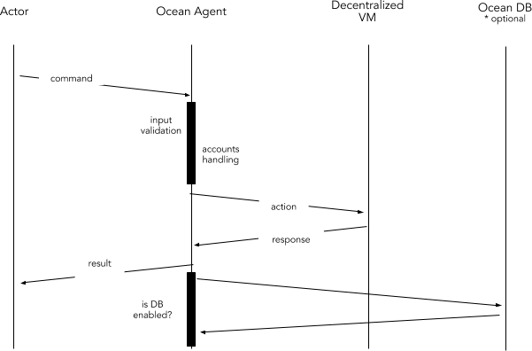

```
shortname: 13/REG
name: Ocean Actors Registry
type: Standard
status: Raw
editor: Aitor Argomaniz <aitor@oceanprotocol.com>
contributors: Dimitri De Jonghe <dimi@oceanprotocol.com>
```

# Ocean Actors Registry

The Ocean Actors Registry (**REG**) is a specification for Ocean Protocol to register to all the actors interacting in the Ocean Network.

This OEP does not focus on actor attributes, whitelisting or curation. It's purely the mechanics of registering and basic handling of actors.

This specification is based on [Ocean Protocol technical whitepaper](https://github.com/oceanprotocol/whitepaper), [3/ARCH](../3/README.md), [4/KEEPER](../4/README.md) and [5/AGENT](../5/README.md).

This specification is called **REG** henceforth.

## Change Process
This document is governed by the [2/COSS](../2/README.md) (COSS).

## Language
The key words "MUST", "MUST NOT", "REQUIRED", "SHALL", "SHALL NOT", "SHOULD", "SHOULD NOT", "RECOMMENDED", "NOT RECOMMENDED", "MAY", and "OPTIONAL" in this document are to be interpreted as described in [BCP 14](https://tools.ietf.org/html/bcp14) \[[RFC2119](https://tools.ietf.org/html/rfc2119)\] \[[RFC8174](https://tools.ietf.org/html/rfc8174)\] when, and only when, they appear in all capitals, as shown here.


## Motivation

Ocean network aims to power marketplaces for relevant AI-related data services.
Different actors and stakeholders are necessary to interact between them using the Ocean Protocol defined.  


Each of those having different motivations and interacting:

### Publishers
They publish/register assets (data, algorithms) or services into the network. Data published by those actors can make it available through Ocean for a price or for free. When their data or services are used by Consumers, Publishers receive tokens in return.

### Providers
They provide access to assets and services to the network making it accessible. When their data or services are accessed by Consumers, Providers receive tokens in return.

### Consumers
Actors who want to consume assets or services. They use the marketplace capabilities to find those assets or services. Depending on the element to consume the user will have to pay a price for it.

### Keepers
These actors maintain core protocol functionality, ensure correct token mechanics, and provide cryptographic proof capabilities. Keepers receive tokens to perform their function. 

### Curators
Curators are incentivized to promote and bet on relevance, they signal their opinion to the network using the network token, hence facilitating discovery. Data Curators put a number of tokens at stake to signal that a certain dataset is of high quality. Every time they correctly do this, they receive newly minted tokens in return.

### Verifiers
Verifiers provide assets and service verifications, getting tokens on reward. Verifiers will challenge the service providers, requiring for them to provice Proofs of Service. 

### Marketplaces
Marketplaces expose all the information about the datasets, reputation, pricing, etc. They work as the  interface where the consumers can search for datasets suitable for their requirements. Marketplaces include the information provided by the curators.


## Specification

The **Actors** information should be managed using an API. This API should exposes the following capabilities:

* Registering an Actor
* Get an Actor
* Update an Actor
* Retire an Actor

The new Actors registed in the system MUST have a valid Account Id and a Wallet.
The information or Metadata about the Actors MUST be stored in Ocean DB.
AGENT MUST NOT store any information about the accounts (public keys, private keys, passwords or recovery phrases).


### Proposed Solution

The proposed solution is composed by the interaction of different elements:

* A high level RESTful API exposing the methods required to manage the Actors Registry (AGENT)
* A Keeper node registering the Actors metadata on-chain (KEEPER)

We can show the interaction between layers and components using a stack view:


The following sections will describe the end to end implementation using a top to bottom approach, starting from the API interface to the Keeper implementation.



The above diagram shows the high level interactions between the components involved:

* The ACTOR interacting with the Actors Registry will send a API requiest to the AGENT
* The AGENT MUST validate the basic parameters sent by the ACTOR
* The AGENT MUST authenticate the ACTOR sending the request (but in the new actor method)
* The AGENT MUST orchestrate the ACTOR authorization using the KEEPER
* The AGENT MUST handle the account management (creation,unlock,etc.)
* The OCEAN DB MUST store the ACTOR metadata

In the following sections you can find the end to end implementation details of the complete REG functionality.

### Registering a new Actor


In the above diagram the Agent and the Account Manager capabilities are implemented in the AGENT scope.
No information is going through the Decentralized VM.
The registering of a new Actor involves the following implementations:

#### Ocean Agent API

It is necessary to expose a RESTful HTTP interface using the following details:

```
Reference: ACT.001
Path: /api/v1/keeper/actors/actor
HTTP Verb: POST
Caller: The Actor trying to be registered
Input: Actor Schema
Output: Actor Schema
HTTP Output Status Codes: 
    HTTP 202 - Accepted
    HTTP 400 - Bad request
    HTTP 422 - Actor already exists
```

##### Input Parameters

| Parameter | Type | Description |
|:----------|:-----|:------------|
|name       |string|Actor nickname (optional)|
|password   |string|Account password (optional). If it's not given the password will be autogenerated.|
|attributes |array |Array of key, value attributes (optional)|

Because all parameters are optional, an empty payload is allowed to create an Actor.

Example: 

```json
{
	"name": "John Doe",
	"password": "secret",
	"attributes": [{
		"key": "interests",
		"value": "Looking Ahead"
	}]
}
```

#### Accounts Management

The AGENT node will be in charge of manage the Accounts creation. To do that the AGENT will interact with the **Accounts API** provided by the **Parity** client.

The API method to integrate is the [personal::newaccount](https://wiki.parity.io/JSONRPC-personal-module#personal_newaccount).
As a result of this, the personal::newaccount method, we should obtain the account address:

```json
{
  "id": 1,
  "jsonrpc": "2.0",
  "result": "0x8f0227d45853a50eefd48dd4fec25d5b3fd2295e"
}
```

The **address** attribute obtained in the response will be **actorId** of the new Actor.

#### Interaction with Ocean DB

Ocean DB will store the metadata information about the actors. 

| Attribute | Type | Description |
|:----------|:-----|:------------|
|name       |string|Actor nickname|
|state      |enum  |Internal state information. One of the following("CREATED", "WHITELISTED", "BANNED", "DISABLED")|
|creationDatetime |Datetime |Creation datetime set by the database|
|attributes |array |Array of key, value attributes|

Different states are:

* CREATED - Actor just created in the system
* WHITELISTED - Actor whitelisted after a curation/verification process
* BANNED - Actor banned from the system
* DISABLED - Actor retired or disabled of the system

Actor state will be set as **CREATED** by the system.

After creating the Actor in the Database, it will return a HTTP 202 Accepted message. It means the request has been accepted for processing, but the processing has not been completed.


#### Output
Using the information stored/provided by **Ocean DB**, the **AGENT** SHOULD compose the output payload to return. It should include the following information:

| Attribute | Type | Description |
|:----------|:-----|:------------|
|actorId    |string|Account address|
|name       |string|Actor nickname|
|state      |enum  |Internal state information. One of the following("CREATED", "WHITELISTED", "BANNED", "DISABLED")|
|creationDatetime |Datetime |Creation datetime set by the database|
|attributes |array |Array of key, value attributes|


### Retrieve information of an existing actor


The retrieval of the Actor information relates with the AGENT and Ocean DB. No information is read from the Decentralized VM. This functionality involves the following implementations:

#### Ocean Agent API

It is necessary to expose a RESTful HTTP interface using the following details:

```
Path:  /api/v1/keeper/actors/actor/{actorId}
HTTP Verb: GET
Caller: Any
Input: actorId
Output: Actor Schema
HTTP Output Status Codes: 
    HTTP 200 - OK
    HTTP 400 - Invalid params
    HTTP 404 - Not Found
```


##### Input Parameters

| Parameter | Type | Description |
|:----------|:-----|:------------|
|actorId    |string|Account address to retrieve|

Example: 

```http
GET http://localhost:8080/api/v1/keeper/actors/actor/0x8f0227d45853a50eefd48dd4fec25d5b3fd2295e
```

```json
{
    "actorId": "0x8f0227d45853a50eefd48dd4fec25d5b3fd2295e",
	"name": "John Doe"
	"attributes": [{
		"key": "interests",
		"value": "Looking Ahead"
	}]
}
```

Before to query the database, it's necessary to check the lenght and format of the actorId. If the lenght and format doesn't fit the standard address definition, the system should return a **HTTP 400** Invalid params message.

Depending of the implementation, there are different alternatives to check if an address is valid (see this [link](https://ethereum.stackexchange.com/questions/1374/how-can-i-check-if-an-ethereum-address-is-valid)).

#### Accounts Management

The Accounts Manager components it's not involved in this method. All the information will be retrieved from **Ocean DB**.

#### Interaction with Ocean DB

Ocean DB stores all the information about the Actors metadata. Using the actorId as key in the Actors collection, the system will retrieve the information about the Actor.

If the Actor metadata has the state attribute `state == DISABLED` the method should return a **HTTP 404** Not Found message.


---

**Still pending to Review**

---
---
---
---
---
---
---
---


### Update an Actor (ACT.003)

```
Path: /api/v1/keeper/actors/actor
HTTP Verb: PUT
Caller: Actor or Marketplace working as Proxy
Input: Actor Schema
Output: Actor Schema
HTTP Output Status Codes: 
    HTTP 200 - Updated
    HTTP 404 - Not Found
```


Method updating the Actor information. This method doesn’t allow to modify all the Actor information attributes. Information like public & private keys, wallet and so on can’t be modified. Only the information about the following fields can be updated:

* Name
* Attributes

This method is integrated by the **Actor**. Marketplaces can participate as proxies. 
The Input and Output parameters are defined in the [Actor Schema](https://github.com/oceanprotocol/pk-schemas/blob/develop/src/main/resources/avro/com/oceanprotocol/core/keeper/schemas/Actor.avsc).


### Retire an Actor (ACT.004)

```
Path: /api/v1/keeper/actors/actor/{actorId}
HTTP Verb: DELETE
Caller: Actor
Input: actorId
Output: Actor Schema
HTTP Output Status Codes: 
    HTTP 200 - OK
    HTTP 404 - Not Found
```


This method implements a soft delete of an actor. It means the Actor is updated setting the state attribute to `“DISABLED”`. 
The method will return a HTTP 200 status code and the Actor modified in the response body.

This method only can be integrated by the Actor. 
The Input of this method is the actorId referencing to a unique Actor. The Output parameters are defined in 
the [Actor Schema](https://github.com/oceanprotocol/pk-schemas/blob/develop/src/main/resources/avro/com/oceanprotocol/core/keeper/schemas/Actor.avsc).


## Events

The AGENT will subscribe to the **Ocean DB** Streams valid transaction log, checking 


## Implementation

It involves some implementation in two different components:
 
* The implementation of the API, from the **Ocean Agent** side, will be done using Python and the Hug framework.
* The implementation of the **Keeper** side, will be done using the Decentralized VM and the **Ocean DB** to persist the Actor information

### Assignee(s)
Primary assignee(s): @diminator, @ssallam, @shark8me


### Targeted Release

The implementation of the API interface is planned for the [Alpha release](https://github.com/oceanprotocol/ProtoKeeper/milestone/2). 
The implementation of the full Keeper functionality it's planned for the [Alpha release](https://github.com/oceanprotocol/ocean/milestone/4)


### Status
unstable


## Copyright Waiver
To the extent possible under law, the person who associated CC0 with this work has waived all copyright and related or neighboring rights to this work.

