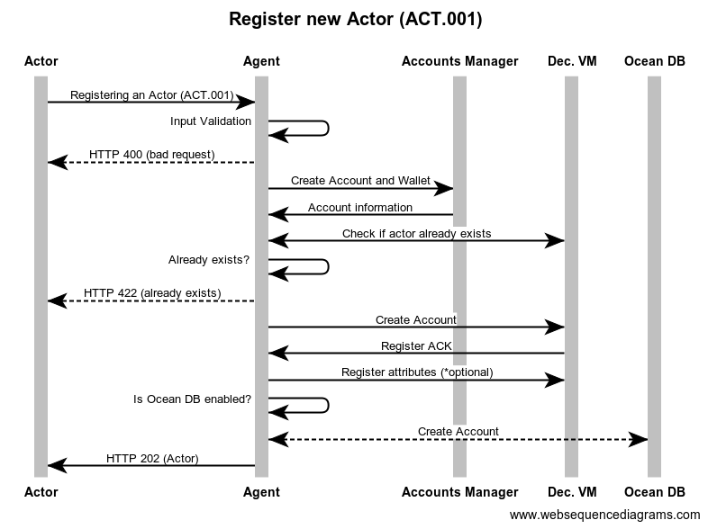
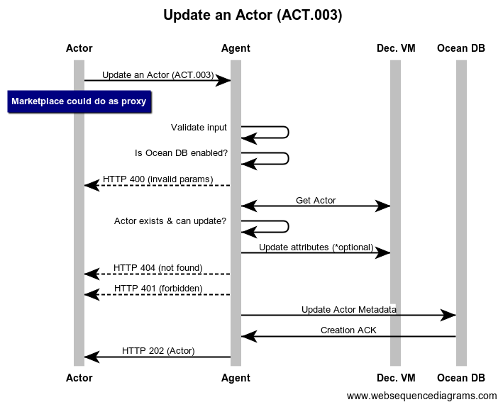

```
shortname: 13/Registry
name: Ocean Actor Registry
type: Standard
status: Raw
editor: Aitor Argomaniz <aitor@oceanprotocol.com>
contributors: Dimitri De Jonghe <dimi@oceanprotocol.com>, Mike Anderson <mike.anderson@dex.sg>, Samer Sallam <samer@oceanprotocol.com>, Kiran Karkera <kiran.karkera@dex.sg>
```


## Abstract

The Registry is a specification for Ocean Protocol to register to all the actors interacting in the Ocean Network.

This OEP does not focus on actor attributes, whitelisting or curation. It's purely the mechanics of registering and basic handling of actors.
 

## Motivation

Ocean network aims to power marketplaces for relevant AI-related data services.
Different actors and stakeholders are necessary to interact between them using the Ocean Protocol defined.  


Each of those having different motivations and interacting:

### Publishers
They publish/register assets (data, algorithms) or services into the network. Data published by those actors can make it available through Ocean for a price or for free. When their data or services are used by Consumers, Publishers receive tokens in return.

### Providers
They provide access to assets and services to the network making it accessible. When their data or services are accessed by Consumers, Providers receive tokens in return.

### Consumers
Actors who want to consume assets or services. They use the marketplace capabilities to find those assets or services. Depending on the element to consume the user will have to pay a price for it.

### Keepers
These actors maintain core protocol functionality, ensure correct token mechanics, and provide cryptographic proof capabilities. Keepers receive tokens to perform their function. 

### Curators
Curators are incentivized to promote and bet on relevance, they signal their opinion to the network using the network token, hence facilitating discovery. Data Curators put a number of tokens at stake to signal that a certain dataset is of high quality. Every time they correctly do this, they receive newly minted tokens in return.

### Marketplaces
Marketplaces expose all the information about the datasets, reputation, pricing, etc. They work as the  interface where the consumers can search for datasets suitable for their requirements. Marketplaces include the information provided by the curators.


## Specification

The **Actors** information should be managed using an API. This API should exposes the following capabilities:

* Registering an Actor
* Get an Actor
* Update an Actor
* Retire an Actor

The information or Metadata about the Actors be registered on-chain.


### Proposed Solution

The proposed solution is composed by the interaction of different elements:

* A high level RESTful API exposing the methods required to manage the Actors Registry
* A Keeper node registering the Actors metadata on-chain

From the API side (**Ocean Agent**), the methods to implement are:

### Registering an Actor (ACT.001)

```
Path: /api/v1/keeper/actors/actor
HTTP Verb: POST
Caller: The Actor trying to be registered
Input: Actor Schema
Output: Actor Schema
HTTP Output Status Codes: 
    HTTP 201 - Actor Created
    HTTP 422 - Actor already exists
```



Method implementing the creation of an Actor. From the Marketplace side only require as optional attributes:

* Name
* Key - Value attributes
* Wallet

It means an empty payload is allowed to create an Actor.
Also a wallet id can be given as parameter. It would allow to associate a new user to a previous existing Wallet. In that case the wallet will not be created, because the existing wallet will be associated to the user.
The rest of the information will be generated by the system (keys, etc.). Actor state will be set as **“CREATED”** by the system.
 
The Input and Output parameters are defined in the [Actor Schema](https://github.com/oceanprotocol/pk-schemas/blob/develop/src/main/resources/avro/com/oceanprotocol/core/keeper/schemas/Actor.avsc).

### Get an Actor (ACT.002)

```
Path:  /api/v1/keeper/actors/actor/{actorId}
HTTP Verb: GET
Caller: Any
Input: actorId
Output: Actor Schema
HTTP Output Status Codes: 
    HTTP 200 - OK
    HTTP 404 - Not Found
```


Method retrieving information of an Actor from the database.
If the Actor retrieved has an attribute `state == “DISABLED”` the method should return a HTTP 404 Not Found message


This method could be integrated by any actor. 
The Input of this method is the **actorId** referencing to a unique **Actor**. The Output parameters are defined in 
the [Actor Schema](https://github.com/oceanprotocol/pk-schemas/blob/develop/src/main/resources/avro/com/oceanprotocol/core/keeper/schemas/Actor.avsc).


### Update an Actor (ACT.003)

```
Path: /api/v1/keeper/actors/actor
HTTP Verb: PUT
Caller: Actor or Marketplace working as Proxy
Input: Actor Schema
Output: Actor Schema
HTTP Output Status Codes: 
    HTTP 200 - Updated
    HTTP 404 - Not Found
```



Method updating the Actor information. This method doesn’t allow to modify all the Actor information attributes. Information like public & private keys, wallet and so on can’t be modified. Only the information about the following fields can be updated:

* Name
* Attributes

This method is integrated by the **Actor**. Marketplaces can participate as proxies. 
The Input and Output parameters are defined in the [Actor Schema](https://github.com/oceanprotocol/pk-schemas/blob/develop/src/main/resources/avro/com/oceanprotocol/core/keeper/schemas/Actor.avsc).


### Retire an Actor (ACT.004)

```
Path: /api/v1/keeper/actors/actor/{actorId}
HTTP Verb: DELETE
Caller: Actor
Input: actorId
Output: Actor Schema
HTTP Output Status Codes: 
    HTTP 200 - OK
    HTTP 404 - Not Found
```


This method implements a soft delete of an actor. It means the Actor is updated setting the state attribute to `“DISABLED”`. 
The method will return a HTTP 200 status code and the Actor modified in the response body.

This method only can be integrated by the Actor. 
The Input of this method is the actorId referencing to a unique Actor. The Output parameters are defined in 
the [Actor Schema](https://github.com/oceanprotocol/pk-schemas/blob/develop/src/main/resources/avro/com/oceanprotocol/core/keeper/schemas/Actor.avsc).


## Implementation

It involves some implementation in two different components:
 
* The implementation of the API, from the **Ocean Agent** side, will be done using Python and the Hug framework.
* The implementation of the **Keeper** side, will be done using the Decentralized VM and the **Ocean DB** to persist the Actor information

### Assignee(s)
Primary assignee(s): @diminator, @ssallam, @shark8me


### Targeted Release

The implementation of the API interface is planned for the [Alpha release](https://github.com/oceanprotocol/ProtoKeeper/milestone/2). 
The implementation of the full Keeper functionality it's planned for the [Alpha release](https://github.com/oceanprotocol/ocean/milestone/4)


### Status
unstable


## Copyright Waiver
To the extent possible under law, the person who associated CC0 with this work has waived all copyright and related or neighboring rights to this work.

