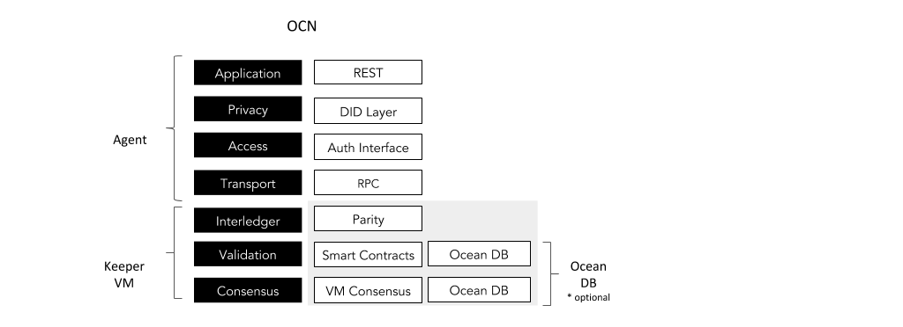
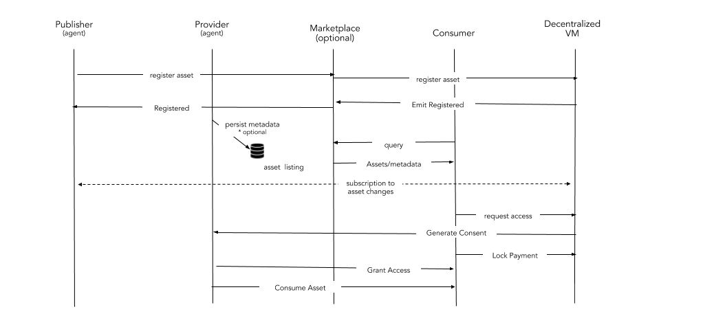
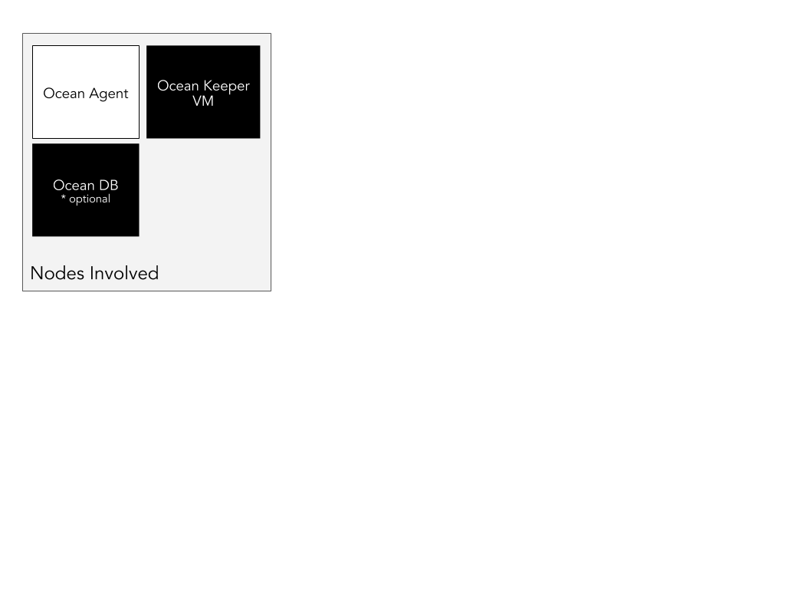
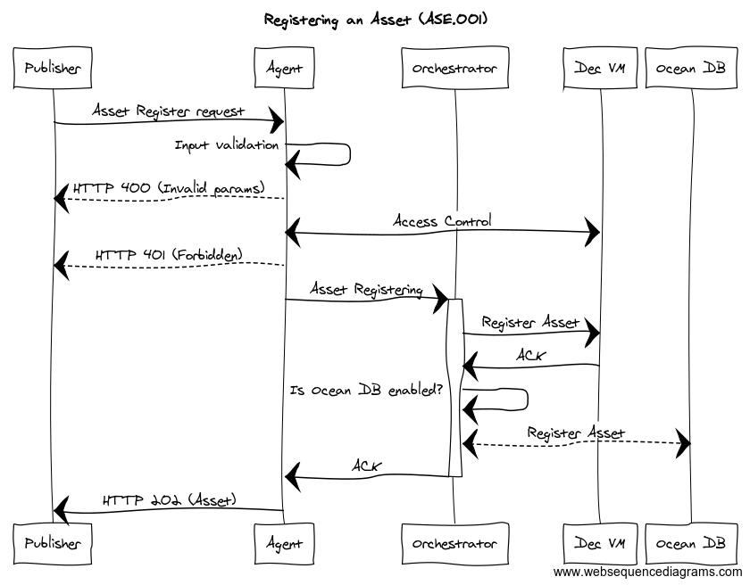
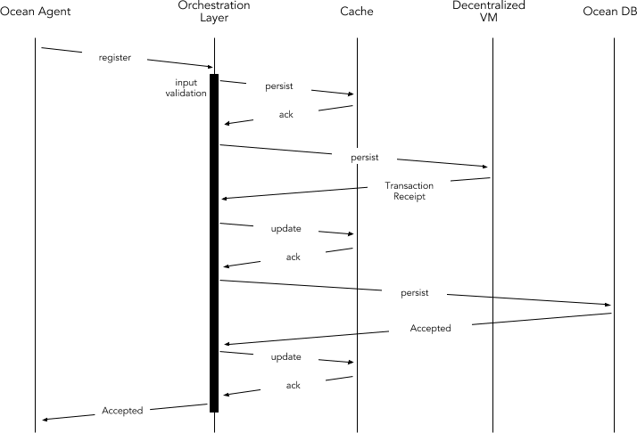
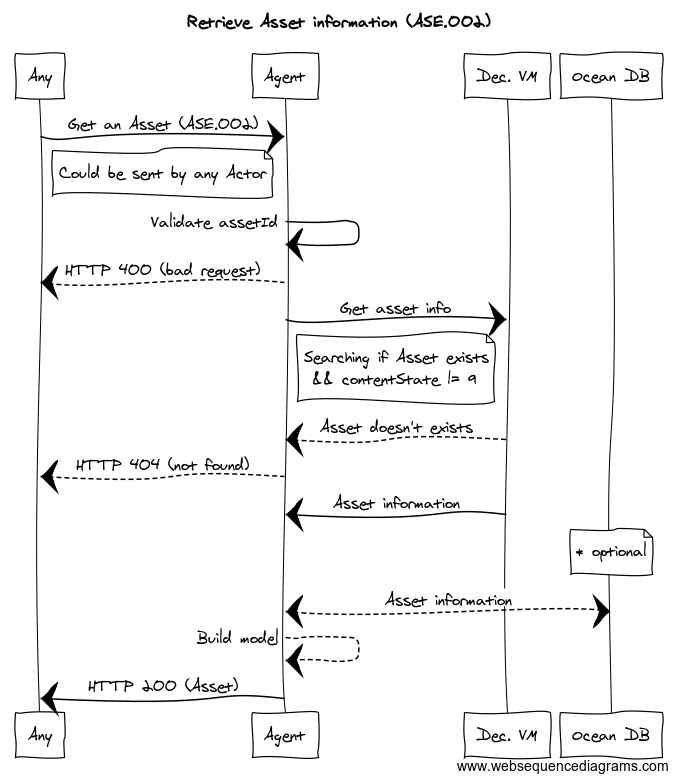
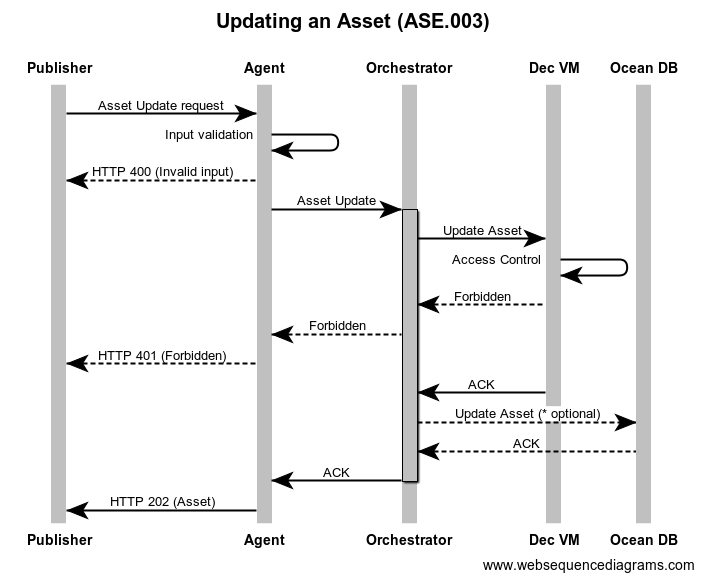
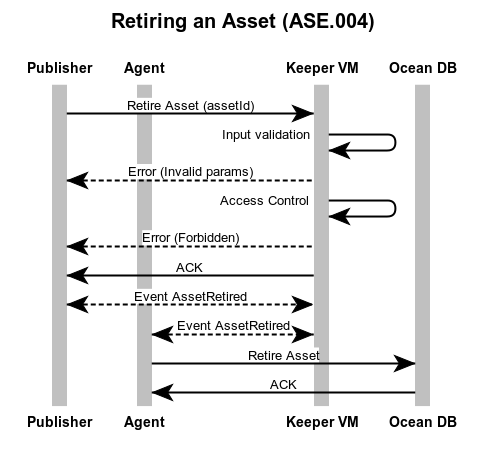
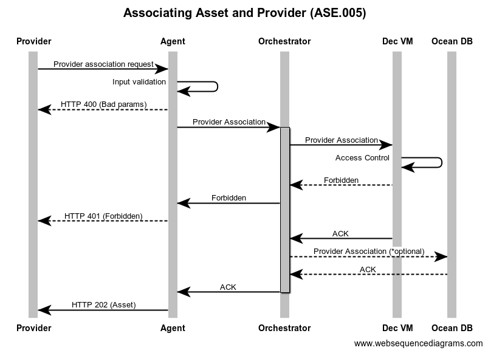
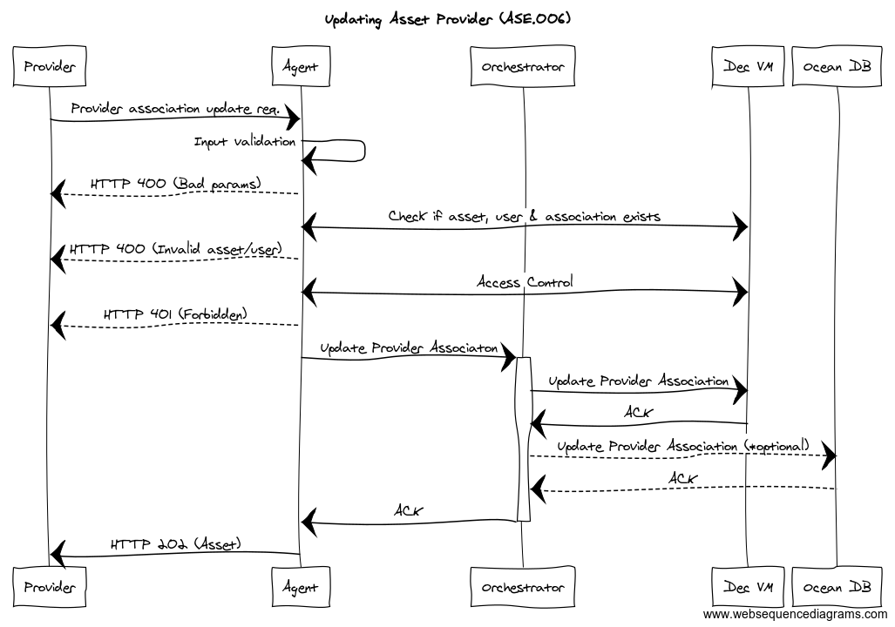

```
shortname: 14/OAR
name: Ocean Assets Registry
type: Standard
status: Raw
editor: Aitor Argomaniz <aitor@oceanprotocol.com>
contributors: Dimitri De Jonghe <dimi@oceanprotocol.com>
		Fang Gong <fang@oceanprotocol.com>
```

<!--ts-->

Table of Contents
=================

   * [Table of Contents](#table-of-contents)
   * [Ocean Assets Registry](#ocean-assets-registry)
      * [Change Process](#change-process)
      * [Language](#language)
      * [Motivation](#motivation)
      * [Specification](#specification)
         * [Proposed Solution](#proposed-solution)
         * [Registering a new Asset](#registering-a-new-asset)
         * [Retrieve metadata of an Asset](#retrieve-metadata-of-an-asset)
         * [Updating Asset Metadata](#updating-asset-metadata)
         * [Retiring an Asset](#retiring-an-asset)
         * [Make an Asset available through a Provider](#make-an-asset-available-through-a-provider)
         * [Updating Asset Provider](#updating-asset-provider)
      * [Copyright Waiver](#copyright-waiver)

      
<!--te-->

<a name="ocean-assets-registry"></a>
# Ocean Assets Registry

The Ocean Assets Registry (**OAR**) is a specification for Ocean Protocol to register any kind of Data Asset in the Ocean Network. 
In the scope of Ocean, we understand as **Asset** or **Data Asset** as any kind of data stored in a structured machine readable format.
It could includes Datasets or Algorithms.

This OEP does not focus on metadata structure, staking or curation. It's purely the mechanics of registering and basic handling of assets.
This OEP discuss about the Data Assets metadata, and not about the Assets storage and consumption mechanisms.
This OEP doesn't focus on Assets discovery. It will be related with the SONAR OEP.

This specification is based on [Ocean Protocol technical whitepaper](https://github.com/oceanprotocol/whitepaper), [3/ARCH](../3/README.md), [4/KEEPER](../4/README.md) and [5/AGENT](../5/README.md).


<a name="change-process"></a>
## Change Process
This document is governed by the [2/COSS](../2/README.md) (COSS).

<a name="language"></a>
## Language
The key words "MUST", "MUST NOT", "REQUIRED", "SHALL", "SHALL NOT", "SHOULD", "SHOULD NOT", "RECOMMENDED", "NOT RECOMMENDED", "MAY", and "OPTIONAL" in this document are to be interpreted as described in [BCP 14](https://tools.ietf.org/html/bcp14) \[[RFC2119](https://tools.ietf.org/html/rfc2119)\] \[[RFC8174](https://tools.ietf.org/html/rfc8174)\] when, and only when, they appear in all capitals, as shown here.

<a name="motivation"></a>
## Motivation

Ocean network aims to power marketplaces for relevant AI-related data services.
The data assets require to be registered in the system and managed in a basic way.  

Requirements are:

* ASSETS are DATA objects describing RESOURCES under control of a PUBLISHER
* PUBLISHERS are incentivized to PUBLISH ASSETS in order to make them discoverable for third parties
* PROVIDER can give access to some ASSETS getting tokens in reward
* PUBLISHER could publish ASSET METADATA on OCEAN DB or an independent Database
* CONSUMER queries OCEAN DB or an independent Database and find ASSETS METADATA 
* CONSUMER resolves PROVIDER for ASSET METADATA 
* CONSUMER creates ASSET SERVICE_AGREEMENT(token, proofs, ...) with PROVIDER 
* CONSUMER consumes ASSET SERVICE from PROVIDER
* ASSET essential attributes are STORED on a decentralized REGISTRY 
* ASSET METADATA is stored in OCEAN DB if it's enabled in the AGENT
* ASSET metadata can be RETRIEVED from OCEAN DB if it's enabled in the AGENT
* ASSET content can be RETRIEVED from the PROVIDER
* ASSETS can have a status of DISABLED or RETIRED, which implies that the ASSET cannot be CONSUMED anymore
* PROVIDER provides SERVICE and PROOF VERIFIER validates PROOF
* OCEAN DB is optional/pluggable, OAR MUST work without an OCEAN DB backend 
  
<a name="specification"></a>
## Specification 

The **ASSET** information should be managed using an API. 
As general rule, only the **INDISPENSABLE** information to run the Smart Contracts MUST be stored in te Decentralized VM.
This API should exposes the following capabilities:

* Registering a new Asset
* Retrieve metadata information of an Asset
* Update the metadata of an existing Asset 
* Retire an Asset
* Make an Asset available through a Provider

The following restrictions apply during the design/implementation of this OEP:

* The Assets registered in the system MUST be associated to the Actors registering the Assets
* The Actors associated to the Assets (PUBLISHER or PROVIDER) MUST have a valid Account Id in the system
* The information or Metadata about the Assets will be stored in Ocean DB if the user plugs a valid Ocean DB implementation
* Only the very basic information about the Assets (ids and pricing) MUST be stored in the Decentralized VM too 
* AGENT MUST NOT store any information about the Assets or Actors during this process

<a name="proposed-solution"></a>
### Proposed Solution 

The proposed solution is composed by the interaction of different elements:

* A high level HTTP API exposing the methods required to manage the Assets Registry (AGENT)
* A Keeper node registering the complete Assets metadata (KEEPER - Ocean DB). This is optional and depends of the user parameters.
* A Keeper node registering the Asset IDs (KEEPER - Decentralized VM)
* A backend orchestration layer (AGENT) in charge of coordinating the persistence of the Assets in both backends consistently (Ocean DB & Decentralized VM)

We can show the interaction between layers and components using a stack view:



Main interactions involving PUBLISHERS, PROVIDERS and Ocean nodes are using the Keeper nodes as source of truth. 
In the below image you can see an example of interaction:



The above diagram shows the high level interactions between the components involved:

* The PUBLISHER interacting with the AGENT sending a request to register the Metadata of a new ASSET
* The AGENT MUST validate the basic parameters sent by the PUBLISHER
* The AGENT MUST authenticate the PUBLISHER sending the request
* The AGENT MUST authorize the user via KEEPER
* The AGENT MUST orchestrate the Asset registering in the OCEAN DB and DECENTRALIZED VM
* The DECENTRALIZED VM MUST only store as less information as possible. Only the main IDs and pricing information
* The OCEAN DB MUST store the complete ASSET Metadata if it's configured/instantiated (this is OPTIONAL)
* The AGENT MUST validate the basic parameters sent by the PUBLISHER
* The AGENT MUST authenticate the PUBLISHER sending the request
* The AGENT MUST authorize the user via KEEPER
* The OCEAN DB MUST store the relation between the ASSET and the PROVIDER if it's configured/instantiated (this is OPTIONAL)


In the below diagram you can see an alternative interaction where the Marketplace is not involved: 


The following sections will describe the end to end implementation using a top to bottom approach, 
starting from the API interface to the Keeper implementation, using the Ocean DB and the Decentralized VM.

In the following diagram you can see the nodes involved in this OEP:



In the following sections you can find the end to end implementation details of the complete OAR functionality.

### Smart Contracts

The KEEPER will store only the essential user information to allow the implementation of the Assets Registry. It means from the KEEPER side, the system MUST NOT store any kind of metadata.

Taking this into account, the skeleton of main implementation should provide the following structs and interfaces:

```solidity
contract AssetsRegistry {

    struct Asset {
        address owner;
        uint256 price;
        bool active;
    }
    
    // associate asset id to the Asset struct
    mapping(bytes32 => Asset) public mAssets; 
    
    /////// EVENTS //////////////////////////////
    event AssetRegistered(bytes32 indexed _assetId, address indexed _owner);   
    
    /////// FUNCTIONS ///////////////////////////
    
    // Allows to register a new asset (assetId) where the owner is the msg.sender of the request
    function register(bytes32 assetId, uint256 price) public validAddress(msg.sender) returns (bool success);
}

```

---

<a name="registering-a-new-asset"></a><a name="ASE.001"></a>
### Registering a new Asset 




In the above diagram the Agent and the Orchestration capabilities are implemented in the AGENT scope.
The registering of a new Asset involves the following implementations:

#### Ocean Agent API

It is necessary to expose a RESTful HTTP interface using the following details:

```
Reference: ASE.001
Path: /api/v1/assets
HTTP Verb: POST
Caller: The Asset PUBLISHER
HTTP Output Status Codes: 
    HTTP 202 - Accepted
    HTTP 400 - Bad request
    HTTP 401 - Forbidden
    HTTP 422 - Asset already exists
```

<a name="asset-insert-params"></a>
##### Input Parameters 

| Parameter | Type | Description |
|:----------|:-----|:------------|
|assetId    |string|Id of the Asset (optional). If not assetId is provided, the system will generate the id|
|owner      |string|Owner address. This parameter MUST be validated. This information will not be give as part of the Payload, it will be retrieved from the Authorization HTTP header|
|marketplaceId    |string|Id of the Marketplace (optional). It indicates if the asset was published through a specific marketplace|
|metadata   |json|Attribute able to include any kind of additional information about the asset (optional)|

Because all parameters are optional, an empty payload is allowed to create an Asset.
In the composition of the HTTP payload, only the assetId and marketplaceId will be in the root of the JSON document. The rest of the parameters (optional), will be included as part of the Metadata entity.

Example: 

```json
{	
    "assetId": "342094823423",
	"marketplaceId": "0xaabbccdd",
	"metadata": {
        "name": "transaction logs jan.2018",
        "mimeType": "text/csv",
        "attributes": [{
                "key": "description",
                "value": "company transaction logs"
            },
            {
                "key": "generatedDatetime",
                "value": "Jan/2018"
            }
        ],
        "parameters": [],
        "links": [{
            "name": "dataSample",
            "linkedAssetId": "0x12345678",
            "linkedType": "subset",
            "url": "http://example.com/samples/tx/2018/01.csv"
        }]
	}
}
```

<a name="asset-model"></a>
##### Output 

The output of this request MUST add the following attributes generated by the system:

| Attribute         | Type      | Description |
|:------------------|:----------|:------------|
|creationDatetime   |datetime   |Allocated by the system when was created in the AGENT (universal datetime), time before consensus |
|updateDatetime     |datetime   |Allocated by the system when was updated the metadata in the AGENT (universal datetime), time before consensus |
|contentState       |string     |Internal state of the Asset (see below for a complete description) |


These are the possible values of the **contentState** attribute:

* PENDING - Asset just created
* PUBLISHED - Asset used by at least one provider
* UNPUBLISHED - An asset is not being provided
* DISABLED - Asset deleted


Example:

```json
{
    "assetId": "123456789abcde", 
  	"marketplaceId": "0xaabbccdd",
    "owner": "0x1234aa33bb",
    "creationDatetime": "2018-05-18T16:00:00Z",
    "updateDatetime": "2018-05-18T16:00:00Z",
    "contentState": "PENDING",
    "metadata" : {
        "name": "transaction logs jan.2018",
        "mimeType": "text/csv",
        "attributes": [ .. ],
        "parameters": [ .. ],
        "links": [ .. ]
	}
}
```

#### Orchestration Layer

The AGENT node will be in charge of manage the Assets creation. The Ocean DB integration is optional, so the Metadata will be stored there only an Ocean DB interface implementation is provided.  
Assets MUST be persisted in the Decentralized VM and Ocean DB (if the configuration is provided), storing in the Decentralized DB only the essential information to run the Smart Contracts.
 
Ocean DB will store the complete metadata information. To coordinate the creation of the Assets in a consistent way in both data stores, the AGENT will implement an Orchestration component in charge of that.

The AGENT will coordinate the creation of an Asset writing initially in the Decentralized VM. It will return a **Transaction Receipt** (see more details about the [Transaction Receipt model](https://github.com/ethereum/wiki/wiki/JavaScript-API#web3ethgettransactionreceipt)).
After of that the Orchestration layer will persist the complete Asset metadata in Ocean DB.




<a name="new-asset-vm"></a>
#### Interaction with the Decentralized VM

The **KEEPER::Decentralized VM** will persist the following information:

| Attribute | Type | Description |
|:----------|:-----|:------------|
|assetId    |byte32|Asset Id|
|owner      |address|Owner of the Asset|
|marketplace|address|Address of the Marketplace associated to the asset (optional)|
|state      |uint|TCR State of the Asset|

Using any of the existing web3 implementation library (web3.js, web3.py, web3.j, etc), it's possible to interact with the VM Smart Contracts.

For example using the java Smart Contract stubs generated by web3.j (Java), it's possible to implement a DTO wrapping the Smart Contract interactions. 

```java

AssetsRegistry registry= AssetsRegistry.load(
    contractAddress,
    vm.getWeb3(),
    txManager,
    GAS_PRICE,
    GAS_LIMIT
    ));

TransactionReceipt receipt= registry.publish(newAsset.assetId).send();

```


#### Interaction with Ocean DB

If the **KEEPER::Ocean DB** is integrated, it will persist the following information:

| Parameter | Type | Description |
|:----------|:-----|:------------|
|assetId    |string|Id of the Asset|
|owner    |string|Account address|
|marketplace    |string|Id of the Marketplace (optional)|
|state       |string     |Internal state of the Asset|
|**Metadata**:|     ||
|creationDatetime   |datetime   |Allocated by the system when was created in the AGENT (universal datetime), time before consensus |
|updateDatetime     |datetime   |Allocated by the system when was updated the metadata in the AGENT (universal datetime), time before consensus |
|name       |string|Asset name (optional)|
|mimeType       |string|The mime-type of the file (optional)|
|attributes |array |Array of key, value attributes (optional)|
|parameters |array | If it's a service or operation, specifies the K,V parameters (optional)|
|links |array |List of links to other assets (samples, previous versions, etc.) (optional)|
|providers       |object     |Providers giving access to the data. This is managed by the [**ASE.005**](#provider-asset) operation.|


---

<a name="retrieve-asset"></a><a name="ASE.002"></a>
### Retrieve metadata of an Asset 



The retrieval of an Asset involves the following implementations:

#### Ocean Agent API

It is necessary to expose a RESTful HTTP interface using the following details:

```
Reference: ASE.002
Path: /api/v1/assets/{assetId}
HTTP Verb: GET
Caller: Any User
Input: assetId
Output: Asset Schema
HTTP Output Status Codes: 
    HTTP 200 - OK
    HTTP 400 - Bad request
    HTTP 404 - Not Found
```

##### Input Parameters

| Parameter | Type | Description |
|:----------|:-----|:------------|
|assetId    |string|Id of the Asset|

Example: 

```http
GET http://localhost:8080/api/v1/assets/777227d45853a50eefd48dd4fec25d5b3fd2295e
```

Before to query the Decentralized VM, it's necessary to check the length and format of the assetId. 
If the length and format doesn't fit the standard address definition, the system should return a **HTTP 400** Invalid params message.


#### Interaction with the Decentralized VM

The Asset information will be retrieved directly from the **KEEPER::Decentralized VM** Smart Contract interfaces. 
It's necessary to validate that the ```state != DISABLED```.
Disabled Assets MUST return a ```HTTP 404 Not Found``` status code.   

##### Output

The essential information is coming from the Decentralized VM. The expected output will provide the following attributes: 

| Attribute | Type | Description |
|:----------|:-----|:------------|
|assetId    |byte32|Asset Id|
|owner      |address|Owner of the Asset|
|marketplace|address|Marketplace associated to the asset (optional)|
|state      |uint|TCR State of the Asset|

If Ocean DB is enabled, the system will try to retrieve the complete Metadata using the interfaces and **assetId**. 
If the system is able to do it, the output will include in the metadata section all the extended information provided by the external system. 


---

<a name="update-asset"></a><a name="ASE.003"></a>
### Updating Asset Metadata 



In the above diagram the Agent and the Orchestration capabilities are implemented in the AGENT scope.
The registering of a new Asset involves the following implementations:

#### Ocean Agent API

It is necessary to expose a RESTful HTTP interface using the following details:

```
Reference: ASE.003
Path: /api/v1/assets
HTTP Verb: PUT
Caller: The Asset PUBLISHER or MARKETPLACE on behalf
Input: Asset Schema
Output: Asset Schema
HTTP Output Status Codes: 
    HTTP 202 - Accepted
    HTTP 400 - Bad request
    HTTP 401 - Forbidden
```

##### Input Parameters

Input parameters accepted are the same are accepted in the [input parameters section](#asset-insert-params) of the Registering an Asset method.

Internal state attributes and the rest of the attributes can't be modified using this method.


##### Output

The expected output implements the Asset model described in the [output parameters section](#asset-model) of the Registering an Asset method.


#### Orchestration Layer

The AGENT node will be in charge of manage the Assets update. 

This method only provide the capabilities to update the following attributes in the the Decentralize VM:

* **marketplace**   

In addition to this, integrates the Decentralized VM to implement the access control mechanism.
The Access Control checks if the user requesting to Update the Asset, has enough privileges to do it. 
To do that, the ```canUpdate(assetId)``` method is called. This method should return a boolean value indicating if the Asset can be modified.  

If the Asset can be updated, and Ocean DB is enabled, the Orchestration layer will persist the complete Asset metadata in Ocean DB. 
Also the attribute **updateDatetime** will be updated with the KEEPER universal datetime. 


---

<a name="retire-asset"></a><a name="ASE.004"></a>
### Retiring an Asset 



In the above diagram the Agent and the Orchestrator capabilities are implemented in the AGENT scope.
The Asset MUST be retired from Ocean DB and the Decentralized VM.

This method implements a soft delete of an Asset. It means the Asset is updated setting the contentState attribute to `DISABLED`. The method will return a HTTP 202 status code and the Asset modified in the response body.

This method only can be integrated by the owner of the Asset or a Marketplace allowed to act on behalf.

#### Ocean Agent API

It is necessary to expose a RESTful HTTP interface using the following details:

```
Reference: ASE.004
Path: /api/v1/assets/{assetId}
HTTP Verb: DELETE
Caller: The Asset owner or Marketplace on behalf
Input: assetId
Output: Asset Schema
HTTP Output Status Codes: 
    HTTP 202 - Accepted
    HTTP 400 - Invalid params
    HTTP 404 - Not Found
```

##### Input Parameters

| Parameter | Type | Description |
|:----------|:-----|:------------|
|assetID    |string|The Asset ID given in the URL|


Example: 

```http
DELETE http://localhost:8080/api/v1/assets/777227d45853a50eefd48dd4fec25d5b3fd2295e
``` 

##### Output

The expected output implements the Asset model described in the [output parameters section](#asset-model) of the Registering an Asset method.

After execute this method, if everything worked okay, the **state** attribute should be **DISABLED**.


#### Orchestration Layer

The AGENT node will be in charge of manage the Assets retirement. 
If Ocean DB is enabled, Assets MUST be updated in Ocean DB and retired from the Decentralized VM.

Before to proceed to any data modification, it's necessary to validate if the address requesting to retire an Asset has privileges to do it. 
The Access Control component is in charge of this validation (KEEPER). To do that, the ```canRetire(assetId)``` method is called. This method should return a boolean value indicating if the Asset can be retired by the user calling that method.  

If the Asset can be retired, the Smart Contract will execute the **retire** method.

After to do that, the Orchestration layer will update the following information in Ocean DB:
* The attribute **state** will be updated with the value **DISABLED**.
* The attribute **updateDatetime** will be updated with the KEEPER universal datetime. 

The AGENT will coordinate the retirement of an Asset interacting initially with the Decentralized VM. It will return a **Transaction Receipt** (see more details about the [Transaction Receipt model](https://github.com/ethereum/wiki/wiki/JavaScript-API#web3ethgettransactionreceipt)).
After of that the Orchestration layer will update the above attributes in Ocean DB if it's enabled.


---

<a name="provider-asset"></a><a name="ASE.005"></a>
### Make an Asset available through a Provider 





In the above diagram the Agent and the Orchestration capabilities are implemented in the AGENT scope.
This method allows to a PROVIDER to registering a request to GIVE ACCESS to a specific ASSET. During this process, the PRICING information is defined.
The association between a PROVIDER and an ASSET involves the following implementations:


#### Ocean Agent API

It is necessary to expose a RESTful HTTP interface using the following details:

```
Reference: ASE.005
Path: /api/v1/assets/provider
HTTP Verb: POST
Caller: PROVIDER
Input: AssetProvider Schema
Output: Asset Schema
HTTP Output Status Codes: 
    HTTP 202 - Accepted
    HTTP 400 - Bad request
    HTTP 401 - Forbidden
    HTTP 422 - Association between Asset & Provider already exists
```

<a name="asset-provider-insert-params"></a>
##### Input Parameters 

| Parameter | Type | Description |
|:----------|:-----|:------------|
|assetId    |string|Id of the Asset|
|providerId |string|Provider Id. This parameter MUST be validated.|
|pricing      |array|Asset Pricing. Price object type.|
|verificationProofs  |array|List of verification proofs provided by the Provider. Uses the VerificationProof object type.|

The **Price** object includes the following attributes:

| Parameter | Type | Description |
|:----------|:-----|:------------|
|id         |string|Id of the pricing model|
|scheme     |string|Pricing scheme. Options: ("FREE", "FIXED", "SERVICE", "SMARTCONTRACT")|
|price      |decimal   |Price in Ocean drops|
|quantity   |int   |Number of items (optional)|
|name       |string|Name about the price (optional)|
|description|string|Description about the price (optional)|

The **VerificationProof** object includes the following attributes:

| Parameter | Type | Description |
|:----------|:-----|:------------|
|id         |string|Id of the verification proof|
|name       |string|Name of the verification proof|
|agreement  |string|Verification proof Agreement|
|expectedResult |string|Expected result to be found|
|description    |string|Description (optional)|


Having into account the previous schemas, an example of the input request could be:

```json
{
	"assetId": "777227d45853a50eefd48dd4fec25d5b3fd2295e",
	"providerId": "0x99991234aa33bb",
	"pricing": [{
			"id": "1",
			"scheme": "FREE",
			"price": 0,
			"name": "Free access",
			"description": "It provides access for 1 day"
		},
		{
			"id": "2",
			"scheme": "FIXED",
			"price": 13.5,
			"quantity": 1,
			"name": "Price for access",
			"description": "It provides access for a month"
		}
	],
	"verificationProofs": [{
			"id": "1234",
			"name": "proof of access",
			"agreement": "Proof provided under request",
			"description": "Access provided via authentication",
			"expectedResult": "200"
		},
		{
			"id": "1235",
			"name": "proof of service",
			"agreement": "Proof provided under request",
			"expectedResult": "abc"
		}
	]
}
```

#### Orchestration Layer

The AGENT node will be in charge of manage the association between PROVIDERS and ASSETS.
The information about the PRICING and VERIFICATION PROOFS MUST be stored in the Decentralized DB. The complete information (Metadata + Pricing + etc.) will be send also to Ocean DB if it's enabled. 
 

#### Interaction with Ocean DB 

If it's enabled, the **KEEPER::Ocean DB** will persist **Pricing** and **VerificationProofs** as nested objects associated to a specific providerId.

| Parameter | Type | Description |
|:----------|:-----|:------------|
|assetId    |string|Id of the Asset|
|owner    |string|Account address|

So complementing the existing ASSET Ocean DB model, it's added an array of providers, where the **providerId** is the id of the Provider associated to the Asset.
 And the **pricing** and **verificationProofs** arrays include the list of prices and proofs given by the provider.
 The description of each attribute is the same given in the [input parameters section](#asset-provider-insert-params).

Here an example of the **providers** entity added to the **Assets** model:

```json
{
    // ASSET Model
	"assetId": "777227d45853a50eefd48dd4fec25d5b3fd2295e",
	
	"providers": [
	  {
	    "providerId": "0x99991234aa33bb",
        "pricing": [{
                "id": "1",
                "scheme": "FREE",
                "price": 0,
                "name": "Free access",
                "description": "It provides access for 1 day"
            },
            {
                "id": "2",
                "scheme": "FIXED",
                "price": 13.5,
                "quantity": 1,
                "name": "Price for access",
                "description": "It provides access for a month"
            }
        ],
        "verificationProofs": [{
                "id": "1234",
                "name": "proof of access",
                "agreement": "Proof provided under request",
                "description": "Access provided via authentication",
                "expectedResult": "200"
            },
            {
                "id": "1235",
                "name": "proof of service",
                "agreement": "Proof provided under request",
                "expectedResult": "abc"
            }
        ]
      }
    ]
}
```


---

<a name="provider-asset-update"></a><a name="ASE.006"></a>
### Updating Asset Provider 





In the above diagram the Agent and the Orchestration capabilities are implemented in the AGENT scope.
This method allows to a PROVIDER to update the existing association related to an ASSET. This method allows to update or remove the information about the PRICING and VERIFICATION PROOFS given by a provider. 
The update of the information associated to a PROVIDER and an ASSET involves the following implementations:

#### Ocean Agent API

It is necessary to expose a RESTful HTTP interface using the following details:

```
Reference: ASE.006
Path: /api/v1/assets/provider
HTTP Verb: PUT
Caller: PROVIDER
Input: AssetProvider Schema
Output: Asset Schema
HTTP Output Status Codes: 
    HTTP 202 - Accepted
    HTTP 400 - Bad request
    HTTP 401 - Forbidden
```

<a name="asset-provider-update-params"></a>
##### Input Parameters 

Input parameters are the same defined in the [ASE.005 input params section](#asset-provider-insert-params).
To **delete** this association, an empty array for **pricing** and **verificationProofs** can be given as parameter.

Example:

```json
{
	"assetId": "777227d45853a50eefd48dd4fec25d5b3fd2295e",
	"providerId": "0x99991234aa33bb",
	"pricing": [],
	"verificationProofs": []
}
```

#### Orchestration Layer

The AGENT node will be in charge of updating the association between the PROVIDER and the ASSET.
The information about the PRICING and VERIFICATION PROOFS MUST be stored in the Decentralized DB. If Ocean DB is enabled, the information will be sent there too.  

#### Interaction with the Decentralized VM

The **updateProviderPricing** & **updateProviderProof** methods will allow to update the Pricing and VerificationProofs information:

```solidity

    function updateProviderPricing(bytes32 _assetId, address _providerId, unit8 scheme, unit256 _price) external returns (bool success);
    
    function updateProviderProof(bytes32 _assetId, address _providerId, bytes32 _result) external returns (bool success);
    
```

If **pricing** and **verificationProofs** attributes are empty, means it's necessary to delete the association between the ASSET and the PROVIDER.
In that case the **disassociateProvider** method will allow to delete this association:

```solidity

    function disassociateProvider(bytes32 _assetId, address _providerId) external returns (bool success);
    
```

Any modification about one Asset and the Providers associated will raise an event `AssetProviderUpdated`.


#### Interaction with Ocean DB

If it's enabled, the **KEEPER::Ocean DB** will persist **Pricing** and **VerificationProofs** as nested objects associated to a specific providerId.
The model is described in the [ASE.005 Ocean DB interaction section](#asset-provider-insert-db).

If **pricing** and **verificationProofs** attributes are empty, means it's necessary to delete the association between the ASSET and the PROVIDER.
In that case the complete relation between the Asset and the Provider is deleted of the **providers** array.


---
<a name="asset-tcr"></a>
### Token Curation Registry (TCR) of Assets 

Token curation registry (TCR) is used to maintain a list of high quality assets through challenge-voting process:

* Voting process can be initiated by:
	- New Asset applies to be listed in the marketplace
	- Existing Asset is challenged by any user
	- All participants including applicant, voter and challenger need to deposit tokens for challenge or voting
	- Deposits of minority in voting result will be distributed to majority party
* Each participant can vote for or against the asset according to their opinion.
* After the voting result is revealed, the token deposit will be distributed among winning parties.
* Depends on the voting result, the asset will be accepted to be listed or removed from the marketplace. 

#### TCR Smart Contract

The TCR Smart Contract can be implemented as a stand-alone module which interacts with the Assets Registry through Interface Functions. 

Let us introduce the data struct and functions of TCR smart contract first, and then discuss the interaction to Assets Registry smart contract.

The TCR smart contract SHOULD provide the structs including `listing` and `challenge`:  

```solidity
    // Maps assetId to associated listing data
    mapping(string => Listing) public listings;
    
    // Maps challengeIDs to associated challenge data
    mapping(uint => Challenge) public challenges;
    
	// Listing data struct
	struct Listing {
		uint		version;
		uint		applicationExpiry;
		bool		whitelisted;
		uint		challengeID;
		string		description;
	}
	
	
	// Challenge data struct
	struct Challenge {
		uint		rewardPool;
		address		challenger;
		uint		stake;
		uint		totalTokens;
		bool		resolved;
		mapping(address => bool) tokenClasims; 
	}  
```

The **Listing** object includes the following attributes:

| Parameter | Type | Description |
|:----------|:-----|:------------|
|version | uint | the version of TCR contract |
|applicationExpiry  |uint| Expiration date of application stage|
|whitelisted  |bool   | Indicates registry status|
|challengeID       |uint| voting ID in challenge stage|
|description|string|Description about the TCR (optional)|

The **Challenge** object includes the following attributes:

| Parameter | Type | Description |
|:----------|:-----|:------------|
|rewardPool  |uint| pool of tokens to be distributed to winning voters|
|challenger | address| owner of challenge|
| resolved | bool | indicates challenge is resolved |
|stake | uint | number of tokens at stake |
|totalTokens | uint | number of tokens used in voting by the winning side |
|tokenClasims | mapping(address=>bool) | indicates whether a voter has claimed reward |

#### Interaction with the Asset Registry

The Asset Registry Smart Contract SHOULD provide following methods to interact with TCR in two scenarios:

* *Case 1: registering new dataset initiates the voting process when TCR is enabled:*
	* The function `apply ` creates a challenge of `_listing` for data asset; 
	* The challenge triggers the voting process;
	* Depends on the result, the function returns "true" if most voters agree to list the new dataset and new dataset can be listed in the marketplace;
	* It returns "false" if not and new dataset is disabled. 

	```solidity
	function apply(bytes32 _listing, uint _amount, string _data) externa;
	```

* *Case 2: User challenges the existing asset:*
	* User creates a challenge of "_assetId" and triggers the voting process with TCR Smart Contract;
	* The TCR Smart Contract SHOULD call `changeListingStatus` methods in Asset Registry if voting result is to remove the asset from the marketplace;
	* As such Asset Registry smart contract disables access to the asset by changing its status to be false.

	```solidity
	function changeListingStatus(bytes32 listing, bytes32 assetId) public returns(bool);
	```
	

---

#### Ocean Agent API

### Assignee(s)
Primary assignee(s): @aaitor, @diminator


### Targeted Release

The implementation of the full Keeper functionality it's planned for the [Alpha release](https://github.com/oceanprotocol/ocean/milestone/4)


### Status
unstable


<a name="copyright-waiver"></a>
## Copyright Waiver  
To the extent possible under law, the person who associated CC0 with this work has waived all copyright and related or neighboring rights to this work.

