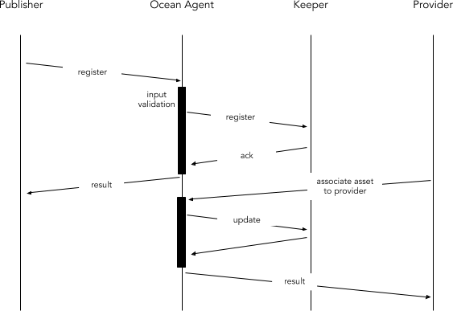

```
shortname: 14/OAR
name: Ocean Assets Registry
type: Standard
status: Raw
editor: Aitor Argomaniz <aitor@oceanprotocol.com>
contributors: Dimitri De Jonghe <dimi@oceanprotocol.com>
```

<!--ts-->

Table of Contents
=================

      
<!--te-->

# Ocean Assets Registry <a name="ocean-assets-registry"></a>

The Ocean Assets Registry (**OAR**) is a specification for Ocean Protocol to register any kind of Data Asset in the Ocean Network. 
In the scope of Ocean, we understand as **Asset** or **Data Asset** as any kind of data stored in a structured machine readable format.
It could includes Datasets or Algorithms.

This OEP does not focus on metadata structure, staking or curation. It's purely the mechanics of registering and basic handling of assets.
This OEP discuss about the Data Assets metadata, and not about the Assets storage and consumption mechanisms.
This OEP doesn't focus on Assets discovery. It will be related with the SONAR OEP.

This specification is based on [Ocean Protocol technical whitepaper](https://github.com/oceanprotocol/whitepaper), [3/ARCH](../3/README.md), [4/KEEPER](../4/README.md) and [5/AGENT](../5/README.md).


## Change Process <a name="change-process"></a>
This document is governed by the [2/COSS](../2/README.md) (COSS).

## Language <a name="language"></a>
The key words "MUST", "MUST NOT", "REQUIRED", "SHALL", "SHALL NOT", "SHOULD", "SHOULD NOT", "RECOMMENDED", "NOT RECOMMENDED", "MAY", and "OPTIONAL" in this document are to be interpreted as described in [BCP 14](https://tools.ietf.org/html/bcp14) \[[RFC2119](https://tools.ietf.org/html/rfc2119)\] \[[RFC8174](https://tools.ietf.org/html/rfc8174)\] when, and only when, they appear in all capitals, as shown here.


## Motivation <a name="motivation"></a>

Ocean network aims to power marketplaces for relevant AI-related data services.
The data assets require to be registered in the system and managed in a basic way.  

Requirements are:

* ASSETs are DATA objects describing RESOURCES under control of a PUBLISHER
* PUBLISHERs are incentivized to PUBLISH ASSETS in order to make them discoverable for third parties
* PROVIDER can give access to some ASSETs getting tokens in reward
* PUBLISHER publishes ASSET METADATA on OCEAN DB 
* CONSUMER queries OCEAN DB and find ASSETs METADATA 
* CONSUMER resolves PROVIDER for ASSET METADATA 
* CONSUMER creates ASSET SERVICE_AGREEMENT(token, proofs, ...) with PROVIDER 
* CONSUMER consumes ASSET SERVICE from PROVIDER
* ASSET metadata are STORED on a decentralized REGISTRY 
* ASSET metadata can be UPDATED 
* ASSET metadata can be RETRIEVED from the REGISTRY
* ASSET content can be RETRIEVED from the PROVIDER
* ASSETS can have a status of DISABLED or RETIRED, which implies that the ASSET cannot be CONSUMED anymore
* PROVIDER provides SERVICE and PROOF VERIFIER validates PROOF
  

## Specification <a name="specification"></a>

The **Asset Metadata** (aka **Asset**) information should be managed using an API. This API should exposes the following capabilities:

* Registering a new Asset
* Retrieve metadata information of an Asset
* Update the metadata of an existing Asset 
* Retire an Asset
* Make an Asset available through a Provider

The following restrictions apply during the design/implementation of this OEP:

* The Assets registered in the system MUST be associated to the Actors registering the Assets
* The Actors associated to the Assets (PUBLISHER or PROVIDER) MUST have a valid Account Id in the system
* The information or Metadata about the Assets MUST be stored in Ocean DB
* Only the very basic information about the Assets (ids and pricing) MUST be stored in the Decentralized VM too
* As general rule, only the INDISPENSABLE information to run the Smart Contracts MUST be stored in te Decentralized VM 
* AGENT MUST NOT store any information about the Assets or Actors during this process


### Proposed Solution <a name="proposed-solution"></a>

The proposed solution is composed by the interaction of different elements:

* A high level RESTful HTTP API exposing the methods required to manage the Assets Registry (AGENT)
* A Keeper node registering the complete Assets metadata (KEEPER - Ocean DB)
* A Keeper node registering the Asset IDs (KEEPER - Decentralized VM)
* A backend orchestration layer (AGENT) in charge of coordinating the persistence of the Assets in both backends consistently (Ocean DB & Decentralized VM)

We can show the interaction between layers and components using a stack view:


Main interactions involving PUBLISHERs, PROVIDERs and Ocean nodes are using the Keeper nodes as source of truth. 
In the below image you can see an example of interaction:



The above diagram shows the high level interactions between the components involved:

* The PUBLISHER interacting with the AGENT sending a request to register the Metadata of a new ASSET
* The AGENT MUST validate the basic parameters sent by the PUBLISHER
* The AGENT MUST authenticate the PUBLISHER sending the request
* The AGENT MUST authorize the user via KEEPER
* The AGENT MUST orchestrate the Asset registering in the OCEAN DB and DECENTRALIZED VM
* The DECENTRALIZED VM MUST only store as less information as possible. Only the main IDs and pricing information
* The OCEAN DB MUST store the complete ASSET Metadata
* The AGENT MUST validate the basic parameters sent by the PUBLISHER
* The AGENT MUST authenticate the PUBLISHER sending the request
* The AGENT MUST authorize the user via KEEPER
* The OCEAN DB MUST store the relation between the ASSET and the PROVIDER


The following sections will describe the end to end implementation using a top to bottom approach, 
starting from the API interface to the Keeper implementation, using the Ocean DB and the Decentralized VM.


### Registering a new Asset <a name="registering-a-new-asset"></a>


In the above diagram the Agent and the Orchestration capabilities are implemented in the AGENT scope.
The registering of a new Asset involves the following implementations:

#### Ocean Agent API

It is necessary to expose a RESTful HTTP interface using the following details:

```
Reference: ASE.001
Path: /api/v1/keeper/assets/metadata
HTTP Verb: POST
Caller: The Asset PUBLISHER
Input: Asset Schema
Output: Asset Schema
HTTP Output Status Codes: 
    HTTP 202 - Accepted
    HTTP 400 - Bad request
    HTTP 401 - Forbidden
    HTTP 422 - Asset already exists
```

##### Input Parameters

| Parameter | Type | Description |
|:----------|:-----|:------------|
|assetId    |string|Id of the Asset (optional). If not assetId is provided, the system will generate the id|
|owner      |string|Owner address. This parameter MUST be validated.|
|name       |string|Asset name (optional)|
|marketplaceId    |string|Id of the Marketplace (optional). It indicates if the asset was published through a specific marketplace|
|mimeType       |string|The mime-type of the file (optional)|
|attributes |array |Array of key, value attributes (optional)|
|parameters |array | If it's a service or operation, specifies the K,V parameters (optional)|
|links |array |List of links to other assets (samples, previous versions, etc.) (optional)|

Because all parameters are optional, an empty payload is allowed to create an Asset.

Example: 

```json
{
	"name": "transaction logs jan.2018",
	"owner": "0x1234aa33bb",
	"mimeType": "text/csv",
	"attributes": [{
			"key": "description",
			"value": "company transaction logs"
		},
		{
			"key": "generatedDatetime",
			"value": "Jan/2018"
		}
	],
	"parameters": [],
	"links": [{
		"name": "dataSample",
		"linkedAssetId": "0x12345678",
		"linkedType": "subset",
		"url": "http://example.com/samples/tx/2018/01.csv"
	}]
}
```

##### Output <a name="asset-model"></a>

The output of this request MUST add the following attributes generated by the system:

| Attribute         | Type      | Description |
|:------------------|:----------|:------------|
|creationDatetime   |datetime   |Allocated by the system when was created in the AGENT (universal datetime), time before consensus |
|updateDatetime     |datetime   |Allocated by the system when was updated the metadata in the AGENT (universal datetime), time before consensus |
|contentState       |string     |Internal state of the Asset (see below for a complete description) |


These are the possible values of the **contentState** attribute:

* PENDING - Asset just created
* PUBLISHED - Asset used by at least one provider
* UNPUBLISHED - An asset is not being provided
* DISABLED - Asset deleted

Example:

```json
{
    "assetId": "123456789abcde", 
    "owner": "0x1234aa33bb",
    "creationDatetime": "2018-05-18T16:00:00Z",
    "updateDatetime": "2018-05-18T16:00:00Z",
    "contentState": "PENDING",
	"name": "transaction logs jan.2018",
	"mimeType": "text/csv",
	"attributes": [ .. ],
	"parameters": [ .. ],
	"links": [ .. ]
}
```

#### Orchestration Layer

The AGENT node will be in charge of manage the Assets creation. 
Assets MUST be persisted in the Decentralized VM and Ocean DB, storing in the Decentralized DB only the essential information to run the Smart Contracts.
Ocean DB will store the complete metadata information. To coordinate the creation of the Assets in a consistent way in both data stores, the AGENT will implement an Orchestration component in charge of that.

The AGENT will coordinate the creation of an Asset writing initially in the Decentralized VM. It will return a **Transaction Receipt** (see more details about the [Transaction Receipt model](https://github.com/ethereum/wiki/wiki/JavaScript-API#web3ethgettransactionreceipt)).
After of that the Orchestration layer will persist the complete Asset metadata in Ocean DB.


##### Caching

The AGENT will need to integrate a local CACHE system to coordinate the consistency of the data written in both systems. This CACHE should provide the following capabilities:

* It should be a Local cache, not exposed in any way to the network
* If AGENT crashes, the AGENT MUST read the state of cache to continue retrying the persistence of the Assets in the different backends
* If any error occurs during the persistence of the content, the retries field MUST be increased
* The cache MUST store the representation of the Asset as soon as a new registering request be received
* The cache status MUST be UPDATED after the content be stored in the Decentralized VM
* The row representing the asset in CACHE MUST be DELETED after the data been stored in Ocean DB  

The cache should store the following information:

| Attribute         | Description|
|:------------------|:----------|
|id                 |Id of the content, in this case assetId|
|type               |Type of the content, in this case "ASSET"|
|status             |Status. Options are: CACHED, STORED_VM, STORED_DB 
|retries            |Number of retries before to remove from the cache. If 0, no limit
|ttl                |Number of seconds after the creationDatetime before to remove from the cache. If 0, no limit 
|creationDatetime   |Creation datetime
|updateDatetime     |Update datetime
|content            |Payload of the content (Json or Avro representation of the Asset)


#### Interaction with the Decentralized VM

The **KEEPER::Decentralized VM** will persist the following information:

| Attribute | Type | Description |
|:----------|:-----|:------------|
|assetId    |byte32|Asset Id|
|actorId    |address|Owner of the Asset|

Using any of the existing web3 implementation library (web3.js, web3.py, web3.j, etc), it's possible to interact with the VM Smart Contracts.

For example using the java Smart Contract stubs generated by web3.j (Java), it's possible to implement a DTO wrapping the Smart Contract interactions. 
```java

AssetsRegistry registry= AssetsRegistry.load(
    contractAddress,
    vm.getWeb3(),
    txManager,
    GAS_PRICE,
    GAS_LIMIT
    ));

TransactionReceipt receipt= registry.publish(newAsset.assetId).send();

```

#### Smart Contracts

The **AssetsRegistry** smart contract layer could expose the following public methods:

```solidity

    function publish(bytes32 _assetId) public returns (bool success) { }
    
    function retire(bytes32 _assetId) public returns (bool success) { }
    
    function getOwner(bytes32 _assetId) public returns (address owner) { }
    
    function isOwner(bytes32 _assetId, address _address) public returns (bool isOwner) { }

```

* publish - allows to register a new asset (assetId) where the owner is the msg.sender of the request
* retire - remove the asset of the system. Only the owner of the asset can retire an asset
* getOwner - returns the address of the owner of a specific asset
* isOwner - Returns true or false saying if the address passed as parameter is the owner of the asset
 


#### Interaction with Ocean DB

The **KEEPER::Ocean DB** will persist the following information:

| Parameter | Type | Description |
|:----------|:-----|:------------|
|assetId    |string|Id of the Asset|
|owner    |string|Account address|
|name       |string|Asset name (optional)|
|marketplaceId    |string|Id of the Marketplace (optional)|
|mimeType       |string|The mime-type of the file (optional)|
|attributes |array |Array of key, value attributes (optional)|
|parameters |array | If it's a service or operation, specifies the K,V parameters (optional)|
|links |array |List of links to other assets (samples, previous versions, etc.) (optional)|
|creationDatetime   |datetime   |Allocated by the system when was created in the AGENT (universal datetime), time before consensus |
|updateDatetime     |datetime   |Allocated by the system when was updated the metadata in the AGENT (universal datetime), time before consensus |
|contentState       |string     |Internal state of the Asset|


The interaction with Ocean DB, using BigChain DB (BDB) as backend, can be implemented using any of the existing [BDB libraries](https://docs.bigchaindb.com/projects/server/en/latest/drivers-clients/) or the [HTTP interface](https://docs.bigchaindb.com/projects/server/en/latest/http-client-server-api.html).  


---

### Retrieve metadata of an Asset <a name="retrieve-asset"></a>


No information is going through the Decentralized VM.
The retrieval of an Asset involves the following implementations:

#### Ocean Agent API

It is necessary to expose a RESTful HTTP interface using the following details:

```
Reference: ASE.002
Path: /api/v1/keeper/assets/metadata/{assetId}
HTTP Verb: GET
Caller: Any User
Input: assetId
Output: Asset Schema
HTTP Output Status Codes: 
    HTTP 200 - Accepted
    HTTP 400 - Bad request
    HTTP 404 - Not Found
```

##### Input Parameters

| Parameter | Type | Description |
|:----------|:-----|:------------|
|assetId    |string|Id of the Asset|

##### Output

The expected output implements the Asset model described in the [previous section](#asset-model) 

#### Interaction with Ocean DB

The Asset Metadata will be retrieved directly from **Ocean DB** using the BDB Libraries or API. 
It's necessary to validate that the ```contentState != DISABLED```.
Disabled Assets MUST return a ```HTTP 404 Not Found``` status code.   

---

### Update the metadata of an existing Asset <a name="update-asset"></a>


---

### Retire an Asset <a name="retire-asset"></a>


---

### Make an Asset available through a Provider <a name="provider-asset"></a>


### Retrieve information of an existing actor <a name="retrieve-actor"></a>


The retrieval of the Actor information relates with the AGENT and Ocean DB. No information is read from the Decentralized VM. This functionality involves the following implementations:

#### Ocean Agent API

It is necessary to expose a RESTful HTTP interface using the following details:

```
Reference: ACT.002
Path:  /api/v1/keeper/actors/actor/{actorId}
HTTP Verb: GET
Caller: Any
Input: actorId
Output: Actor Schema
HTTP Output Status Codes: 
    HTTP 200 - OK
    HTTP 400 - Invalid params
    HTTP 404 - Not Found
```


##### Input Parameters

| Parameter | Type | Description |
|:----------|:-----|:------------|
|actorId    |string|Account address to retrieve|

Example: 

```http
GET http://localhost:8080/api/v1/keeper/actors/actor/0x8f0227d45853a50eefd48dd4fec25d5b3fd2295e
```

```json
{
    "actorId": "0x8f0227d45853a50eefd48dd4fec25d5b3fd2295e",
	"name": "John Doe",
	"state": "CREATED",
	"attributes": [{
		"key": "interests",
		"value": "Looking Ahead"
	}]
}
```

Before to query the database, it's necessary to check the lenght and format of the actorId. If the lenght and format doesn't fit the standard address definition, the system should return a **HTTP 400** Invalid params message.

Depending of the implementation, there are different alternatives to check if an address is valid (see this [link](https://ethereum.stackexchange.com/questions/1374/how-can-i-check-if-an-ethereum-address-is-valid)).

#### Accounts Management

The Accounts Manager components it's not involved in this method. All the information will be retrieved from **Ocean DB**.

#### Interaction with Ocean DB

Ocean DB stores all the information about the Actors metadata. Using the actorId as key in the Actors collection, the system will retrieve the information about the Actor.

If the Actor metadata has the state attribute `state == DISABLED` the method should return a **HTTP 404** Not Found message.


### Updating Actor metadata <a name="updating-actor-metadata"></a>


In the above diagram the Agent and the Account Manager capabilities are implemented in the AGENT scope.
No information is going through the Decentralized VM.
The updating of an existing Actor metadata involves the following implementations:

This method doesn’t allow to modify all the Actor information attributes. Only the information about the following fields can be updated:

* Name
* Attributes


#### Ocean Agent API

It is necessary to expose a RESTful HTTP interface using the following details:

```
Reference: ACT.003
Path: /api/v1/keeper/actors/actor
HTTP Verb: PUT
Caller: Actor
Input: Actor Schema
Output: Actor Schema
HTTP Output Status Codes: 
    HTTP 202 - Accepted
    HTTP 400 - Invalid params
    HTTP 404 - Not Found
```

##### Input Parameters

| Parameter | Type | Description |
|:----------|:-----|:------------|
|actorId    |string|Account address|
|name       |string|Actor nickname (optional)|
|attributes |array |Array of key, value attributes (optional)|

Example: 

```json
{
    "actorId": "0x8f0227d45853a50eefd48dd4fec25d5b3fd2295e",
	"name": "Alice",	
	"attributes": [{
		"key": "interests",
		"value": "no interests"
	}]
}
```

#### Accounts Management

The Accounts Manager components it's not involved in this method. All the information will be retrieved from **Ocean DB**.

#### Interaction with Ocean DB

Ocean DB will store the metadata information about the actor. Only the metadata included in the following attributes will be modified:

* Name
* Attributes

To implement that it's necessary to retrieve the actor from the database, and update the Name and Attributes information in the document retrieved, the new model created will be sent as a new transaction to the database. 
After creating the Actor in the Database, it will return a HTTP 202 Accepted message. It means the request has been accepted for processing, but the processing has not been completed.


#### Output
Using the information stored/provided by **Ocean DB**, the **AGENT** SHOULD compose the output payload to return. It should include same information detailed in the previous sections.


### Retire an Actor <a name="retire-an-actor"></a>


In the above diagram the Agent and the Account Manager capabilities are implemented in the AGENT scope.
No information is going through the Decentralized VM.

This method implements a soft delete of an Actor. It means the Actor is updated setting the state attribute to `DISABLED`. The method will return a HTTP 200 status code and the Actor modified in the response body.

This method only can be integrated by the Actor. The Input of this method is the actorId referencing to a unique Actor. 

#### Ocean Agent API

It is necessary to expose a RESTful HTTP interface using the following details:

```
Reference: ACT.004
Path: /api/v1/keeper/actors/actor/{actorId}
HTTP Verb: DELETE
Caller: Actor
Input: actorId
Output: Actor Schema
HTTP Output Status Codes: 
    HTTP 202 - Accepted
    HTTP 400 - Invalid params
    HTTP 404 - Not Found
```

##### Input Parameters

| Parameter | Type | Description |
|:----------|:-----|:------------|
|actorId    |string|Account address|


Example: 

```http
DELETE http://localhost:8080/api/v1/keeper/actors/actor/0x8f0227d45853a50eefd48dd4fec25d5b3fd2295e
```

```json
{
    "actorId": "0x8f0227d45853a50eefd48dd4fec25d5b3fd2295e",
	"name": "Alice",
	"state": "DISABLED",
	"attributes": [{
		"key": "interests",
		"value": "no interests"
	}]
}
```

#### Accounts Management

The Accounts Manager components it's not involved in this method. All the information will be retrieved and updated in **Ocean DB**.

#### Interaction with Ocean DB

Ocean DB will store the metadata information about the actor. This method only will update the information about the **state** attribute.

To implement that it's necessary to retrieve the actor from the database, and update state information in the document retrieved, the new model created will be sent as a new transaction to the database. 
After creating the Actor in the Database, it will return a HTTP 202 Accepted message. It means the request has been accepted for processing, but the processing has not been completed.


#### Output
Using the information stored/provided by **Ocean DB**, the **AGENT** SHOULD compose the output payload to return. It should include same information detailed in the previous sections.


## TODO: Events <a name="events"></a>

The AGENT will subscribe to the **Ocean DB** Streams valid transaction log, checking 


### Assignee(s)
Primary assignee(s): @diminator, @ssallam, @shark8me


### Targeted Release

The implementation of the full Keeper functionality it's planned for the [Alpha release](https://github.com/oceanprotocol/ocean/milestone/4)


### Status
unstable


## Copyright Waiver  <a name="copyright-waiver"></a>
To the extent possible under law, the person who associated CC0 with this work has waived all copyright and related or neighboring rights to this work.

