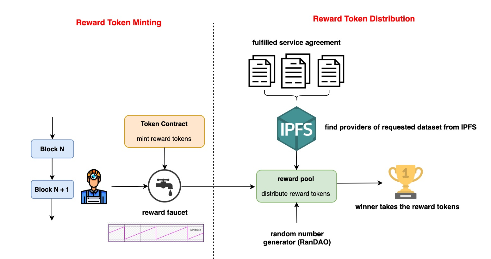
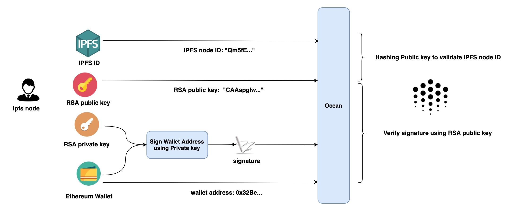
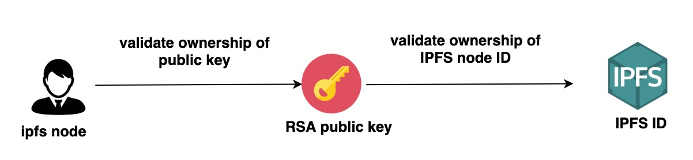

# OEP-16: Network Reward Distribution

```
shortname: 16/REWARD
name: Network Reward Distribution
type: Standard
status: Raw
version: 0.1
editor: Alex Coseru <alex@oceanprotocol.com> 
		 Fang Gong <fang@oceanprotocol.com>
		 Ahmed Ali <ahmed@oceanprotocol.com>,
		 Sebastian Gerske <sebastian@oceanprotocol.com>
```


## 1. Abstract

It is critical for Ocean network to motivate data providers to add more valuable and releavent data commons to our network. As such, the total value of the network as well as Ocean token price can increase over the time. To do so, Ocean network has reserved a partial of total token supply as the network rewards that will be distributed to providers of data commons in the Ocean network.

See [Ocean Token Design: Structure and Behavior](https://github.com/oceanprotocol/research/tree/master/17-permissionless-incentive) for more information about the Ocean token design including the incentive mechanism design.

This OEP defines the architecture, modules and interfaces for network reward distribution  in the settings of IPFS storage. This OEP is on-going work and may be updated frequently along the way.

## 2. Motivation

The main motivations of this OEP are to provide more detailed technical specifications:

* illustrate the high-level architecture to include Ocean components that need changes;
* specify the workflow to generate and distribute network rewards;
* detail the main characteristics of each different modules;
* define the attributes of interfaces between modules;
* identify the new functionalities and attributes that SHOULD be integrated.


# 3. Actors and Technical Components

* SOURCERS - Provide access to assets and/or services
* PROVIDERS - Provide storage in IPFS network and serve the download request
* CONSUMERS - Want to get access to assets and/or services
* MARKETPLACES - Store the DDO (including metadata) associated with the assets and/or services

The following technical components are involved with the publishing flow or the consumption flow:

* MARKETPLACE - Exposes a web interface allowing users to publish and purchase assets. Also facilitates the discovery of assets. An example MARKETPLACE web interface is [Pleuston](https://github.com/oceanprotocol/pleuston).
* [SQUID](https://github.com/oceanprotocol/dev-ocean/blob/master/doc/architecture/squid.md) - Software library encapsulating the Ocean Protocol business logic. It's used to interact with all the components & APIs of the system. It's currently implemented in the following packages:
  * [squid-js](https://github.com/oceanprotocol/squid-js) - JavaScript version of SQUID to be integrated with front-end applications.
  * [squid-py](https://github.com/oceanprotocol/squid-py) - Python version of SQUID to be integrated with back-end applications. The primary users are data scientists.
  * [squid-java](https://github.com/oceanprotocol/squid-java) - Java version of SQUID to be integrated with [JVM](https://en.wikipedia.org/wiki/Java_virtual_machine) applications. The primary users are data engineers.
* [KEEPER CONTRACTS](https://github.com/oceanprotocol/keeper-contracts) - Provide the Service Agreement business logic.
* [SECRET STORE](https://github.com/oceanprotocol/parity-ethereum) - Included as part of the Parity Ethereum client. Allows the PUBLISHER to encrypt the asset URL. Integrates with the SA to authorize (on-chain) the decryption of the asset URL by the CONSUMER.
* [BRIZO](https://github.com/oceanprotocol/brizo) - Microservice to be executed by PUBLISHERS. It exposes an HTTP REST API permitting access to PUBLISHER assets or additional services such as computation.
* [AQUARIUS](https://github.com/oceanprotocol/aquarius) - Microservice to be executed by MARKETPLACES. Facilitates creating, updating, deleting and searching the asset metadata registered by the PUBLISHERS. This metadata is included as part of a DDO (see [OEP-7](../7/README.md) and [OEP-8](../8/README.md)) and also includes the services associated with the asset (consumption, computation, etc.).

# 4. Work Flows

This section describes the network reward distribution workflow in details. 

## 4.1 Overall Architecture

From the high level, the workflow is illustrated as below:




* **Token Mining**:
	* every period of time, Ocean will mine new tokens as the network rewards, which will be distributed to providers as the incentive.
* **Token Distribution**:
	* Ocean queries the provider list from IPFS for all downloaded dataset;
	* One winner is randomly chosen from the list;
	* The actual reward amount is calculated according to formula as described in [V3 Network Backend Specs](https://docs.google.com/document/d/1zgf-rVW0UrAokJ2GZr_k4RKrcqgaP18Yj0aqMK16rh8/)
	* Ocean distributes the correct amount of network rewards to chosen winner. 
	* repeat the process every period of time.

To implement this workflow, some other modules are needed to be implemented or integrated, such as IFPS node registration, random number generator/Oracle network service and etc.


## 4.2 IPFS node registration

Since the IPFS network is separate from Ocean network, it is required for IPFS nodes to register their Ethereum wallet in Ocean to receive reward tokens.

However, it is must to verify the identity of IPFS nodes in order to prevent potential fradulence such as free-riding attack as mentioned before.

The registration workflow can be illustrated as below:

  

The validation logic flow is following: IPFS node needs to prove the ownership of RSA key pairs and further verify that the key pairs can be hashed to be IPFS node ID.

  

* **Generate Signature**: IPFS node needs to sign his Ethereum wallet in order to prove his ownership of the keypairs, which is created by IPFS during the `$ ipfs init` step.

	the IPFS node ID and public key can be retrieved using following command:

	```
	$ ipfs id
	{
		"ID": "QmVrZp6LR511dJ1HLJgsL7RAD1xVhH18X7nsJonxZXGA4i",
		"PublicKey": "CAASpgIwggEiMA0GCSqGSIb3DQEBAQUAA4IBDwAwggEKAoIBAQC...",
		"Addresses": null,
		"AgentVersion": "go-ipfs/0.4.22/",
		"ProtocolVersion": "ipfs/0.1.0"
	}
	```
	
	The private key is stored in `~/.ipfs/config`:
	
	```
	$ cat ~/.ipfs/config
	{
  "Identity": {
    "PeerID": "QmVrZp6LR511dJ1HLJgsL7RAD1xVhH18X7nsJonxZXGA4i",
    "PrivKey": "CAASqAkwggSkAgEAAoIBAQC9TUbcgZlonn6zvK6Z9UTiAJYw+C0B..."
  },
  "Datastore": {
    "StorageMax": "10GB",
    "StorageGCWatermark": 90,
    "GCPeriod": "1h",
	...
	}
	```
	
	Ocean shall provide a script in Javascript or Python that accept the input Ethereum wallet and generate the signature using extracted RSA key pairs from the above. The sample command line interface looks like:
	
	```
	$ python ocean-sign.py --private ~/.ipfs/config --wallet 0x5A87E2a... --out walletAddress.sig
	```
	
	The `ocean-sign.py` file may include following functions:
	
	```
	// extract the private key from the file in the path
	def load_keypairs(file_name, path)
	
	// sign wallet_address using private key
	def sign(private_key, wallet_address, hash_algorithm="SHA-256", output_file)
	```

* **verify signature**: after the signature is generated, IPFS node can send the signature, wallet_address and public key to Ocean for verification. The signature can be a string or a file to be uploaded, which may need front-end support.

	The Keeper smart contract may need functions for signature verification as:

	```
	struct IPFSnode{
		address	wallet;		// ethereum wallet address
		bool	 keypair;		// RSA key pair is verified
		bool	 id;			// IPFS ID is verified
		bytes	 ipfs_id;		// IPFS node ID
	}
	
	mapping<address => IPFSnode> nodes;
	
	function registerIPFSnode(
		bytes   signature,
		bytes	 signer,
		string	 message
	)
		public
		returns (bool success){
	}
	```
	
	The parameters passed into `registerIPFSnode` function is:
	
	* `signature`: the signature generated from IPFS by signing his Ethereum wallet address;
	* `signer`: the IPFS ndoe ID that generates the signature;
	* `message`: the Ethereum wallet address of this IPFS node.

	
* **verify IPFS node id**: After the RSA key pairs are verified, IPFS node need to prove his identity that is the IPFS node ID. In general, his RSA public key can be hashed into a multihash that should be the same as his IPFS node ID.
	
	```
	modifier onlyVerified()
    {
        require(
            nodes[msg.sender].keypair == true,
            'Keypair is not verified'
        );
        _;
    }

	function validateIPFSnode(
		string ipfs_id,
		bytes	public_key
	)
		external
		onlyVerified
		return (bool){
	}
	```
	
	The parameters are:
	
	* `ipfs_id`: the IPFS node ID that looks like `QmVrZp6L...`
	* `public_key`: the RSA public key that will be hashed into IPFS node ID.


## 4.3 Token Mining


## 4.4 Token Distribution


