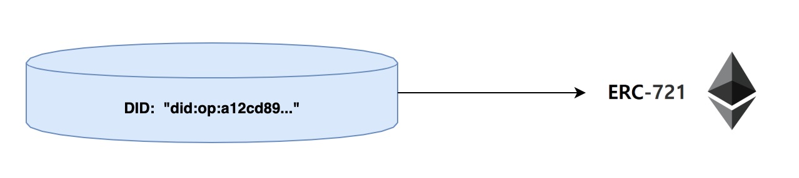
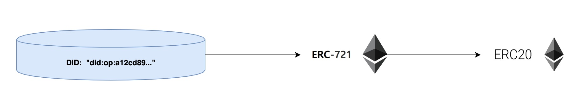

# OEP-18: Data Token

```
shortname: 18/data-token
name: development of data token for datasets
type: Standard
status: Draft
```

<!--**Table of Contents**

- [Abstract](#abstract)
- [Motivation](#motivation)
- [Specification](#specification)
  - [Publishing](#publishing)
  - [Consuming](#consuming)
- [Implementation](#implementation)
- [IPFS Node & Gateway](#ipfs-node--gateway)
- [Change Process](#change-process)
- [Language](#language)
-->
---

## Abstract

This OEP describes how to develop data tokens to tokenize the datasets in Ocean network, which enables many business opportunities such as fractional trading, shared ownership and etc.


## Motivation

Ocean network represents each dataset with a unique DID such as `did:op:xxx`, which is used to uniquely identify a specific dataset. In the meantime, users need to pay Ocean tokens (fungible ERC20 tokens) to get the access. This approach has some problems:

- one entity owns the data;
- data owner finds it difficult to prove his ownership of a specific dataset;
- user need to create a service agreement to get the access, which involves many operations and cost;
- the permission of accessing dataset cannot be transferred;

To build a better data economy, a better solution is urgently sought. In this OEP, we try to represent the access permission to each dataset as a unique ERC721 tokens (called "access token"). Moreover, a few fungible ERC20 can be minted against this ERC721 token to share the access to dataset, which can be purchased, transfered and traded.

As such, users can keep their access token in existing wallet infrastructure. Data custody becomes simple as keeping tokens in the wallet.


## Specification

* **Nonfungible Data Tokens**: it complies with ERC721 standard and uniquely represent the access permission to a specific dataset. Inside Ocean network, the ERC721 token should wrap Ocean DID as an access token.



* **Fungible Data Tokens**: it is ERC20 fungible tokens, which is binded to underlying ERC721 tokens. The total supply of ERC20 tokens is set by the data owner. If there is available ERC20 tokens, users can pay Ocean tokens to purchase.



## Implementation

* **Create ERC721 token**: When data owner register a new dataset with Ocean, a unique DID is created and a unique non-fungible token (ERC721) can be minted. The data owner is the initial owner of this ERC721 token.

```Solidity
// dataset DID -> NFT token address
mapping (bytes32 => address) public nftAddress;

// create NFT token for dataset
function createNFT(
    bytes32 did,
    string memory name,
    string memory symbol
)
    public
    returns (bool success)
{
    
   ...
	ERC721Token _token = new ERC721Token(name, symbol);
	nftAddress[did] = _token.address;
	...
}
```

* **Create ERC20 token**: Once the ERC721 token is minted, data owner can decide the number of fungible ERC20 tokens can be further created and the price as well. User can pay Ocean tokens to purchase the ERC20 token for this specific dataset.

```Solidity
// non-fungible-token address => underlying fungible token address
mapping (address => address) public ftAddress;
	
// non-fungible-token => number of underlying fungible tokens
mapping (address => uint256) public ftAmount;
	
// create fungible tokens for NFT
function createFT(
	string name, 
	string symbol,
	uint256 decimals,
	address owner,
	address nftAddress,
	uint256 supply
) 
	public
	return (address) {
	
	...
	ERC20Token _token = new ERC20Token(name, symbol, supply);
	ftAddress[nftAddress] = _token.address;
	ftAmount[_token.address] = supply;
	...
};
```

## Change Process

This document is governed by [1/C4](../1/README.md) and  [2/COSS](../2/README.md).

## Language

The key words "MUST", "MUST NOT", "REQUIRED", "SHALL", "SHALL NOT", 
"SHOULD", "SHOULD NOT", "RECOMMENDED", "NOT RECOMMENDED", "MAY", and 
"OPTIONAL" in this document are to be interpreted as described in 
[BCP 14](https://tools.ietf.org/html/bcp14) 
\[[RFC2119](https://tools.ietf.org/html/rfc2119)\] 
\[[RFC8174](https://tools.ietf.org/html/rfc8174)\] when, and only when, 
they appear in all capitals, as shown here.
