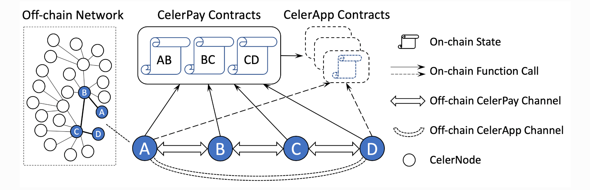
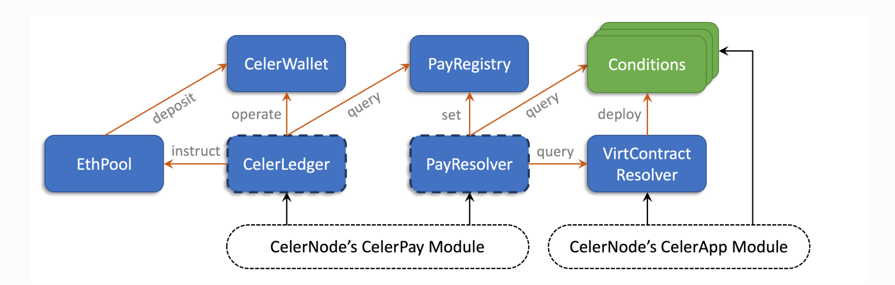
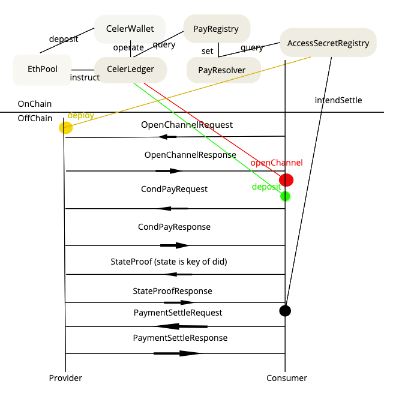
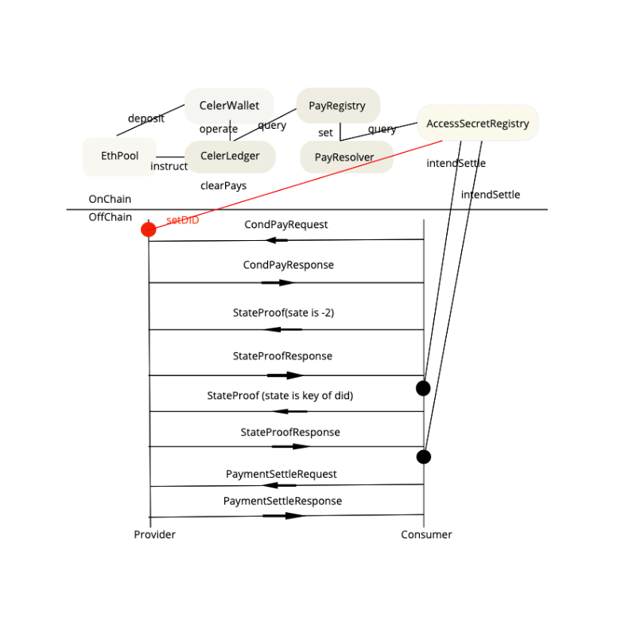
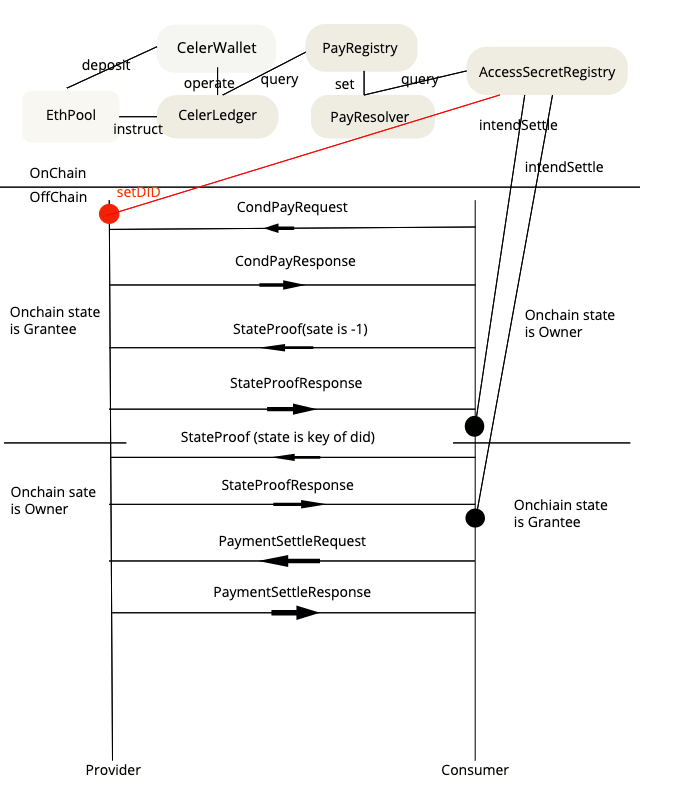

```text
shortname: 19/Layer2 (State Channel)
name: Off-chain verification and validation of conditions
type: Standard
status: Raw
version: 0.1
editor: Tatsuki Hashimoto <hashimoto19980924@gmail.com>
```
**Table of Contents**
<!--ts-->
 * [Abstract](#abstract)
 * [Language](#language)
 * [Change Process](#change-process)
 * [Motivation](#motivation)
 * [Design Requirements](#design-requirements)
 * [Introduction](#introduction)
 * [Actors and Technical Components](#actors-and-technical-components)
 * [Flows](#flows)
	* [When PUBLISHERS and CONSUMERS contract for the first time and CONSUMERS and PUBLISHERS is cooperative](#when-publishers-and-consumers-contract-for-the-first-time-and-consumers-and-publishers-is-cooperative)
	* [When PUBLISHERS are motivated to dispute the payment in case of uncooperative behaviors of CONSUMERS](#when-publishers-are-motivated-to-dispute-the-payment-in-case-of-uncooperative-behaviours-of-consumers)
	* [When CONSUMERS is uncooperative after payment is resolved on-chain](#when-consumers-is-uncooperative-after-payment-is-resolved-on-chain)
	* [When PUBLISHERS and CONSUMERS want to contract another did document](#when-publishers-and-consumers-want-to-contract-another-did-document)
	* [When PUBLISHERS and CONSUMERS want to swap positions](#when-publishers-and-consumers-want-to-swap-positions)
 * [Backwards Compatibility](#backwards-compatibility)
 * [Prototype](#prototype)
 * [Reference](#reference)

<!--te-->

---

## Abstract
The global ledger works as a “single global truth”, which means that all transactions between network participants are recorded on the same global ledger and requiring everyone to synchronize with everyone else reduces the maximum throughput of the network as a whole. 
Propose off chain verification and validation of conditions to solve this structual problem.


# Language
The key words "MUST", "MUST NOT", "REQUIRED", "SHALL", "SHALL NOT", "SHOULD", "SHOULD NOT", "RECOMMENDED", "NOT RECOMMENDED", "MAY", and "OPTIONAL" in this document are to be interpreted as described in [BCP 14](https://tools.ietf.org/html/bcp14) \[[RFC2119](https://tools.ietf.org/html/rfc2119)\] \[[RFC8174](https://tools.ietf.org/html/rfc8174)\] when, and only when, they appear in all capitals, as shown here.

## Change Process
This document is governed by 1/C4 and 2/COSS.

## Motivation
The main motivation of this OEP are:
* Evolve OEP11 to more scalable and instant finality
* Understand Layer2 and state channel
* Understand how shift some work to “Layer2” (state channel) and flow
* Integrate [squid-js](https://github.com/oceanprotocol/squid-js/tree/master/src) with [celer-light-client](https://github.com/celer-network/celer-light-client).

## Design Requirements
Ocean’s on-chain access control SHOULD provide the following responsibilities:
* Verifiable On-chain Access Control.
* Off-chain verification and validation of conditions.
* Accountability (bad actors abusing the system)

## Introduction
In this section, I explain Layer2(state channel) and conditional payment.
Layer2 is scaling solution. Layer1 is used for what Layer1 is good at: achieving　immutable, unanimous consensus based on a clearly defined set of rules. Layer1 is the judge and jury, and it is far more efficient to use it to retroactively handle claims that the law has not been followed than to proactively oversee everything to ensure that law is always followed. Processing disputes for all unsuccessful transaction is cheaper than processing all successful transactions.
Layer1 is used as judge and jury and we need to define a clear set of laws that it will use to make rulings on claims. For state channel, a valid exitable state can be defined in English as “The most recent mutually-signed state of a channel.” To make this statement evaluable by a general purpose judge, a valid exit claim for party A to exit state channel C, and update its Layer1 state to match the state of Layer2, contains two assertions:
	
	1. Message M with State S, for channel C has been signed by all channel participants.
	
	2. There exists no Message M’ for channel C such that M’ has a higher nonce than M and M’ is signed by all channel participants.

If such a claim is made, 2 possible scenarios can result:
	
	1.  The claim is validated by the dispute period lapsing without a valid challenge.
	
	2.  The claim is invalidated during the dispute period if either of the following happen.
		a) The L1 contract evaluates message M and determines that it is not signed by all participants of channel C.
		b) The L1 contract receives, from any party, a message M’ that disproves the claim that such a message doesn’t.
The logic to evaluate such claims must be present in the Layer1
contract.

## Actors and Technical Components
* PUBLISHERS - Provide access to assets and/or services
* CONSUMERS - Want to get access to assets and/or services

* MARKETPLACE - Exposes a web interface allowing users to publish and purchase assets. Also facilitates the discovery of assets. An example MARKETPLACE web interface is [Pleuston](https://github.com/oceanprotocol/pleuston).
* [SQUID](https://github.com/oceanprotocol/dev-ocean/blob/master/doc/architecture/squid.md) - Software library encapsulating the Ocean Protocol business logic. It's used to interact with all the components & APIs of the system. It's currently implemented in the following packages:
  * [squid-js](https://github.com/oceanprotocol/squid-js) - JavaScript version of SQUID to be integrated with front-end applications.
 	 * [celer-light-client](https://github.com/celer-network/celer-light-client) - Typescript implementation of a Celer client capable of sending and receiving conditional payments via state channels. 
  * [squid-py](https://github.com/oceanprotocol/squid-py) - Python version of SQUID to be integrated with back-end applications. The primary users are data scientists.
  * [squid-java](https://github.com/oceanprotocol/squid-java) - Java version of SQUID to be integrated with [JVM](https://en.wikipedia.org/wiki/Java_virtual_machine) applications. The primary users are data engineers.
* [cChannel-eth](https://github.com/thashimoto1998/keeper-layer2/tree/master/contracts/cChannel-eth) - It includes a collection of smart contracts acting as the binding of core CelerPay abstractions and supporting modules. CelerPay smart contracts only specify the interaction logic of two peers.
* [keeper-layer2](https://github.com/thashimoto1998/keeper-layer2/tree/master/contracts/keeper-layer2) - Provide set of laws that it will use to make rulings on claims, did document register logic and check permission logic.
* [SECRET STORE](https://github.com/oceanprotocol/parity-ethereum) - Included as part of the Parity Ethereum client. Allows the PUBLISHER to encrypt the asset URL. Integrates with the SA to authorize (on-chain) the decryption of the asset URL by the CONSUMER.
* [BRIZO](https://github.com/oceanprotocol/brizo) - Microservice to be executed by PUBLISHERS. It exposes an HTTP REST API permitting access to PUBLISHER assets or additional services such as computation.
* [AQUARIUS](https://github.com/oceanprotocol/aquarius) - Microservice to be executed by MARKETPLACES. Facilitates creating, updating, deleting and searching the asset metadata registered by the PUBLISHERS. This metadata is included as part of a DDO (see [OEP-7](../7/README.md) and [OEP-8](../8/README.md)) and also includes the services associated with the asset (consumption, computation, etc.).


**System Architecture**
Celer Channel is conditional payment.  There are three key components in the system: CelerPay, CelerApp, and CelerNode.

**CelerPay** is a generalized payment network that supports efficient off-chain token transfer with the capability to resolve arbitrary conditional dependency on on-chain verifiable states. It consists of a set of on-chain smart contracts and off-chain communication protocols. The shared smart contracts maintain the minimum required on-chain states for each pair of channel peers. The off-chain protocols specify how peers update and exchange off-chain states, and when to make the rare on-chain function calls. CelerPay channels are the edges connecting the state channel network. 

**CelerApp** are generic state channels that can express any application logic. They expose the standard query APIs required by CelerPay, so that payment conditions can be based on CelerApp outcomes. Dashed lines in the figure above indicate CelerApp could be virtual modules. An app contract can be either initially deployed once by the developer and shared by all the future players.

**CelerNodes** are the endpoints that run the state channel protocol of CelerPay and CelerApps. A node can join the state channel network by setting up a CelerPay channel with another node in the network. Once the CelerNode joins the network, it can send off-chain payments to any other nodes in the network. 

＊CelerPay and CelerApp are loosely connected through the simple conditional dependency interface. This allow CelerPay use cases to go significantly beyond state channel applications, because off-chain conditional payment sent through the CelerPay network can be resolved as long as there is an on-chain verifiable conditional state.  Sending a conditional payment with dependency on an outcome from an on-chain oracle.

**Protobuf Messages**
Celer components at different platforms need to support the same set of protobuf messages, which can be categorized into four groups:
[chain.proto](https://github.com/celer-network/cChannel-eth/blob/master/contracts/lib/data/proto/chain.proto) is used only for interactions with CelerPay on-chain smart contracts.
[entity.proto](https://github.com/celer-network/cChannel-eth/blob/master/contracts/lib/data/proto/entity.proto) has CelerPay core data structures for both on-chain and off-chain communications.
[app.proto](https://github.com/celer-network/cApps-eth/blob/master/contracts/lib/proto/app.proto) is used for CelerApp on-chain and off-chain communications.

**Contracts Architecture**


White dashed modules at the boatman are user-offchain components. Each colored rectangle is an individual on-chain contract. Blue modules are CelerPay contracts (ones with dashed border are upgradable); green modules are external arbitrary condition contracts; orange arrows are external function calls (with single word functionality summaries) among contracts; black arrows are external function calls from CelerNodes (off-chain users).

**CelerWallet**
The CelerWallet contract keeps the multi-owner and multi-token wallets for all the payment channels. CelerWallet only holds tokens for the channel peers without any complicated payment channel logics, which are programmed in the CelerLedger contract. Is is extremely robust and safe due to its simplicity. Payment channel peers (CelerNodes) do not directly interact with the CelerWallet contract to operate their funds, but the wallet operator: the CelerLedger contract, which we describe below.

**CelerLedger**
CelerLedger is central of all CelerPay contracts, and the entry point of most of the on-[chain user operations](https://www.celer.network/docs/celercore/channel/pay_contracts.html#channel-operations). It defines the CelerPay on-chain state machine, maintains the core logic of a payment channel, acts as the operator of CelerWallet to operate on the token assets, and expose a rich set of (APIs)[https://github.com/celer-network/cChannel-eth/blob/master/contracts/lib/interface/ICelerLedger.sol] for users (channel peers) to manage the payment channels. CelerLedger calls the external functions of three contracts when executing its logic:
* To CelerWallet: operation on CelerWallet to deposit/withdraw funds, or transfer operatorship.
* To EthPool: transfer ETH to CelerWallet, enable the single-transaction channel opening.
* To PayRegistry: query about the resolved payment amount when settling a channel.

**PayResolver**
PayResolver defines the payment resolving logic. It exposes two [APIs](https://github.com/celer-network/cChannel-eth/blob/master/contracts/lib/interface/IPayResolver.sol) to let a CelerNode resolve a payment on-chain if it cannot clear the payment off-chain with its channel peer cooperatively. PayResolver call external functions of other contracts when executing its logic:
* To PayRegistry: set the resolved payment amount in the global payment information registry.
* To Conditions: query the condition outcomes when computing the payment finalized amount.

**PayRegistry**
PayRegistry is the global registry to store the resolved amount of all payments. It exposes simple [APIs](https://github.com/celer-network/cChannel-eth/blob/master/contracts/lib/interface/IPayRegistry.sol) for anyone to set a payment result indexed by the payment ID. PayRegistry calculates the payment ID as `payID = Hash(Hash(pay), setterAddress)`, where setter is usually the PayResolver. In this way, each payment’s result can only be set int the registry by its self-specified resolver contract (field 8 of the [ConditionalPay message](https://www.celer.network/docs/celercore/channel/pay_contracts.html#conditional-payment). A payment result becomes immutable and publicly available once it is finalized on the PayRegistry. Then all channels that have the payment in pending status can use the result from the registry to clear the payment either off-chain or on-chain.

**EthPool**
EthPool is a simple ETH wallet contract that provides ERC-20-like APIs for ETH, and an additional API to make ETH deposit into CelerPay more flexible and efficient. EthPool enables the single-transaction channel opening feature of CelerPay.

**Conditions**
Conditions are not part of the CelerPay contracts, but external [CelerApp](https://www.celer.network/docs/celercore/channel/app.html) contracts for the PayResolver to query through `isFinalized()` and `getOutcome()` APIs when resolving  payments. A condition contract can be an initially on-chain deployed-contract.


## Flows
This section describes detail flow. 

＊At present,this proposal correspond to only SEA of did document(not correspond to computing service)


## When PUBLISHERS and CONSUMERS contract for the first time and CONSUMERS and PUBLISHERS is cooperative.
	

	
**Deploy**
DID PUBLISHERS deploy AccessSecretRegistry.sol. This contract is used for on-chain oracle. Sending a conditional payment with dependency on an outcome from this smart contract. Outcome is `isFinalized()` and `getOutcome()`. When `IsFinalized()` and `getOutcome()` is true, PUBLISHERS can get token. Access agreement outcome is `checkPermissions()`. When `checkPermissions()` is true, CONSUMERS can access document .


**Open Channel**
The CelerLedger contract expose an `openChannel()` API which allows a funded payment channel to be open a single transaction. The API takes a single input, which is the channel peer co-signed payment channel initializer message. Once the CelerLedger contract receives a valid open channel request, it will execute the following operations in a single transaction:
	1. Create a wallet in the CelerWallet contract and use the returned wallet ID as the channel ID, which is computed as 
    `Hash(walletAddress, ledgerAddress, Hash(channelInitializer))`.
	2. Initialize the channel state in the CelerLedger contract.
    3. Accept the blockchain native tokens (ETH) sent along with the transaction request, and transfer tokens from the peer’s approved token pools (e.g.EthPool or ERC20 contracts) to the CelerWallet according to the requested initial distribution Amounts.

**Send Conditional Payment**
Sending a conditional payment is essentially creating a new co-signed [simplex channel state](https://www.celer.network/docs/celercore/channel/pay_contracts.html#simplex-channel-state) to add a new entry in the pending payId list (field 5) and update other related fields. Two off-chain messages(`CondPayRequest` and `CondPayResponse`) in one round trip are involved during the process. `CondPayRequest` is the single-hop message sent by the peer who wants to send or forward the conditional payment. It mainly consists of the following information:
Payment data: the immutable [conditional payment](https://www.celer.network/docs/celercore/channel/pay_contracts.html#conditional-payment) message set by the payment source.
New one-sig state: the new [simplex state](https://www.celer.network/docs/celercore/channel/pay_contracts.html#simplex-channel-state) with the signature of peer_from. The new state should have a higher sequence number, new pending payId list (field 5) that includes the  new conditional payment ID, and updated channel metadata(field 6 and field 7).
Base seq: the sequence number of the previous simplex state on which this new state is based.
Pay note: a payment note with `google.protobuf.Any` type that can describe any information which might be useful for off-chain communication.
`CondPayResponse` is the replied message from receiving peer after checking the validity of every data field in the request. The response consists of two fields:
Co-Signed state: the latest co-signed [simplex state](https://www.celer.network/docs/celercore/channel/pay_contracts.html#simplex-channel-state). This sate should be the same as the state in the `CondPayRequest` if the request is valid. Otherwise (e.g. invalid sequence number due to packet loss), the latest co-signed state stored by the receiving peer is replied to the peer_from to help failure recovery (e.g., resending lost previous request).
Error: an optional error message with the error reason and the sequence number of the errored request. The peer_from sender is responsible for remembering and funding out the sent request based on the NACked sequence number.

**Send State Proof Request(state is key of did)**
Sending a [StateProof](https://github.com/celer-network/cApps-eth/blob/master/contracts/lib/proto/app.proto) is essentially creating a new consigned state.
It mainly consists of the following information:
New one-sig state: the new state with the signature of peer_from. The new state should have a higher sequence number. state is key of `didList (did(bytes32)=> key(uint8))`.
seq: the sequence number of the previous state on which this new state is based.
`StateProofResponse` is the replied message from receiving peer after checking the validity of every data field in the request. The response consists of two fields:
Co-Signed state: the latest co-signed state.
Error: an optional error message with the error reason and the sequence number of the errors request. 
**intendSettle(state is key of did)**
Submit and settle off-chain state to update state according to an off-chain state proof. Outcome `isFinalized()`, `getOutcome()` and `checkPermissions()` will be true after checking validity (co-signed, state is valid).

**Settle Conditional Payment**
After a conditional payment is successfully setup, two peers can cooperatively settle the payment off-chain once the condition outcomes are finalized. Settling a conditional payment is essentially creating a new co-signed [simplex channel state](https://www.celer.network/docs/celercore/channel/pay_contracts.html#simplex-channel-state) to remove an entry from the pending payId list (field 5) and update the transferred amount(field 4) and other related fields. Three off-chain messages(`PaymentSettleRequest`, `PaymentSettleResponse`, and `PaymentSettleProof`)
`PaymentSettleRequest` is the single-hop message sent by peer_from side of the channel to clear a payment. It mainly consists of the following information:
Payments to be settled: a list if payment IDs to be settled, their settle reasons(e.g. fully paid, expired, rejected, on-chain resolved), and the settled amounts.
New one-sig state: the new [simplex state](https://www.celer.network/docs/celercore/channel/pay_contracts.html#simplex-channel-state) with the signature of peer_from. The new state should have a higher sequence number (field 3), new pending payId list  (field 5) that removes the IDs of settled payments, and updated transferred amount (field 4) and total pending amount (field 7).
Base seq: the sequence number of the previous simplex state on which this new state is based.
`PaymentSettleResponse` is the replied message from the receiving peer after checking the validity of the request. It has the two fields with the `CondPayResponse` described above: a co-signed simplex state, and an optional error message.

## When PUBLISHERS are motivated to dispute the payment in case of uncooperative behaviors of CONSUMERS.


 In detail, when CONSUMERS doesn’t send PaymentSettleRequest after `intendSettle()`to AccessSecretRegistry.sol or `PaymentSettleRequest` is not expected.

**Resolve Payment by Condition**
If not receive the settlement as expected, PUBLISHERS can choose to submit an on-chain transaction to resolve the payment by conditions once conditions of a payment are finalized on-chain. `resolvePaymentByConditions()` API input consists of two pieces of information: 1) the full conditional payment data and 2) all hash preimgaes fo the hash locks associated with the payment. Then the PayResolver will verify the hash preimages, query the conditions outcomes, then compute and set the payment result in the PayRegistry. PUBLISHERS should send the `PaymentSettleProof` message to the CONSUMERS to ask for the settlement. `PaymentSettleProof` is used by the receiving peer to initiating a settlement process. After payment is resolved on-chain and CONSUMERS will be cooperative, CONSUMERS send valid `PaymentSettleRequest` and PUBLISHERS return `PaymentSettleResponse`.

## When CONSUMERS is uncooperative after payment is resolved on-chain.


Settle/Close the payment channel
If cooperative settling is not possible, PUBLISHERS can initiate a unilateral settling by calling the `intendSettle()` API, which takes the co-signed off-chain simplex states as input. The CelerLedger contract will compute the settled balance distributions based on the simplex states and the results pf pending payments queried from the PayRegistry.
A challenge time window is opened after the unilateral settle request, for the other peer to submit simplex channel states with higher sequence numbers if exists. After the challenge window is closed, one can call the `confirmSettle()` API to finish the operation and close the channel.

## When PUBLISHERS and CONSUMERS want to contract another did document.



REQUIREMENT: The security assumption of the applications on which conditional payments depend so we should not update `isFinalized()` and `getOutcome()` unintentionally.

Set another DID.
PUBLISHERS call `setDID()` to AccessSecretRegistry to set another DID.

Send State Proof Request (state is -2)
When CONSUMERS `intendSettle()`(state is -2) to AccessSecretRegistry.sol, `AppStatus.FINALIZED -> APPStatus.IDLE`

## When PUBLISHERS and CONSUMERS want to swap positions.



REQUIREMENT: The security assumption of the applications on which conditional payments depend so we should not update `isFinalized()` and `getOutcome()` unintentionally.

Send State Proof Request (state is -1)
When CONSUMERS `intendSettle()` (state is -1) to AccessSecretRegistry.sol, owner <-swap-> grantee.

## Backwards Compatibility
Compatible
* Publishing
* Constructing an Asset DDO
* Encryption and Decryption

Not compatible
* Verification and valiation of condition.
* Consuming

[celer-light-client](https://github.com/celer-network/celer-light-client) abstract logic(off-chain verification and validation of condition, allocate token) so I don't think there's many code to write from scratch.


## Prototype
This is smart contract prototype.
[keeper-layer2](https://github.com/thashimoto1998/keeper-layer2)

## Reference
* [OEP11](https://github.com/oceanprotocol/OEPs/tree/master/11/v0.2)
* [CelerCore](https://www.celer.network/docs/celercore/index.html)
* [The OVM ❤️s Your Scaling Solution: State Channel Edition](https://medium.com/plasma-group/the-ovm-%EF%B8%8Fs-your-scaling-solution-state-channel-edition-ed13de56e249)
