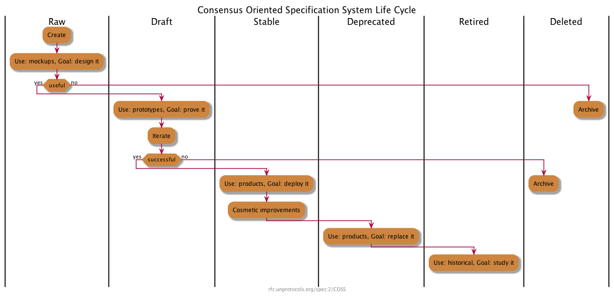

```
shortname: 2/COSS
name: Consensus-Oriented Specification System
type: Meta
status: Draft
editor: Dimitri De Jonghe <dimi@oceanprotocol.com>
contributors: -
```

This document describes a consensus-oriented specification system (COSS) for building interoperable technical specifications. COSS is based on a lightweight editorial process that seeks to engage the widest possible range of interested parties and move rapidly to consensus through working code.

This specification is based on [unprotocols.org 2/COSS](https://rfc.unprotocols.org/spec:2/COSS/), on [BEP2/COSS](https://github.com/bigchaindb/BEPs/tree/master/2) and on [EIP1 - EIP Purpose and Guidelines](https://github.com/ethereum/EIPs/blob/master/EIPS/eip-1.md).

## Change Process
This document is governed by the [2/COSS](../2/README.md) (COSS).

## Language
The key words "MUST", "MUST NOT", "REQUIRED", "SHALL", "SHALL NOT", "SHOULD", "SHOULD NOT", "RECOMMENDED", "NOT RECOMMENDED", "MAY", and "OPTIONAL" in this document are to be interpreted as described in [BCP 14](https://tools.ietf.org/html/bcp14) \[[RFC2119](https://tools.ietf.org/html/rfc2119)\] \[[RFC8174](https://tools.ietf.org/html/rfc8174)\] when, and only when, they appear in all capitals, as shown here.

## Goals
The primary goal of COSS is to facilitate the process of writing, proving, and improving new technical specifications. A "technical specification" defines a protocol, a process, an API, a use of language, a methodology, or any other aspect of a technical environment that can usefully be documented for the purposes of technical or social interoperability.

A OceanProtocol specification is called **O**ceanProtocol **E**nhancement **P**roposal, **OEP** henceforth.

COSS is intended to above all be economical and rapid, so that it is useful to small teams with little time to spend on more formal processes.

Principles:

* We aim for rough consensus and running code.
* OEPs are small pieces, made by small teams.
* OEPs should have a clearly responsible editor.
* The process should be visible, objective, and accessible to anyone.
* The process should clearly separate experiments from solutions.
* The process should allow deprecation of old OEPs.

OEPs should take minutes to explain, hours to design, days to write, weeks to prove, months to become mature, and years to replace.

OEPs have no special status except that accorded by the community.

The author of the OEP is responsible for building consensus within the community and documenting dissenting opinions.

## Architecture

### Types of OEP
There are three types of OEPs:
* A **Standard Track OEP** describes any change to network protocols, transaction validity rules, proposed application standards/conventions, or any change or addition that affects the interoperability of applications using OceanProtocol products.
* An **Informational OEP** describes a OceanProtocol design issue, or provides general guidelines or information to the OceanProtocol community, but does not propose a new feature. Informational OEPs do not necessarily represent OceanProtocol community consensus or a recommendation, so users and implementers are free to ignore Informational OEPs or follow their advice.
* A **Meta OEP** describes a process surrounding OceanProtocol or proposes a change to a process.

### OEP Format
A OEP is a set of Markdown documents (the main file SHOULD be called `README.md`), together with comments, attached files, and other resources. A OEP is identified by its number and short name (e.g. this OEP is **2/COSS**). The number of the OEP is also the name of the directory where its files are stored.

Every OEP (including branches) carries a different number. New versions of the same OEP have new numbers.

### OEP template
Each OEP MUST customize and include this header:
````
```
shortname: [number/shortname]
name: [Full name of the OEP]
type: [standard | informational | meta ]
status: [raw | draft | stable | deprecated | retired | deleted]
editor: [Editor Name <email address>]
contributors: [Optional Contributor 1 <email address>, ..., Optional Contributor N <email address>]
```
````
_Note: the `number` is assigned after a OEP has been submitted._

Each OEP SHOULD include the following sections:

1. **Abstract**. The abstract is a short (~200 word) description of the technical issue being addressed.

1. **Motivation**. The motivation is critical for OEPs that want to change the OceanProtocol protocol. It should clearly explain why the existing protocol OEP is inadequate to address the problem that the OEP solves. OEP submissions without sufficient motivation may be rejected outright.

1. **Specification**: The technical specification should describe the syntax and semantics of any new feature. The specification should be detailed enough to allow competing, interoperable implementations. It MAY describe the impact on data models, API endpoints, security, performance, end users, deployment, documentation, and testing.

1. **Rationale**. The rationale fleshes out the specification by describing what motivated the design and why particular design decisions were made. It should describe alternate designs that were considered and related work, e.g. how the feature is supported in other languages. The rationale may also provide evidence of consensus within the community, and should discuss important objections or concerns raised during discussion.

1. **Backwards Compatibility**. All OEPs that introduce backwards incompatibilities must include a section describing these incompatibilities and their severity. The OEP must explain how the author proposes to deal with these incompatibilities. OEP submissions without a sufficient backwards compatibility treatise may be rejected outright.

1. **Implementation**. The implementations must be completed before any OEP is given status "stable", but it need not be completed before the OEP is accepted. While there is merit to the approach of reaching consensus on the OEP and rationale before writing code, the principle of "rough consensus and running code" is still useful when it comes to resolving many discussions of API details.

1. **Copyright Waiver**. Except for 1/C4 and 2/COSS, all OEPs MUST be released to the public domain. The following waiver SHOULD be used: _To the extent possible under law, the person who associated CC0 with this work has waived all copyright and related or neighboring rights to this work._


## COSS Lifecycle
Every OEP has an independent lifecycle that documents clearly its current status.

A OEP has six possible states that reflect its maturity and contractual weight:



### Raw OEPs
All new OEPs are **raw** OEPs. Changes to raw OEPs can be unilateral and arbitrary. Those seeking to implement a raw OEP should ask for it to be made a draft OEP. Raw OEPs have no contractual weight.

### Draft OEPs
When raw OEPs can be demonstrated with a fully working and tested reference implementation, they become **draft** OEPs. Changes to draft OEPs should be done in consultation with users. Draft OEPs are contracts between the editors and implementers.

### Stable OEPs
When draft OEPs are used by third parties, they become **stable** OEPs. Changes to stable OEPs should be restricted to cosmetic ones, errata and clarifications. Stable OEPs are contracts between editors, implementers, and end-users.

### Deprecated OEPs
When stable OEPs are replaced by newer draft OEPs, they become **deprecated** OEPs. Deprecated OEPs should not be changed except to indicate their replacements, if any. Deprecated OEPs are contracts between editors, implementers and end-users.

### Retired OEPs
When deprecated OEPs are no longer used in products, they become **retired** OEPs. Retired OEPs are part of the historical record. They should not be changed except to indicate their replacements, if any. Retired OEPs have no contractual weight.

### Deleted OEPs
Deleted OEPs are those that have not reached maturity (stable) and were discarded. They should not be used and are only kept for their historical
value. Only Raw and Draft OEPs can be deleted.

## Editorial control
A OEP MUST have a single responsible editor, the only person
who SHALL change the status of the OEP through the lifecycle stages.

A OEP MAY also have additional contributors who contribute changes to it. It is RECOMMENDED to use the [C4 process](../1/README.md) to maximize the scale and diversity of contributions.

The editor is responsible for accurately maintaining the state of OEPs and for handling all comments on the OEP.

## Branching and Merging
Any member of the domain MAY branch a OEP at any point. This is done by copying the existing text, and creating a new OEP with the same name and content, but a new number. The ability to branch a OEP is necessary in these circumstances:

* To change the responsible editor for a OEP, with or without the cooperation of the current responsible editor.
* To rejuvenate a OEP that is stable but needs functional changes. This is the proper way to make a new version of a OEP that is in stable or deprecated status.
* To resolve disputes between different technical opinions.

The responsible editor of a branched OEP is the person who makes the branch.

Branches, including added contributions, SHOULD be dedicated to the public domain using CC0 (just like the original OEP). This means that contributors are guaranteed the right to merge changes made in branches back into their original OEPs.

Technically speaking, a branch is a *different* OEP, even if it carries the same name. Branches have no special status except that accorded by the community.

## Conflict resolution
COSS resolves natural conflicts between teams and vendors by allowing anyone to define a new OEP. There is no editorial control process except that practised by the editor of a new OEP. The administrators of a domain (moderators) may choose to interfere in editorial conflicts, and may suspend or ban individuals for behaviour they consider inappropriate.

## Conventions
Where possible editors and contributors are encouraged to:

* Refer to and build on existing work when possible, especially IETF specifications.
* Contribute to existing OEPs rather than reinvent their own.
* Use collaborative branching and merging as a tool for experimentation.

## License
Copyright (c) 2008-16 Yurii Rashkovskii <yrashk@gmail.com>, Pieter Hintjens <ph@imatix.com>, André Rebentisch <andre@openstandards.de>, Alberto Barrionuevo <abarrio@opentia.es>, Chris Puttick <chris.puttick@thehumanjourney.net>
Copyright (c) 2018 BigchainDB GmbH
Copyright (c) 2018 OceanProtocol Foundation

This OEP is free software; you can redistribute it and/or modify it under the terms of the GNU General Public License as published by the Free Software Foundation; either version 3 of the License, or (at your option) any later version.

This OEP is distributed in the hope that it will be useful, but WITHOUT ANY WARRANTY; without even the implied warranty of MERCHANTABILITY or FITNESS FOR A PARTICULAR PURPOSE. See the GNU General Public License for more details.

You should have received a copy of the GNU General Public License along with this program; if not, see http://www.gnu.org/licenses.
