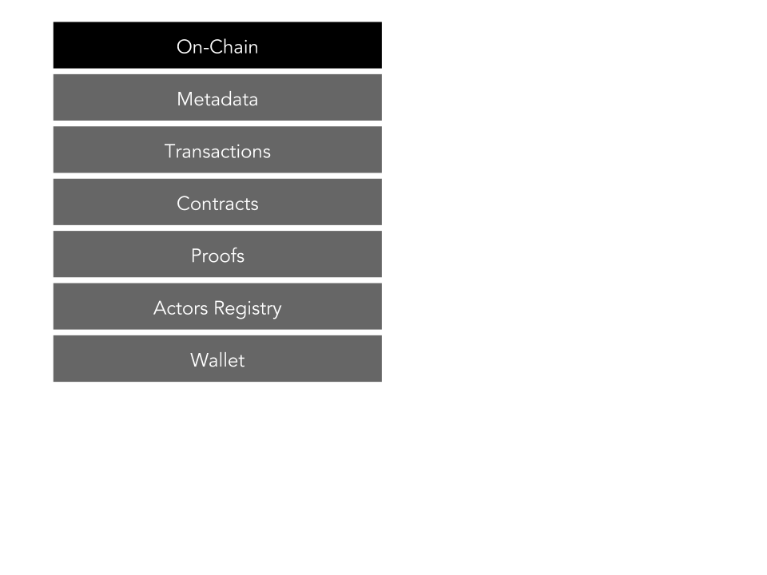
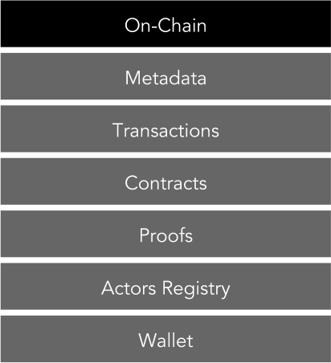
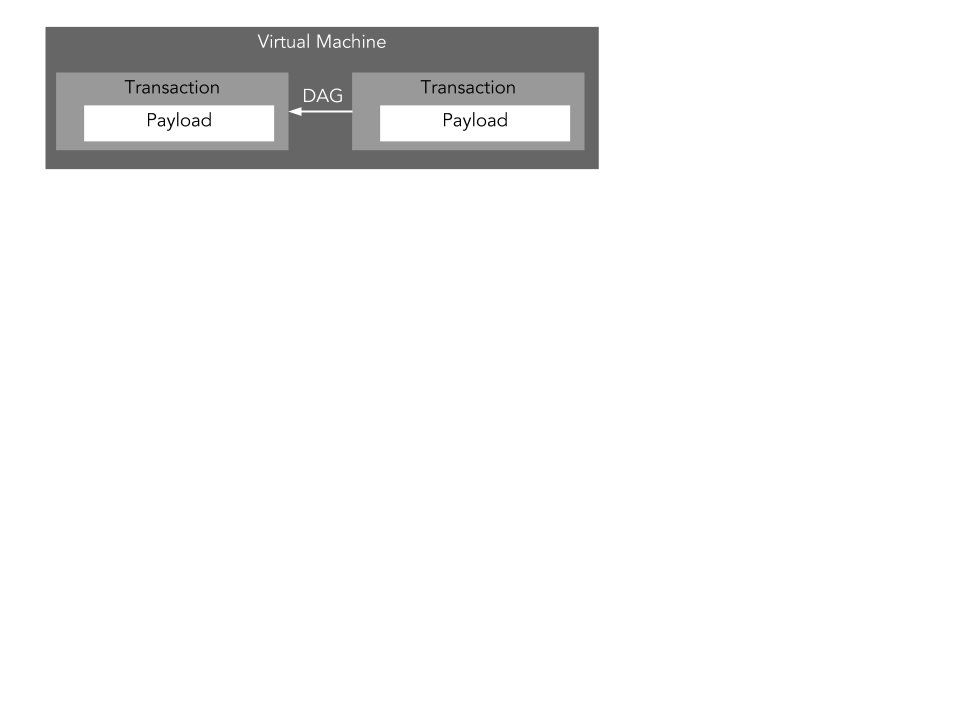
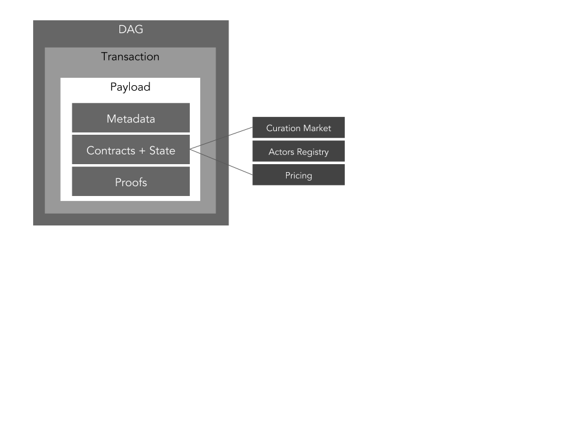
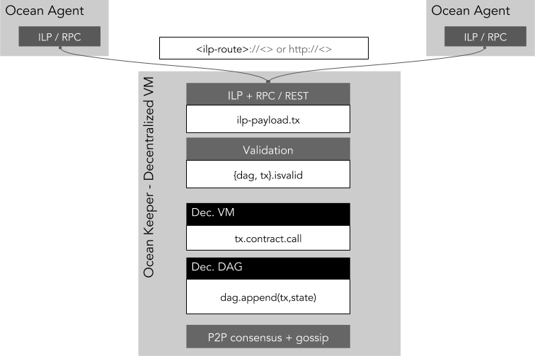
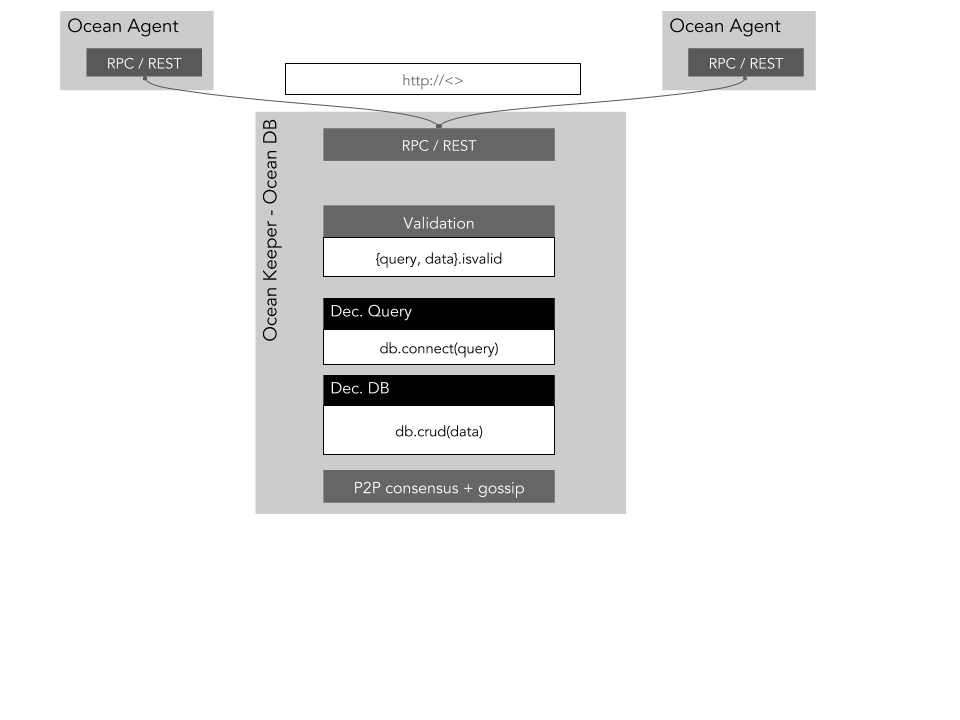

```
shortname: 3/ARCH
name: Ocean Protocol Architecture
type: Standard
status: Raw
editor: Aitor Argomaniz <aitor@oceanprotocol.com>
contributors: Dimitri De Jonghe <dimi@oceanprotocol.com>
```

This document describes the Ocean Architecture. 
It focus in which are the main responsibilities, functions and components implementing the architecture.

This specification is based on [Ocean Protocol technical whitepaper](https://github.com/oceanprotocol/whitepaper).

This specification is called **ARCH** henceforth.


## Change Process
This document is governed by the [2/COSS](../2/README.md) (COSS).

## Language
The key words "MUST", "MUST NOT", "REQUIRED", "SHALL", "SHALL NOT", "SHOULD", "SHOULD NOT", "RECOMMENDED", "NOT RECOMMENDED", "MAY", and "OPTIONAL" in this document are to be interpreted as described in [BCP 14](https://tools.ietf.org/html/bcp14) \[[RFC2119](https://tools.ietf.org/html/rfc2119)\] \[[RFC8174](https://tools.ietf.org/html/rfc8174)\] when, and only when, they appear in all capitals, as shown here.

# Ocean Protocol Architecture

Ocean Protocol connects data service PROVIDERS with CONSUMERS using 
contractual agreements to ensure payments, audit trails and privacy.

The ARCH covers a conceptual framework for provisioning contractual CONNECTIONS,
an overview of the Ocean Network architecture and it's building blocks,
as well as a suite of protocols that implements the design. 

This document MUST to provide a common framework used describing 
the technical solution to put in place. 

## Motivation

All the different components described SHOULD be used as building blocks, 
allowing to compose the different scenarios using them.

The ARCH it's based in a **contract-centric** architecture approach. 
A contract is the interface between clients and the consensus engine.

One of the main responsibilities of a contract is to 
lock up funds and have means to resolve the transfer of funds by verification of proofs. 
The contract is generic and sent as a payload of a transaction (TX) to the consensus engine.

The interaction between the consensus layer and the clients is driven by transactions:

* As a means of token transfer
* For deploying contracts and registering metadata
* For calling contracts with specific input variables and hence updating the contract state.

It's the responsibility of the clients to construct valid transactions and contracts. 
Otherwise they won’t be accepted by the consensus layer.

We foresee a few ways to set up contracts:

* Facilitation by a marketplace
* Peer-to-peer between clients
* Open ended on-chain. ie send a valid TX to the contract address and gain service access

In the remainder of this document we refer to:
- AGENT: client-side software responsible for constructing transactions.
Examples are CONSUMERS, PROVIDERS, MARKETPLACES, PUBLISHERS and so on.
- KEEPER: consensus-side software responsible for validating transactions, 
smart contracts execution, consensus algorithm coordination and decentralized storage.


## Components

The Ocean ARCH is composed of independent components:


### Keepers

Implements the Ocean Protocol and all the business logic embedded in validation and smart contracts. 
A full node would be running three distinct processes:

#### Decentralized VM

A blockchain component with smart contract abilities:

* Interacts with the clients through transactions. 
* Executes the Smart Contracts. The VM serves as a state transition mechanism.
* Stores transactions, blocks and contract state [such as bytecode, proofs, variables, …] in a DAG [directed acyclic graph]. 
* Is a validation engine for UTXO [unspent transaction outputs] and contract logic.
* Is power-fault tolerant

#### Ocean DB

A decentralized database with the following capabilities:

* Interacts with the clients through transactions. 
* Stores metadata about assets and actors in a decentralized database. 
* Has a query layer and an indexing scheme
* Is byzantine-fault tolerant

#### Ocean Worker

A work-dispatch engine with the following capabilities:

* Interacts with the clients through transactions.
* Performs compute intensive jobs such as mining and proofs validation
* Can challenge clients to provide succinct proofs
* Is fault tolerant


### Ocean Agent

Thin abstraction layer in charge of exposing a common and stable API to the network consumers. The client outputs transactions that are send to the keeper. It could provide verification, privacy & multicast capabilities. Throttling and spam prevention is done at the VM validation level in the keeper. TX’s have fees attached, could have some Client-side PoW and invalid tx’s won’t get replicated by honest nodes.

## Components Interaction

An Ocean Node can run all of those processes or any combination of them. It will allow to have specialized nodes, depending of the requirements of the users running those nodes.


In the above picture you can see multiple set up combinations of an Ocean Node. The first one (top left), shows an Ocean Node running an Agent and a Full Keeper (Decentralized VM, Database and Worker). Other scenarios could require specialized deployments to run Worker nodes, Agents, Database nodes, etc.

## Design Requirements

The following design requirements should guide the development of the Ocean Protocol:

* MUST use an open protocol, accessible to clients using any technology stack
* SHOULD minimise latency for user transactions
* MUST store a record of all asset provenance
* MUST allow custom metadata (as defined by marketplaces and/or domain specific use cases)
* MUST support data services of all types, including:
  - Data assets
  - Data operations including:
    - Data transformation operations
    - Machine learning operations
* MUST enable interoperability (i.e. sharing of data assets and services) between multiple marketplace implementations
* MUST support arbitrary data formats (e.g. as specified by MIME type)
* MUST support off-chain operations for storage and compute
* MUST support both free and priced data assets / services
* MUST allow marketplaces to implement custom asset pricing logic (for priced services)
* MUST support the IP management. During the creation of a new Asset or Service, the ownership rights should be registered. During the consumption agreement, this right should be registered.
* Ocean agents (including but not limited to Marketplaces) MUST have an efficient way to access the full blockchain history so that can query or index a copy of the blockchain as necessary

# Keeper Architecture

## Responsibilities



The main responsibilities of the Keeper are:

* Expose an interface to receive requests requiring to execute some actions. Initially this will expose a HTTP RPC interface
* Validate the input requests implementing the RBAC system 
* Persist the Metadata and Transactions information On-Chain
* Maintain the decentralized state including the Proofs of Service, Contracts bytecode and Actors registry
* Implement the Curation Market Business logic for data and services
* Manage and track the IP ownership of assets and services during their creation and access
* Provide the Token curated registry of actors
* Maintain the P2P consensus between the Keeper nodes
* Orchestrate the Keeper business logic interacting with the different external resources
* Manage the external Processing entities providing computing capabilities
* Manage the external Storage entities providing storage capabilities

## Decentralized State




**Ocean Core** itself does not store the content of the Assets, instead, it links to data that is stored, and provides mechanisms for access control. At the same time Keepers store a different kind of metadata:

* **Assets and Services Metadata** - Information describing the Assets or Service including the owner, attributes, pricing model and so on.
* **Transactions** - Confirmed transactions between actors. It doesn’t include the negotiation messages.
* **Contracts** - Information about the contract and the contract definition itself.
* **Proofs** -Information about the validation proofs and the proof definition itself. 
* **Actors Registry** - As soon as an actor is allowed into the system, the metadata describing what that actor is and does is appended to the Actor Registry.
* **Wallet** - Persist the account tokens balance.

## Keeper Components

As was described before, the Keeper full node it's implemented by three main building blocks:

* Decentralized VM 
* Ocean DB
* Ocean Worker

### Decentralized VM

The Decentralized VM is a blockchain-based distributed computing platform and operating system featuring smart contract (scripting) functionality.



The internal state is based in a **DAG** structure. DAG is a Direct Acyclic Graph data structure that uses a topological ordering. The sequence can only go from earlier to later. DAG is often applied to problems related to data processing, scheduling, finding the best route in navigation, and data compression.



The payload associated to each transaction includes all the data necessary to execute the Smart Contracts in a deterministic way. In our case, a part of the binary content of the contracts, it includes an internal state with information about:

* Curation Market
* Pricing
* Actors Registry
* Proofs

The Decentralized VM will expose the main capabilities through the Smart Contract external interfaces. It will allow the integration between this part of the Keeper node and the rest of the network.



Main logic components implemented in the Decentralized VM are:

#### Curation Market

Implementing:
* The Token Curation Market (TCM) Business logic for data and services
* The Token curated registry of actors

#### RBAC system

In charge of validating the incoming requests, checking if the actions requested can be performed depending of the user privileges/roles. To do that, the component integrate the Actors registry on-chain information.

#### Pricing module 

It should implement a flexible pricing model allowing different scenarios:
* Free pricing
* Fixed price
* Smart Contracts - It would support more flexible pricing models (pricing defined from the marketplace side, auctions, etc.)

#### Proofs of Service

It manages the storage and validation of the different kind of Proofs of Services. It integrates with the Data & Services interfaces allowing to retrieve the proofs of services provided by third-parties.


### Ocean DB

Ocean DB is a decentralized BFT database, allowing to store different kind of information in an efficient way. Including:

* Assets and Service metadata
* IP rights
* Contract details
* Transactions information
* ...



Ocean DB will be based in an existing technology (ie. BigChainDB), and will be able to running in a totally independent way of the rest of the Keeper components.

Ocean DB will expose the API's (RESTful) allowing the integration in an easy way.

### Ocean Worker

A head-less component (without external interface) in charge of perform most of the compute intensive tasks, like mining and proofs validation. 
Business logic related with **Verifiers** and **Curators** is performed in the Worker scope.

The work interact with the rest of the world through the system transactions, so will be listening those in order to perform different actions. It includes:  

* Validate Proofs of Service
* Challenge to Providers in order they provide some Proofs
* Provide Assets and service curation

## Keeper Functions and Component responsibilities

Most important functions or actions provided by the keeper are:
* Assets management - Allowing to register the assets metadata associated to the publisher and provider of the asset. The complete metadata information will be stored in the Ocean DB, including IP. References to the Asset, owner and pricing will be stored in the decentralized VM. Main capabilities provided are:
  - Asset registering - Allowing to register the metadata of new Assets on-chain. Should register the IP rights of the owner.
  - Updating and disabling an Asset - Allowing to update the metadata of an Asset or disable it. Only metadata can be updated, if the Asset content has to be modified, it must be handled as a totally new Asset (probably as a derivation of the previous one). This function must validate that only the owner can update or delete the asset.
  - Retrieve Asset information - Useful to obtain the metadata information of an Asset.
  - Add a Provider to an Asset - Associating one specific asset with one provider. It will include the pricing and proof information associated with the provider.

* Actors management - Allowing to register the actors basic information. Basic registry of actors will be stored in Ocean DB. It includes:
  - Actor registering - Allowing to register a new Actor on-chain
  - Updating and disabling Actors - Allowing to update the metadata of an Actor or disable it. This function must validate that only the own Actor can modify his/her information.
  - Retrieve Actor information - Useful to obtain the metadata information of an Actor.

* Curation Market - Allowing to provide curation information about Assets, Services and Actors of the system. Curation information should be managed using the Decentralized VM and Ocean DB. The Curator put tokens on stake of this curation. The functions provide include:
  - Curate an Asset - Allowing to curate an Asset
  - Curate an Actor - Allowing to curate an Actor
  - Curate a Service - Allowing to curate an Asset

* Market Transactions - Allowing to define the contract between parties. This information should be managed using the Decentralized VM and Ocean DB. Should provide the following functions:
  - Contract definition- After negotiate the contract terms (off-chain), it’s necessary to store (on-chain) the terms of the contract
  - Contract agreement - All the parties involved in a contract (publisher, provider, consumer, marketplace) agree the terms of a contract.
  - Access - After of having the contract in place, the Consumer can request to get Access to the Asset or Service. If the requirements are met (correct contract), the access request is registered (on-chain) and the Provider is notified to give access to the Asset or Service defined in the contract.
  - Access authorization - The Provider authorizes the consumption of the Asset or Service defined in the contract. It provides the information necessary to consume the element. Should register the IP grants related with the Asset or Service and the Consumer.
  - Contract settlement - Once enough proofs are provided (see verification actions), the contract goes into settlement. Keepers, Providers, Marketplaces or Verifiers can request to put a contract on settlement after to have all the Proofs of Service required to validate that service has been provided.

* Verification - Allowing to handle the actors and assets verification and whitelisting process.  This information should be managed using the Decentralized VM and Ocean DB. Should provide the following functions:
  - Definition of Verification challenge - A pre-appointed verifier and/or the client challenges the service to provide proofs that the requested service is delivered according to integrity specifications.
  - Provide a Verification Proof - The service accepts the challenge, computes the proof and stores this on-chain with a reference to the contract.
  - Get details of a Verification Proof - Retrieval of Verification Proof information.
  - Actor Whitelisting - A verifier send a whitelisting request approving or denying to an actor
  
* Wallet - Allowing the manage the basics about the user wallets.  This information should be managed using the Decentralized VM. Should provide the following functions:
  - Wallet creation - Creation of a wallet
  - Obtain wallet information - Providing information about the wallet address owner and balance
  - Transfer of funds - Transfer of funds between wallets
  
 # Ocean Agent


