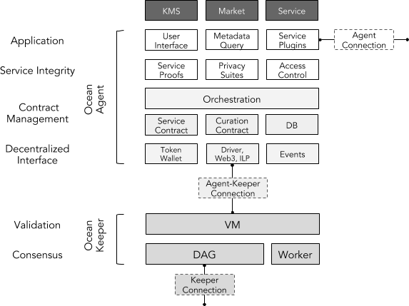

```
shortname: 3/ARCH
name: Ocean Protocol Network Architecture
type: Standard
status: Raw
editor: Dimitri De Jonghe <dimi@oceanprotocol.com>
contributors: Aitor Argomaniz <aitor@oceanprotocol.com>
```

# Ocean Protocol Network Architecture

This document gives an overview of the Ocean Network Architecture. 
It specifies what components can be found in the network and how they interact with each other.

This specification is based on [Ocean Protocol technical whitepaper](https://github.com/oceanprotocol/whitepaper).

This specification is called **ARCH** henceforth.

## Change Process
This document is governed by the [2/COSS](../2/README.md) (COSS).

## Language
The key words "MUST", "MUST NOT", "REQUIRED", "SHALL", "SHALL NOT", "SHOULD", "SHOULD NOT", "RECOMMENDED", "NOT RECOMMENDED", "MAY", and "OPTIONAL" in this document are to be interpreted as described in [BCP 14](https://tools.ietf.org/html/bcp14) \[[RFC2119](https://tools.ietf.org/html/rfc2119)\] \[[RFC8174](https://tools.ietf.org/html/rfc8174)\] when, and only when, they appear in all capitals, as shown here.

## Motivation

Ocean Protocol connects data service PROVIDERS with CONSUMERS using 
contractual agreements to ensure attribution, payments, audit trails and privacy.
Data service providers are seen in the broad sense of a data intelligence ecosystem:
data, scripts, algorithms, storage, computation, scheduling, privacy and more. 

The ARCH covers a conceptual framework for provisioning contractual CONNECTIONS,
an overview of the network architecture and it's building blocks,
as well as a suite of protocols that implements the design. 

This ARCH is inspired by 
the [web3.js](https://github.com/ethereum/web3.js/) implementation, 
the Internet architecture described in 
[RFC 1122](https://tools.ietf.org/html/rfc1122), 
[RFC 1123](https://tools.ietf.org/html/rfc1123) and 
[RFC 1009](https://tools.ietf.org/html/rfc1009) and the 
[Interledger Protocol (ILP)](https://github.com/interledger/rfcs/blob/master/0001-interledger-architecture/0001-interledger-architecture.md#interledger-architecture).

This document MUST provide a common framework used describing the network together with the relevant components, protocols and interactions. 
All the different components described SHOULD be used as building blocks, allowing to compose the different scenarios using them.

## Design Requirements

The following design requirements guide the development of the Ocean Protocol:

* MUST use an open protocol, accessible to clients using any technology stack
* MUST be decentralized in ownership of vision, mission, governance, implementation and usage
* MUST support arbitrary levels of privacy comfort and regulation (anonymity, data escapes, right to be forgotten, zero-knowledge, etc)
* MUST be designed around self-sovereignty in terms of ownership, control and exposure of identities and data services. 
* MUST respect rights of owners and creators.
* MUST support data services of all types, including:
  - Data assets
  - Data operations including:
    - Data transformation operations
    - Machine learning operations
    - Data interaction and visualisation libraries
* MUST support off-chain operations for storage and compute
* MUST enable interoperability (i.e. sharing of data assets and services) between multiple marketplace implementations 
and multiple decentralized and centralized technology stacks 
* MUST store a record of all asset provenance
* MUST allow metadata governance (as defined by domain specific use cases)
* MUST allow custom control logic for assets and interactions
* SHOULD incentivize the network towards ecosystem objectives and the commons

## Ocean Protocol Network Model

### At a glance

Ocean protocol facilitates a decentralized network to connect data services in a data service supply chain.

Decentralization impacts the network design in the following ways:

- there are no centralized components at the protocol level
- nodes in the network are assumed to be Byzantine and Sybil actors
- events and messages in the network are recorded as signed transactions
- the full history of transactions is stored as a cryptographically linked data structure
- business logic that triggers state transitions  


### Agents and Keepers

At the core of the network are nodes that can be either AGENTS and KEEPERS.
Each node in the network can be regarded as an AGENT with certain behavior.

AGENTS run software that is responsible for:
- exposing internal attributes and services of the AGENT
- setting up connections between services
- interact with KEEPERS by means of transactions and smart contracts 

Depending on the service provided to the network, different types of behavior 
can be observed in the network such as CONSUMERS, PROVIDERS, MARKETPLACES, PUBLISHERS, CURATORS and VERIFIERS.

KEEPERS are nodes that form the Ocean consensus network (also known as miners or validators in other projects). 
These nodes have replicated behavior that is coordinated by a consensus protocol.
Practically, KEEPERS run software that is responsible for validating transactions, smart contracts execution and shared state storage.

A CONTRACT is the interface between AGENTS and is enforced and validated at the KEEPER level.

A BRIDGE is an AGENT that connects the state between Ocean KEEPERS and other consensus networks.

Below is a diagram that depicts various AGENT roles as well as some example interactions.


One of the main responsibilities of a CONTRACT between AGENTS is to lock up funds 
and have means to resolve the transfer of funds (for example by verification of CONNECTION-related cryptographic proofs). 
The contract is generic and sent as a payload of a transaction (TX) to the consensus engine.

The interaction between the consensus layer and the AGENTS is driven by transactions:

* As a means of token transfer
* For deploying contracts and registering metadata
* For calling contracts with specific input variables and hence updating the contract state.

It's the responsibility of the AGENTS to construct valid transactions and contracts. 
Otherwise they won't be accepted by the consensus layer.

We foresee a few ways to set up contracts:

* Facilitation by a marketplace
* Peer-to-peer between AGENTS
* Open ended on-chain. ie send a valid TX to the contract address and gain service access

It should be noted that a minimum viable Ocean network only requires KEEPERS, CONSUMERS and combined PUBLISHER-PROVIDERS.

### Communication Protocols

Ocean Network foresees 3 types of communication channels:

1. AGENT-AGENT communication

At this layer we have for example the service connections between service provider and consumer. 
Potentially, these channels allow full duplex communication.
The access and privacy of the channel is coordinated by the contract layers below.


2. AGENT-KEEPER communication

AGENTS communicate on-chain by means of signed transactions and event listeners or event polling.
KEEPERS subscribe to these transactions and either validate them and store them in a pool of unconfirmed transactions (MEMPOOL)

3. KEEPER-KEEPER communication

KEEPERS within a decentralized network achieve consensus about a shared state like a Directed Acyclic Graph (DAG).
The consensus algorithms may need to coordinate between faulty, Byzantine and Sybil actors. 


Below, you can find a representation of the network with an emphasis to communication channels.
The image depicts a PUB/SUB method of communication as an example


## Components

The Ocean ARCH is composed of independent components:


### Keepers

Implements the Ocean Protocol and all the business logic embedded in validation and smart contracts. 
A full node would be running three distinct processes:

#### Ocean VM

A blockchain component with smart contract abilities:

* Interacts with the AGENTS through transactions. 
* Executes the Smart Contracts. The VM serves as a deterministic state transition mechanism.
* Stores transactions, blocks and contract state - such as bytecode, proofs, variables - in a Directed Acyclic Graph (DAG). 
* Is a validation engine for transaction and contract logic.
* MUST be [power-fault tolerant](https://filecoin.io/power-fault-tolerance.pdf) (PFT) 

#### Ocean DB

A database with the following capabilities:

* Interacts with the AGENTS through API calls. 
* Stores metadata about assets and actors in a database. 
* Has a query layer and an indexing scheme
* OPTIONAL Byzantine fault tolerant (BFT)

#### Ocean Worker

A work-dispatch engine with the following capabilities:

* Interacts with the AGENTS through transactions.
* Performs compute intensive jobs such as mining and proofs validation
* Can challenge AGENTS to provide succinct proofs
* OPTIONAL fault tolerant (FT)


### Ocean Agent

Thin abstraction layer in charge of exposing a common and stable API to the network consumers. 
The client outputs transactions that are send to the keeper. 
It could provide verification, privacy & multicast capabilities. 
Throttling and spam prevention is done at the VM validation level in the keeper. 
TX's have fees attached, could have some Client-side PoW and invalid tx's won't get replicated by honest nodes.

An detailed overview of the Ocean AGENT can be found in  [OEP-5/AGENT](../5/README.md) 

## Components Interaction

An Ocean Node can run all of those processes or any combination of them. 
It will allow to have specialized nodes, depending of the requirements of the users running those nodes.


In the above picture you can see multiple set up combinations of an Ocean Node. 
The first one (top left), shows an Ocean Node running an Agent and a Full Keeper (Decentralized VM, Database and Worker). 
Other scenarios could require specialized deployments to run Worker nodes, Agents, Database nodes, etc.

## Ocean Protocol Suite

The Ocean protocol stack has 6 layers, divided between AGENT and KEEPER.



### Application Layer

The application layer describes the AGENT interface with the outside world - ie. the data service tools.
Protocols at this level are responsible for:

1. Registry and discovery of services and agents
2. Contract selection and details negotiation
3. (Remote) communication and integration with service interfaces, tools and libraries


As an example, consider following data delivery scenario:

- A data PROVIDER publishes a datum ASSET offering together 
with CONNECTION details such as authorization and encryption.

- A data CONSUMER discovers the offering through a user interface.

- Both parties SHOULD negotiate and agree on CONTRACT and CONNECTION details.

- Once the CONTRACT is deployed and signed, the data CONSUMER MUST ACCESS 
the datum using the CONNECTION details. 
The data PROVIDER MAY listen to state changes of the CONTRACT 
and perform callback functions for CONNECTION management and responding 
to cryptographic CHALLENGES.

- At any point the CONTRACT resolution is triggered and the provider MAY revoke ACCESS.

The high level description as well as the  developer and user experience for this scenario
SHALL be implemented at this level. 

Details of the application layer are discussed in [#TODO:OEP-PLUGIN](../<PLUGIN>/README.md) 

### Service Integrity Layer

The Service Integrity layer MUST provide a cryptographically secure layer that
ensures the correct delivery of data services.

Components in this layer grant service access, set up privacy protocols and deliver proofs of service delivery.

#### Service Proofs

Service proofs are meant to publicly verify the off-chain data services and connections.
Multiple data service proofs that enhance data and compute integrity can be foreseen in this component

Details of the service proofs are discussed in [#TODO:OEP-PROOFS](../<PROOFS>/README.md) 

#### Privacy

The privacy layer SHALL take care of end-to-end privacy for messages traveling over a CONNECTION between AGENTS.
Various protocols are available to enhance privacy of data services such as encryption, 
homomorphic encryption (HE), trusted execution environments, on-premise, multiparty (MPC) and zero-knowledge computation (ZK).

In this layer both AGENTS MAY negotiate privacy details for the CONNECTION.

Due to limited capabilities of privacy suites like MPC, HE and ZK, 
not all service capabilities at the application level WILL supported.

Details of the privacy module are discussed in [#TODO:OEP-PRIVACY](../<PRIVACY>/README.md) 

#### Access Control

Service CONTRACTS in the Ocean network are the basis for access permissions between AGENTS.
The access layer foresees CONTRACT-based authentication and authorization for end-to-end CONNECTIONS.

The way access can be granted depends heavily on the type of data service and MAY include
signed tokens, signed URLs, on-chain role-based access control (RBAC), OAuth and so forth.

Details of the access module are discussed in [#TODO:OEP-ACCESS](../<ACCESS>/README.md) 


### Contract Management 

The contract management layer foresees the coordination of a service CONTRACT between all involved AGENTS and KEEPER networks.

Example contract protocols include peer-to-peer escrow contracts, marketplace-based contracts, 
as well as CONTRACT resolution mechanisms such as judging and verification.

Details of the contract management layer are discussed in [#TODO:OEP-CONTRACT-MANAGEMENT](../<CONTRACT-MANAGEMENT>/README.md) 

### Decentralized Interface

The decentralized interface layer provides modules to create sufficient token and network specific components such as wallets and drivers
This layer provides account management libraries and ensures that ledger-specific transactions can be composed and signed.

This layer SHOULD also listen to events generated by state changes on the keeper 
and provide necessary callbacks and hooks. 

Details of the identity layer are discussed in [#TODO:OEP-WALLET](../<WALLET>/README.md) 

### Validation Layer

The validation layer is where an Ocean KEEPER runs the logic of smart contracts and validates
transactions

Details of the access layer are discussed in [#TODO:OEP-VM](../<VM>/README.md) 

### Consensus Layer

This layer orchestrates decentralized coordination between KEEPERS and includes gossip protocols for inter-KEEPER communication

This layer also includes the cryptographic data structures to store state transitions.

OPTIONALLY this layer implements worker logic to validate and generate cryptographic proofs. 

Details of the access layer are discussed in [#TODO:OEP-CONSENSUS](../<CONSENSUS>/README.md) 
