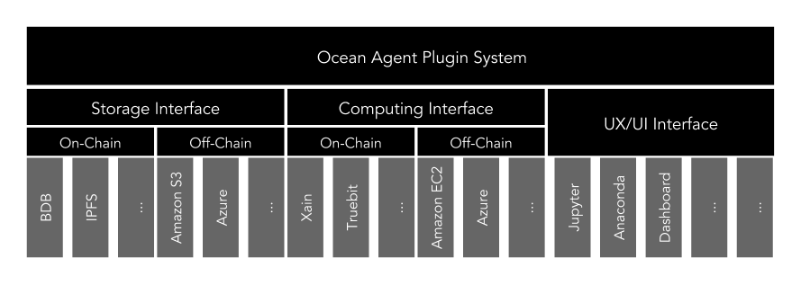

```
shortname: 3/ARCH
name: Ocean Protocol Architecture
type: Standard
status: Raw
editor: Aitor Argomaniz <aitor@oceanprotocol.com>
contributors: Dimitri De Jonghe <dimi@oceanprotocol.com>
```

This document describes the Ocean Architecture. It focus in which are the main responsabilities, functions and components implementing the architecture.

This specification is based on [Ocean Protocol technical whitepaper](https://github.com/oceanprotocol/whitepaper).

The Ocean Protocol Archite specification is called **ARCH** henceforth.


## Change Process
This document is governed by the [2/COSS](../2/README.md) (COSS).

## Language
The key words "MUST", "MUST NOT", "REQUIRED", "SHALL", "SHALL NOT", "SHOULD", "SHOULD NOT", "RECOMMENDED", "NOT RECOMMENDED", "MAY", and "OPTIONAL" in this document are to be interpreted as described in [BCP 14](https://tools.ietf.org/html/bcp14) \[[RFC2119](https://tools.ietf.org/html/rfc2119)\] \[[RFC8174](https://tools.ietf.org/html/rfc8174)\] when, and only when, they appear in all capitals, as shown here.

## Goals
The primary goal of ARCH is to facilitate the process of implementing the use cases required to provided by the Ocean Network. 
It MUST to provide a common framework used describing the technical solution to put in place. 

All the different components described, SHOULD be used as building blocks, allowing to compose the different scenarios using those.

# High Level Architecture

The ARCH it's based in a **contract-centric** architecture approach. A contract is the interface between clients and the consensus engine.

It locks up funds and has means to resolve the transfer of funds (proofs/verifications). The contract is generic and send as a payload of a transaction

The interaction between the consensus layer and the clients is driven by transactions:

* As a means of token transfer
* For deploying contracts
* For calling contracts with specific input variables and hence updating the contract state

It's the responsibility of the clients to construct valid transactions and contracts. Otherwise they won’t be validated by the consensus layer.

Ways to set up contracts:

* Facilitation by a marketplace
* Peer-to-peer between clients
* Open ended on-chain. ie send token/tx to the contract address and gain service access


## Components

It is composed by independent components:


### Keeper

Implements the Ocean Protocol and all the business logic embedded in validation and smart contracts. A full node would be running three distinct processes:

#### Decentralized VM

A blockchain component with smart contract abilities:

* Interacts with the clients through transactions. 
* Executes the Smart Contracts. The VM serves as a state transition mechanism.
* Stores transactions, blocks and contract state [such as bytecode, proofs, variables, …] in a DAG [directed acyclic graph]. 
* Is a validation engine for UTXO [unspent transaction outputs] and contract logic.
* Is power-fault tolerant

#### Ocean DB

A decentralized database with the following capabilities:

* Interacts with the clients through transactions. 
* Stores metadata about assets and actors in a decentralized database. 
* Has a query layer and an indexing scheme
* Is byzantine-fault tolerant

#### Ocean Worker

A work-dispatch engine with the following capabilities:

* Interacts with the clients through transactions.
* Performs compute intensive jobs such as mining and proofs validation
* Can challenge clients to provide succinct proofs
* Is fault tolerant


### Ocean Agent

Thin abstraction layer in charge of exposing a common and stable API to the network consumers. The client outputs transactions that are send to the keeper. It could provide verification, privacy & multicast capabilities. Throttling and spam prevention is done at the VM validation level in the keeper. TX’s have fees attached, could have some Client-side PoW and invalid tx’s won’t get replicated by honest nodes.

## Components Interaction

An Ocean Node can run all of those processes or any combination of them. It will allow to have specialized nodes, depending of the requirements of the users running those nodes.


In the above picture you can see multiple set up combinations of an Ocean Node. The first one (top left), shows an Ocean Node running an Agent and a Full Keeper (Decentralized VM, Database and Worker). Other scenarios could require specialized deployments to run Worker nodes, Agents, Database nodes, etc.

## Design Requirements

The following design requirements should guide the development of the Ocean Protocol:

* MUST use an open protocol, accessible to clients using any technology stack
* SHOULD minimise latency for user transactions
* MUST store a record of all asset provenance
* MUST allow custom metadata (as defined by marketplaces and/or domain specific use cases)
* MUST support data services of all types, including:
  - Data assets
  - Data operations including:
    - Data transformation operations
    - Machine learning operations
* MUST enable interoperability (i.e. sharing of data assets and services) between multiple marketplace implementations
* MUST support arbitrary data formats (e.g. as specified by MIME type)
* MUST support off-chain operations for storage and compute
* MUST support both free and priced data assets / services
* MUST allow marketplaces to implement custom asset pricing logic (for priced services)
* MUST support the IP management. During the creation of a new Asset or Service, the ownership rights should be registered. During the consumption agreement, this right should be registered.
* Ocean agents (including but not limited to Marketplaces) MUST have an efficient way to access the full blockchain history so that can query or index a copy of the blockchain as necessary

# Keeper Architecture

## Responsibilities


The main responsibilities of the Keeper are:

* Expose an interface to receive requests requiring to execute some actions. Initially this will expose a HTTP RPC interface
* Validate the input requests implementing the RBAC system 
* Persist the Metadata and Transactions information On-Chain
* Maintain the decentralized state including the Proofs of Service, Contracts bytecode and Actors registry
* Implement the Curation Market Business logic for data and services
* Manage and track the IP ownership of assets and services during their creation and access
* Provide the Token curated registry of actors
* Maintain the P2P consensus between the Keeper nodes
* Orchestrate the Keeper business logic interacting with the different external resources
* Manage the external Processing entities providing computing capabilities
* Manage the external Storage entities providing storage capabilities

## Decentralized State


**Ocean Core** itself does not store the content of the Assets, instead, it links to data that is stored, and provides mechanisms for access control. At the same time Keepers store a different kind of metadata:

* **Assets and Services Metadata** - Information describing the Assets or Service including the owner, attributes, pricing model and so on.
* **Transactions** - Confirmed transactions between actors. It doesn’t include the negotiation messages.
* **Contracts** - Information about the contract and the contract definition itself.
* **Proofs** -Information about the validation proofs and the proof definition itself. 
* **Actors Registry** - As soon as an actor is allowed into the system, the metadata describing what that actor is and does is appended to the Actor Registry.
* **Wallet** - Persist the account tokens balance.

## Keeper Components

As was described before, the Keeper full node it's implemented by three main building blocks:

* Decentralized VM 
* Ocean DB
* Ocean Worker

### Decentralized VM

The Decentralized VM is a blockchain-based distributed computing platform and operating system featuring smart contract (scripting) functionality.


The internal state is based in a **DAG** structure. DAG is a Direct Acyclic Graph data structure that uses a topological ordering. The sequence can only go from earlier to later. DAG is often applied to problems related to data processing, scheduling, finding the best route in navigation, and data compression.


The payload associated to each transaction includes all the data necessary to execute the Smart Contracts in a deterministic way. In our case, a part of the binary content of the contracts, it includes an internal state with information about:

* Curation Market
* Pricing
* Actors Registry
* Proofs

The Decentralized VM will expose the main capabilities through the Smart Contract external interfaces. It will allow the integration between this part of the Keeper node and the rest of the network.


Main logic components implemented in the Decentralized VM are:

#### Curation Market

Implementing:
* The Token Curation Market (TCM) Business logic for data and services
* The Token curated registry of actors

#### RBAC system

In charge of validating the incoming requests, checking if the actions requested can be performed depending of the user privileges/roles. To do that, the component integrate the Actors registry on-chain information.

#### Pricing module 

It should implement a flexible pricing model allowing different scenarios:
* Free pricing
* Fixed price
* Smart Contracts - It would support more flexible pricing models (pricing defined from the marketplace side, auctions, etc.)

#### Proofs of Service

It manages the storage and validation of the different kind of Proofs of Services. It integrates with the Data & Services interfaces allowing to retrieve the proofs of services provided by third-parties.


### Ocean DB

Ocean DB is a decentralized BFT database, allowing to store different kind of information in an efficient way. Including:

* Assets and Service metadata
* IP rights
* Contract details
* Transactions information
* ...


Ocean DB will be based in an existing technology (ie. BigChainDB), and will be able to running in a totally independent way of the rest of the Keeper components.

Ocean DB will expose the API's (RESTful) allowing the integration in an easy way.

### Ocean Worker

A head-less component (without external interface) in charge of perform most of the compute intensive tasks, like mining and proofs validation. 
Business logic related with **Verifiers** and **Curators** is performed in the Worker scope.

The work interact with the rest of the world through the system transactions, so will be listening those in order to perform different actions. It includes:  

* Validate Proofs of Service
* Challenge to Providers in order they provide some Proofs
* Provide Assets and service curation

## Keeper Functions and Component responsibilities

Most important functions or actions provided by the keeper are:
* Assets management - Allowing to register the assets metadata associated to the publisher and provider of the asset. The complete metadata information will be stored in the Ocean DB, including IP. References to the Asset, owner and pricing will be stored in the decentralized VM. Main capabilities provided are:
  - Asset registering - Allowing to register the metadata of new Assets on-chain. Should register the IP rights of the owner.
  - Updating and disabling an Asset - Allowing to update the metadata of an Asset or disable it. Only metadata can be updated, if the Asset content has to be modified, it must be handled as a totally new Asset (probably as a derivation of the previous one). This function must validate that only the owner can update or delete the asset.
  - Retrieve Asset information - Useful to obtain the metadata information of an Asset.
  - Add a Provider to an Asset - Associating one specific asset with one provider. It will include the pricing and proof information associated with the provider.

* Actors management - Allowing to register the actors basic information. Basic registry of actors will be stored in Ocean DB. It includes:
  - Actor registering - Allowing to register a new Actor on-chain
  - Updating and disabling Actors - Allowing to update the metadata of an Actor or disable it. This function must validate that only the own Actor can modify his/her information.
  - Retrieve Actor information - Useful to obtain the metadata information of an Actor.

* Curation Market - Allowing to provide curation information about Assets, Services and Actors of the system. Curation information should be managed using the Decentralized VM and Ocean DB. The Curator put tokens on stake of this curation. The functions provide include:
  - Curate an Asset - Allowing to curate an Asset
  - Curate an Actor - Allowing to curate an Actor
  - Curate a Service - Allowing to curate an Asset

* Market Transactions - Allowing to define the contract between parties. This information should be managed using the Decentralized VM and Ocean DB. Should provide the following functions:
  - Contract definition- After negotiate the contract terms (off-chain), it’s necessary to store (on-chain) the terms of the contract
  - Contract agreement - All the parties involved in a contract (publisher, provider, consumer, marketplace) agree the terms of a contract.
  - Access - After of having the contract in place, the Consumer can request to get Access to the Asset or Service. If the requirements are met (correct contract), the access request is registered (on-chain) and the Provider is notified to give access to the Asset or Service defined in the contract.
  - Access authorization - The Provider authorizes the consumption of the Asset or Service defined in the contract. It provides the information necessary to consume the element. Should register the IP grants related with the Asset or Service and the Consumer.
  - Contract settlement - Once enough proofs are provided (see verification actions), the contract goes into settlement. Keepers, Providers, Marketplaces or Verifiers can request to put a contract on settlement after to have all the Proofs of Service required to validate that service has been provided.

* Verification - Allowing to handle the actors and assets verification and whitelisting process.  This information should be managed using the Decentralized VM and Ocean DB. Should provide the following functions:
  - Definition of Verification challenge - A pre-appointed verifier and/or the client challenges the service to provide proofs that the requested service is delivered according to integrity specifications.
  - Provide a Verification Proof - The service accepts the challenge, computes the proof and stores this on-chain with a reference to the contract.
  - Get details of a Verification Proof - Retrieval of Verification Proof information.
  - Actor Whitelisting - A verifier send a whitelisting request approving or denying to an actor
  
* Wallet - Allowing the manage the basics about the user wallets.  This information should be managed using the Decentralized VM. Should provide the following functions:
  - Wallet creation - Creation of a wallet
  - Obtain wallet information - Providing information about the wallet address owner and balance
  - Transfer of funds - Transfer of funds between wallets
  
# Ocean Agent Architecture

## Responsibilities

Ocean Agent is a stateless thin abstraction layer. Main responsibilities are:

* Exposing a common and stable API to the network consumers. 
* Build the authorization & authentication mechanism to identify the user using the client
* Manage the user PKI information
* Compose transactions that are send to the keeper. 
* Orchestrate lower-level Keeper interactions exposing a higher level API
* Subscribe to some Smart Contract events raised by the Keeper and trigger actions responding to that
* Integrate with external services or providers (Compute, Data, ..)
* Simple input validation. Throttling and spam prevention is done at the VM validation level in the keeper. 
* Expose some API’s providing alternative consumption mechanisms (synchronous/asynchronous)

## Components


The **Ocean Agent** is a software application receiving incoming messages (REST, RPC, etc.) related with the Ocean Network interactions, and producing some output messages after interact with the **Ocean Keeper components**. 
Independently of the API consumption mechanism, the Ocean Agent is in charge of building the internal object models using the incoming messages provided by the **Keeper components interfaces**. 
This marshaling and unmarshaling operations will allow using a common internal data model across all the application. 
The Agent also will orchestrate the interaction with the Keeper components, allowing to provide a high level view from the consumer side, interacting with the decentralized VM and the Ocean DB.

### Interfaces

In charge of receiving the external requests to interact with the system. Initially the Ocean Agent will expose a HTTP RESTful API, but is designed to expose the API’s or consume requests in different ways.
Because of that the Ocean Agent should expose the API’s in different formats allowing integration mechanisms that can be used depending on the use case. The initial consumption mechanisms could be:
 
* **Request/Response** - Provided by the RESTful and the RPC interfaces. Those allow a request/response integration. The API will expose different HTTP methods implementing the defined actions.


* **Async Websocket** - Provided by the Websocket interface. Useful when some actors need to be subscribed to the changes happening in the database. For example, if a change in a contract is happening. 


* **Event Driven** - Provided by a Pub/Sub interface. In some scenarios where the execution of an action can take some time (more than 2 or seconds) could be recommended to allow async consumption mechanisms. This could be an optimal configuration when the Ocean Agent is running in conjunction with a Marketplace.


#### Communication with Keeper

The keeper will expose 3 main block of capabilities to the rest of the world:

* **Decentralized VM** - Providing the Smart Contracts implementing the core business logic
* **Ocean DB** - Storing the Assets, Actors, etc. information
* **Worker** - Accepts challenges via p2p commands 

Those capabilities will be integrated from the Ocean Agent using different protocols. 

The Keeper interface module should implement an extensible interfaces system allowing to plug different communication protocols to establish the communication between the Ocean Agent and the the Keepers network. This component is in charge of the following capabilities:

* Interact with the Keeper components (Decentralized VM, Ocean DB)
* Compose the transactions payload necessary by the Keeper nodes
* Orchestrate the execution of multiple Keeper requests when be necessary

Initially, HTTP RPC is the easiest candidate to integrate in the communication with the Decentralized VM. A part of HTTP RPC, in following iterations this component could interface with HTTP RESTful API’s and using the Interledger Protocol (ILP).

Regarding the Ocean DB, the communication can be establish using HTTP RESTful interfaces.


The worker nodes will expose a p2p interface supporting some commands allowing to raise proof challenges.

The implementation of this module is highly linked to the Keeper API definition. 

#### Agents P2P communication

This module is in charge of maintain peer to peer communication between Ocean Agents. This communication can be used to implement: 
     
* Direct messaging between parties - Allowing for example the agree Contracts terms before to formalize the contract or direct sharing of Assets consumptions information between the provider and the consumer. 
* Assets transferring between different Ocean actors - In the actors that are giving access directly to some assets without using a third-party provider, would be possible to share directly the Assets between parties.
     
The implementation of the P2P communication is highly related with the existing p2p libraries. 


#### Interfaces with external providers

Ocean Agent should provide a pluggable mechanism allowing to interact with external providers. It could be:

* **Computing Providers** - In charge of providing off-chain or on-chain computing services. For example Amazon EC2, XAIN, Enigma, etc.
* **Storage or Data Providers** - In charge of providing storage services off-chain or on-chain. Like Amazon S3, IPFS, etc.
* **UX/UI Providers** - In charge of providing visual interfacing with the system.

Because is difficult to define upfront the different providers to integrate, it’s important to implement a pluggable mechanism allowing to extend the systems supported by the system.



In the above picture the Storage, Computing and UX/UI interfaces have the responsibility of modelling the interaction with the external systems. Having this approach, support additional providers would require only the implementation of the communication with the new provider, but the integration with the rest of the system should be simpler.

Depending of the implementation of the system, the usage of one plugin or another one, could be made by configuration or using dependency injection.

```java
StorageProvider interface {

    bool store(Asset asset);
    Asset retrieve(URL url);
    ..
}
```

## Access Control


Access Control system implements the architecture where external users or applications are Authenticated and Authorized in the system, allowing (or denying) the management of the resources.

In general, authentication is the process of validating that somebody really is who he claims to be. Authorization refers to rules that determine who is allowed to do what.  

### Authentication

In this Ocean Agent side the authentication layer is very thin, and it’s in charge mainly of verifying the public key information associated to the transactions.

### Authorization

In the authorization phase it’s necessary to validate that user is able to implement a specific action, ie. modify the metadata information of a specific asset. To implement this validating it’s necessary to use the information associated to the ownership of the resources, it’s stored on-chain.


The authentication will be implemented in the conjunction between the Access Control layer and the Decentralized VM component running in the Keeper side. 

The Access Control layer implement the association between the user information, validated in the authentication layer, and the method execution. 
The Decentralized VM component, using the validations implemented in the Smart Contracts, and the associating between the resources and the owners or users able to access the resources, will implement the validations allowing to authorize the user. It includes to answer the following questions:

* Is the user sending the request the owner of the resource (msg.sender == owner)? The ownership of a resource, typically enable to the owner execute the high restricted operations related with the resource (like transfer the ownership or updating data).
* Can the user sending the request access (read or write) to the resource? The resource can have associated a Access Control List (ACL) defining who can do what. 
* Can the user sending the request to change the ownership of the resource?


## PKI

### Accounts

An account is a human-readable identifier (public key) stored on the decentralized VM. Every transaction has its permissions evaluated under the configured authority of an account. The grants of each account will be validated by the RBAC system. The user permissions must be met for a transaction signed under that authority to be considered valid. Transactions are signed by utilizing a client that has a loaded and unlocked a wallet. 

Ocean Agent will provide the capabilities to manage the accounts creation. It will use the [BIP32](https://github.com/bitcoin/bips/blob/master/bip-0032.mediawiki) defition for the creation of those.

### Wallets

Wallet component is in charge of protects and makes use of your keys. These keys may or may not be granted permission to an account authority on the blockchain.
A wallet manages a private/public key pair which is used to cryptographically sign transactions and prove ownership on the network. The Ocean Agent will provide the wallet capabilities that allows the monetary interactions in the network.

The reference for wallet definitions to be used are:

* [BIP32](https://github.com/bitcoin/bips/blob/master/bip-0032.mediawiki) - It describes hierarchical deterministic wallets (or "HD Wallets"). Those are wallets which can be shared partially or entirely with different systems, each with or without the ability to spend coins. 
* [BIP39](https://github.com/bitcoin/bips/blob/master/bip-0039.mediawiki) - It describes the implementation of a mnemonic code or mnemonic sentence, a group of easy to remember words, for the generation of deterministic wallets.
* [BIP44](https://github.com/bitcoin/bips/blob/master/bip-0044.mediawiki) - Defines a logical hierarchy for deterministic wallets based on an algorithm described in BIP32, and purpose scheme described in [BIP43](https://github.com/bitcoin/bips/blob/master/bip-0043.mediawiki).

The main methods to be provided are:

* **New wallet** - It creates a new wallet in the system. It is saved in encrypted format, passphrase must be provided
* **Update wallet** - It updates an existing wallet. The passphrase must be provided to unlock the account and another to save the updated file
* **Import wallet** - Imports an unencrypted private key from a keyfile and creates a new wallet. The keyfile should contain an unencrypted private key in hexadecimal format.
* **List wallets** - List the existing wallets in the scope of the Ocean Agent

It’s necessary to check about the security limitations of os.urandom, which depends on the version of Python, and the operating system. Some implementations rely on it.

PyWallet provides a reference implementation.

## Privacy Management

TODO: Protocol to negotiate privacy requirements

## Events Watcher

An important part of the Smart Contracts implementation in the Decentralized VM is the triggering of Events. Those events could expose system notifications when some relevant actions are happening (ie. a new Asset is registered, an Asset is curated, etc.).

From the Ocean Agent side, the Events Watcher component will be in charge of watching those events to trigger some further actions. 

```javascript
var subscription = web3.eth.subscribe('logs', {
    address: '0x123456..',
    topics: ['0x12345...']
}, function(error, result){
    if (!error)
        console.log(log);
});

// unsubscribes the subscription
subscription.unsubscribe(function(error, success){
    if(success)
        console.log('Successfully unsubscribed!');
});
```

## Orchestration Layer

Using as input the incoming requests and events, the Orchestration layer is in charge on compose complex workflows as a result of the interactions of multiple service executions. Some scenarios require the execution of multiple steps before completion, for example:

* Assets Registry - When is received a request to register a new Asset, it requires to execute:
  - Register the basic Asset metadata on-chain (Decentralized VM Database)
  - Register the complete Asset metadata in the Ocean DB (Assets Registry)
  - Register the IP rights related with the Asset
* Contract Settlement - When it’s received an API request providing a proof of service, the Ocean Agent requires to execute:
  - Store the Proof of Service information on-chain
  - Check if all the proof of services were provided, in that case update the state of the contract to Settled
  - Notify all the contract parties

To implement that, the Orchestration Layer acts as a mediator between different components. The implementation of this can be implemented in two possible ways:

* Using a sync orchestration layer, abstracting/encapsulating the execution of multiple components using a [Mediator pattern](https://en.wikipedia.org/wiki/Mediator_pattern). The mediator can executes one by one all the steps involved in one execution workflow.
* Evolving the Mediator pattern to introduce a pub/sub mechanism. In that case, the mediator publish a new event in a specific topic of the events bus. Multiple subscribers can listen to that topic implementing the behaviour of the individual phases. Those subscribers can emit events to different topics to notify the state of their actions.


