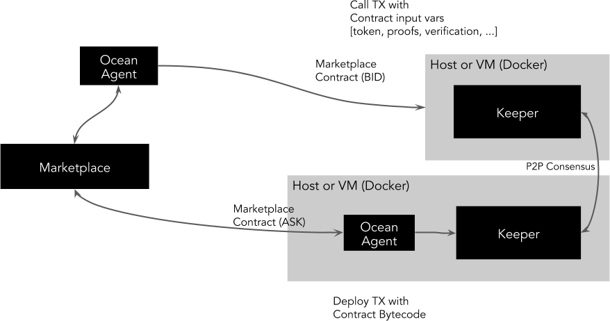
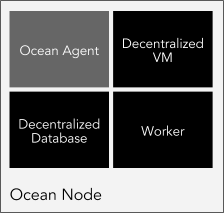
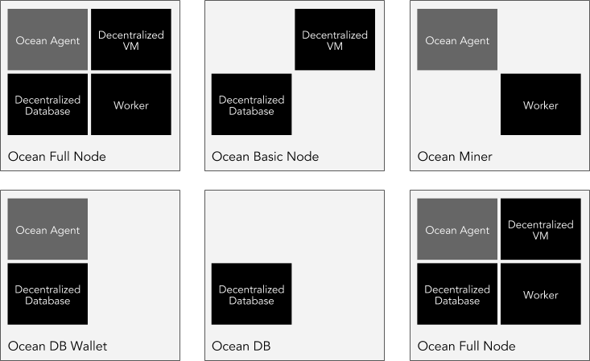

```
shortname: 3/ARCH
name: Ocean Protocol Architecture
type: Standard
status: Raw
editor: Aitor Argomaniz <aitor@oceanprotocol.com>
contributors: Dimitri De Jonghe <dimi@oceanprotocol.com>
```

This document describes the Ocean Architecture. It focus in which are the main responsabilities, functions and components implementing the architecture.

This specification is based on [Ocean Protocol technical whitepaper](https://github.com/oceanprotocol/whitepaper).

The Ocean Protocol Archite specification is called **ARCH** henceforth.


## Change Process
This document is governed by the [2/COSS](../2/README.md) (COSS).

## Language
The key words "MUST", "MUST NOT", "REQUIRED", "SHALL", "SHALL NOT", "SHOULD", "SHOULD NOT", "RECOMMENDED", "NOT RECOMMENDED", "MAY", and "OPTIONAL" in this document are to be interpreted as described in [BCP 14](https://tools.ietf.org/html/bcp14) \[[RFC2119](https://tools.ietf.org/html/rfc2119)\] \[[RFC8174](https://tools.ietf.org/html/rfc8174)\] when, and only when, they appear in all capitals, as shown here.

## Goals
The primary goal of ARCH is to facilitate the process of implementing the use cases required to provided by the Ocean Network. 
It MUST to provide a common framework used describing the technical solution to put in place. 

All the different components described, SHOULD be used as building blocks, allowing to compose the different scenarios using those.


# Design Requirements

The following design requirements should guide the development of the Ocean Protocol:

* MUST use an open protocol, accessible to clients using any technology stack
* SHOULD minimise latency for user transactions
* MUST store a record of all asset provenance
* MUST allow custom metadata (as defined by marketplaces and/or domain specific use cases)
* MUST support data services of all types, including:
  - Data assets
  - Data operations including:
    - Data transformation operations
    - Machine learning operations
* MUST enable interoperability (i.e. sharing of data assets and services) between multiple marketplace implementations
* MUST support arbitrary data formats (e.g. as specified by MIME type)
* MUST support off-chain operations for storage and compute
* MUST support both free and priced data assets / services
* MUST allow marketplaces to implement custom asset pricing logic (for priced services)
* MUST support the IP management. During the creation of a new Asset or Service, the ownership rights should be registered. During the consumption agreement, this right should be registered.
* Ocean agents (including but not limited to Marketplaces) MUST have an efficient way to access the full blockchain history so that can query or index a copy of the blockchain as necessary


# High Level Architecture

The ARCH it's based in a **contract-centric** architecture approach. A contract is the interface between clients and the consensus engine.

It locks up funds and has means to resolve the transfer of funds (proofs/verifications). The contract is generic and send as a payload of a transaction

The interaction between the consensus layer and the clients is driven by transactions:

* As a means of token transfer
* For deploying contracts
* For calling contracts with specific input variables and hence updating the contract state

It's the responsibility of the clients to construct valid transactions and contracts. Otherwise they won’t be validated by the consensus layer.

Ways to set up contracts:

* Facilitation by a marketplace
* Peer-to-peer between clients
* Open ended on-chain. ie send token/tx to the contract address and gain service access




## Components

It is composed by independent components:



### Keeper

Implements the Ocean Protocol and all the business logic embedded in validation and smart contracts. A full node would be running three distinct processes:

#### Decentralized VM

A blockchain component with smart contract abilities:

* Interacts with the clients through transactions. 
* Executes the Smart Contracts. The VM serves as a state transition mechanism.
* Stores transactions, blocks and contract state [such as bytecode, proofs, variables, …] in a DAG [directed acyclic graph]. 
* Is a validation engine for UTXO [unspent transaction outputs] and contract logic.
* Is power-fault tolerant

#### Ocean DB

A decentralized database with the following capabilities:

* Interacts with the clients through transactions. 
* Stores metadata about assets and actors in a decentralized database. 
* Has a query layer and an indexing scheme
* Is byzantine-fault tolerant

#### Ocean Worker

A work-dispatch engine with the following capabilities:

* Interacts with the clients through transactions.
* Performs compute intensive jobs such as mining and proofs validation
* Can challenge clients to provide succinct proofs
* Is fault tolerant


### Ocean Agent

Thin abstraction layer in charge of exposing a common and stable API to the network consumers. The client outputs transactions that are send to the keeper. It could provide verification, privacy & multicast capabilities. Throttling and spam prevention is done at the VM validation level in the keeper. TX’s have fees attached, could have some Client-side PoW and invalid tx’s won’t get replicated by honest nodes.

## Components Interaction

An Ocean Node can run all of those processes or any combination of them. It will allow to have specialized nodes, depending of the requirements of the users running those nodes.



In the above picture you can see multiple set up combinations of an Ocean Node. The first one (top left), shows an Ocean Node running an Agent and a Full Keeper (Decentralized VM, Database and Worker). Other scenarios could require specialized deployments to run Worker nodes, Agents, Database nodes, etc.

