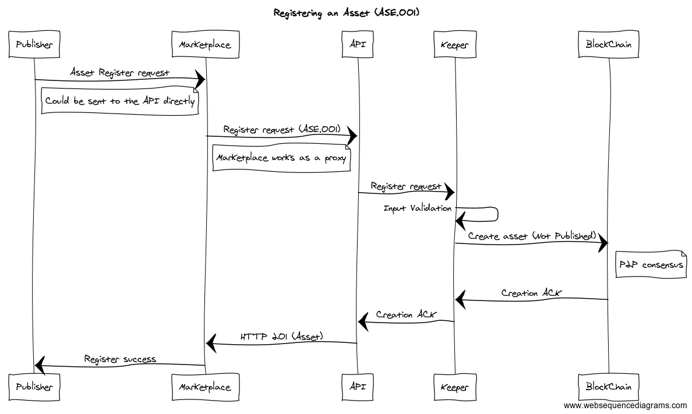
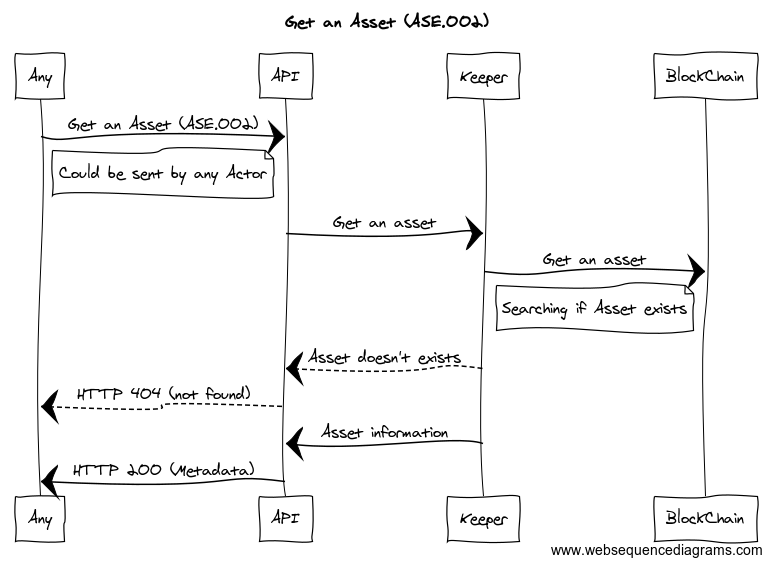
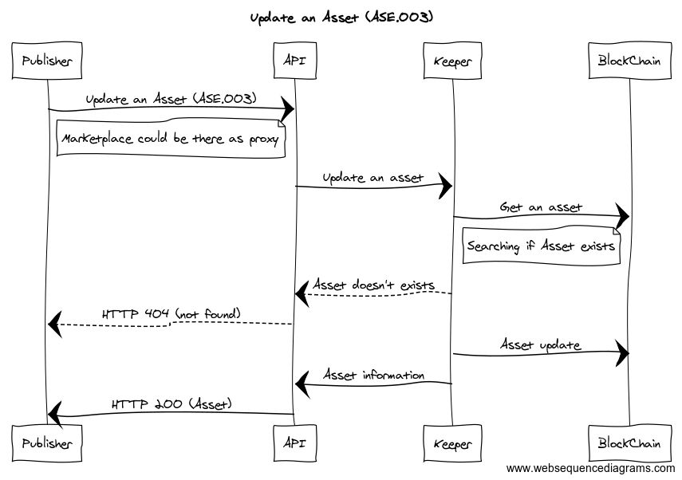
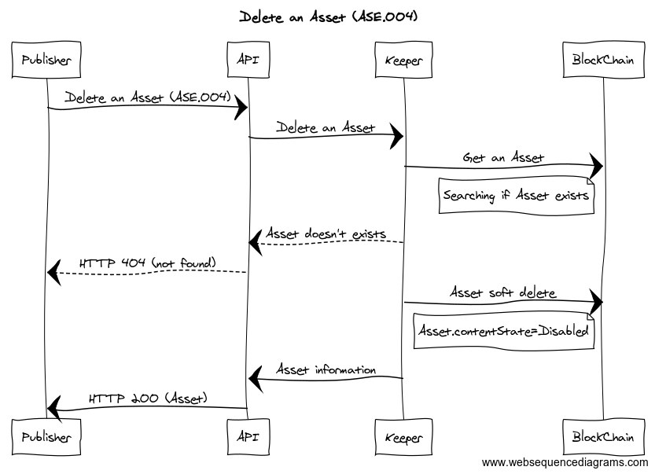
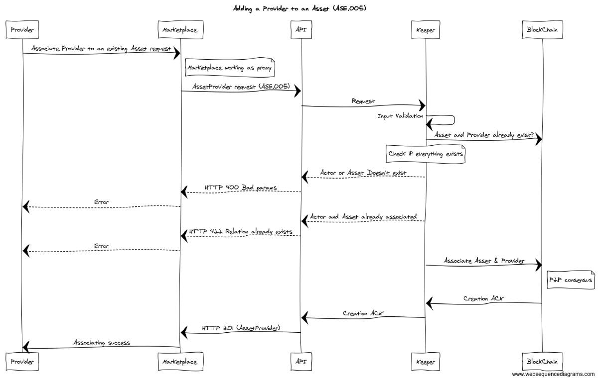

```
shortname: 3/SONAR
name: Searchable OceaN Asset Registry 
type: Standard
status: Raw
editor: Aitor Argomaniz <aitor@oceanprotocol.com>
contributors: Dimitri De Jonghe <dimi@oceanprotocol.com>, Mike Anderson <mike.anderson@dex.sg>, Samer Sallam <samer@oceanprotocol.com>, Kiran Karkera <kiran.karkera@dex.sg>
```

## Abstract

The SONAR OEP is a specification for Ocean Protocol to publish and discover ASSETS such as data sets, algorithms, infrastructure and so on. ASSETS are described by structured METADATA.

Optionally this OEP extends to hold other datatypes such as actors.

## What not

This OEP does not focus on the storage backend, METADATA structure or incentives around signalling. 
It's purely the interface for publishing and discovery of ASSETS.

## Motivation

Ocean network aims to power marketplaces for relevant AI-related data services. 
The data services require to be discoverable and queryable, as well as consumable.

- ASSET METADATA are DATA objects describing RESOURCES & SERVICES.
- A PUBLISHER is incentivized to PUBLISH ASSETS on the ASSET REGISTRY in order to make them discoverable for third parties.
- A CONSUMER can query the ASSET REGISTRY and find ASSET METADATA.

More formally, an API would at least expose the following functionality:
- ASSETS METADATA are STORED on a decentralized REGISTRY.
- ASSETS METADATA can be UPDATED. Optionally with versioning.
- ASSETS METADATA can be RETRIEVED from the REGISTRY.
- ASSETS METADATA can have a status of DISABLED, which implies that the ASSET cannot be CONSUMED anymore.

## Specification

The **Assets** information should be managed using an API. This API should exposes the following capabilities:

* Adding an Asset
* Get an Asset
* Update an Asset
* Disabling an Asset
* Make an Asset available through a Provider

The information or Metadata of the Assets should be registered on-chain.


### Proposed Solution

The proposed solution is a RESTful API exposing different methods implementing the different actions required. The methods to implement are:

### Adding an Asset (ASE.001)

```
Path: /api/v1/keeper/assets/asset
HTTP Verb: POST
Caller: Publisher
Input: Asset Schema
Output: Asset Schema
HTTP Output Status Codes: 
    HTTP 201 - Asset Created
    HTTP 422 - Asset already exists
```



This method implements the creation of an Asset. It includes a List of sample data included as reference with the Asset. Those samples should help the consumers to understand if the Asset includes the expected information.

This method is integrated by the **Publisher** of an Asset. Marketplaces can participate as proxies. 
The Input and Output parameters are defined in the [Asset Schema](https://github.com/oceanprotocol/pk-schemas/blob/develop/src/main/resources/avro/com/oceanprotocol/core/keeper/schemas/Asset.avsc).

### Get an Asset (ASE.002)

```
Path: /api/v1/keeper/assets/asset/{assetId}
HTTP Verb: GET
Caller: Any
Input: assetId
Output: Asset Schema
HTTP Output Status Codes: 
    HTTP 200 - OK
    HTTP 404 - Not Found
```




Method retrieving information (Metadata) of an Asset from the database. 
If the Asset retrieved has an attribute `contentState == “DISABLED”` the method should return a **HTTP 404** Not Found message.

This method could be integrated by any actor. 
The Input of this method is the assetId referencing to a unique Asset. The Output parameters are defined in 
the [Asset Schema](https://github.com/oceanprotocol/pk-schemas/blob/develop/src/main/resources/avro/com/oceanprotocol/core/keeper/schemas/Asset.avsc).


### Update an Asset (ASE.003)

```
Path: /api/v1/keeper/assets/asset/{assetId}
HTTP Verb: PUT
Caller: Publisher
Input: Asset Schema
Output: Asset Schema
HTTP Output Status Codes: 
    HTTP 200 - Updated
    HTTP 404 - Not Found
```



This method implements the update of the information about an Asset. 

This method is integrated by the **Publisher** of an Asset. Marketplaces can participate as proxies. 
The Input and Output parameters are defined in the [Asset Schema](https://github.com/oceanprotocol/pk-schemas/blob/develop/src/main/resources/avro/com/oceanprotocol/core/keeper/schemas/Asset.avsc).


### Disabling an Asset (ASE.004)

```
Path: /api/v1/keeper/assets/asset/{assetId}
HTTP Verb: DELETE
Caller: Any
Input: assetId
Output: Asset Schema
HTTP Output Status Codes: 
    HTTP 200 - OK
    HTTP 404 - Not Found
```



This method implements a soft delete of an asset. It means the Asset is updated setting the contentState attribute to “DISABLED”. 
The method will return a **HTTP 200** status code and the Asset modified in the response body.

This method only can be integrated by the publisher of the Asset. 
The Input of this method is the assetId referencing to a unique Asset. The Output parameters are defined in 
the [Asset Schema](https://github.com/oceanprotocol/pk-schemas/blob/develop/src/main/resources/avro/com/oceanprotocol/core/keeper/schemas/Asset.avsc).


### Adding a Provider to an Asset (ASE.005)

```
Path: /api/v1/keeper/assets/provider
HTTP Verb: POST
Caller: Provider
Input: AssetProvider Schema
Output: AssetProvider Schema
HTTP Output Status Codes: 
    HTTP 201 - AssetProvider Created
    HTTP 400 - Request doesn’t include mandatory parameters
    HTTP 400 - Asset or Actor don’t exist in the system
    HTTP 422 - AssetProvider already exists
```



Method implementing the creation of a relation between an **Asset** and a **Provider**. 
This method is necessary when an Actor wants to be the Provider of an existing Asset. It will support different Providers providing the same asset from different Marketplaces. It should include the pricing & proof information about the asset to be provided by the actor.

This method is integrated by the **Provider** of an Asset. Marketplaces can participate as proxies. 
The Input and Output parameters are defined in the [AssetProvider Schema](https://github.com/oceanprotocol/pk-schemas/blob/develop/src/main/resources/avro/com/oceanprotocol/core/keeper/schemas/AssetProvider.avsc).


## Implementation

The implementation of the API will be done using Python and the Hug framework. The code can be found in the [Git repository](https://github.com/oceanprotocol/protokeeper).

### Assignee(s)
Primary assignee(s): @diminator, @ssallam, @shark8me


### Targeted Release

The implementation of this API is planned for the [Alpha release](https://github.com/oceanprotocol/ProtoKeeper/milestone/2).


### Status
unstable


## Copyright Waiver
To the extent possible under law, the person who associated CC0 with this work has waived all copyright and related or neighboring rights to this work.

