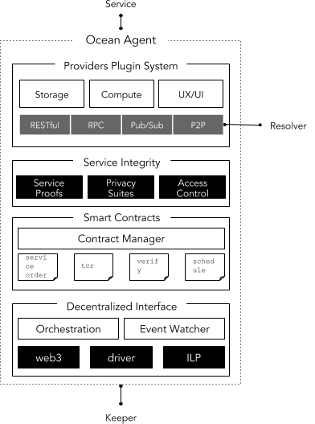
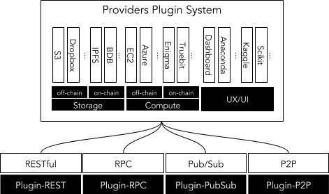
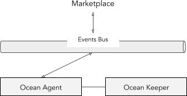
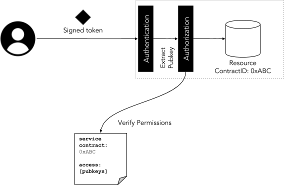
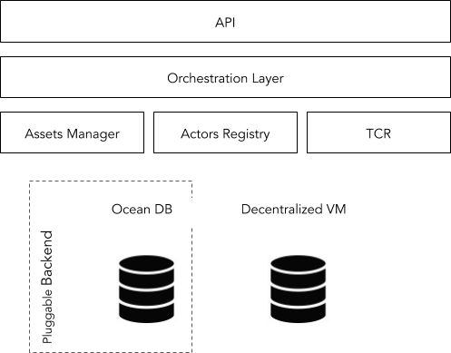

```
shortname: 4/AGENT
name: Ocean Agent Protocol Stack
type: Standard
status: Raw
editor: Aitor Argomaniz <aitor@oceanprotocol.com>
contributors: Dimitri De Jonghe <dimi@oceanprotocol.com>
```

Table of Contents
=================

   * [Table of Contents](#table-of-contents)
   * [Ocean Agent Architecture](#ocean-agent-architecture)
      * [Change Process](#change-process)
      * [Language](#language)
      * [Motivation](#motivation)
      * [Design Requirements](#design-requirements)
      * [Agent Protocol Stack](#agent-protocol-stack)
      * [Plugin System](#plugin-system)
         * [Service Plugins](#service-plugins)
         * [Interfaces](#interfaces)
      * [Service Integrity Layer](#service-integrity-layer)
         * [Service Proofs](#service-proofs)
         * [Privacy](#privacy)
         * [Access Control](#access-control)
            * [Authentication](#authentication)
            * [Authorization](#authorization)
      * [Contract Management](#contract-management)
      * [Decentralized Interface](#decentralized-interface)
         * [Orchestration Layer](#orchestration-layer)
         * [Events Watcher](#events-watcher)
         * [Data Transfer Objects](#data-transfer-objects)
      * [Connection to External Modules](#connection-to-external-modules)
         * [Ocean DB integration](#ocean-db-integration)


# Ocean Agent Architecture

This document describes the Ocean Agent Protocol Stack: the main responsibilities, functions and components.

This specification is based on [Ocean Protocol technical whitepaper](https://github.com/oceanprotocol/whitepaper).

This specification is called **AGENT** henceforth.

## Change Process
This document is governed by the [2/COSS](../2/README.md) (COSS).

## Language
The key words "MUST", "MUST NOT", "REQUIRED", "SHALL", "SHALL NOT", "SHOULD", "SHOULD NOT", "RECOMMENDED", "NOT RECOMMENDED", "MAY", and "OPTIONAL" in this document are to be interpreted as described in [BCP 14](https://tools.ietf.org/html/bcp14) \[[RFC2119](https://tools.ietf.org/html/rfc2119)\] \[[RFC8174](https://tools.ietf.org/html/rfc8174)\] when, and only when, they appear in all capitals, as shown here.

## Motivation

The goal of this document is to describe the responsibilities and architecture of an Ocean AGENT node, also referenced as the PROVIDER in some documents.


In the Ocean network, AGENTS implement a variety of actions that contribute data services to the network.
For example: AGENTS can provide access to services such as data sets, algorithms, storage, computational power, service curation,
verification, market makers and so on.

AGENTS need to be able to talk to each other as well as to the network KEEPERS.
The network architecture talks about that, see [3/ARCH](../3/README.md).
Hence, part of the intention of this document is to describe the different interaction patterns between them.

At the same time, the AGENT implements an internal architecture based on different layers and modules. 
This document MUST provide a common framework and definition to drive technical implementations. 

The detailed components SHOULD be used as building blocks, which allow the synthesis of different scenarios.

## Design Requirements

AGENT is client-side software. The main responsibilities of AGENT are:

* Facilitate the integration of various Ocean services 
* Enable communication between AGENTS and with the KEEPER network
* Expose a common and stable interface to network consumers
* Integrate with external metadata providers
* Integrate with external services or providers (compute, data, metadata, ...)
* Expose a cryptographically secure interface for off-chain service proofs, privacy and access control 
* Implement necessary identity components for authentication and authorization of AGENTS
* Compose valid transactions to interact with the KEEPER network 
* Orchestrate lower-level KEEPER interactions exposed by a higher level interface
* Subscribe to relevant events raised by the KEEPER network and trigger corresponding actions
* Expose some API's providing alternative consumption mechanisms (synchronous/asynchronous)

## Agent Protocol Stack

This document uses as reference and starting point the network architecture defined by the [3/ARCH](../3/README.md) (ARCH).

The **Ocean Agent** (aka **AGENT**) is client-side software 
that communicates (REST, RPC, etc.) with both other AGENTS and KEEPERS in the network. 

AGENTS also bring data services to the Ocean network. 
Reciprocally, the same software is used for consuming services and managing the related transactions.

Independent of the API consumption mechanism, the AGENT is in charge of building the internal 
object models using the incoming messages provided by the **KEEPER components interfaces**.
 
This marshaling and un-marshaling operations will facilitate a common internal data model across the entire application. 


The Agent will also orchestrate the interaction with the KEEPER components, facilitating the provision of a high level view 
from the consumer side, interacting with the decentralized VM and the **Ocean DB** (Metadata storage).



## Plugin System

The plugin system describes how the AGENT interfaces with the outside world - ie. the data service tools.
Components at this level are responsible for:

1. Registration and discovery of services and agents
2. Contract selection and negotiation details
3. (Remote) communication and integration with service interfaces, tools and libraries.


As an example, consider the following data delivery scenario:

- A data PROVIDER publishes a datum ASSET offered together 
with CONNECTION details such as authorization and encryption.

- A data CONSUMER discovers the offering through a user interface.

- Both parties SHOULD negotiate and agree on CONTRACT and CONNECTION details.

- Once the CONTRACT is deployed and signed, the data CONSUMER MUST ACCESS 
the datum using the CONNECTION details. 
The data PROVIDER MAY listen to state changes of the CONTRACT 
and perform callback functions for CONNECTION management and responding 
to cryptographic CHALLENGES.

- At any point the CONTRACT resolution is triggered and the provider MAY revoke ACCESS.

The high level description as well as the developer and user experience for this scenario
SHALL be implemented at this level. 

### Service Plugins

Ocean Agent SHOULD provide a pluggable mechanism that allows interaction with external providers. 
This could be:

* **Computing Providers** - In charge of providing off-chain or on-chain computing services. 
For example Amazon EC2, Fitchain, Truebit, Weeve, XAIN, Enigma, etc.
* **Storage or Data Providers** - In charge of providing storage services off-chain or on-chain. 
Like Amazon S3, IPFS, BigchainDB, SWARM, etc.
* **UX/UI Providers** - In charge of providing interfacing capabilities (i.e. command line, GUI, etc.) with the system.

Because it is cumbersome to define upfront the different providers to integrate, it is important 
to implement a pluggable mechanism that facilitates the extension of connections supported by the system.




In the above picture the storage, compute and UX/UI interfaces have the responsibility of 
modelling the interaction with external systems. Using this approach, supporting additional 
providers would only require the implementation of communication with a new provider.
From this point onwards, the integration with the rest of the system is abstracted.

Depending on the implementation of the system, the usage of one plugin or another could be made through configuration or using a dependency injection.

### Interfaces

Interfaces are in charge of interacting with off-chain services, libraries, cloud/micro-services and more.
In essence, they connect relevant services that can bring value to the ocean network.
The interfaces expose the service integrity layer that allows data services and consumers to interact with service contracts.
   

Initially the AGENT will expose an HTTP RESTful API, but it is designed such that it can expose the API's or consume requests in different ways. Because of this, the AGENT should expose the API's in different formats that permit integration of mechanisms 
depending on the use case. The main interaction mechanisms are:
 
* **Request/Response** - Provided by the RESTful and the RPC interfaces that facilitate request/response integration. 
The API will expose different HTTP methods implementing the defined actions.


* **Async Websocket** - Provided by the Websocket interface. This is useful when users need to be subscribed 
to the changes happening in the KEEPER level. For example, if a change in a contract is happening. 


* **Event Driven** - Provided by a Pub/Sub interface. In some scenarios where the execution of an action 
can take some time (more than about 2 seconds), it is recommended to allow for async consumption mechanisms. 
This could be an optimal configuration when the Ocean AGENT is running in conjunction with a Marketplace.




* **P2P** - Provided by a Peer-to-Peer interface. It is in charge of maintaining peer-to-peer communication between AGENTS. This communication can be used to implement:
  - Direct messaging between parties - Allowing, for example, the agreement on contract terms before formalizing the contract, or the direct sharing of Asset consumption information between the provider and the consumer 
  - Assets transferring between different Ocean actors - For example, when actors are providing access to some asset directly without using a third-party provider.

  


## Service Integrity Layer

The Service Integrity layer MUST provide a cryptographically secure layer that ensures the correct delivery of data services.

This layer can be regarded as a cryptographic membrane for off- to on-chain communication and vice versa.
Here one finds the generation of service delivery proofs to resolve service contracts as well as 
service access control and privacy negotiation mandated by service contracts.

Components in this layer grant service access, set up privacy protocols and deliver proofs of service delivery.

### Service Proofs

Service proofs are meant to publicly verify the off-chain data services and connections. 
Multiple data service proofs that enhance data and compute integrity can be foreseen in this component. 
The AGENT is responsible for generating the relevant proofs and interacting with all the different providers, 
enabling the challenge/retrieve mechanisms that are required for Proofs of Service.

Using the [Service Plugins](#service-plugins) system, this module will interface with off-chain providers to obtain the needed proofs.

Details of the service proofs will be discussed in an independent OEP.

### Privacy

The privacy layer SHALL take care of end-to-end privacy for messages traveling over a CONNECTION between AGENTS.
Various protocols are available to enhance privacy of data services such as encryption, 
homomorphic encryption (HE), trusted execution environments, on-premise, multiparty (MPC) and zero-knowledge computation (ZK).

In this layer AGENTS MAY negotiate privacy details for the CONNECTION.

Due to limited capabilities of privacy suites like MPC, HE and ZK, 
not all service capabilities at the application level WILL be supported.

The AGENT WILL implement a Privacy Protocol that negotiates the privacy requirements between parties.
In a non-homogeneous network, different nodes can provide alternative mechanisms (hardware or software), 
implementing different levels of privacy capabilities.

In such a scenario, it can be assumed that the different users running Ocean AGENTS MAY require and implement 
different privacy capabilities to negotiate with other agents. This means that each AGENT WILL define a list 
of the **"privacy systems"** supported.

In order to establish a successful connection, two different AGENTS SHOULD share the information about their supported 
privacy suits using a handshake protocol. If they have a common or compatible method, the exchange of messages can
be bi-directionally encoded and decoded. 


Details of the privacy module will be discussed in an independent OEP.

### Access Control

Service CONTRACTS in the Ocean network are the basis for access permissions between AGENTS.
The access layer foresees CONTRACT-based authentication and authorization for end-to-end CONNECTIONS.

The way access can be granted depends heavily on the type of data service and MAY include
signed tokens, signed URLs, on-chain role-based access control (RBAC), OAuth and so forth.



Access control systems connected to Ocean network are
_Authenticated_ and _Authorized_ in the system, allowing (or denying) the management of the resources.

In general, authentication is the process of validating that something really is what it claims to be. 
Authorization refers to rules that determine what each actor is allowed to do.  

Details of the access module are discussed in the [On-Chain Access Control OEP](../10/README.md)

#### Authentication

In the AGENT scope, the authentication layer is very thin, and it is in charge mainly of 
verifying the minimal identity information (public key, DID, openID, ...) associated to the transactions.

In every HTTP API interaction, the component integrating the API SHOULD send his public key as part 
of the HTTP request using the ```Authorization``` HTTP Header 
(see [RFC 7325](https://tools.ietf.org/html/rfc7235#page-7)).

All the requests giving invalid authentication parameters will return a **HTTP 401 Status code: Unauthorized**. 

#### Authorization

In the authorization phase it is necessary to validate that an actor is able to execute a specific action 
(i.e. access a data service or modify the metadata information of a specific asset). 

On-chain authorization requires information associated to ownership of the resources to be stored on-chain. 

The authorization will be implemented as an on-chain access control module driven by
service contracts that are deployed on the decentralized VM. 

The access control module implements the association between the service session information and the method execution. 
Service contracts in the decentralized VM component dictate the service access and form the basis for the 
authentication layer. It includes answers the following questions:

* Does the connection request originate from the owner of the resource (```msg.sender == owner```)? 
The ownership of a resource permits the execution of highly restricted operations 
on the resource (like administrator rights to manage the service).
* In which context can the user sending the request access (read or write) the resource? 
The resource can have an associated Access Control List (ACL) defining what can be done and when. 


## Contract Management 

The contract management layer oversees the coordination of a service CONTRACT between all involved AGENTS and KEEPER networks.

Example: Contract protocols include peer-to-peer escrow contracts, marketplace-based contracts, 
as well as CONTRACT resolution mechanisms such as judging and verification.

Details of the contract management will be discussed in an independent OEP.

## Decentralized Interface

The decentralized interface layer allows modules to create sufficient token and network specific components such as wallets and drivers.
This layer provides account management libraries and ensures that ledger-specific transactions can be composed and signed.

This layer SHOULD also listen to events generated by state changes on the KEEPER 
and provide necessary callbacks and hooks. 

Details of the identity layer will be discussed in an independent OEP.

### Orchestration Layer

Service contracts can be composed of multiple components, workflows and networks.
The _orchestration layer_ is in charge of composing and keeping track of complex workflows.
These workflows are a result of the interactions of multiple service executions that use 
the incoming requests and events as inputs. 
Some scenarios require the execution of multiple steps before completion, for example:

* Contract Settlement - When an API request is received providing a Proof of Service, the Ocean AGENT requires:
  - Storage of the Proof of Service information on-chain
  - Validation of whether all the Proof of Services were correctly provided such that the state of the contract can be updated to Settled
  - Notification to all the contract parties.
* External DB integration - If an external backend is provided, the Orchestration Layer will invoke the method to persist the objects sent to the Decentralized VM.

The Orchestration Layer acts as a mediator between different components and can be implemented in two possible ways:

* Using a sync orchestration layer, abstracting/encapsulating the execution of multiple components 
using a [Mediator pattern](https://en.wikipedia.org/wiki/Mediator_pattern). 
The mediator can execute all the steps involved in one execution workflow.
* Evolving the Mediator pattern to introduce a pub/sub mechanism. 
In that case, the mediator publishes a new event in a specific topic of the Events Bus. 
Multiple subscribers can listen to that topic implementing the behaviour of the individual phases. 
Those subscribers can emit events to different topics to provide notification on the state of their actions.


### Events Watcher

An important part of the smart contracts implementation in the decentralized VM is the triggering of _events_. 
Events expose notifications from the KEEPERS network when relevant actions happen 
(i.e. a contract is signed, an asset is curated, etc.).

From the AGENT side, the Events Watcher module will be in charge of watching those events 
to trigger further actions. 


The AGENT will provide the interfaces to:

* Subscribe to all the movements related with an address (FROM or TO) and filtered by TOPIC. It allows:
  - Subscription to all the events sent by an actor (FROM)
  - Subscription to all the events sent to a smart contract address (TO)
  - The combination of the previous two
  - Filtering by TOPIC (specific event)
* Retrieve all the historic transactions related to an address.  

### Data Transfer Objects

The KEEPER interface module should implement an extensible interface system facilitates different 
communication protocols to establish the communication between the Ocean AGENT and the KEEPER network. 
This component is in charge of the following capabilities:

* Interacting with the KEEPER components
* Composing the transactions payload necessary by the KEEPER nodes
* Orchestrating the execution of multiple KEEPER requests when it is necessary

Initially, HTTP RPC is the easiest candidate to integrate in the communication with the Decentralized VM. 

To interact with the Smart Contracts, the AGENT will provide different [Data Transfer Objects](https://en.wikipedia.org/wiki/Data_transfer_object) (DTO). 
These will abstract the integration with the contracts in an easier way.

## Connection to External Modules

The AGENT will connect to:

* **Decentralized VM** - Provides the smart contracts implementing the core business logic
* **Ocean DB** - Interfaces with an external and pluggable Metadata storage system
* **Ocean Worker** - Accepts cryptographic challenges and validations via p2p commands. 

Those capabilities will be integrated from the AGENT using different protocols. 

### Ocean DB Integration

Capabilities such as metadata publishing, discovery, and caching require a data store with query capabilities.
Fully decentralized data storage is prone to costly infrastructure requirements, consistency issues and 
data liability. Hence Ocean protocol shall not mandate decentralized storage but, rather, make it a pluggable option.

Some characteristics about the Ocean DB integration:

* Ocean DB as backend is **optional** and **pluggable**. This means that an AGENT MUST be able to run without any Ocean DB as a backend
* The AGENT COULD provide the interfaces to implement different storage implementations and integrate them as a backend
* Different users or marketplaces MAY require different storage systems integrataion, 
providing different capabilities. The interface MUST describe a basic interface in order to be integrated in the AGENT
* Because of the totally flexible and agnostic approach of the AGENT, 
the setup of interfaces facilitates the integration of centralized (Oracle, Kafka, Elastic Search, etc.) or decentralized backends (BigchainDB, IPFS, etc.)
* The backend could be local, distributed or decentralized depending on the system integrated.



The AGENT SHALL provide a mechanism to check the config parameters given during the initial stages of the process.
Depending on those parameters, the AGENT WILL invoke the plugin at runtime if a backend is provided.

The Orchestration Layer WILL be in charge or invoke the optional backend if it is provided. 
As a rule of thumb, the Decentralized VM is always the main storage format and source of truth of the system.


