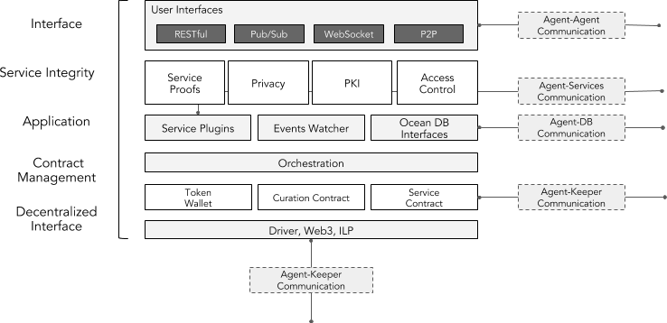
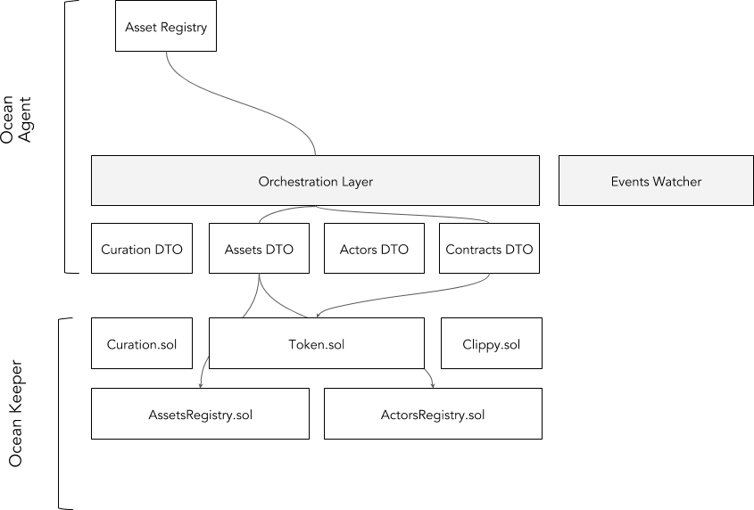

```
shortname: 4/AGENT
name: Ocean AGENT Protocol Stack
type: Standard
status: Raw
editor: Aitor Argomaniz <aitor@oceanprotocol.com>
contributors: Dimitri De Jonghe <dimi@oceanprotocol.com>
```

=================

Table of Contents
=================

   * [Table of Contents](#table-of-contents)
   * [Ocean Agent Architecture](#ocean-agent-architecture)
      * [Change Process](#change-process)
      * [Language](#language)
      * [Motivation](#motivation)
      * [High Level Architecture](#high-level-architecture)
      * [Responsibilities](#responsibilities)
   * [Logical Architecture](#logical-architecture)
      * [Interfaces](#interfaces)
      * [Service Integrity](#service-integrity)
         * [Service Proofs](#service-proofs)
         * [Privacy Management](#privacy-management)
         * [Access Control](#access-control)
            * [Authentication](#authentication)
            * [Authorization](#authorization)
         * [PKI](#pki)
            * [Accounts](#accounts)
            * [Wallets](#wallets)
      * [Application](#application)
         * [Service Plugins](#service-plugins)
      * [Events Watcher](#events-watcher)
         * [Ocean DB integration](#ocean-db-integration)
      * [Contract Management](#contract-management)
         * [Orchestration Layer](#orchestration-layer)
         * [Data Caching](#data-caching)
      * [Decentralized Interface](#decentralized-interface)


<a name="ocean-agent-architecture"></a>
# Ocean Agent Architecture

This document describes the Ocean Agent Architecture: the main responsibilities, functions and components.

This specification is based on [Ocean Protocol technical whitepaper](https://github.com/oceanprotocol/whitepaper).

This specification is called **AGENT** henceforth.

<a name="change-process"></a>
## Change Process
This document is governed by the [2/COSS](../2/README.md) (COSS).

<a name="language"></a>
## Language
The key words "MUST", "MUST NOT", "REQUIRED", "SHALL", "SHALL NOT", "SHOULD", "SHOULD NOT", "RECOMMENDED", "NOT RECOMMENDED", "MAY", and "OPTIONAL" in this document are to be interpreted as described in [BCP 14](https://tools.ietf.org/html/bcp14) \[[RFC2119](https://tools.ietf.org/html/rfc2119)\] \[[RFC8174](https://tools.ietf.org/html/rfc8174)\] when, and only when, they appear in all capitals, as shown here.


## Ocean Protocol Suite

The Ocean protocol stack has 6 layers, divided between AGENT and KEEPER.


### Application Layer

The application layer describes the AGENT interface with the outside world - ie. the data service tools.
Protocols at this level are responsible for:

1. Registry and discovery of services and agents
2. Contract selection and details negotiation
3. (Remote) communication and integration with service interfaces, tools and libraries


As an example, consider following data delivery scenario:

- A data PROVIDER publishes a datum ASSET offering together 
with CONNECTION details such as authorization and encryption.

- A data CONSUMER discovers the offering through a user interface.

- Both parties SHOULD negotiate and agree on CONTRACT and CONNECTION details.

- Once the CONTRACT is deployed and signed, the data CONSUMER MUST ACCESS 
the datum using the CONNECTION details. 
The data PROVIDER MAY listen to state changes of the CONTRACT 
and perform callback functions for CONNECTION management and responding 
to cryptographic CHALLENGES.

- At any point the CONTRACT resolution is triggered and the provider MAY revoke ACCESS.

The high level description as well as the  developer and user experience for this scenario
SHALL be implemented at this level. 

Details of the application layer are discussed in [#TODO:OEP-PLUGIN](../<PLUGIN>/README.md) 

### Service Integrity Layer

The Service Integrity layer MUST provide a cryptographically secure layer that
ensures the correct delivery of data services.

Components in this layer grant service access, set up privacy protocols and deliver proofs of service delivery.

#### Service Proofs

Service proofs are meant to publicly verify the off-chain data services and connections.
Multiple data service proofs that enhance data and compute integrity can be foreseen in this component

Details of the service proofs are discussed in [#TODO:OEP-PROOFS](../<PROOFS>/README.md) 

#### Privacy

The privacy layer SHALL take care of end-to-end privacy for messages traveling over a CONNECTION between AGENTS.
Various protocols are available to enhance privacy of data services such as encryption, 
homomorphic encryption (HE), trusted execution environments, on-premise, multiparty (MPC) and zero-knowledge computation (ZK).

In this layer both AGENTS MAY negotiate privacy details for the CONNECTION.

Due to limited capabilities of privacy suites like MPC, HE and ZK, 
not all service capabilities at the application level WILL supported.

Details of the privacy module are discussed in [#TODO:OEP-PRIVACY](../<PRIVACY>/README.md) 

#### Access Control

Service CONTRACTS in the Ocean network are the basis for access permissions between AGENTS.
The access layer foresees CONTRACT-based authentication and authorization for end-to-end CONNECTIONS.

The way access can be granted depends heavily on the type of data service and MAY include
signed tokens, signed URLs, on-chain role-based access control (RBAC), OAuth and so forth.

Details of the access module are discussed in [#TODO:OEP-ACCESS](../<ACCESS>/README.md) 


### Contract Management 

The contract management layer foresees the coordination of a service CONTRACT between all involved AGENTS and KEEPER networks.

Example contract protocols include peer-to-peer escrow contracts, marketplace-based contracts, 
as well as CONTRACT resolution mechanisms such as judging and verification.

Details of the contract management layer are discussed in [#TODO:OEP-CONTRACT-MANAGEMENT](../<CONTRACT-MANAGEMENT>/README.md) 

### Decentralized Interface

The decentralized interface layer provides modules to create sufficient token and network specific components such as wallets and drivers
This layer provides account management libraries and ensures that ledger-specific transactions can be composed and signed.

This layer SHOULD also listen to events generated by state changes on the keeper 
and provide necessary callbacks and hooks. 

Details of the identity layer are discussed in [#TODO:OEP-WALLET](../<WALLET>/README.md) 

### Validation Layer

The validation layer is where an Ocean KEEPER runs the logic of smart contracts and validates
transactions

Details of the access layer are discussed in [#TODO:OEP-VM](../<VM>/README.md) 

### Consensus Layer

This layer orchestrates decentralized coordination between KEEPERS and includes gossip protocols for inter-KEEPER communication

This layer also includes the cryptographic data structures to store state transitions.

OPTIONALLY this layer implements worker logic to validate and generate cryptographic proofs. 

Details of the access layer are discussed in [#TODO:OEP-CONSENSUS](../<CONSENSUS>/README.md) 
<a name="motivation"></a>
## Motivation

The goal of this document is to describe the responsibilities and architecture of an Ocean AGENT node. 

In the Ocean network, AGENTS implement a variety of behavior that contribute data services to the network.
For example: AGENTS can provide services such as data sets, algorithms, storage, computational power, service curation, 
verification, market makers and so on.  

AGENTS need to be able to talk to each other as well as to the network KEEPERS.
The network architecture talks about that, see [3/ARCH](../3/README.md).
Hence, part of the intention of this document is to describe the different interaction patterns between them.

At the same time, the AGENT implements an internal architecture based in different layers and modules. 
This document MUST provide a common framework and definition to drive technical implementations. 

The detailed components SHOULD be used as building blocks, allowing to synthesize different scenarios.

<a name="high-level-architecture"></a>
## High Level Architecture

This document uses as reference and starting point the network architecture defined by the [3/ARCH](../3/README.md) (ARCH).

<a name="responsabilities"></a>
## Responsibilities

AGENT is client-side software. The main responsibilities of AGENT are:

* Facilitate the integration of various Ocean services 
* Enable the communication between AGENTS and with the KEEPER network
* Exposing a common and stable interface to network consumers
* Integrate with external services or providers (compute, data, orchestration, ...)
* Exposing a cryptographically secure interface for off-chain service proofs, privacy and access control 
* Implement necessary identity components for authentication and authorization of AGENTS
* Compose valid transactions to interact with the keeper network 
* Orchestrate lower-level Keeper interactions exposing a higher level interface
* Subscribe to relevant events raised by the KEEPER network and trigger corresponding actions
* Expose some API's providing alternative consumption mechanisms (synchronous/asynchronous)

<a name="components"></a>
# Logical Architecture



The **Ocean Agent** (aka **AGENT**) is client-side software 
that communicates (REST, RPC, etc.) with both other AGENTS and KEEPERS in the network. 

Besides the communication purpose, AGENTS bring data services to the Ocean network. 
Reciprocally the same software is used for consuming the services and managing related transactions.

Independently of the API consumption mechanism, the AGENT is in charge of building the internal 
object models using the incoming messages provided by the **KEEPER components interfaces**.
 
This marshaling and un-marshaling operations will allow using a common internal data model across all the application. 

The Agent also will orchestrate the interaction with the Keeper components, allowing to provide a high level view 
from the consumer side, interacting with the decentralized VM and the **Ocean DB**.

<a name="interfaces"></a>
## Interfaces

Interfaces are charge of interacting with off-chain services, libraries, cloud/micro-services and more.
In essence, they connect relevant services that can bring value to the ocean network.
The interfaces expose the service integrity layer that allows data services and consumers to interact with service contracts.
   

Initially the AGENT will expose a HTTP RESTful API, but is designed to expose the API's or consume requests in different ways.
Because of that the AGENT should expose the API's in different formats allowing integration mechanisms 
that can be used depending on the use case. The main interaction mechanisms are:
 
* **Request/Response** - Provided by the RESTful and the RPC interfaces. Those allow a request/response integration. 
The API will expose different HTTP methods implementing the defined actions.


* **Async Websocket** - Provided by the Websocket interface. Useful when some users need to be subscribed 
to the changes happening in the KEEPER level. For example, if a change in a contract is happening. 


* **Event Driven** - Provided by a Pub/Sub interface. In some scenarios where the execution of an action 
can take some time (more than 2 or seconds) could be recommended to allow async consumption mechanisms. 
This could be an optimal configuration when the Ocean Agent is running in conjunction with a Marketplace.


* **P2P** - Provided by a Peer to Peer interface. in charge of maintain peer to peer communication between AGENTS. This communication can be used to implement:
  - Direct messaging between parties - Allowing for example the agree Contracts terms before to formalize the contract or direct sharing of Assets consumptions information between the provider and the consumer 
  - Assets transferring between different Ocean actors - In the actors that are giving access directly to some assets without using a third-party provider, would be possible to share directly the Assets between parties.

 
 


<a name="service-integrity"></a>
## Service Integrity
The Service Integrity layer can be regarded as a cryptographic membrane for off- to on-chain communication and vice versa.
Here one finds the generation of service delivery proofs to resolve service contracts as well as 
service access control and privacy negotiation mandated by service contracts.
  
<a name="service-proofs"></a>
### Service Proofs

Service proofs are meant to publicly verify the off-chain data services and connections. 
Multiple data service proofs that enhance data and compute integrity can be foreseen in this component. 
The AGENT is responsible to generate the relevant proofs and interact with all the different providers, 
enabling the communications allowing to challenge/retrieve the required Proofs of Service.

Using the [Service Plugins](#service-plugins) system, this module will interface with off-chain providers to obtain the proofs needed.

<a name="privacy-management"></a>
### Privacy Management

The AGENT WILL implement a Privacy Protocol allowing to negotiate the privacy requirements between parties.
In a non-homogeneous network, different nodes can provide alternative mechanisms (hardware or software) 
implementing some privacy capabilities.

In such scenario of one can assume that different users running Ocean Agents can require and implement 
different privacy capabilities to negotiate with other agents. This means that each AGENT will define a list 
of the **"privacy systems"** supported. For example:

```
privacy {
	mpc= "sign,encrypt,query"
	tee= "intel,arm"
	zk= "syft,libsnarks"
}
```

In order to establish a successful connection, 2 different AGENT's SHOULD share the information about their supported 
privacy suits using a handshake protocol. If they have a common or compatible method, the exchange of messages can
be bidirectionally encoded and decoded. 

<a name="access-control"></a>
### Access Control


Access control systems provides services connected to Ocean network the ability 
_Authenticated_ and _Authorized_ in the system, allowing (or denying) the management of the resources.

In general, authentication is the process of validating that somebody really is who he claims to be. 
Authorization refers to rules that determine who is allowed to do what.  

<a name="authentication"></a>
#### Authentication

In the AGENT scope the authentication layer is very thin, and it's in charge mainly of 
verifying the minimal identity information (public key, DID, openID, ...) associated to the transactions.

In all the HTTP API interactions, the component integrating the API SHOULD send his public key as part 
of the HTTP request using the ```Authorization``` HTTP Header 
(see [RFC 7325](https://tools.ietf.org/html/rfc7235#page-7)).

All the requests giving invalid authentication parameters will return a **HTTP 401 Status code: Unauthorized**. 

<a name="authorization"></a>
#### Authorization

In the authorization phase it's necessary to validate that a user is able execute a specific action, 
ie. access a data service or modify the metadata information of a specific asset. 

On-chain authorization requires information associated to ownership of the resources to be stored on-chain.


The authorization will be implemented as an on-chain access control module driven by
service contracts that are deployed on the decentralized VM. 

The access control module implement the association between the service session information and the method execution. 
Service contracts in the decentralized VM component dictate the service access and form the basis for the 
authentication layer. It includes to answer the following questions:

* Does the connection request originated from the owner of the resource (```msg.sender == owner```)? 
The ownership of a resource allows to execute highly restricted operations 
on the resource (like administrator rights to manage the service).
* In which context can the user sending the request access (read or write) to the resource? 
The resource can have associated a Access Control List (ACL) defining who can do what and when. 
* Can the user sending the request change the ownership of the resource?

<a name="pki"></a>
### Private Key Infrastructure (PKI)

<a name="accounts"></a>
#### Accounts

An account is a human-readable identifier (public key) stored on the decentralized VM. 
Every transaction has its permissions evaluated under the configured authority of an account. 
The grants of each account will be validated by the access control system. 
The user permissions must be met for a transaction signed under that authority to be considered valid. 
Transactions are signed by a client that has a loaded and unlocked a wallet. 

The AGENT will provide the capabilities to manage the accounts creation. 
It will use the [BIP32](https://github.com/bitcoin/bips/blob/master/bip-0032.mediawiki) definition for the creation of wallets and accounts.
An example implementation is the **Accounts API** provided by the **Parity** client.

This will be detailed in the [Actors Registry OEP 13](../13/REG). 

<a name="wallets"></a>
#### Wallets

The wallet component is in charge of protecting and using sensitive information such as private keys. 
These keys may or may not be granted permission to an account authority on the KEEPER level.
A wallet manages a private/public key pair which is used to cryptographically sign transactions and 
prove ownership on the network. The Ocean Agent will provide the wallet capabilities that allows 
the monetary interactions in the network.

The reference for wallet definitions to be used are:

* [BIP32](https://github.com/bitcoin/bips/blob/master/bip-0032.mediawiki) - Describes hierarchical deterministic 
wallets (or "HD Wallets"). Those are wallets which can be shared partially or entirely with different 
systems, each with or without the ability to spend coins. 
* [BIP39](https://github.com/bitcoin/bips/blob/master/bip-0039.mediawiki) - Describes the 
implementation of a mnemonic code or mnemonic sentence, a group of easy to remember words, 
for the generation of deterministic wallets.
* [BIP44](https://github.com/bitcoin/bips/blob/master/bip-0044.mediawiki) - Defines a logical 
hierarchy for deterministic wallets based on an algorithm described in BIP32, 
and purpose scheme described in [BIP43](https://github.com/bitcoin/bips/blob/master/bip-0043.mediawiki).

As an example, the management of the Wallets can be implemented using the **Parity** client.
More information will be provided in the [Actors Registry OEP](../13/README.md) and [Wallet OEP](../README.md). 


<a name="application"></a>
## Application

<a name="service-plugins"></a>
### Service Plugins

Ocean Agent SHOULD provide a pluggable mechanism that allows interaction with external providers. 
This could be:

* **Computing Providers** - In charge of providing off-chain or on-chain computing services. 
For example Amazon EC2, Truebit, Weeve, XAIN, Enigma, etc.
* **Storage or Data Providers** - In charge of providing storage services off-chain or on-chain. 
Like Amazon S3, IPFS, BigchainDB, SWARM, etc.
* **UX/UI Providers** - In charge of providing visual interfacing with the system.

Because is cumbersome to define upfront the different providers to integrate, it's important 
to implement a pluggable mechanism allowing to extend the systems supported by the system.


In the above picture the storage, computing and UX/UI interfaces have the responsibility of 
modelling the interaction with external systems. Using this approach, supporting additional 
providers would only require the implementation of the communication with a new provider.
From there onwards, the integration with the rest of the system is abstracted.

Depending on the implementation of the system, the usage of one plugin or another one 
could be made by configuration or using dependency injection.

```java
public StorageProvider interface {

    bool store(Asset asset);
    Asset retrieve(URL url);
    ..
}
```

<a name="events-watcher"></a>
## Events Watcher

An important part of the smart contracts implementation in the decentralized VM is the triggering of _events_. 
Events expose notifications from the KEEPERS network when relevant actions happen 
(ie. a contract is signed, an asset is curated, etc.).

From the AGENT side, the events watcher module will be in charge of watching those events 
to trigger further actions. 

```javascript
var subscription = web3.eth.subscribe('logs', {
    address: '0x123456..',
    topics: ['0x12345...']
}, function(error, result){
    if (!error)
        console.log(log);
});

// unsubscribe from an event stream
subscription.unsubscribe(function(error, success){
    if(success)
        console.log('Successfully unsubscribed!');
});
```

The AGENT will provide the interfaces to:

* Subscribe to all the movements related with an address (FROM or TO) and filtered by TOPIC. It allows:
  - Subscribe to all the events sent by an actor (FROM)
  - Subscribe to all the events sent to a smart contract address (TO)
  - The combination of the previous two
  - Filter by TOPIC (specific event)
* Retrieve all the historic transactions related an address  


<a name="ocean-db-integration"></a>
### Ocean DB integration

Capabilities such as metadata publishing, discovery, caching require a data store with query capabilities.
Fully decentralized data storage is prone to costly infrastructure requirements, consistency issues and 
data liability. Hence Ocean protocol shall not mandate a decentralized storage but rather make it a pluggable option.

Some characteristics about the Ocean DB integration:

* Ocean DB as backend is **optional** and **pluggable**. This means that an AGENT MUST be able to run without any Ocean DB as backend
* The AGENT COULD provide the interfaces to implement different storage implementations and integrate them as backend
* Different users or marketplaces MAY require to integrate different storage systems, 
providing different capabilities. The interface MUST describe a basic interface in order to be integrated in the AGENT
* Because of the totally flexible and agnostic approach of the AGENT, 
defining only the interfaces allows to integrate a centralized (Oracle, Kafka, Elastic Search, etc.) or decentralized backend (BigchainDB, IPFS, etc.)
* The backend could be local, distributed or decentralized depending of the system integrated


The AGENT SHALL provide a mechanism to check the config parameters given during the start-up of the process.
Depending on those parameters the AGENT will invoke the plugin at runtime if a backend is provided.

Below you can find an example of a configuration file enabling the integration with an external system: 

```properties

# It could be true or false, false by default
agent.backend.enabled=true

agent.backend.implClass=com.example.mydatabase.MyDatabaseImpl

# All the options in the config tree can be passed as parameters to the backend plugin
agent.backend.config.hostname=localhost
agent.backend.config.port=1234
agent.backend.config.user=john
agent.backend.config.password=john
agent.backend.config.xxxx=WhateverNeeded

``` 

And this could be the initial definition of a generic interface:

```java

public abstract class OceanPluginFactory {
    
    public static OceanPluginFactory builder(Config config) {}
    
}

public interface OceanBackendPlugin {
    
    public boolean connect(Config conf);
    
    public boolean disconnect();
    
    public boolean isConnected();
    
    public boolean write(List<T> items);
    
}

```

The Orchestration Layer will be in charge or invoke the optional backend if it's provided. 
As a rule of thumb, the Decentralized VM is always the main and minimal storage and source of truth of the system.


<a name="contract-management"></a>
## Contract Management

<a name="orchestration-layer"></a>
### Orchestration Layer

Service contracts can be composed of multiple components, workflows and networks.  
The _orchestration layer_ is in charge of composing and keeping track of complex workflows.
These workflows are a result of the interactions of multiple service executions that use 
the incoming requests and events as inputs. 
Some scenarios require the execution of multiple steps before completion, for example:

* Contract Settlement - When it's received an API request providing a proof of service, the Ocean AGENT requires to:
  - Store the Proof of Service information on-chain
  - Validate if all the proof of services were correctly provided such that the state of the contract can be updated to Settled
  - Notify all the contract parties
* External DB integration - If an external backend is provided, the Orchestration Layer will invoke the method to persist the objects sent to the Decentralized VM.

The orchestration Layer acts as a mediator between different components and can be implemented in two possible ways:

* Using a sync orchestration layer, abstracting/encapsulating the execution of multiple components 
using a [Mediator pattern](https://en.wikipedia.org/wiki/Mediator_pattern). 
The mediator can executes one by one all the steps involved in one execution workflow.
* Evolving the Mediator pattern to introduce a pub/sub mechanism. 
In that case, the mediator publish a new event in a specific topic of the events bus. 
Multiple subscribers can listen to that topic implementing the behaviour of the individual phases. 
Those subscribers can emit events to different topics to notify the state of their actions.


<a name="decentralized-interface"></a>
## Decentralized Interface

The KEEPER will expose 3 main block of capabilities to the rest of the world:

* **Decentralized VM** - Providing the smart contracts implementing the core business logic
* **Ocean DB** - Interfacing with an external and pluggable storage system
* **Worker** - Accepts cryptographic challenges and validations via p2p commands 

Those capabilities will be integrated from the AGENT using different protocols. 

The Keeper interface module should implement an extensible interfaces system allowing to plug different 
communication protocols to establish the communication between the Ocean Agent and the the Keepers network. 
This component is in charge of the following capabilities:

* Interact with the KEEPER components
* Compose the transactions payload necessary by the Keeper nodes
* Orchestrate the execution of multiple Keeper requests when be necessary

Initially, HTTP RPC is the easiest candidate to integrate in the communication with the Decentralized VM. 

To interact with the Smart Contracts, the AGENT will provide different [Data Transfer Objects](https://en.wikipedia.org/wiki/Data_transfer_object) (DTO). 
Those will allow to abstract the integration with the contracts in an easier way.



The worker nodes will expose a p2p interface supporting some commands allowing to raise proof challenges.

The implementation of this module is highly linked to the Keeper API definition. 
