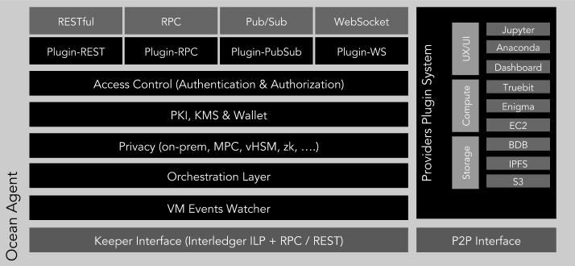
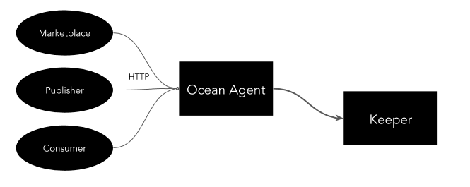
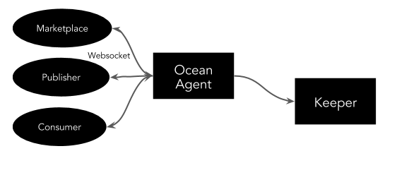
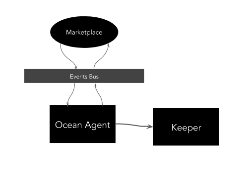
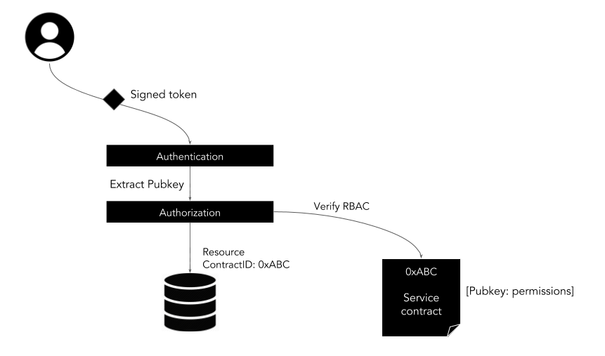
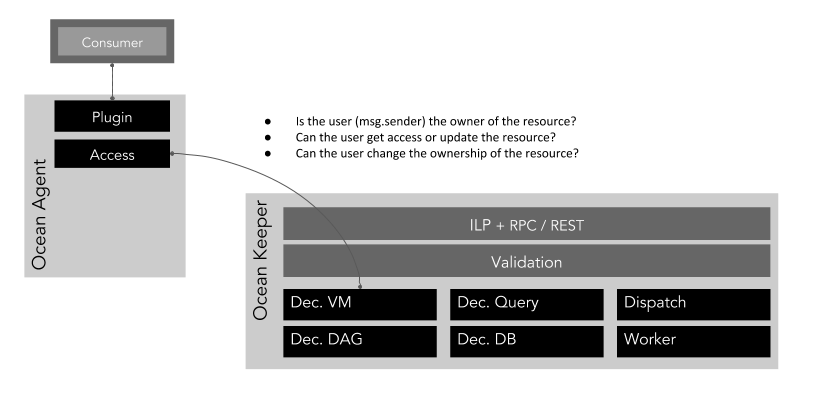

```
shortname: 5/AGENT
name: Ocean Agent
type: Standard
status: Raw
editor: Aitor Argomaniz <aitor@oceanprotocol.com>
contributors: Dimitri De Jonghe <dimi@oceanprotocol.com>
```

This document describes the Ocean Architecture. It focus in which are the main responsabilities, functions and components implementing the architecture.

This specification is based on [Ocean Protocol technical whitepaper](https://github.com/oceanprotocol/whitepaper).

The Ocean Protocol Archite specification is called **ARCH** henceforth.


## Change Process
This document is governed by the [2/COSS](../2/README.md) (COSS).

## Language
The key words "MUST", "MUST NOT", "REQUIRED", "SHALL", "SHALL NOT", "SHOULD", "SHOULD NOT", "RECOMMENDED", "NOT RECOMMENDED", "MAY", and "OPTIONAL" in this document are to be interpreted as described in [BCP 14](https://tools.ietf.org/html/bcp14) \[[RFC2119](https://tools.ietf.org/html/rfc2119)\] \[[RFC8174](https://tools.ietf.org/html/rfc8174)\] when, and only when, they appear in all capitals, as shown here.

## Goals
The primary goal of AGENT is to detail the internal architecture and interfaces exposed by the Ocean Agent node, and the elements composing the Ocean Keeper functionalities. 
It MUST to provide a common framework used describing the technical solution to put in place. 

All the different components described, SHOULD be used as building blocks, allowing to compose the different scenarios using those.

## High Level Architecture
This document use as reference and starting point the Architecture defined by the [3/ARCH](../3/README.md) (ARCH).

  
# Ocean Agent Architecture

## Responsibilities

Ocean Agent is a stateless thin abstraction layer. Main responsibilities are:

* Exposing a common and stable API to the network consumers. 
* Build the authorization & authentication mechanism to identify the user using the client
* Manage the user PKI information
* Compose transactions that are send to the keeper. 
* Orchestrate lower-level Keeper interactions exposing a higher level API
* Subscribe to some Smart Contract events raised by the Keeper and trigger actions responding to that
* Integrate with external services or providers (Compute, Data, ..)
* Simple input validation. Throttling and spam prevention is done at the VM validation level in the keeper. 
* Expose some API’s providing alternative consumption mechanisms (synchronous/asynchronous)

## Components



The **Ocean Agent** is a software application receiving incoming messages (REST, RPC, etc.) related with the Ocean Network interactions, and producing some output messages after interact with the **Ocean Keeper components**. 
Independently of the API consumption mechanism, the Ocean Agent is in charge of building the internal object models using the incoming messages provided by the **Keeper components interfaces**. 
This marshaling and unmarshaling operations will allow using a common internal data model across all the application. 
The Agent also will orchestrate the interaction with the Keeper components, allowing to provide a high level view from the consumer side, interacting with the decentralized VM and the Ocean DB.

### Interfaces

In charge of receiving the external requests to interact with the system. Initially the Ocean Agent will expose a HTTP RESTful API, but is designed to expose the API’s or consume requests in different ways.
Because of that the Ocean Agent should expose the API’s in different formats allowing integration mechanisms that can be used depending on the use case. The initial consumption mechanisms could be:
 
* **Request/Response** - Provided by the RESTful and the RPC interfaces. Those allow a request/response integration. The API will expose different HTTP methods implementing the defined actions.



* **Async Websocket** - Provided by the Websocket interface. Useful when some actors need to be subscribed to the changes happening in the database. For example, if a change in a contract is happening. 



* **Event Driven** - Provided by a Pub/Sub interface. In some scenarios where the execution of an action can take some time (more than 2 or seconds) could be recommended to allow async consumption mechanisms. This could be an optimal configuration when the Ocean Agent is running in conjunction with a Marketplace.



#### Communication with Keeper

The keeper will expose 3 main block of capabilities to the rest of the world:

* **Decentralized VM** - Providing the Smart Contracts implementing the core business logic
* **Ocean DB** - Storing the Assets, Actors, etc. information
* **Worker** - Accepts challenges via p2p commands 

Those capabilities will be integrated from the Ocean Agent using different protocols. 

The Keeper interface module should implement an extensible interfaces system allowing to plug different communication protocols to establish the communication between the Ocean Agent and the the Keepers network. This component is in charge of the following capabilities:

* Interact with the Keeper components (Decentralized VM, Ocean DB)
* Compose the transactions payload necessary by the Keeper nodes
* Orchestrate the execution of multiple Keeper requests when be necessary

Initially, HTTP RPC is the easiest candidate to integrate in the communication with the Decentralized VM. A part of HTTP RPC, in following iterations this component could interface with HTTP RESTful API’s and using the Interledger Protocol (ILP).

Regarding the Ocean DB, the communication can be establish using HTTP RESTful interfaces.


The worker nodes will expose a p2p interface supporting some commands allowing to raise proof challenges.

The implementation of this module is highly linked to the Keeper API definition. 

#### Agents P2P communication

This module is in charge of maintain peer to peer communication between Ocean Agents. This communication can be used to implement: 
     
* Direct messaging between parties - Allowing for example the agree Contracts terms before to formalize the contract or direct sharing of Assets consumptions information between the provider and the consumer. 
* Assets transferring between different Ocean actors - In the actors that are giving access directly to some assets without using a third-party provider, would be possible to share directly the Assets between parties.
     
The implementation of the P2P communication is highly related with the existing p2p libraries. 


#### Interfaces with external providers

Ocean Agent should provide a pluggable mechanism allowing to interact with external providers. It could be:

* **Computing Providers** - In charge of providing off-chain or on-chain computing services. For example Amazon EC2, XAIN, Enigma, etc.
* **Storage or Data Providers** - In charge of providing storage services off-chain or on-chain. Like Amazon S3, IPFS, etc.
* **UX/UI Providers** - In charge of providing visual interfacing with the system.

Because is difficult to define upfront the different providers to integrate, it’s important to implement a pluggable mechanism allowing to extend the systems supported by the system.


In the above picture the Storage, Computing and UX/UI interfaces have the responsibility of modelling the interaction with the external systems. Having this approach, support additional providers would require only the implementation of the communication with the new provider, but the integration with the rest of the system should be simpler.

Depending of the implementation of the system, the usage of one plugin or another one, could be made by configuration or using dependency injection.

```java
StorageProvider interface {

    bool store(Asset asset);
    Asset retrieve(URL url);
    ..
}
```

## Access Control




Access Control system implements the architecture where external users or applications are Authenticated and Authorized in the system, allowing (or denying) the management of the resources.

In general, authentication is the process of validating that somebody really is who he claims to be. Authorization refers to rules that determine who is allowed to do what.  

### Authentication

In this Ocean Agent side the authentication layer is very thin, and it’s in charge mainly of verifying the public key information associated to the transactions.

### Authorization

In the authorization phase it’s necessary to validate that user is able to implement a specific action, ie. modify the metadata information of a specific asset. To implement this validating it’s necessary to use the information associated to the ownership of the resources, it’s stored on-chain.



The authentication will be implemented in the conjunction between the Access Control layer and the Decentralized VM component running in the Keeper side. 

The Access Control layer implement the association between the user information, validated in the authentication layer, and the method execution. 
The Decentralized VM component, using the validations implemented in the Smart Contracts, and the associating between the resources and the owners or users able to access the resources, will implement the validations allowing to authorize the user. It includes to answer the following questions:

* Is the user sending the request the owner of the resource (msg.sender == owner)? The ownership of a resource, typically enable to the owner execute the high restricted operations related with the resource (like transfer the ownership or updating data).
* Can the user sending the request access (read or write) to the resource? The resource can have associated a Access Control List (ACL) defining who can do what. 
* Can the user sending the request to change the ownership of the resource?


## PKI

### Accounts

An account is a human-readable identifier (public key) stored on the decentralized VM. Every transaction has its permissions evaluated under the configured authority of an account. The grants of each account will be validated by the RBAC system. The user permissions must be met for a transaction signed under that authority to be considered valid. Transactions are signed by utilizing a client that has a loaded and unlocked a wallet. 

Ocean Agent will provide the capabilities to manage the accounts creation. It will use the [BIP32](https://github.com/bitcoin/bips/blob/master/bip-0032.mediawiki) defition for the creation of those.

### Wallets

Wallet component is in charge of protects and makes use of your keys. These keys may or may not be granted permission to an account authority on the blockchain.
A wallet manages a private/public key pair which is used to cryptographically sign transactions and prove ownership on the network. The Ocean Agent will provide the wallet capabilities that allows the monetary interactions in the network.

The reference for wallet definitions to be used are:

* [BIP32](https://github.com/bitcoin/bips/blob/master/bip-0032.mediawiki) - It describes hierarchical deterministic wallets (or "HD Wallets"). Those are wallets which can be shared partially or entirely with different systems, each with or without the ability to spend coins. 
* [BIP39](https://github.com/bitcoin/bips/blob/master/bip-0039.mediawiki) - It describes the implementation of a mnemonic code or mnemonic sentence, a group of easy to remember words, for the generation of deterministic wallets.
* [BIP44](https://github.com/bitcoin/bips/blob/master/bip-0044.mediawiki) - Defines a logical hierarchy for deterministic wallets based on an algorithm described in BIP32, and purpose scheme described in [BIP43](https://github.com/bitcoin/bips/blob/master/bip-0043.mediawiki).

The main methods to be provided are:

* **New wallet** - It creates a new wallet in the system. It is saved in encrypted format, passphrase must be provided
* **Update wallet** - It updates an existing wallet. The passphrase must be provided to unlock the account and another to save the updated file
* **Import wallet** - Imports an unencrypted private key from a keyfile and creates a new wallet. The keyfile should contain an unencrypted private key in hexadecimal format.
* **List wallets** - List the existing wallets in the scope of the Ocean Agent

It’s necessary to check about the security limitations of os.urandom, which depends on the version of Python, and the operating system. Some implementations rely on it.

PyWallet provides a reference implementation.

## Privacy Management

TODO: Protocol to negotiate privacy requirements

## Events Watcher

An important part of the Smart Contracts implementation in the Decentralized VM is the triggering of Events. Those events could expose system notifications when some relevant actions are happening (ie. a new Asset is registered, an Asset is curated, etc.).

From the Ocean Agent side, the Events Watcher component will be in charge of watching those events to trigger some further actions. 

```javascript
var subscription = web3.eth.subscribe('logs', {
    address: '0x123456..',
    topics: ['0x12345...']
}, function(error, result){
    if (!error)
        console.log(log);
});

// unsubscribes the subscription
subscription.unsubscribe(function(error, success){
    if(success)
        console.log('Successfully unsubscribed!');
});
```

## Orchestration Layer

Using as input the incoming requests and events, the Orchestration layer is in charge on compose complex workflows as a result of the interactions of multiple service executions. Some scenarios require the execution of multiple steps before completion, for example:

* Assets Registry - When is received a request to register a new Asset, it requires to execute:
  - Register the basic Asset metadata on-chain (Decentralized VM Database)
  - Register the complete Asset metadata in the Ocean DB (Assets Registry)
  - Register the IP rights related with the Asset
* Contract Settlement - When it’s received an API request providing a proof of service, the Ocean Agent requires to execute:
  - Store the Proof of Service information on-chain
  - Check if all the proof of services were provided, in that case update the state of the contract to Settled
  - Notify all the contract parties

To implement that, the Orchestration Layer acts as a mediator between different components. The implementation of this can be implemented in two possible ways:

* Using a sync orchestration layer, abstracting/encapsulating the execution of multiple components using a [Mediator pattern](https://en.wikipedia.org/wiki/Mediator_pattern). The mediator can executes one by one all the steps involved in one execution workflow.
* Evolving the Mediator pattern to introduce a pub/sub mechanism. In that case, the mediator publish a new event in a specific topic of the events bus. Multiple subscribers can listen to that topic implementing the behaviour of the individual phases. Those subscribers can emit events to different topics to notify the state of their actions.


