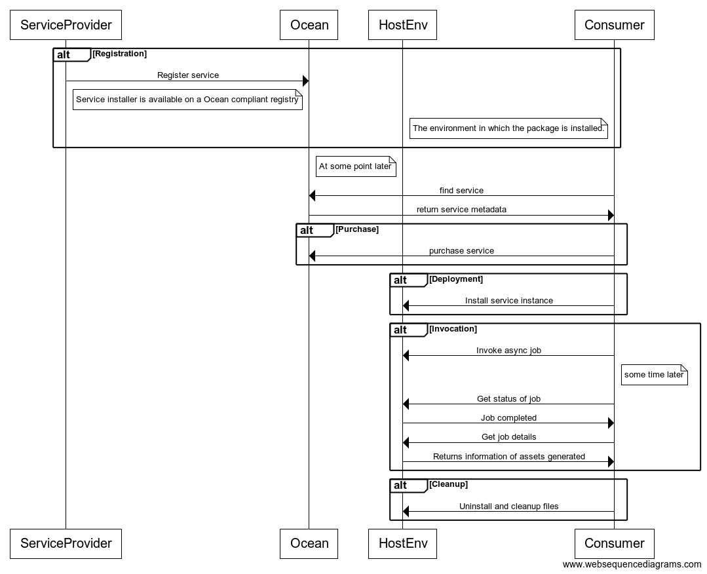

```
shortname: 6/CSAPI
name: API to register & invoke computer services   
type: Standard
status: Raw
editor: Mike Anderson <mike.anderson@dex.sg>
contributors: Kiran K <kiran.karkera@dex.sg> 
```

<!--ts-->

Table of Contents
=================

   * [Table of Contents](#table-of-contents)
   * [Service Invocation](#service-invocation)
      * [Change Process](#change-process)
      * [Language](#language)
      * [Motivation](#motivation)
      * [Application Abstraction](#application-abstraction)
      * [Constraints](#constraints)
      * [Options for a host platformOpti](#options-for-a-host-platform)
      * [Suggested Choice](#suggested-choice)
      * [Specification](#specification)

      
<!--te-->

<a name="service-invocation"></a>
# Service Invocation

The Service Invocation API (**INVOKE**) is a specification for the Ocean Protocol to register and invoke compute jobs.

INVOKE offers a general purpose computational interface

Compute services are defined as services available on the Ocean Network that

* May accept one or more Input parameters (which will typically be data assets to be used or algorithms to be run)
* Typically produce one or more Outputs (which will typically be references to generated data assets)
* Support the provision of proofs by service providers upon service completion (after which tokens in escrow may be released) 

This OEP does not prescribe the exact type of compute services offered. It is open to service provider implementations to define them, providing that they conform with this API specification
This OEP does not cover service discovery.
The OEP is not intended to apply to services where invocation / access is off-chain (e.g. high volume APIs or queue services)

This specification is based on [Ocean Protocol technical whitepaper](https://github.com/oceanprotocol/whitepaper), [3/ARCH](../3/README.md), [4/KEEPER](../4/README.md) and [5/AGENT](../5/README.md).


<a name="change-process"></a>
## Change Process
This document is governed by the [2/COSS](../2/README.md) (COSS).

<a name="language"></a>
## Language
The key words "MUST", "MUST NOT", "REQUIRED", "SHALL", "SHALL NOT", "SHOULD", "SHOULD NOT", "RECOMMENDED", "NOT RECOMMENDED", "MAY", and "OPTIONAL" in this document are to be interpreted as described in [BCP 14](https://tools.ietf.org/html/bcp14) \[[RFC2119](https://tools.ietf.org/html/rfc2119)\] \[[RFC8174](https://tools.ietf.org/html/rfc8174)\] when, and only when, they appear in all capitals, as shown here.

<a name="motivation"></a>
## Motivation

Ocean network aims to power marketplaces for relevant AI-related data services.
There is a need for a standardised **interface** for the invocation of compute services so that different implementations can be provided and invoked by users of the Ocean Protocol.

Example of data related services that could be offered by Ocean actors:

* A data cleaning service that removes noise from data
* A model training service that returns a trained model given training data
* A model verification service that returns metrics of a model's performance, given a model and a test data set.
* A consent service which filters a dataset by checking each dataset instance (e.g. a single patient's data in a healthcare study) against an external consent registry.
* A notebook hosting service which grants access to a notebook system such as Jupyter, for a fixed or variable unit of time.

It may be observed that these services

- Enable creation of dataset(s)
- Accept input dataset(s) and transform it in some fashion

The Invoke API enables

- provides Ocean users tools to transform data assets registered on the Ocean network.
- facilitates a workflow pipeline of data asset transformations.
- enables provenance tracking by Ocean provenance aware algorithms.

<a name="specification"></a>

## Application Abstraction

From a temporal perspective, the invoke API has the following types of requirements:

- Registration
  - Register the service on Ocean with metadata that declares its service capabilities.
  - Make service artifacts available (e.g. register a Docker instance of Docker hub)
  
- Deployment 
  - Deploy the package from a trusted source (e.g. install from DockerHub)
  
- Invocation
  The API needs to provide the ability to:
  - start the job providing Ocean (or other) inputs, including configuration
  - Query the status of the job
  - Stop the job (while in progress)
  
- Post invocation
  - Enable collection of results/generated outputs
  - Enable registration of generated assets on Ocean and inform the service consumer
  - Offer proof of compute job completion to verifiers
  
- Uninstallation
  - Uninstall the package.
  - Delete any data generated by the job.



The rest of the OEP is focused on the API for invocation. Deployment and other tasks are left unspecified.

## Constraints

The execution environment must support the following abstractions:

* The package must have the capability to be installed in 
  - a local machine 
  - on a publisher's cloud 
  - on a third party cloud service
* The install package must not depend on the host container for managing its dependencies. (e.g. Docker installs all the dependencies, including the correct language version and its dependencies)
* The package must be language agnostic (i.e it should not mandate that the invoke job implementation must use a particular language or language version).
* Report failures with sufficient information to aid consumer debugging

### Service Options

* The service may be offered free or for a price
* The service may be offered in trusted mode or trustless mode (backed by Service Execution Agreements) 
* the service must be identified with its asset ID on the Ocean Network
* the service must register its metadata with the OCEAN agent
* the service container can be installed locally (inthe pubilsher machine or cloud)
* may accept configuration options to tune the algorithm/job to be run.
* may register ocean assets generated as a result of the job. the registered assets must be in the name of the service coinsumer
* may return a payload
* may accept a list of ocean assets as inputs to the job  (along with access tokens to consume the asset)
* may accept a data payload as an input
* The unit of measurement could be 
  - a one-shot execution of a job (e.g. a data cleaning job)
  - a cron-like job that can be scheduled at regular intervals
  - a subscribable service which is active for a fixed unit of time (e.g. a notebook service available for 1 hour)
  
## Options for a host platform

| Host platform | Install package | Dependencies managed            | Scaling across machines | Can be installed locally? | Language agnostic?   |
|---------------|-----------------|---------------------------------|-------------------------|---------------------------|----------------------|
| JVM           | jar             | no                              | no                      | yes                       | (only JVM supported) |
| Python        | pip             | yes (partial-needs more inputs) | no                      | yes                       | no                   |
| Docker        | docker image    | yes                             | no                      | yes                       | yes                  |
| Kubernetes    | Helm chart      | yes                             | yes                     | yes                       | yes                  |
| Spark         | jar             | yes                             | yes                     | yes                       | partial              |
|               |                 |                                 |                         |                           |                      |

## Suggested choice

The suggested choice for the initial host platform is Kubernetes, for the following reasons.

* Open standard (CNCF), 36 companies [support it](https://techcrunch.com/2017/11/13/the-cncf-just-got-36-companies-to-agree-to-a-kubernetes-certification-standard/)
* Can be installed on local or cloud hosts
* Unlike Docker (single image), multi-node orchestration is possible.
* Excellent tooling support, both CLI and REST APIs available.
* Package distribution (Helm charts) has an active ecosystem
* It can use Docker images for containerization

## Specification 

The **Service Metadata** information should be managed using an API on the Ocean Agent. 
This API should expose the following capabilities in the Ocean Agent via HTTP REST.

### Registering a new Service

Registering a service 

* is the same process as registering a new asset with an Ocean Agent.
* uses the same metadata as described in OEP8. In addition to the [regular metadata](https://github.com/oceanprotocol/OEPs/tree/master/8#base-attributes) it must specify the following:

```json
{ "other" : "metadata",
  "type"  : "algorithm",
  "links" : [ {"name" : "My algorithm",
               "url" : "https://github.com/my-algorithm/metadata"}]
}
```

The metadata in the url specifies configuration required to fire an invoke job.
Example configuration

```json
{ "oceaninputs" : ["inputasset1"]}
```

- Each input asset to be consumed must be named. On invoke, each named inputasset needs a map containing the asset id, asset url and other arguments (described in the invoke section)
- Non-Ocean inputs such as URL-accessed payloads and configuration options can also be specified

### Retire a Service

Retiring a service uses the same method as retiring an asset

### Invoke a job

#### Request

- a POST request to the https://service-endpoint/jobs , along with the following JSON formatted payload

```json 
{
  "oceaninputs" : {
            "inputasset1" : {
               "assetid" : "ocnassetid",
               "asseturl" : "url to consume the asset ",
               "serviceagreementid" : "sa_id",
             },
             "consumerid" : "consumerid",
             "invokeserviceagreementid" : "in_said" 
  },
  "configuration" : {
      "job" : "options"
  }
}
```

#### Arguments

The value against the *oceaninputs* key is a  map, where each key is the input argument name, and the value is a map.

| param              | description                                 | Mandatory? |
|--------------------|---------------------------------------------|------------|
| assetid            | is the id of the asset on the Ocean network | yes        |
| asseturl           | the URL where the asset is consumed from    | yes        |
| serviceagreementid | ID of the service agreement                 | no         |
| assetmetadataurl   | URL where the asset metadata is hosted      | no         |

- Each Ocean input asset must have the mandatory arguments. It can also have optional arguments.
- Each invocation can have any number of input assets. The payload needs to contain a map where the keys are parameter names (as defined in the service metadata).

Non-data asset inputs:

| param                  | description                                         | Mandatory? |
|------------------------|-----------------------------------------------------|------------|
| consumerid             | user id of the consumer                             | no         |
| invokeserviceagreementid | service agreement of the (purchased) invoke service | no         |


#### Response

| response code | description          | payload |
|---------------|----------------------|---------|
|           201 | job creation success | jobid   |
|           500 | error                |         |

### Describe the status of the job

#### Request

- an HTTP GET request to https://service-endpoint/jobs/status/jobid

#### Arguments

The arguments are to be passed as HTTP request parameters

| argument   | description                       |
| --      |  --                               |
| consumerid | The consumer who invoked this job |
|            |                                   |

#### Response

| response code | description                                                | payload                   |
|---------------|------------------------------------------------------------|---------------------------|
|            200 | job status, one of: started, in progress, completed, error | {"status" : "inprogress"} |
|           500 | error                                                      |                           |

### Get the result of a job

#### Request

- an HTTP GET request to https://service-endpoint/jobs/result/jobid

#### Arguments

The arguments are to be passed as HTTP request parameters

| argument   | description                       |
| --|--                                         |
| consumerid | The consumer who invoked this job |
|            |                                   |

#### Response

| response code | description                                                | 
|---------------|------------------------------------------------------------|
|            200 | job result, a json formatted string| 
|           500 | error                                                      |

The json response is of the form

```json
{ "oceanoutputs" : [ "generatedassetid1", "generatedassetid2"]}

```

It can contain other keys such as non-Ocean payloads.
Note: this response section is underspecified. It needs to handle

- registering the generated asset on behalf of the service consumer
- specifying the service agreement, purchase price, additional metadata. 

### FAQ

- Can the API accept configuration options:
  - Yes the payload can contain any other inputs in the json object, other than ocean inputs
  
  
## License

This OEP is free software; you can redistribute it and/or modify it under the terms of the GNU General Public License as published by the Free Software Foundation; either version 3 of the License, or (at your option) any later version.

This OEP is distributed in the hope that it will be useful, but WITHOUT ANY WARRANTY; without even the implied warranty of MERCHANTABILITY or FITNESS FOR A PARTICULAR PURPOSE. See the GNU General Public License for more details.

You should have received a copy of the GNU General Public License along with this program; if not, see http://www.gnu.org/licenses.


