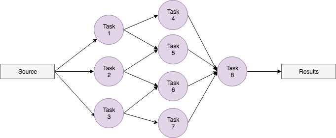
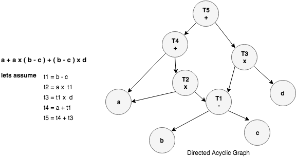
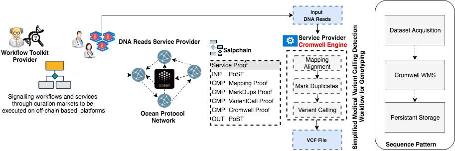

***DISCLAIMER: THIS IS A WORK IN PROGRESS***
```
shortname: 6/INVOKE
name: Invoke compute and storage services
type: Standard
status: Raw
editor: Ahmed Abdullah <ahmed@oceanprotocol.com>
```
***Lightweight On-Chain Workflow Management System (salpchain)***

<!--ts-->
### Table of Contents

   * [Lightweight on-chain WMS](#salpchain)
      * [Change Process](#change_process)
      * [Language](#language)
      * [Motivation](#motivation)
      * [Introduction to WMS](#wms)
      * [Architecture](#architecture)
      * [Implementation](#implementation)
      * [Use Cases](#usecases)
      * [Reference](#reference)
      * [Copyright Waiver](#copyright-waiver)
      
## Lightweight On-chain WMS (salpchain) <a name="salpchain"></a>

Ocean protocol works as a substrate for data consumption on blockchain, in which enables users to consume multiple 
services that could be on-chain or off-chain. Moreover theses services SHOULD preserve the privacy models such as zero-knowledge and 
at the same time provide some sort of service integrity such as verifiable computation. In this OEP, we are going to 
introduce a proposal for how to implement lightweight on-chain workflow management system [salpchain](https://en.wikipedia.org/wiki/Salp). 
Salpchain SHOULD enable users to execute workflows, orchestrate services, and manage tasks with minimal amount 
of gas on Ethereum blockchain.


## 1. Change Process <a name="change_process"></a>

This document is governed by the [2/COSS](../2/README.md) (COSS).

## 2. Language <a name="language"></a>
The key words "MUST", "MUST NOT", "REQUIRED", "SHALL", "SHALL NOT", "SHOULD", "SHOULD NOT", "RECOMMENDED", 
"NOT RECOMMENDED", "MAY", and "OPTIONAL" in this document are to be interpreted as described in 
[BCP 14](https://tools.ietf.org/html/bcp14) \[[RFC2119](https://tools.ietf.org/html/rfc2119)\] 
\[[RFC8174](https://tools.ietf.org/html/rfc8174)\] when, and only when, they appear in all capitals, 
as shown here.

## 3. Motivation <a name="motivation"></a>
As a data scientist, you have complex pipelines. They maybe just consuming dataset
but also they might include different computation, storage and networking services. As a result, 
you will need to schedule these services in terms of workflow. Salpchain is an on-chain workflow 
management system in Ocean protocol that manages the scheduling and execution of workflows on Ethereum blockchain.


## 4. Introduction to WMS <a name="wms"></a>

Workflows are a sequence of tasks where each task scheduled and triggered by an event. Mainly we use workflows to handle complex 
pipelines and big data analysis. For instance as shown in the below figure we have a some sort of simple workflow which start with data acquisition, then
processing this dataset, monitor processing progress and finally report results. 


Usually, we use workflows in our development process such as Extract, Transform, Load (ETL), also in testing we can use a 
workflow in order to orchestrate automated testing, moreover one of the most complex workflows coming from Bioinformatics and genomics workflows. The following
table shows different workflow management systems (WMS) and summarize main points for each workflow:

***Open Source WMS***

WMS    |                                         Language                    | Deployed By | Web UI     
--------------|--------------------------------------------------------------|-------------|---------
[Luigi](https://luigi.readthedocs.io/en/stable/)| Python                     | Spotify     |   Yes
[Apache Airflow](http://airflow.incubator.apache.org/) | Python              | Airbnb      |    Yes
[Apache Oozie](http://oozie.apache.org/)               | Java                | Cloudera, Yahoo, Microsoft | Yes
[Taskflow](https://wiki.openstack.org/wiki/TaskFlow)   | Python              | OpenStack   | No

***Bioinformatics WMS***

WMS    |                                         Language                    | Deployed By | Web UI     
--------------|--------------------------------------------------------------|-------------|---------
[Galaxy Engine](https://galaxyproject.org/) | Python                     | Johns Hopkins University    |   Yes
[Cosmos](https://cosmos.hms.harvard.edu/) | Python              | Harvard Medical School    |   No
[Apache Taverna](https://taverna.incubator.apache.org/)| Java                | University of Manchester | No
[Cromwell Engine](http://cromwell.readthedocs.io/en/develop/)   |       Scala        | Broad Institute   | No

### 4.1 DAG based WMSs 

Each task in a pipeline make decisions based on what is the task inputs (upstream), and outputs (downstream). We can see below 
that every task node MUST be able to receive inputs and bypass its outputs to other task nodes. So you can split up and merge many branches from the same task output. 



Directed Acyclic Graph (DAG) means that all of theses links among tasks MUST move in the same direction, and they can not be bi-directional. Also any task node can not
reference back to itself. And the magic what DAG does is if you can put any input dataset at task node (upstream) in this workflow, you will
see that this will flow downstream of this task and it will be available for next tasks. This keeps your workflow more modular by using the same tasks in 
different positions in a workflow.

As shown below we can notice that all operations are moving in one direction from top to bottom. You can use 
tree data structure but DAGs are more optimized to use the same operation multiple times. For instance we use 
<code>T1</code> called twice during workflow execution.



Most of modern workflow management systems supports DAG based workflows. But by designed it was intended to also support the following 
important characteristics.

- It SHOULD be based on opensource programming language such as python.
- It SHOULD be able to handle failures, and alerts.
- It SHOULD be easy to handle complexity and dependencies.
- It SHOULD support scheduling tasks, so we can ran it anytime.

### 4.2 Workflow Patterns

Workflows have some sort of patterns which solve common problems. In this subsection we are going 
to show the basic control flow patterns:

* ***Sequence***

It is one of the simplest patterns where task in workflow is triggered once the the preceding task finished. So two tasks could
be consecutive if the edge of one of them is associated with the second task without any conditions.

* ***Parallel Split***

Also It is called AND-Split where single process can be divides ( unconditionally ) into multiple threads. 

* ***Synchronization***

Also known as AND-Join which means combining multiple or parallel threads of execution into a single thread.

* ***Execlusive Choice***

Execlusive choice or XOR-Split pattern chooses one the possible paths to complete the task. 
For instance if you have an order, so you can use credit card or bank transfer, your task will pick one 
of these paths in order to complete the payment.

* ***Simple Merge*** 

The simple merge or XOR-Join pattern uses only one of the paths without any synchronization in order to proceed the  next task. For example, payment could be 
performed by bank transfer or credit card.


For more details about advanced branching and synchroization patterns check out this [article](http://www.workflowpatterns.com/patterns/control/index.php).

## 5. Architecture <a name="architecture"></a>
This architecture assumes that we have a curation market layer which disseminates and curates services in Ocean protocol. So lets start with 
the building blocks of salpchain. It consists of three basic parts:

### 5.1 Workflow Management

This component handles the workflow initialization, calling scheduler, and triggering the execution of tasks.
You can think about it as a chained tasks where you can execute the workflow in terms of three basic steps and 
then execute the last task (This is only in case of **sequence flow pattern**). Different pattern implementations 
will be shown in the next section. 


## 6. Implementation <a name="implementation"></a>

***TODO***

## 7. Use Cases <a name="usecases"></a>

In this section we are going to show two complex use case scenarios:

### 7.1 Medical Variant Detection 



***TODO***

## 8. Reference <a name="reference"></a>

* [Workflow Control-Flow Patterns, BPM Center Report BPM-06-22 , BPMcenter.org, 2006](http://www.workflowpatterns.com/documentation/documents/BPM-06-22.pdf)
* [Workflow Patterns - Distributed and Parallel Databases, 14(3), pages 5-51, July 2003](http://www.workflowpatterns.com/documentation/documents/wfs-pat-2002.pdf)

***TODO***

## 9. Copyright Waiver  <a name="copyright-waiver"></a>
To the extent possible under law, the person who associated CC0 with this work has waived all copyright and related or neighboring rights to this work.