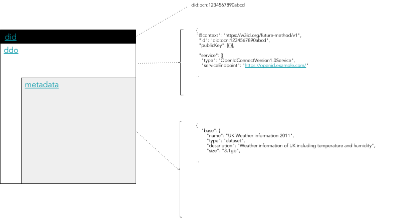

```
shortname: 7/DID
name: Decentralized Identifiers
type: Standard
status: Draft
editor: Aitor Argomaniz <aitor@oceanprotocol.com>
contributors: Dimitri De Jonghe <dimi@oceanprotocol.com>, Troy McConaghy <troy@oceanprotocol.com>
```

**Table of Contents**

<!--ts-->
   * [Decentralized Identifiers](#decentralized-identifiers)
      * [Change Process](#change-process)
      * [Language](#language)
      * [Motivation](#motivation)
      * [Specification](#specification)
      * [Proposed Solution](#proposed-solution)
         * [Decentralized IDs (DIDs)](#decentralized-ids-dids)
         * [DID Documents (DDOs)](#did-documents-ddos)
         * [Integrity](#integrity)
            * [How to compute the integrity checksum](#how-to-compute-the-integrity-checksum)
            * [DID Document Proof](#did-document-proof)
            * [Length of a DID](#length-of-a-did)
            * [How to compute a DID](#how-to-compute-a-did)
         * [Registry](#registry)
         * [Resolver](#resolver)
      * [Changes Required](#changes-required)
         * [List 1](#list-1)
         * [List 2](#list-2)
      * [References](#references)

<!--te-->

# Decentralized Identifiers

This specification is based on:

* the [W3C DID specification](https://w3c-ccg.github.io/did-spec/), which was at version 0.11 as of August 2018,
* the [Ocean Protocol technical whitepaper](https://github.com/oceanprotocol/whitepaper),
* [3/ARCH](../3/README.md), and
* [4/AGENT](../4/README.md).

## Change Process

This document is governed by [OEP 2/COSS](../2/README.md).

## Language

The key words "MUST", "MUST NOT", "REQUIRED", "SHALL", "SHALL NOT", "SHOULD", "SHOULD NOT", "RECOMMENDED", "NOT RECOMMENDED", "MAY", and "OPTIONAL" in this document are to be interpreted as described in [BCP 14](https://tools.ietf.org/html/bcp14) \[[RFC2119](https://tools.ietf.org/html/rfc2119)\] \[[RFC8174](https://tools.ietf.org/html/rfc8174)\] when, and only when, they appear in all capitals, as shown here.

## Motivation

The main motivations of this OEP are:

* Design a solution to extend the current architecture to use **Decentralized Identifiers (DIDs)** and **DID Documents (DDOs)**
* Understand how to register information on-chain with off-chain integrity associated
* Understand how to resolve DIDs into DDOs
* Design a solution facilitating alignment of on-chain and off-chain information
* Establishing the mechanism to know if the DDO associated with a DID was modified
* Defining the common mechanisms, interfaces and APIs to implemented the designed solution
* Define how Ocean assets, agents and domains can be modeled with a DID/DDO data model
* Understand how DID hubs are formed, and how they integrate a business and storage layer

## Specification

Requirements are:

* The DID resolving capabilities MUST be exposed in the client libraries, enabling to resolve a DDO directly in a totally transparent way
* ASSETS are DATA objects describing RESOURCES under control of a PUBLISHER
* KEEPER stores on-chain only the essential information about ASSETS
* PROVIDERS store the ASSET metadata off-chain
* KEEPER doesn't store any ASSET metadata
* OCEAN doesn't store ASSET contents (e.g. files)
* An ASSET is modeled in OCEAN as on-chain information stored in the KEEPER and metadata stored in OCEANDB
* ASSETS on-chain information only can be modified by OWNERS or DELEGATED USERS
* ASSETS can be resolved using a Decentralized ID (DID) included on-chain and off-chain
* A DID Document (DDO) should include the ASSET metadata
* Any kind of object registered in Ocean SHOULD have a DID allowing one to uniquely identify that object in the system
* ASSET DDO (and the metadata included as part of the DDO) is associated to the ASSET information stored on-chain using a common DID
* A DID can be resolved to get access to a DDO
* ASSET DDOs can be updated without updating the on-chain information
* ASSET information stored in the KEEPER will include a checksum attribute
* The ASSET on-chain checksum attribute SHOULD include a one-way HASH calculated using the DDO content
* After the DDO resolving, the DDO HASH can be calculated off-chain to validate if the on-chain and off-chain information is aligned
* A HASH not matching with the checksum on-chain means the DDO was modified without the on-chain update
* The function to calculate the HASH MUST BE standard

## Proposed Solution

### Decentralized IDs (DIDs)

A DID is a unique identifier that can be resolved or de-referenced to a standard resource describing the entity (a DID Document or DDO).
If we apply this to Ocean, the DID would be the unique identifier of an object represented in Ocean (i.e. the Asset ID of an ASSET or the Actor ID of a USER).
The DDO SHOULD include the METADATA information associated with this object.
The DDO is stored off-chain in Ocean.

In Ocean, a DID is a string that looks like:

```text
did:op:0ebed8226ada17fde24b6bf2b95d27f8f05fcce09139ff5cec31f6d81a7cd2ea
```

which follows [the generic DID scheme](https://w3c-ccg.github.io/did-spec/#the-generic-did-scheme).
Details about how to compute the DID are given below.

### DID Documents (DDOs)

If a DID is the index key in a key-value pair, then the DID Document is the value to which the index key points.
The combination of a DID and its associated DID Document forms the root record for a decentralized identifier.



A DDO document is composed of standard DDO attributes:

* "@context"
* "id"
* "created"
* "updated"
* "publicKey"
* "authentication"
* "proof"
* "verifiableCredential"
* "service"

Asset metadata can be included as one of the objects inside the `"service"` array, with type `"metadata"`.
Example:

```json
"service": [{
		"index": "0",
		"type": "metadata",
		"serviceEndpoint": "https://service/api/v1/metadata/assets/ddo/did:op:0ebed8226ada17fde24b6bf2b95d27f8f05fcce09139ff5cec31f6d81a7cd2ea",
		"attributes": {
			"main": {},
			"mutable": {}
		}
	}, {
		"index": "1",
		"type": "metadata",
		"serviceEndpoint": "https://service/api/v1/metadata/assets/ddo/did:op:0ebed8226ada17fde24b6bf2b95d27f8f05fcce09139ff5cec31f6d81a7cd2ea",
		"metadata": {
			"main": {},
			"mutable": {}
		}
	}, {
		"index": "1",
		"type": "provenance",
		"serviceEndpoint": "https://service/api/v1/provenance/assets/ddo/did:op:0ebed8226ada17fde24b6bf2b95d27f8f05fcce09139ff5cec31f6d81a7cd2ea",
		"attributes": {
			"main": {},
			"mutable": {}
		}
	}, {
		"index": "2",
		"type": "access",
		"serviceEndpoint": "https://service/api/v1/access/assets/ddo/did:op:0ebed8226ada17fde24b6bf2b95d27f8f05fcce09139ff5cec31f6d81a7cd2ea",
		"attributes": {
			"main": {},
			"mutable": {}
		}
	}]
```

You can find a complete examplo of a DDO [here](ddo-example.json).
You can find a complete reference of the asset metadata in [OEP-8](8).
Also it's possible to find a complete [real example of a DDO](https://w3c-ccg.github.io/did-spec/#real-world-example) with extended services added, as part of the W3C DID spec.

### Integrity

The Integrity policy for identity and metadata is a sub-specification for the Ocean Protocol allowing to validate the integrity of the Metadata associated to an on-chain object (initially an ASSET).

#### How to compute the integrity checksum

An ASSET in the system is composed by on-chain information maintained by the DLT and off-chain Metadata information (DDO) stored by the PROVIDER.
Technically a user could update the DDO accessing directly to the off-chain database, modifying attributes (e.g. License information, description, etc.) relevant to a previous consumption agreement with an user.
The motivation of this is to facilitate a mechanism allowing to the CONSUMER of an object, to validate if the DDO was modified after a previous agreement.

This hash composing the **integrity checksum** is calculated in the following way:

- The complete content of the `service[index].attributes.main` is serialized in a common string
- The string generated is is Hashed using SHA3-256 algorithm  (You might have to convert the string to bytes first.)
- The hash generated as a result of this process is stored in the `proof.checksum[index].checksum` attribute
- The previous 3 steps are repeated for every individual service include in the `service` array. The hash generated is always stored in the `proof.checksum` array using as key the `index` of the service computed
- During the serialization process, the objects to serialize (`service[index].attributes.main` are prepared using the following process:
  * The object is sorted alphabetically independently of the existing nested levels
  * In the JSON generated, all the characters between entries are removed (`\n`, `\t`, `\r`, whitespaces, etc.)
  * As a result must be generated a string of only one line 
- After hashing, in the DDO, the checksums should be represented as a hex string beginning with `0x` and ending with 64 hex characters (e.g. `0x52b5c93b82dd9e7ecc3d9fdf4755f7f69a54484941897dc517b4adfe3bbc3377`)
- After generating each individual checksum the complete `proof.checksum` entry is sorted, serialized and hashed as previusly described in the other checksums
- The final hash generated as a result of hashing the checksums (DID CHECKSUM or DID HASH) will be the ID part of the DID (the string after the prefix `did:op:`)

Because this DID HASH will be stored on-chain and emitted as an event, a validator could use this information to check if something changed regarding the initial registration.

#### DID Document Proof

A proof on a DID Document is cryptographic proof of the integrity of the DID Document. In the DID Specification the `proof` attribute is optional.
We enforce the usage of the `proof` attribute to demonstrate the Owner of an Asset is signing the proof of integrity of some Asset attributes.
The information to sign by the owner is the **integrity checksum** defined in the above section.

```js
var signature = Sign.signMessage(DID)
```

The DID Document (DDO) SHOULD include the following `proof` information:

* `type` - Type of proof, in our case `"DDOIntegritySignature"`
* `created` - Date and time when the proof was created
* `creator` - Address of the user providing the proof
* `signatureValue` - Result of the signature given by the creator
* `checksum` - Checksums of the individual services included in the DDO 

Here is an example `proof` section to add in the DDO:

```json
  "proof": {
    "type": "DDOIntegritySignature",
    "created": "2016-02-08T16:02:20Z",
    "creator": "0x00Bd138aBD70e2F00903268F3Db08f2D25677C9e",
    "signatureValue": "0xc9eeb2b8106e…6abfdc5d1192641b",
    "checksum": {
        "0": "0x52b5c93b82dd9e7ecc3d9fdf4755f7f69a54484941897dc517b4adfe3bbc3377",
        "1": "0x999999952b5c93b82dd9e7ecc3d9fdf4755f7f69a54484941897dc517b4adfe3"
    }    
  }
```

Using the `proof` information, a third-party with access to the DDO could validate the `creator` signed a specific integrity checksum refering to an Asset.

#### Length of a DID

The length of a DID must be compliant with the underlying storage layer and function calls.
Given that decentralized virtual machines make use of contract languages such as Solidity and WASM, it is advised to fit the DID in structures such as `bytes32`.

It would be nice to store the "did:op:" prefix in those 32 bytes, but that means fewer than 32 bytes would be left for storing the rest (25 bytes since "did:op:" takes 7 bytes if using UTF-8). If the rest is a secure hash, then we need a 25-byte secure hash, but secure hashes typically have 28, 32 or more bytes, so that won't work.

Only the hash value _needs_ to be stored, not the "did:op:" prefix, because it should be clear from context that the value is an Ocean DID.

#### How to compute a DID

The DID ("id") string begins with "did:op:" and is followed by a string representation of a bytes32.

In the first version of this spec (to be implemented in the Trilobite release), the bytes32 part is _random_ and is represented by a 64-character hex string (using the characters 0-9 and a-f).
One way to compute such a DID is by concatenating two random UUIDs. (Each UUID is 128 bits = 16 bytes, which can be represented by a 32-character hex string with all hyphens "-" removed.)

One way NOT to compute such a DID is `sha3_256_hash(UUID).to_hex_string()`, because the space of UUIDs (16 bytes) is smaller than the space of bytes32 (32 bytes).

In the future, this spec might allow for other ways to compute a DID (e.g. the SHA3-256 hash of the DDO-without-DID).

Note: The bytes32 (a sequence of bytes) is what gets stored in a blockchain, not the final DID ("id") value. That is, the "did:op:" part doesn't have to be stored in a blockchain because it should be clear from context that the stored bytes32 is part of an Ocean DID.

### Registry

To register the different kind of objects can be stored in a **simple** register contract named **DidRegistry**.
This DidRegistry can act as generic/flexible way to associate Resources (ie. Assets) to the public providers resolving the DDO (and Metadata included) of those resources.
The key of the Identity entity in Ocean is the **DID**. Each entity will have a unique DID.
To resolve the DDO associated to a Resource (Asset), associated to this Resource DID we have the DID of the Provider giving access to this Resource.
The Provider will have associated a mapping (key - value) of attributes. One of those can be used to related with the public service returning the DDO of a specific resource.

Applied to Assets, typically are part of a Service Agreement. The suggested approach to implement this is:

* Associate the Resource (ie. Asset DID) to the Provider DID
* Each Provider will have associated a Public URL where the provider is exposing the DDO's

Here a draft **DidRegistry** implementation:

```solidity

// This piece of code is for reference only!
// Doesn't include any validation, types could be reviewed, enums, etc

contract DidRegistry {

    event DIDAttributeRegistered(
        bytes32 indexed did,
        address indexed owner,
        bytes32 indexed checksum,
        string value,
        uint updatedAt
    );

    mapping(bytes32 => DIDRegister) private didRegister;
    function registerAttribute(bytes32 _did, bytes32 _checksum, string _value) public {
        // ....

        emit DIDAttributeRegistered(_did, msg.sender, _checksum, _value, block.number);
    }

}
```

To register the provider publicly resolving the DDO associated to a DID, we will register an attribute with the public hostname of that provider:

```
registerAttribute("21tDAKCERh95uGgKbJNHYp", "328aabb94534935864312", "https://myprovider.example.com/ddo")
```

### Resolver

The resolving capabilities will be encapsulated in the Ocean Client libraries (Javascript, Python, ..), allowing to resolve a DDO directly speaking with the KEEPER.
No third-party requests or API need to be integrated. This allows to have a simple a seam-less integration from the consumer side.

This is a generic definition of what could be exposed in the client libraries from an API point of view:

```java
function DDO resolve(String did)  {
  // black magic
  return ddo;
}
```

To resolve a DID to the associated DDO, some information is stored on-chain associated to the DID. In the approach recommended in the scope of this OEP, this is stored
as an attribute associated to the ```DidAttributeRegistered``` event. Because the did and key are indexed parameters of the event, a consumer in any supported web3 language,
could filter the ```DidAttributeRegistered``` events filtering by the DID and the key named **"service-ddo"**.

A DDO pointing to a DID could be resolved hierarchically using the same mechanism.

This is an example in Javascript using web3.js:

```javascript
var event = contractInstance.DidAttributeRegistered( {did: "21tDAKCERh95uGgKbJNHYp"}, {fromBlock: 0, toBlock: 'latest'});
```

Here in Python using web3.py:

```python
event = mycontract.events.DidAttributeRegistered.createFilter(fromBlock='latest', argument_filters={'did': '21tDAKCERh95uGgKbJNHYp'})
```

This logic could be encapsulated in the client libraries (**Squid**) in different languages, allowing to the client applications to get the attributes enabling to resolve the DDO associated to the DID.
Using this information a consumer can query directly to the provider able to return the DDO.

Here you have the complete flow using as example a new ASSET:


Steps:

1. A PUBLISHER, using the KEEPER, register the new Resource (ie. ASSET) providing the DID and the DID of the Provider acting as Public service returning the DDO of the Resource (ASSET)
1. The KEEPER register the Resource using the Service Agreement Smart Contract and after of that register the identity using the DidRegistry Smart Contract. In this point, the attribute is raised as a new event
1. The PUBLISHER publish the DDO in the metadata-store/OCEANDB provided by PROVIDER
1. A CONSUMER (it could be a frontend application or a backend software), having a DID and using a client library (Python or Javascript) get the **service-ddo** attribute associated to the DID directly from the KEEPER
1. The CONSUMER, using the provider public url, query directly to the provider passing the DID to obtain the DDO

## Changes Required

The changes to apply in the proposed solution are:

### List 1

* Modify the function creating the id to return a DID compliant id - KEEPER
* Create the new DidRegistry Smart Contract - KEEPER
* Integrate the call to the DidRegistry contract in the OceanMarketplace or Service Agreement contract (depending of the moment of integration of this) - KEEPER
* Implement the resolving function of a DDO given a DID - CLIENT LIBRARIES

### List 2

* Define a one-way algorithm to use to calculate the HASH function (keccak is suggested)
* Create a new method to calculate the HASH - CLIENT LIBRARIES
* Modify OceanMarketplace allowing to specify the HASH during the ASSET registry - KEEPER
* Integrate the HASH function with the ASSET registry process - CLIENT LIBRARIES
* Integrate the HASH calculation in the CONSUMER side - CLIENT LIBRARIES

## References

* [DID Spec from the W3C Credentials Community Group](https://w3c-ccg.github.io/did-spec/)
* [DID Spec from _Rebooting the Web of Trust_](https://github.com/WebOfTrustInfo/rebooting-the-web-of-trust-fall2016/blob/master/topics-and-advance-readings/did-spec-working-draft-03.md)
