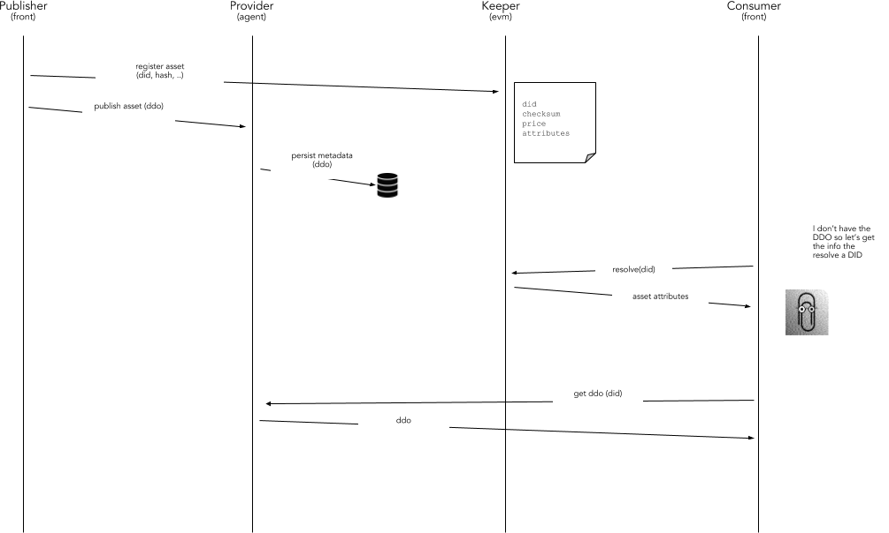

```
shortname: 7/DID
name: Decentralized Identifiers
type: Standard
status: Raw
editor: Aitor Argomaniz <aitor@oceanprotocol.com>
contributors: Aitor Argomaniz <aitor@oceanprotocol.com>
              Ahmed Ali <ahmed@oceanprotocol.com>
```

<!--ts-->

Table of Contents
=================

   * [Table of Contents](#table-of-contents)
   * [Decentralized Identifiers](#decentralized-identifiers)
      * [Change Process](#change-process)
      * [Language](#language)
      * [Motivation](#motivation)
      * [Specification](#specification)
      * [Proposed Solution](#proposed-solution)
         * [Decentralized ID's (DID)](#decentralized-ids-did)
         * [Actors Identity](#actors-identity)
            * [Registry](#registry)
            * [DID Resolver](#did-resolver)
         * [Assets Identification](#assets-identification)
            * [Registry of Assets](#registry-of-assets)
            * [Assets Resolver](#assets-resolver)
      * [Changes Required](#changes-required)
      * [Metadata Integrity](#metadata-integrity)
         * [Proposed solution](#proposed-solution-1)
      * [Changes Required](#changes-required-1)
      * [References](#references)


<!--te-->


# Decentralized Identifiers

This OEP doesn't detail the exact method of registering ASSETS on-chain or publishing metadata in a metadata store.

This specification is based on [Ocean Protocol technical whitepaper](https://github.com/oceanprotocol/whitepaper), [3/ARCH](../3/README.md) and [4/AGENT](../4/README.md).


## Change Process

This document is governed by the [2/COSS](../2/README.md) (COSS).


## Language

The key words "MUST", "MUST NOT", "REQUIRED", "SHALL", "SHALL NOT", "SHOULD", "SHOULD NOT", "RECOMMENDED", "NOT RECOMMENDED", "MAY", and "OPTIONAL" in this document are to be interpreted as described in [BCP 14](https://tools.ietf.org/html/bcp14) \[[RFC2119](https://tools.ietf.org/html/rfc2119)\] \[[RFC8174](https://tools.ietf.org/html/rfc8174)\] when, and only when, they appear in all capitals, as shown here.


## Motivation

The main motivations of this OEP are:

* Design a solution to extend the current Ocean architecture to use  **Decentralized Identifiers (DID)** and **DID description objects (DID Document)**
* Understand how to register information on-chain with off-chain integrity associated
* Understand how to resolve DID's into DID Document's
* Understand how to resolve Assets Metadata using Assets IDs
* Design a solution facilitating to have the on-chain and off-chain information aligned
* Establishing the mechanism to know if the DID Document associated to a DID was modified
* Defining the common mechanisms, interfaces and APIs to implemented the designed solution
* Define how Ocean assets, agents and tribes can be modeled with a DID/DID Document data model
* Understand how DID hubs are formed, and how they integrate a business and storage layer


## Specification

Requirements are:

* The DID resolving capabilities MUST be exposed in the client libraries, enabling to resolve a DID Document directly in a totally transparent way
* ASSETS are DATA objects describing RESOURCES under control of a PUBLISHER
* PUBLISHER or OWNERS of ASSETS could delegate some usage permissions regarding those ASSETS
* KEEPER stores on-chain only the essential information about ASSETS
* PROVIDERS store the ASSET metadata off-chain
* KEEPER doesn't store any ASSET metadata
* OCEAN doesn't store ASSET files contents
* SUBJECTS (Ocean actors) could be identified using a **Decentralized ID (DID)** included on-chain and off-chain
* ACTORS don't need to be registered. Only ACTORS requiring to be discovered by others require a simple registration mechanism
* A Decentralized Distributed Object (**DID Document**) represents the metadata of an Actor
* A **DID** can be resolved into a **DID Document**
* DID Documents can be updated without updating the on-chain information
* An ASSET is modeled in OCEAN as on-chain information stored in the KEEPER and metadata stored in OCEANDB
* ASSETS on-chain information only can be modified by OWNERS or DELEGATED USERS
* An ASSET is identified using an ASSET ID
* Any kind of object registered in Ocean MUST have a **Uniform Resource Names (URN)** allowing to uniquely identify that object in the system
* ASSET Metadata (off-chain) is associated to the ASSET information stored on-chain using a common **ASSET ID**
* A **ASSET ID** can be resolved to get access to extended **Metadata**
* ASSET Metadata could be provided by one or more than one providers
* ASSETs Metadata can be updated without updating the on-chain information
* ASSET information stored in the keeper will include a **checksum** attribute
* The ASSET on-chain checksum attribute, includes a one-way HASH calculated using the DID Document content
* After resolving the Metadata, the Metadata HASH can be calculated off-chain to validate if the on-chain and off-chain information is aligned
* A HASH not matching with the checksum on-chain means the DID Document was modified without the on-chain update
* The function to calculate the HASH MUST BE standard


## Proposed Solution

### Decentralized ID's (DID)

A DID is a unique identifier that can be resolved or de-referenced to a standard resource describing the entity (a DID Document).
If we apply this to Ocean, the DID would be the unique identifier of an actor interacting in Ocean (the Actor ID of a USER).
The DID Document would be the METADATA information associated to this Actor DID that is stored off-chain on Ocean.

DID schema:

```text
did-reference      = did [ "/" did-path ] [ "#" did-fragment ]
did                = "did:" method ":" specific-idstring
method             = 1*methodchar
methodchar         = %x61-7A / DIGIT
specific-idstring  = idstring *( ":" idstring )
idstring           = 1*idchar
idchar             = ALPHA / DIGIT / "." / "-"
```

In Ocean, the DID looks:

```text
did:ocn:21tDAKCERh95uGgKbJNHYp
```

The complete specs can be found in the [W3C Decentralized Identifiers (DIDs) document](https://w3c-ccg.github.io/did-spec/)


### Actors Identity

#### Registry

To register an Actor, requiring to be located, a simple register contract named **DidRegistry** will be provided.
The key of the Identity entity in Ocean is the **DID**. Associated to this DID we have a Mapping of key-value attributes,
allowing to associate publicly information to DID's. This could be used to add public information allowing for example
to discover/resolve a DID. There are two main options to implement this:

* Associate to the DID a mapping of key-value attributes to be stored as new entries of a smart contract variable

* Emit events associated to the DID. Events works pretty well as a kind of cost effective storage. This is the **recommended approach**.

Contract Events are a useful feature for storing data from smart contracts exclusively for off-chain use.

Here a draft **DidRegistry** implementation:

```solidity

// This piece of code is for reference only!
// Doesn't include any validation, types could be reviewed, enums, etc

contract DIDRegistry {

    struct Identity {
        address owner; // owner of the Identity
        string did;
        mapping (bytes32 => string) attributes; // key => value attributes
    }

    mapping (string => Identity) identities; // list of identities

    // Option 1. Attributes as K,V stored as part of internal object attributes
    mapping (string => mapping (bytes32 => string) ) identities; // list identities attributes

    // Attributes are emited as events
    event DidAttributeRegistered(
        string indexed did,
        bytes32 indexed key,
        string value,
        uint updateAt
    );

    constructor(bytes32 _did) public {
    }

    function registerAttribute(string _did, bytes32 _key, string _value) public _onlyOwner returns (bool) {
        // Registering Identity
        identities[_did][_key] = _value;

        // Emitting event about new Attribute registered
        emit DidAttributeRegistered(_did, _key, _value, now);
    }

    function getAttribute(string _did, bytes32 _key) public view returns (string) {
        return identities[_did][_key];
    }
}

```

To register the provider publicly resolving the DID Document associated to a DID, we will register an attribute **"url"** with the public address of that provider:

```
registerAttribute("did:ocn:21tDAKCERh95uGgKbJNHYp", "url", "https://myprovider.example.com/")
```


#### DID Resolver

The resolving capabilities will be encapsulated in the Ocean Client libraries (Javascript, Python, ..), allowing to resolve a DID Document directly interacting with the KEEPER.
No third-party requests or API need to be integrated. This allows to have a simple a seam-less integration from the consumer side.

Only calling to the `getAttribute` method about an specific DID would be possible to get the public url associated to that DID.
This logic could be encapsulated in the client libraries in different languages, allowing to the client applications to get the attributes enabling to resolve the DID Document associated to the DID.
Using this information a consumer can query directly to the provider able to return the DID Document.


### Assets Identification

#### Registry of Assets

Currently the existing Ocean ASSETS are stored as part of the `OceanMarket` Smart Contract, but there is not a provider associated to it.
Having this implementation, and because we want to avoid to store the **NSS** fragment of the **URN**, the existing Asset ID syntax will be the same.

In addition to this, to associate a provider to an ASSET the following modifications are necessary in the `OceanMarket` contract:

* Modify the `registerAsset` method allowing to specify the provider DID and emit the `AssetAttributeRegistered` event
* Define a new `registerAssetAttribute` method allowing to associate an attribute to an existing asset
* Define a new `unregisterAssetAttribute` method allowing to de-activate an existing attribute

The following Solidity example could be used as reference of the modifications to apply:

```solidity

contract OceanMarket {

    // ..

    event AssetAttributeRegistered(
        string indexed assetId,
        bytes32 indexed key,
        string indexed value,
        bool indexed active,
        uint updateAt
    );

    function register(bytes32 assetId, uint256 price, bytes32 key, string value)
        public validAddress(msg.sender) returns (bool success) {

        // ..

        emit AssetAttributeRegistered(assetId, key, value, true);
        // ..
    }

    function registerAssetAttribute(assetId, bytes32 key, string value) _onlyAssetOwner returns (bool) {
        emit AssetAttributeRegistered(assetId, key, value, true);
    }

    function unregisterAssetAttribute(assetId, bytes32 key, string value) _onlyAssetOwner returns (bool) {
        emit AssetAttributeRegistered(assetId, key, value, false);
    }

    // ..

```

Asset attributes have associated the `active` flag (true or false). It allows to disable existing attributes, and from the client perspective filtering and getting only the active attributes.
In that scope, an `unregister` method could be implemented, allowing to de-activate an existing attribute.

Because the events are sorted by block number, a consumer of the events could reconstruct the state of the active Asset attributes using this information.
This list would be the list of active providers associated to an Asset.


#### Assets Resolver

To resolve the provider URL associated to an asset, the Provider DID is stored on-chain associated to the asset using events. In the approach recommended in the scope of this OEP, this is stored
as an attribute associated to the ```AssetAttributeRegistered``` event. Because the assetId and key are indexed parameters of the event, a consumer in any supported web3 language,
could filter the ```AssetAttributeRegistered``` events filtering by the **assetId** and the key named **"provider"**.

This is an example in Javascript using web3.js:

```javascript
var event = contractInstance.AssetAttributeRegistered( {assetId: "12345678", "key": "provider", "active": true}, {fromBlock: 0, toBlock: 'latest'});
```

Here in Python using web3.py:

```python
event = mycontract.events.AssetAttributeRegistered.createFilter(fromBlock='latest', argument_filters={'assetId': '12345678', 'key': 'provider', 'active': true})
```


Here you have the complete flow using as example a new ASSET:



Steps:

1. A PUBLISHER, using the KEEPER, register the new ASSET providing the full ASSET URL and the attribute to resolve the provider (DID) + ASSET ID
1. The KEEPER register the ASSET using the OceanMarket Smart Contract. As part of the registerAsset function, a new event is emitted with the Provider DID as Attribute
1. The PUBLISHER publish the Metadata in the metadata-store/OCEANDB provided by PROVIDER which is resolved using Base-URL. 
1. Base-url can be used to fetch the DDO of the provider,Base url + asset id (or other id in the future), can be used to directly retrieve the asset Metadata. This is so that we avoid unnecessary extra call in the middle.
1. A CONSUMER (it could be a frontend application or a backend software), having an ASSET URL and using a client library (SQUID libraries) get the **provider** DID attribute associated to the URN directly from the KEEPER
1. The CONSUMER library (SQUID) using the Provider DID get the provider public url attribute
1. The CONSUMER, using the provider public url, query directly to the provider passing the URL to obtain the Asset Metadata


## Changes Required

The list of changes to apply in the proposed solution are:

* Create a new function to generate a valid DID - KEEPER
* Create the new DidRegistry Smart Contract - KEEPER
* When a new Asset is created, it's checked if the DID exists in the DidRegistry - KEEPER
* If DID doesn't exist, integrate the call to the DidRegistry constructor in the OceanMarketplace contract - KEEPER
* Implement the resolving function of a Provider public URL given a a DID - CLIENT LIBRARIES
* Implement the resolving function of a ASSET Metadata an ASSET URN - CLIENT LIBRARIES


## Metadata Integrity

The Metadata Integrity policy is a sub-specification for the Ocean Protocol allowing to validate the integrity of the Metadata associated to an on-chain object (initially an ASSET).

### Proposed solution


The solution included in the above diagram includes the following steps:

1. The PUBLISHER, before publish any ASSET information, calculate the **HASH** using the **DID Document** as input.
   To do that, the PUBLISHER will use from the client side a common Ocean library using the same algorithm.
1. The PUBLISHER, in the process of registering an ASSET on-chain specifies the **HASH** in addition of the existing parameters.
1. The KEEPER register the ASSET and associate the HASH calculated using the DID Document associated to the ASSET.
1. After a CONSUMER get access to an ASSET, could store internally the HASH referencing to the DID Document he purchased
1. In a posterior consumption, after resolving the DID Document, the CONSUMER using the client library can calculate the HASH of the DID Document just obtained
1. If the HASH obtained is not the same than the HASH associated in the original purchase, means the DID Document was modified afterwards
1. This, depending of the agreed conditions, could means an exit clause of some contracts

The HASH could be an optional parameter in the registering of the ASSET. If it's not specified, means the DID Document can be updated without any limitation.

## Changes Required

The list of changes to apply in the proposed solution are:

* Define a one-way algorithm to use to calculate the HASH function (SHA-3 is suggested)
* Create a new method to calculate the HASH - CLIENT LIBRARIES
* Modify OceanMarketplace allowing to specify the HASH during the ASSET registry - KEEPER
* Integrate the HASH function with the ASSET registry process - CLIENT LIBRARIES
* Integrate the HASH calculation in the CONSUMER side - CLIENT LIBRARIES

## References

* https://w3c-ccg.github.io/did-spec/
* https://github.com/WebOfTrustInfo/rebooting-the-web-of-trust-fall2016/blob/master/topics-and-advance-readings/did-spec-working-draft-03.md