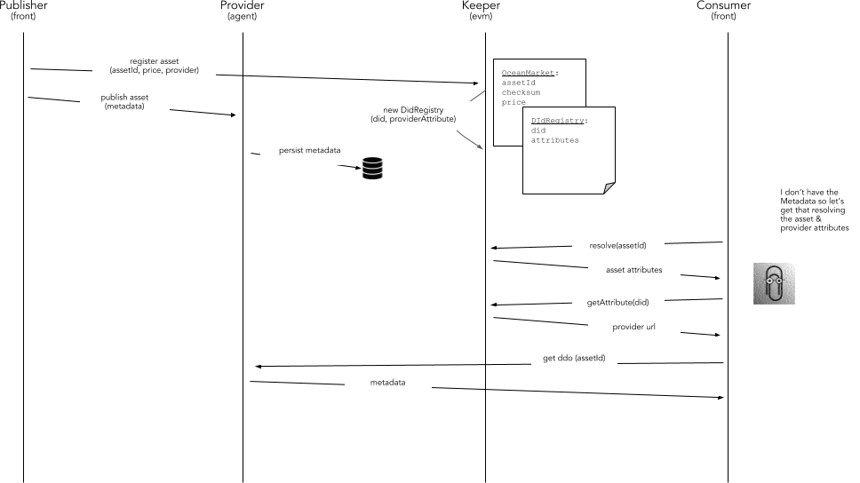

```
shortname: 7/DID
name: Decentralized Identifiers
type: Standard
status: Raw
editor: Aitor Argomaniz <aitor@oceanprotocol.com>
contributors: Mike Anderson <mike.anderson@dex.sg>
```

<!--ts-->

Table of Contents
=================

   * [Table of Contents](#table-of-contents)
   * [Decentralized Identifiers](#decentralized-identifiers)
      * [Change Process](#change-process)
      * [Language](#language)
      * [Motivation](#motivation)
      * [Specification](#specification)
      * [Proposed Solution](#proposed-solution)
         * [Decentralized ID's (DID)](#decentralized-ids-did)
         * [Registry](#registry)
         * [Resolver](#resolver)
      * [Changes Required](#changes-required)
      * [Metadata Integrity](#metadata-integrity)
         * [Proposed solution](#proposed-solution-1)
      * [Changes Required](#changes-required-1)


<!--te-->


# Decentralized Identifiers

This OEP presents an approach to using the W3C DID specification within OCean for the following purposes:
- Providing identifiers for Actors and Assets on Ocean
- Providing the ability to resolve a DDO (on-chain) for relevant Actors (especially service providers who need to expose API endpoints for the ecosystem
- Providing a way to locate cryptographically verifiable metadata for assets under the control of a service provider

A DID for an Actor in Ocean takes the follwoing format:

`did:ocn:cd2a3d9f938e13cd947ec05abc7fe734df8dd826`

Where the hexadecimal ID is the the ethereum account address of the Actor

A DID for an Asset in Ocean takes the following format:

`did:ocn:cd2a3d9f938e13cd947ec05abc7fe734df8dd826/c5d2460186f7233c927e7db2dcc703c0e500b653ca82273b7bfad8045d85a470`

Where the two hexadecimal IDs are the ethereum account address of the Actor managing the Asset and ID of the Asset. The ID 
of the asset in turn is defined as the Hash (Keccak256?) of the Asset Metadata.

This scheme presents the following useful properties:
- It is possible to address the same Asset provided by multiple Service Providers (e.g. an asset is listed on multple marketplaces for sale).
- It is possible to extend this scheme to sub-Assets by extending the DID path
- There is no requirment for Assets to be registered on-chain, allowing for efficient off-chain registration of Assets and associated Metadata

## Change Process

This document is governed by the [2/COSS](../2/README.md) (COSS).


## Language

The key words "MUST", "MUST NOT", "REQUIRED", "SHALL", "SHALL NOT", "SHOULD", "SHOULD NOT", "RECOMMENDED", "NOT RECOMMENDED", "MAY", and "OPTIONAL" in this document are to be interpreted as described in [BCP 14](https://tools.ietf.org/html/bcp14) \[[RFC2119](https://tools.ietf.org/html/rfc2119)\] \[[RFC8174](https://tools.ietf.org/html/rfc8174)\] when, and only when, they appear in all capitals, as shown here.


## Motivation

The main motivations of this OEP are:

* Define a standard to identify Actors and Assets on Ocean using **Decentralized Identifiers (DID)** 
* Present a solution to resolve service endpoints for service providers via **DID description objects (DDO)**
* Defining the common mechanisms, interfaces and API's to implemented the designed solution
* Enable Ocean assets, agents and tribes to be modelled with a DID/DDO data model


## Specification

Requirements are:

* The DID resolving capabilities MUST be exposed in the client libraries, enabling to resolve a DDO directly in a totally transparent way
* ASSETS are DATA objects describing RESOURCES under control of a PUBLISHER
* KEEPER stores on-chain only the essential information about ASSETS
* MATA AGENTS store the ASSET metadata off-chain
* KEEPER doesn't store any ASSET metadata
* An ASSET is modeled in OCEAN as Asset Metadata stored by a Meta Agent Provider exposing a standard Meta API and asset data stored by a storage provider exposing a standard Meta API
* ASSETS have no on-chain information (unless they are referenced in Service Agreements)
* Any kind of object Ocean SHOULD have a DID allowing users to uniquely identify that object in the system
* An Actor's **DID** can be resolved to get access to a **DDO** using an on-chain resolver
* An Asset ID is the HASH of the Asset Metadata
* An Asset's **DID** is defined as the DID of the Actors providing the metadata of the asset, extended with the Asset ID as part of the DID path
* The function to calculate the HASH MUST BE standard


## Proposed Solution

### Decentralized ID's (DID)

A DID is a unique identifier that can be resolved or de-referenced to a standard resource describing the entity (a DID Document or DDO).
If we apply this to Ocean, the DID would be the unique identifier of an object represented in Ocean (ie. the Asset ID of an ASSET or the Actor ID of a USER).

DID schema:

```text
did-reference      = did [ "/" did-path ] [ "#" did-fragment ]
did                = "did:" method ":" specific-idstring
method             = 1*methodchar
methodchar         = %x61-7A / DIGIT
specific-idstring  = idstring *( ":" idstring )
idstring           = 1*idchar
idchar             = ALPHA / DIGIT / "." / "-"
```

In Ocean, the DID looks:

```text
did:ocn:cd2a3d9f938e13cd947ec05abc7fe734df8dd826
```

The complete specs can be found in the [W3C Decentralized Identifiers (DIDs) document](https://w3c-ccg.github.io/did-spec/)

### Registry

To register the different kind of objects can be stored in a **simple** register contract named **IdRegistry**.
The key of the Identity entity in Ocean is the **DID**. Associated to this DID we have a Mapping of key-value attributes,
allowing to associate publicly information to DID's. This could be used to add public information allowing for example
to discover/resolve a DID.

There are two main options to implement this:

* Associate to the DID a mapping of key-value attributes to be stored as new entries of a smart contract variable
* Emit events associated to the DID. Events works pretty well as a kind of cost effective storage. This is the recommended approach.

As a result of considering these two option, Ocean implements the Registry events keyed to the DID

Here a draft **IdRegistry** implementation:

```solidity

// This piece of code is for reference only!
// Doesn't include any validation, types could be reviewed, enums, etc

contract IdRegistry {

    struct Identity {
        address owner; // owner of the Identity
        string did;
        unint256 type; // type of Identity object (Asset, Actor, Workflow, ..)
    }

    mapping (string => Identity) identities; // list of identities

    // Option 1. Attributes as K,V stored as part of internal object attributes
    mapping (string => mapping (bytes32 => string) ) identities; // list identities attributes

    // Option 2. Attributes as events (recommended)
    event DidAttributeRegistered(
        string indexed did,
        address indexed owner,
        uint256 indexed type,
        bytes32 indexed key,
        string value,
        uint updateAt
    );

    constructor(bytes32 _did, uint256 _type) public {
    }

    function registerAttribute(string _did, bytes32 _key, string _value) public returns (bool) {
        // Option 1.
        identities[_did][_key] = _value;

        // Option 2. (recommended)
        DidAttributeRegistered(_did, msg.sender, identities[_did].type, _key, _value, now);
    }
}

```

To register the provider publicly resolving the DDO associated to a DID, we will register an attribute **"provider"** with the public hostname of that provider:
```
registerAttribute("did:ocn:21tDAKCERh95uGgKbJNHYp", "provider", "https://myprovider.example.com")
```


### Resolver

The resolving capabilities will be encapsulated in the Ocean Client libraries (Javascript, Python, ..), allowing to resolve a DDO directly speaking with the KEEPER.
No third-party requests or API need to be integrated. This allows to have a simple a seam-less integration from the consumer side.

This is a generic definition of what could be exposed in the client libraries from an API point of view:

```java
function DDO resolve(String did)  {
  // black magic
  return ddo;
}
```

To resolve a DID to the associated DDO, some information is stored on-chain associated to the DID. In the approach recommended in the scope of this OEP, this is stored
as an attribute associated to the ```DidAttributeRegistered``` event. Because the did and key are indexed parameters of the event, a consumer in any supported web3 language,
could filter the ```DidAttributeRegistered``` events filtering by the DID and the key named **"provider"**.

A DDO pointing to a DID could be resolved hierarchically using the same mechanism.

This is an example in Javascript using web3.js:

```javascript
var event = contractInstance.DidAttributeRegistered( {did: "did:ocn:21tDAKCERh95uGgKbJNHYp", "key": "provider"}, {fromBlock: 0, toBlock: 'latest'});
```

Here in Python using web3.py:

```python
event = mycontract.events.DidAttributeRegistered.createFilter(fromBlock='latest', argument_filters={'did': 'did:ocn:21tDAKCERh95uGgKbJNHYp', 'key': 'provider'})
```

This logic could be encapsulated in the client libraries in different languages, allowing to the client applications to get the attributes enabling to resolve the DDO associated to the DID.
Using this information a consumer can query directly to the provider able to return the DDO.

Here you have the complete flow using as example a new ASSET:



Steps:

1. A PUBLISHER, using the KEEPER, register the new ASSET providing the DID and the attribute to resolve the provider
1. The KEEPER register the ASSET using the OceanMarket Smart Contract and after of that register the identity using the IdRegistry Smart Contract. In this point, the attribute is raised as a new event
1. The PUBLISHER publish the DDO in the metadata-store/OCEANDB provided by PROVIDER
1. A CONSUMER (it could be a frontend application or a backend software), having a DID and using a client library (Python or Javascript) get the **provider** attribute associated to the DID directly from the KEEPER
1. The CONSUMER, using the provider public url, query directly to the provider passing the DID to obtain the DDO


## Changes Required

The list of changes to apply in the proposed solution are:

* Modify the function creating the id to return a DID compliant id - KEEPER
* Create the new IdRegistry Smart Contract - KEEPER
* Integrate the call to the IdRegistry contract in the OceanMarketplace contract - KEEPER
* Implement the resolving function of a DDO given a DID - CLIENT LIBRARIES


## Metadata Integrity

The Metadata Integrity policy is a sub-specification for the Ocean Protocol allowing to validate the integrity of the Metadata associated to an on-chain object (initially an ASSET).

An ASSET in the system is composed by on-chain information maintained by the KEEPER and off-chain Metadata information (DDO) stored in OCEANDB.
Technically a user could update the DDO accessing directly to the database, modifying attributes (ie. License information, description, etc.) relevant to a previous consumption agreement with an user.
The motivation of this is to facilitate a mechanism allowing to the CONSUMER of an object, to validate if the DDO was modified after a previous agreement.

### Proposed solution


The solution included in the above diagram includes the following steps:

1. The PUBLISHER, before publish any ASSET information, calculate the **HASH** using the **DDO** as input.
   To do that, the PUBLISHER will use from the client side a common Ocean library using the same algorithm.
1. The PUBLISHER, in the process of registering an ASSET on-chain specifies the **HASH** in addition of the existing parameters.
1. The KEEPER register the ASSET and associate the HASH calculated using the DDO associated to the ASSET.
1. After a CONSUMER get access to an ASSET, could store internally the HASH referencing to the DDO he purchased
1. In a posterior consumption, after resolving the DDO, the CONSUMER using the client library can calculate the HASH of the DDO just obtained
1. If the HASH obtained is not the same than the HASH associated in the original purchase, means the DDO was modified afterwards
1. This, depending of the agreed conditions, could means an exit clause of some contracts

The HASH could be an optional parameter in the registering of the ASSET. If it's not specified, means the DDO can be updated without any limitation.

## Changes Required

The list of changes to apply in the proposed solution are:

* Define a one-way algorithm to use to calculate the HASH function (SHA-3 is suggested)
* Create a new method to calculate the HASH - CLIENT LIBRARIES
* Modify OceanMarketplace allowing to specify the HASH during the ASSET registry - KEEPER
* Integrate the HASH function with the ASSET registry process - CLIENT LIBRARIES
* Integrate the HASH calculation in the CONSUMER side - CLIENT LIBRARIES

## References

* https://w3c-ccg.github.io/did-spec/
* https://github.com/WebOfTrustInfo/rebooting-the-web-of-trust-fall2016/blob/master/topics-and-advance-readings/did-spec-working-draft-03.md