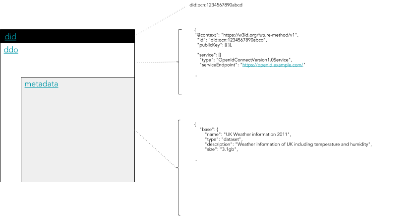

# OEP-7: Decentralized Identifiers

```
shortname:      7/DID
name:           Decentralized Identifiers
type:           Standard
status:         Draft
version:        0.3
editor:         Alex Coseru <alex@oceanprotocol.com>
contributors:   Aitor Argomaniz <aitor@oceanprotocol.com>
                Dimitri De Jonghe <dimi@oceanprotocol.com>,
                Troy McConaghy <troy@oceanprotocol.com>,
                Matthias Kretschmann <matthias@oceanprotocol.com>
```

**Table of Contents**

- [Motivation](#motivation)
- [Specification](#specification)
- [Proposed Solution](#proposed-solution)
  - [Decentralized IDs (DIDs)](#decentralized-ids-dids)
  - [DID Documents (DDOs)](#did-documents-ddos)
    - [DDO Services](#ddo-services)
  - [Integrity](#integrity)
    - [How to compute the integrity checksum](#how-to-compute-the-integrity-checksum)
    - [DID Document Proof](#did-document-proof)
    - [Length of a DID](#length-of-a-did)
    - [How to compute a DID](#how-to-compute-a-did)
  - [Registry](#registry)
  - [Resolver](#resolver)
- [Changes Required](#changes-required)
  - [List 1](#list-1)
  - [List 2](#list-2)
- [References](#references)
- [Change Process](#change-process)
- [Language](#language)

---

This specification is based on:

* the [W3C DID specification](https://w3c-ccg.github.io/did-spec/), which was at version 0.11 as of August 2018,
* the [Ocean Protocol technical whitepaper](https://github.com/oceanprotocol/whitepaper),
* [3/ARCH](../3/README.md), and
* [4/AGENT](../4/README.md).

## Motivation

The main motivations of this OEP are:

* Design a solution to extend the current architecture to use **Decentralized Identifiers (DIDs)** and **DID Documents (DDOs)**
* Understand how to resolve DIDs into DDOs
* Establishing the mechanism to know if the DDO associated with a DID was modified
* Defining the common mechanisms, interfaces and APIs to implemented the designed solution
* Define how Ocean assets, agents and domains can be modeled with a DID/DDO data model
* Understand how DID hubs are formed, and how they integrate a business and storage layer

## Specification

Requirements are:

* The DID resolving capabilities MUST be exposed in the client libraries, enabling to resolve a DDO directly in a totally transparent way
* ASSETS are DATA objects describing RESOURCES under control of a PUBLISHER
* PROVIDERS store the ASSET metadata off-chain
* OCEAN doesn't store ASSET contents (e.g. files)
* An ASSET is modeled in OCEAN as on-chain information stored in the KEEPER and metadata stored in OCEANDB
* ASSETS on-chain information only can be modified by OWNERS or DELEGATED USERS
* ASSETS can be resolved using a Decentralized ID (DID) included on-chain and off-chain
* A DID Document (DDO) should include the ASSET metadata
* Any kind of object registered in Ocean SHOULD have a DID allowing one to uniquely identify that object in the system
* ASSET DDO (and the metadata included as part of the DDO) is associated to the ASSET information stored on-chain using a common DID
* A DID can be resolved to get access to a DDO
* The function to calculate the HASH MUST BE standard

## Proposed Solution

### Decentralized IDs (DIDs)

A DID is a unique identifier that can be resolved or de-referenced to a standard resource describing the entity (a DID Document or DDO).
If we apply this to Ocean, the DID would be the unique identifier of an object represented in Ocean (i.e. the Asset ID of an ASSET or the Actor ID of a USER).
The DDO SHOULD include the METADATA information associated with this object.
The DDO is stored off-chain in Ocean.

In Ocean, a DID is a string that looks like:

```text
did:op:0ebed8226ada17fde24b6bf2b95d27f8f05fcce09139ff5cec31f6d81a7cd2ea
```

which follows [the generic DID scheme](https://w3c-ccg.github.io/did-spec/#the-generic-did-scheme).
Details about how to compute the DID are given below.

### DID Documents (DDOs)

If a DID is the index key in a key-value pair, then the DID Document is the value to which the index key points.
The combination of a DID and its associated DID Document forms the root record for a decentralized identifier.



A DDO document is composed of standard DDO attributes:

* `@context`
* `id`
* `created`
* `updated`
* `publicKey`
* `authentication`
* `proof`
* `verifiableCredential`
* `dtAddress`
* `service`

Asset metadata can be included as one of the objects inside the `"service"` array, with type `"metadata"`.

#### DDO Services

Each type of asset (dataset, algorithm, workflow, etc, ..) typically will have associated different kind of services. There are multiple type of services that are commonly added to all the assets:
* metadata - describing the asset
* provenance - describing the asset provenance
* access - describing how the asset can be downloaded
* compute - describing how the asset can be computed upon

Each service is distinguished by the `DDO.service.type` attribute.

Each service has an `attributes` section where all the information related to the service is added. As mandatory content, the attributes section will have a `main` sub-section. This one is important because it must include all the mandatory information that a service has to provide.

A part of the `attributes.main` sub-section, other optional sub-sections can be added (like: `attributes.curation` or `attributes.extra`) depending on the service type.

Each service has an `dtCost` and `timeout` (in seconds) section describing the cost and how long the sevice can be used after payment. A timeout of 0 represents no time limit.

Example:

```json
"service": [  
  {  
    "index": 0,
    "type": "metadata",
    "serviceEndpoint": "https://service/api/v1/metadata/assets/ddo/did:op:0ebed8226ada17fde24b6bf2b95d27f8f05fcce09139ff5cec31f6d81a7cd2ea",
    "attributes": {  
      "main": {},
      "additionalInformation": {},
      "curation": {}
    }
  },
  {  
    "index": 1,
    "type": "access",
    "serviceEndpoint": "http://localhost:8030/api/v1/brizo/services/consume",
    "attributes": {  
      "main": {
        "dtcost":"10",
        "timeout":0
      },
      "additionalInformation": {}
    }
  },
  {  
    "index": 2,
    "type": "compute",
    "serviceEndpoint": "http://localhost:8030/api/v1/brizo/services/compute",
    "attributes": {  
      "main": {
        "dtcost":"10",
        "timeout":3600
      },
      "additionalInformation": {}
    }
  }
]
```

- You can find a [complete example of a DDO](ddo-example.json).
- You can find a complete reference of the asset metadata in [OEP-8](8).
- You can find a complete [real world example of a DDO](https://w3c-ccg.github.io/did-spec/#real-world-example) with extended services added, as part of the W3C DID spec.

### Integrity

The Integrity policy for identity and metadata is a sub-specification for the Ocean Protocol allowing to validate the integrity of the Metadata associated to an on-chain object (initially an ASSET).

#### How to compute the integrity checksum

An ASSET in the system is composed by on-chain information maintained by the DLT and off-chain Metadata information (DDO) stored by the PROVIDER.

Technically a user could update the DDO accessing directly to the off-chain database, modifying attributes (e.g. License information, description, etc.) relevant to a previous consumption agreement with an user.

The motivation of this is to facilitate a mechanism allowing to the CONSUMER of an object, to validate if the DDO was modified after a previous agreement.

This hash composing the **integrity checksum** is calculated in the following way:

- The complete content of the `service[index].attributes.main` is serialized in a common string
- The string generated is is Hashed using SHA3-256 algorithm  (You might have to convert the string to bytes first.)
- The hash generated as a result of this process is stored in the `proof.checksum[index].checksum` attribute
- The previous 3 steps are repeated for every individual service include in the `service` array. The hash generated is always stored in the `proof.checksum` array using as key the `index` of the service computed
- During the serialization process, the objects to serialize (`service[index].attributes.main` are prepared using the following process:
  * The object is sorted alphabetically independently of the existing nested levels
  * In the JSON generated, all the characters between entries are removed (`\n`, `\t`, `\r`, whitespaces, etc.)
  * As a result must be generated a string of only one line 
- After hashing, in the DDO, the checksums should be represented as a hex string beginning with `0x` and ending with 64 hex characters (e.g. `0x52b5c93b82dd9e7ecc3d9fdf4755f7f69a54484941897dc517b4adfe3bbc3377`)
- After generating each individual checksum the complete `proof.checksum` entry is sorted, serialized and hashed as previously described in the other checksums
- The final hash generated as a result of hashing the checksums (DID CHECKSUM or DID HASH) will be the ID part of the DID (the string after the prefix `did:op:`)

Because this DID HASH will be stored on-chain and emitted as an event, a validator could use this information to check if something changed regarding the initial registration.

#### DID Document Proof

A proof on a DID Document is cryptographic proof of the integrity of the DID Document. In the DID Specification the `proof` attribute is optional.
We enforce the usage of the `proof` attribute to demonstrate the Owner of an Asset is signing the proof of integrity of some Asset attributes.
The information to sign by the owner is the **integrity checksum** defined in the above section.

```js
const signature = Sign.signMessage(DID)
```

The DID Document (DDO) SHOULD include the following `proof` information:

* `type` - Type of proof, in our case `"DDOIntegritySignature"`
* `created` - Date and time when the proof was created
* `creator` - Address of the user providing the proof
* `signatureValue` - Result of the signature given by the creator
* `checksum` - Checksums of the individual services included in the DDO 

Here is an example `proof` section to add in the DDO:

```json
"proof": {
    "type": "DDOIntegritySignature",
    "created": "2016-02-08T16:02:20Z",
    "creator": "0x00Bd138aBD70e2F00903268F3Db08f2D25677C9e",
    "signatureValue": "0xc9eeb2b8106e…6abfdc5d1192641b",
    "checksum": {
        "0": "0x52b5c93b82dd9e7ecc3d9fdf4755f7f69a54484941897dc517b4adfe3bbc3377",
        "1": "0x999999952b5c93b82dd9e7ecc3d9fdf4755f7f69a54484941897dc517b4adfe3"
    }    
}
```

Using the `proof` information, a third-party with access to the DDO could validate the `creator` signed a specific integrity checksum referring to an Asset.

#### Length of a DID

The length of a DID must be compliant with the underlying storage layer and function calls. Given that decentralized virtual machines make use of contract languages such as Solidity and WASM, it is advised to fit the DID in structures such as `bytes32`.

It would be nice to store the `did:op:` prefix in those 32 bytes, but that means fewer than 32 bytes would be left for storing the rest (25 bytes since "did:op:" takes 7 bytes if using UTF-8). If the rest is a secure hash, then we need a 25-byte secure hash, but secure hashes typically have 28, 32 or more bytes, so that won't work.

Only the hash value _needs_ to be stored, not the `did:op:` prefix, because it should be clear from context that the value is an Ocean DID.

#### How to compute a DID

The DID (`id`) string begins with `did:op:` and is followed by a string representation of a bytes32.

As is described previously, the DID is calculating doing the Hash (SHA3-256) of the `DDO.proof.checksum` entry


## References

* [DID Spec from the W3C Credentials Community Group](https://w3c-ccg.github.io/did-spec/)
* [DID Spec from _Rebooting the Web of Trust_](https://github.com/WebOfTrustInfo/rebooting-the-web-of-trust-fall2016/blob/master/topics-and-advance-readings/did-spec-working-draft-03.md)

## Change Process

This document is governed by [OEP 2/COSS](../2/README.md).

## Language

The key words "MUST", "MUST NOT", "REQUIRED", "SHALL", "SHALL NOT", "SHOULD", "SHOULD NOT", "RECOMMENDED", "NOT RECOMMENDED", "MAY", and "OPTIONAL" in this document are to be interpreted as described in [BCP 14](https://tools.ietf.org/html/bcp14) \[[RFC2119](https://tools.ietf.org/html/rfc2119)\] \[[RFC8174](https://tools.ietf.org/html/rfc8174)\] when, and only when, they appear in all capitals, as shown here.
