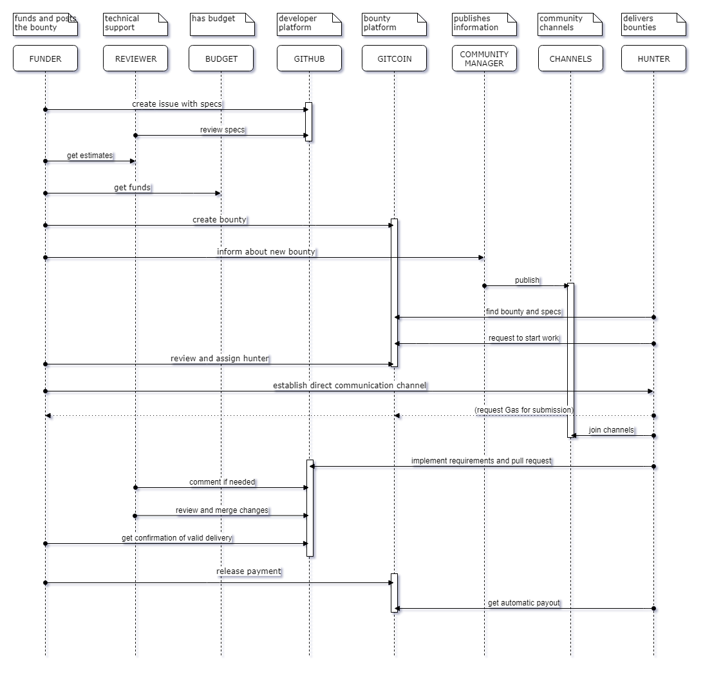

```
shortname: 9/BOUNTY
name: Bounties in Ocean Protocol
type: Meta
status: Raw
editor: Chalid Mannaa <chalid@bigchaindb.com>, Manan Patel <manan@oceanprotocol.com>
```

This document describes a pragmatic bounty system that enables open source projects to reward coding contributions to software in the Ocean Protocol ecosystem.

This specification is based on the intents and concepts of the [Gitcoin](https://gitcoin.co/) project.
## Change Process
This document is governed by [1/C4](../1/README.md) and  [2/COSS](../2/README.md).

## Goals
The primary goal of BOUNTY is to facilitate a reward process for open source software contributions into Ocean Protocol's github repositories. Such repositories should represent elements of the ecosystem building for the web3. 

BOUNTY is intended to above all be economical and rapid, so that it is useful to small teams with little time to spend on more formal processes.

## Problem and Motivation
Software [repositories](https://help.github.com/articles/about-repositories/) in [Github](https://github.com/) contain [issues](https://guides.github.com/features/issues/) . Issues represent problems in their specific context which should be resolved. 

An issue is called **bounty** when it has 

* a [requirement specification](https://en.wikipedia.org/wiki/Software_requirements_specification), 
* a [definition of done](https://www.scrum.org/resources/blog/walking-through-definition-done), 
* a funding,
* a resolution proposal, 
* an approved revision, 
* a merge into the master code branch and 
* a successful payment transaction. 

The purpose of bounties is to 
 * resolve issues,
 * scale developments in the ecosystem,
 * attract contributors for key components,
 * support adoption and
 * self-maintenance
 
## Process
The process requires following activities that should be performed

1. Identify issue and provide requirements specification 
1. Estimate efforts for the work to be done
1. Define the bounty, eg. funds/DoD
1. Clarify revisions and issue labeling ("bounty")
1. Create and submit bounty on the platform
1. Publish to blog, slack, gitter, twitter and linkedin
1. Monitor progress and comment where applicable
1. Revise pull request and merge
1. Reward / pay the bounty hunter

A typical interaction between bounty poster and bounty hunter is described in following sequence diagram.




Gitcoin as a platform supports the lifecycle of the bounty with Github integration and enables monitoring via email. Additional guidance can be found [here](https://docs.google.com/document/d/1_U9IdDN8FIRMGAdLWCMl2BnqCTAv558QvyJiSWQfkbs/edit?usp=sharing).

 

## Copyright Waiver
To the extent possible under law, the person who associated CC0 with this work has waived all copyright and related or neighboring rights to this work.