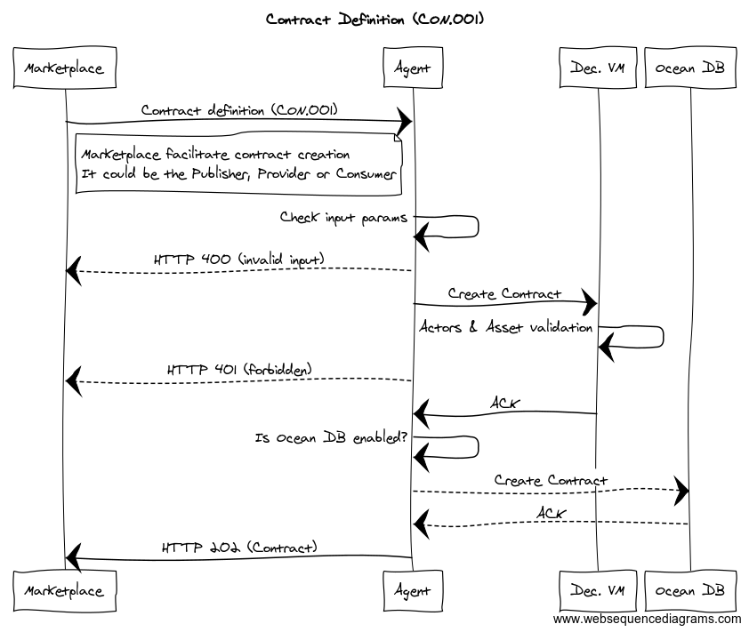
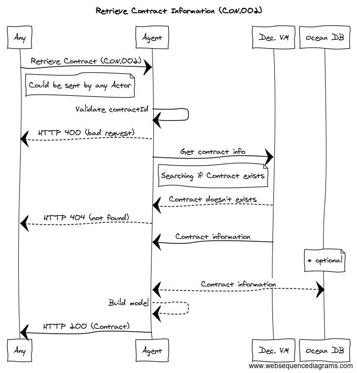

```
shortname: 9/TX
name: Ocean Order Transactions
type: Standard
status: Raw
editor: Aitor Argomaniz <aitor@oceanprotocol.com>

```

<!--ts-->

Table of Contents
=================

      
<!--te-->

# Ocean Order Transactions <a name="ocean-order-transactions"></a>

The Ocean Order Transactions (**TX**) is a specification for Ocean Protocol to manage the interaction between users trying to negotiate the Asset access or consumption through the network.

This OEP does not focus on asset attributes, whitelisting or curation. It's purely the mechanics of registering the order transactions allowing to the Ocean users to trade using the protocol.

This specification is based on [Ocean Protocol technical whitepaper](https://github.com/oceanprotocol/whitepaper), [3/ARCH](../3/README.md), [4/KEEPER](../4/README.md) and [5/AGENT](../5/README.md).

This specification is called **TX** henceforth.

## Change Process <a name="change-process"></a>
This document is governed by the [2/COSS](../2/README.md) (COSS).

## Language <a name="language"></a>
The key words "MUST", "MUST NOT", "REQUIRED", "SHALL", "SHALL NOT", "SHOULD", "SHOULD NOT", "RECOMMENDED", "NOT RECOMMENDED", "MAY", and "OPTIONAL" in this document are to be interpreted as described in [BCP 14](https://tools.ietf.org/html/bcp14) \[[RFC2119](https://tools.ietf.org/html/rfc2119)\] \[[RFC8174](https://tools.ietf.org/html/rfc8174)\] when, and only when, they appear in all capitals, as shown here.


## Motivation <a name="motivation"></a>

Ocean network aims to power marketplaces for relevant AI-related data services.
Different actors and stakeholders are necessary to interact between them using the Ocean Protocol defined.
One of the essential points of Ocean is to provide the mechanisms allowing to untrusted users to trade using the system.  

The main motivation of TX is to define a simple and clear protocol allowing those mechanics.

Some considerations:

* The negotiation protocol SHOULD be as simple as possible
* The protocol SHOULD be flexible enough to support different scenarios
* The information to store on-chain MUST be only the essential information to run the Smart Contracts
* Marketplaces are actors facilitating the discovery/negotiation but are not indispensable 
* Protocol MUST support contract definition and consumption without Marketplaces  


## Specification <a name="specification"></a>

Main requirements are:

* TX MUST provide the Smart Contracts logic allowing to non-trusted parties to negotiate the ASSETS sharing
* Main TX business logic will be implemented in the Smart Contract layer running in the **KEEPER::DEC-VM**
* The AGENT will interface with the KEEPER::DEC-VM to compose the valid transactions needed by the Smart Contracts layer
* The AGENT will integrate the KEEPER::DEC-VM to implement the Access Control capabilities
* The information sent to the KEEPER::DEC-VM by the AGENT MUST be only the essential
* The AGENT will integrate with OCEAN DB if it's provided, allowing to send to an external Data Store the copy of the transactions managed
* The AGENT and OCEAN DB integration is totally optional, the only source of truth is the data stored on-chain in the KEEPER::DEC-VM
* The AGENT will provide a higher level API allowing to third parties to integrate with TX in an easier way
* Contract negotiations MUST occur off-chain, the protocol won't provide methods for ASK/MATCHING
* Main parties involved in a Contract negotiation are PUBLISHERS, PROVIDERS, CONSUMERS and MARKETPLACES
* MARKETPLACES are facilitators but not indispensable for a Contract settlement
* A Contract can be prepared or defined by any of the parties involved in the Contract. 
* The essential information about the contract MUST be stored on-chain
* All the parties of the contract MUST sign the contract before to move to any consumption phase
* If a contract is not signed after a time, the contract SHOULD be Cancelled
* If a contract is signed, the PROVIDER is the one Authoring the Consumption
* When a contract is authorized, the CONSUMER can request the access to the ASSETs or SERVICES listed in the Contract
* When the PROVIDER facilitates all the Proofs of Service requested, the contract is moved to a settlement state

The following restrictions apply during the design/implementation of this OEP:

* The Assets registered in the system MUST be associated to the Actors registering the Assets
* The Actors associated to the Contracts (PUBLISHER, PROVIDER, CONSUMER, MARKETPLACE) MUST have a valid Account Id in the system
* The information or Metadata about the Contracts will be stored in Ocean DB if the user plugs a valid Ocean DB implementation
* Only the very basic information about the Contracts (ids, proofs, etc) MUST be stored in the Decentralized VM
* AGENT MUST NOT store any information about the Contracts, Assets or Actors during this process


A Contract could implement a state machine with the following states:

* **DRAFT** - Contract is created on-chain by any of the parties involved. Contract can be created as a result of a negotiation (Bid/Match) or automatically (ie. free scenarios). During the Creation, one or many signatures related with the parties involved can be provided.
* **SIGNED** -  All the parties involved in the Contract have provided their signature.
* **AUTHORIZED** - The provider authorize the consumption of the Asset giving (encrypted) the Consumption information (url, user, password, etc.)
* **SETTLED** - After being challenged and all the Proofs of Services requested provided, the contract is Settled. 
* **CANCELLED** - The Contract is cancelled by any reason. Signatures or authorization not provided, etc. 

The system MUST be designed and developed with PRIVACY and ANONYMITY as core principles. 

The **Contracts** information should be managed using an API. This API should exposes the following capabilities:

* Create a Contract
* Retrieve a Contract
* Sign a Contract
* Authorize a Contract
* Request access to the contents included in a contract
* Settle a Contract
* Revoke Contract Authorization


### Proposed Solution <a name="proposed-solution"></a>

The proposed solution is composed by the interaction of different elements:

* A high level RESTful API exposing the methods required to manage the Contracts (AGENT)
* A Keeper node registering the Contracts on-chain (KEEPER::DEC-VM)
* Optionally, an external database pluged using the Ocean DB interfaces 


We can show the interaction between layers and components using a stack view:


The following sections will describe the end to end implementation using a top to bottom approach, starting from the API interface to the Keeper implementation.


The above diagram shows the high level interactions between the components involved:

* A CONSUMER, using a Marketplace frontend application find an Asset and click on "buy button"
* The MARKETPLACE using his local AGENT or the CONSUMER, register the Contract in the KEEPER::DEC-VM ([CON.001](#CON.001)). In this process the Marketplace could provide the public keys of some of the parties involved (Marketplace, Consumer, Provider, Publisher)
  - In scenarios where the conditions are agreed by the Consumer, won't be necessary to request the approval/sign of the Publisher and Provider. It would reduce the time for contract setup, allowing quick consumption from the Consumer side
  - For example optionally, because the Asset was registered through the Marketplace, the Marketplace send a notification to the Publisher requesting his/her signature on the contract. If the user is a registered user in the Marketplace, this notification can be sent by email, sms or pidgeon, doesn’t matter.
* The PUBLISHER receives the sign notification and provides his/her signature through the Marketplace frontend application
* The MARKETPLACE using the AGENT provide the PUBLISHER signature and store on-chain ([CON.003](#CON.003))
* The PROVIDER AGENT is subscribed to the KEEPER::DEC-VM transaction log. So the Provider is aware of any change in any Contract related to him. 
* When the Contract has been signed by all the parties, the PROVIDER AGENT send an Authorization Consumption request ([CON.004](#CON.004)). The PROVIDER gives the information necessary to consume the ASSET (it includes where is the asset and how to get access). This information is encrypted using asymmetric cryptography. So only the CONSUMER using his/her private key should be able to get decrypt this data.  This is stored on-chain. 
* The MARKETPLACE AGENT, subscribed to the transaction log, after to get notice the contract has been signed and access granted, notify the CONSUMER saying the ASSET is ready to be consumed.
* The CONSUMER request access to download the asset [CON.005](#CON.005) using the information provided on-chain by the PROVIDER.
* The PROVIDER AGENT the Access Control layer validate the access grants of the CONSUMER to the ASSET related to the Contract. This is validated using the Decentralized VM. On-Chain Access Control.
* If everything is okay, the PROVIDER returns the content of the ASSET in the same request.

The workflow described is one of the available options. Because the protocol is flexible, **alternative workflows can be implemented**: 

* During the creation of the Contract, the Marketplace could provide the Publisher signature during the Contract creation. This depends of the Marketplace conditions provided to their users.
* In a Free scenario, all the signature process could be automated without any kind of interaction
* In a scenario where the conditions requested by Producer and Publisher are agreed by the Consumer, the Contract won't require Publisher and Provider signatures, moving to **SIGNED** state automatically after the Consumer (and Marketplace if it's involved) signs the contract
* The transaction log of the KEEPER::DEC-VM is open, so any actor could be subscribed to them to be aware of the Contract changes for example. It could be implemented without any Agent, using directly the web3 libraries.
* The request access/download of an Asset could happen also having the Marketplace as intermediary
* The Marketplace is a facilitator, but all the contract negotiation and definition could happen without any interaction of the Marketplace. Publishers, Providers and Consumers could complete a full transaction with a Marketplace. 
* Different roles can be provided by the same actor, it would allow alternative scenarios also supported:
  - Publisher acting in addition as Providers giving access to the Assets
  - Marketplaces acting as Providers
  - Marketplaces acting on behalf of Providers or Publishers 


In the following sections you can find the end to end implementation details of the complete TX functionality.


### Smart Contracts <a name="smart-contracts"></a>

The **KEEPER::DEC-VM** will store the essential user information to allow the implementation of the TX OEP.
It means the system MUST NOT store any personal information, enabling PRIVACY and ANONYMITY.

Taking this into account, the skeleton of main implementation should provide the following structs and interfaces:

```solidity

contract ContractsRegistry {

    struct Contract {
        
        bytes32 contractId;
        // Parties involved 
        address publisherId;
        address consumerId;
        address providerId;        
        address marketplaceId= 0x0; // Optional party
        
        bytes32 assetId;
        
        // 0= DRAFT, 1=SIGNED, 2=AUTHORIZED, 3=SETTLED, 9=CANCELED
        uint state;
        ContractCondition conditions;        
    }
    
    struct ContractConditions {
        uint price;
        uint availability;
    }
    
    mapping(bytes20 => Contract) contracts;
    
    function register(address _pubId, address _proId, address _conId, address _mktId, bytes32 _assetId, uint price, uint availability) 
                        external returns (bytes32 contractId) { }
    
    function getState(bytes32 _contractId) public view returns (uint state) { }
    
    function getContract(bytes32 _contractId) public view returns (address, address, address, address, bytes32, uint, uint) { }

    // Given an array of ids of actors signing the contract
    function signContract(address[] _signers) external returns (uint state) {}

    function authorize(bytes32 _contractId) external returns (bool success) {}
    
    function provideAccess(bytes32 _contractId, ConsumptionDetails _consumptionDetails) external returns (bool success) {} 

    function settle(bytes32 _contractId) external returns (bool success) {}
    
    function revoke(bytes32 _contractId) external returns (bool success) {}

}
```

Different states are:

* **DRAFT** - `state= 0`
* **SIGNED** -  `state= 1`
* **AUTHORIZED** - `state= 2`
* **SETTLED** - `state= 3` 
* **CANCELLED** - `state= 9` 

To save costs, the states are mapped to uint. 

<a name="create-contract"></a><a name="CON.001"></a>
### Create Contract



In the [above diagram](diagrams/CON.001.md) the Agent is in charge of interacting with the Decentralized VM to implement the Access Control validations and Contract definition on-chain.
If Ocean DB is enabled, the AGENT will send the Contract information to Ocean DB.
The registering of a new Contract involves the following implementations:

#### Ocean Agent API

It is necessary to expose a RESTful HTTP interface using the following details:

```
Reference: CON.001
Path: /api/v1/contracts
HTTP Verb: POST
Caller: Any party involved in the Contract (CONSUMER, PRODUCER, PUBLISHER, MARKETPLACE)
HTTP Output Status Codes: 
    HTTP 202 - Accepted
    HTTP 400 - Bad request
    HTTP 401 - Forbidden  
```

##### Input Parameters

| Parameter | Type  | Description |
|:----------|:------|:------------|
|assetId    |string |Id of the Asset related with the contract|
|publisherId|string |Id of the publisher|
|consumerId |string |Id of the consumer|
|providerId |string |Id of the provider (optional). A contract can be created as DRAFT without Provider|
|marketplaceId|string|Id of the marketplace (optional). A contract can executed without a Marketplace participation|
|price      |int    |Price defined in the contract in token drops. 0 if free.|
|availability|int   |Period of time the consumption is available (optional). 0 if there not any limitation|
|metadata   |Json   |Free Json object of information to be persisted in Ocean DB if enabled (optional)|

If **OCEAN DB** is enabled, the content of the Metadata attribute will be pass as parameter to the Ocean DB implementation to be stored in an external system.  

Example: 

```json
{	
	"assetId": "1234abcde",
	"publisherId": "0x999888777",
	"consumerId": "0xaabbcc112",
	"providerId": "0xaabbcc112",
	"price": 10,
	"metadata": {
        "topic": "xxx",
        "attributes": [{
            "key": "interests",
            "value": "Looking Ahead"
        }]
	}
}
```

<a name="contract-output"></a>
##### Output

The output of this request MUST add the following attributes generated by the system:

| Parameter | Type | Description |
|:----------|:-----|:------------|
|contractId|string|Id of the Contract created|
|assetId|string|Id of the Asset related with the contract|
|publisherId|string|Id of the publisher|
|consumerId |string|Id of the consumer|
|providerId |string|Id of the provider (optional)|
|marketplaceId |string|Id of the marketplace (optional)|
|price      |int    |Price defined in the contract in token drops. 0 if free.|
|availability|int   |Period of time the consumption is available (optional). 0 if there not any limitation|
|creationDatetime|datetime|Allocated by the system when was created in the AGENT (universal datetime), time before consensus|
|updateDatetime|datetime|Allocated by the system when was updated the metadata in the AGENT (universal datetime), time before consensus
|state|string|Internal state of the Contract: DRAFT, SIGNED, AUTHORIZED, SETTLED, CANCELLED|

Example: 

```json
{	
    "contractId": "87654321",
	"assetId": "1234abcde",
	"publisherId": "0x999888777",
	"consumerId": "0xaabbcc112",
	"providerId": "0xaabbcc112",
	"price": 10,
	"state": "DRAFT",
	"creationDatetime": "2018-05-18T16:00:00Z",
    "updateDatetime": "2018-05-18T16:00:00Z",
	"metadata": {
        "topic": "xxx",
        "attributes": [{
            "key": "interests",
            "value": "Looking Ahead"
        }]
	}
}
```

#### Orchestration Layer

The AGENT node will be in charge of manage the Contracts creation. 
The Ocean DB integration is optional, so the Metadata will be stored there only if Ocean DB interface implementation is provided.
Contract information MUST be persisted in the Decentralized VM and Ocean DB (if the configuration is provided), storing in the Decentralized DB only the essential information to run the Smart Contracts.

Ocean DB will store the complete metadata information. To coordinate the creation of the Contracts in a consistent way in both data stores, the AGENT will implement an Orchestration component in charge of that.

The AGENT will coordinate the creation of an Contracts writing initially in the KEEPER::DEC-VM. It will return a Transaction Receipt (see more details about the Transaction Receipt model). 
After of that the Orchestration layer will persist the complete Contracts metadata in Ocean DB.


#### Interaction with the Keeper


The **KEEPER::DEC-VM** will persist the following information:

| Attribute | Type  | Description |
|:----------|:------|:------------|
|contractId |address|Id of the contract created|
|publisherId|address|Owner of the Asset|
|providerId |address|Owner of the Asset|
|consumerId |address|Owner of the Asset|
|marketplaceId|address|Owner of the Asset|
|assetId    |bytes32|Id of the Asset|
|state      |uint   |State of the Contract (0= DRAFT, 1=SIGNED, 2=AUTHORIZED, 3=SETTLED, 9=CANCELED)|
|price      |uint   |Price offered by the Consumer|
|availability|uint   |Time period the asset is available|


During the execution of the `register` function, the following tasks MUST be implemented:

* Check the authorization of the msg.sender
* Check the asset availability
* Check if the asset has assigned a provider
* Check if the conditions proposed (price & availability) meet the provider and publisher requirements
  - If conditions are granted, state is **SIGNED**
  - Else, state is **DRAFT**
* Register the contract 

Using any of the existing web3 implementation library (web3.js, web3.py, web3.j, etc), it's possible to interact with the VM Smart Contracts.


#### Interaction with Ocean DB

The integration with OCEAN DB is optional, so only will works if an implementation backend is provided.

If it's enabled, the Ocean DB layer will interact with the backend to store the metadata information about the contracts. So a part of the information defined in the Output section, the AGENT will forward the **metadata** json document to the Ocean DB implementation. 


---

<a name="retrieve-contract"></a><a name="CON.002"></a>
### Retrieve Contract



In the [above diagram](diagrams/CON.002.md), the retrieval of the Contract information state is related with the AGENT and the KEEPER::DEC-VM. No information is read from Ocean DB, unless an Ocean DB implementation is provided. This functionality involves the following implementations:

#### Ocean Agent API

It is necessary to expose a RESTful HTTP interface using the following details:

```
Reference: CON.002
Path:  /api/v1/contracts/{orderId}
HTTP Verb: GET
Caller: Any
Input: contractId
Output: Contract Schema
HTTP Output Status Codes: 
    HTTP 200 - OK
    HTTP 400 - Invalid params
    HTTP 404 - Not Found
```


##### Input Parameters

| Parameter | Type | Description |
|:----------|:-----|:------------|
|contractId |string|Contract ID to retrieve|

Example: 

```http
GET http://localhost:8080/api/v1/contracts/48dd4fec25d5b3fd2295e
```

##### Output

A complete description of the Contract output can be found in the [previous section](#contract-output).

#### Interaction with the Keeper

Before to query the KEEPER::DEC-VM, it's necessary to check the length and format of the contractId. If the length and format doesn't fit the standard address definition, the system should return a **HTTP 400** Invalid params message.

The KEEPER::DEC-VM stores the state about the Contract, being the KEEPER::DEC-VM the source of truth about Contracts information. 
The AGENT will use the `AssetsRegistry.getContract` method to check if the contract already exists and return the Contract attributes.
If no contract is found, the system must return a **HTTP 404** Not Found message.

If Ocean DB is enabled, using the contractId as key, the system will retrieve the information about the Contract. So having the Contract information retrieved from the KEEPER::DEC-VM and Ocean DB, the AGENT should compose the output. 
Taking into account the information given by the KEEPER::DEC-VM should prevail. 


---

<a name="retrieve-contract"></a><a name="CON.002"></a>
### Updating Contract


In the [above diagram](diagrams/ACT.003.md) the Agent and the Account Manager capabilities are implemented in the AGENT scope.

This method it's a wrapper to edit the Actors Metadata, not the essential (KEEPER::VM) information. So only the metadata information can be updated.

The KEEPER::Decentralized VM works in this method as authorization mechanism, allowing/denying the user to update the Metadata.

The updating of an existing Actor metadata involves the following implementations:

#### Ocean Agent API

It is necessary to expose a RESTful HTTP interface using the following details:

```
Reference: ACT.003
Path: /api/v1/keeper/actors
HTTP Verb: PUT
Caller: Actor
Input: Actor Schema
Output: Actor Schema
HTTP Output Status Codes: 
    HTTP 202 - Accepted
    HTTP 400 - Invalid params
    HTTP 404 - Not Found
```

##### Input Parameters

| Parameter | Type | Description |
|:----------|:-----|:------------|
|actorId    |string|Account address|
|metadata   |Json Object|Free Json object with attributes|

Example: 

```json
{
    "actorId": "0x8f0227d45853a50eefd48dd4fec25d5b3fd2295e",
    "metadata" : {
        "name": "Alice",	
        "attributes": [{
            "key": "interests",
            "value": "no interests"
        }]
	}
}
```

#### Accounts Management

The Accounts Manager components it's not involved in this method. 


#### Interaction with the Keeper

The Decentralized VM stores the state about the Actors. Using the actorId as key in the Actors collection, the system will authorize or deny the update of the Actor information..

The information about if the actor is enabled or disabled can be obtained integrating the `ActorsRegistry::getState` Smart Contract method.
The information about if the actor can be updated can be obtained integrating the `ActorsRegistry::canUpdate` Smart Contract method.

If the Actor metadata has the state attribute `state == DISABLED (9)` the method should return a **HTTP 404** Not Found message.
If after executing the `ActorsRegistry::canUpdate` method, the Actor can't be updated by the user, the method should return a **HTTP 401** Forbidden message.


#### Interaction with Ocean DB

Ocean DB, if it's enabled, will store the metadata information about the actor. Only the metadata attribute will be modified:
 
After creating the Actor in the Database, it will return a HTTP 202 Accepted message. It means the request has been accepted for processing, but the processing has not been completed.


#### Output
Using the information stored/provided by the user and the Decentralized VM, the **AGENT** SHOULD compose the output payload to return. It should include same information detailed in the previous sections.


### Retire an Actor <a name="retire-an-actor"></a>


In the [above diagram](diagrams/ACT.004.md) the Agent and the Account Manager capabilities are implemented in the AGENT scope.

This method implements a soft delete of an Actor. It means the Actor is updated setting the state attribute to `DISABLED`. The method will return a HTTP 202 status code and the Actor modified in the response body.

This method only can be integrated by the Actor. The Input of this method is the actorId referencing to a unique Actor. 

This method authorize the retirement of an Actor using the Smart Contract deployed in the Decentralized VM. 

#### Ocean Agent API

It is necessary to expose a RESTful HTTP interface using the following details:

```
Reference: ACT.004
Path: /api/v1/keeper/actors/{actorId}
HTTP Verb: DELETE
Caller: Actor
Input: actorId
Output: Actor Schema
HTTP Output Status Codes: 
    HTTP 202 - Accepted
    HTTP 400 - Invalid params
    HTTP 404 - Not Found
```

##### Input Parameters

| Parameter | Type | Description |
|:----------|:-----|:------------|
|actorId    |string|Account address|


Example: 

```http
DELETE http://localhost:8080/api/v1/keeper/actors/0x8f0227d45853a50eefd48dd4fec25d5b3fd2295e
```

```json
{
    "actorId": "0x8f0227d45853a50eefd48dd4fec25d5b3fd2295e",
    "state": "DISABLED"
}
```

#### Accounts Management

The Accounts Manager components it's not involved in this method. 


#### Interaction with the Keeper

The Decentralized VM stores the state about the Actors. Using the actorId as key in the Actors collection, the system will authorize or deny the retirement of the Actor information..

The information about if the actor is enabled or disabled can be obtained integrating the `ActorsRegistry::getState` Smart Contract method.
The information about if the actor can be retired can be obtained integrating the `ActorsRegistry::canRetire` Smart Contract method.

If the Actor metadata has the state attribute `state == DISABLED (9)` the method should return a **HTTP 404** Not Found message.
If after executing the `ActorsRegistry::canRetire` method, the Actor can't be updated by the user, the method should return a **HTTP 401** Forbidden message.


#### Interaction with Ocean DB

Ocean DB, if it's enabled, will store the metadata information about the actor. This method only will update the information about the **state** attribute.

After updating the Actor state in the Database, it will return a HTTP 202 Accepted message. It means the request has been accepted for processing, but the processing has not been completed.


#### Output

All the information to output is the actorId and state of the user.

```json
{
    "actorId": "0x8f0227d45853a50eefd48dd4fec25d5b3fd2295e",
    "state": "DISABLED"
}
```


### Assignee(s)
Primary assignee(s): @aaitor


### Targeted Release

The implementation of the full Keeper functionality it's planned for the [Alpha release](https://github.com/oceanprotocol/ocean/milestone/4)


### Status
unstable


## Copyright Waiver  <a name="copyright-waiver"></a>
To the extent possible under law, the person who associated CC0 with this work has waived all copyright and related or neighboring rights to this work.
