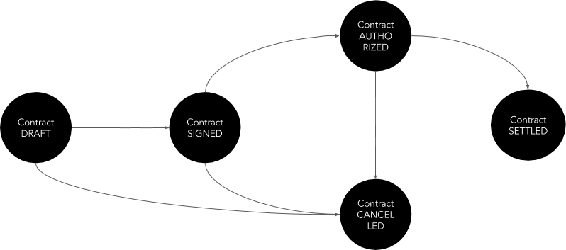
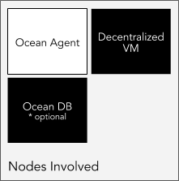
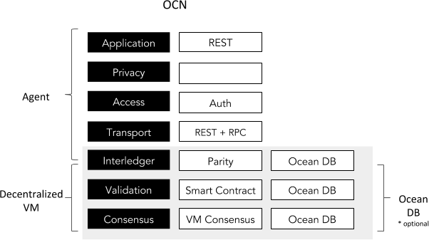
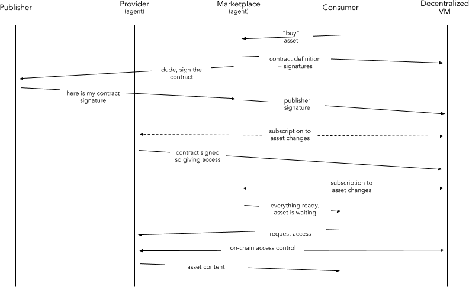

```
shortname: 15/OOT
name: Ocean Order Transactions
type: Standard
status: Raw
editor: Aitor Argomaniz <aitor@oceanprotocol.com>

```

<!--ts-->

Table of Contents
=================

      
<!--te-->

# Ocean Order Transactions <a name="ocean-order-transactions"></a>

The Ocean Order Transactions (**OOT**) is a specification for Ocean Protocol to manage the interaction between users trying to negotiate the Asset access or consumption through the network.

This OEP does not focus on asset attributes, whitelisting or curation. It's purely the mechanics of registering the order transactions allowing to the Ocean users to trade using the protocol.

This specification is based on [Ocean Protocol technical whitepaper](https://github.com/oceanprotocol/whitepaper), [3/ARCH](../3/README.md), [4/KEEPER](../4/README.md) and [5/AGENT](../5/README.md).

This specification is called **OOT** henceforth.

## Change Process <a name="change-process"></a>
This document is governed by the [2/COSS](../2/README.md) (COSS).

## Language <a name="language"></a>
The key words "MUST", "MUST NOT", "REQUIRED", "SHALL", "SHALL NOT", "SHOULD", "SHOULD NOT", "RECOMMENDED", "NOT RECOMMENDED", "MAY", and "OPTIONAL" in this document are to be interpreted as described in [BCP 14](https://tools.ietf.org/html/bcp14) \[[RFC2119](https://tools.ietf.org/html/rfc2119)\] \[[RFC8174](https://tools.ietf.org/html/rfc8174)\] when, and only when, they appear in all capitals, as shown here.


## Motivation <a name="motivation"></a>

Ocean network aims to power marketplaces for relevant AI-related data services.
Different actors and stakeholders are necessary to interact between them using the Ocean Protocol defined.
One of the essential points of Ocean is to provide the mechanisms allowing to untrusted users to trade using the system.  

The main motivation of OOT is to define a simple and clear protocol allowing those mechanics.

Some considerations:

* The negotiation protocol SHOULD be as simple as possible
* The protocol SHOULD be flexible enough to support different scenarios
* The information to store on-chain MUST be only the essential information to run the Smart Contracts
* Marketplaces are actors facilitating the discovery/negotiation but are not indispensable 
* Protocol MUST support contract definition and consumption without Marketplaces  


## Specification <a name="specification"></a>

Main requirements are:

* OOT MUST provide the Smart Contracts logic allowing to non-trusted parties to negotiate the ASSETS sharing
* Main OOT business logic will be implemented in the Smart Contract layer running in the KEEPER::Decentralized VM
* The AGENT will interface with the Decentralized VM to compose the valid transactions needed by the Smart Contracts layer
* The AGENT will integrate the Decentralized VM to implement the Access Control capabilities
* The information sent to the Decentralized VM by the AGENT MUST be only the essential
* The AGENT will integrate with OCEAN DB if it's provided, allowing to send to an external Data Store the copy of the transactions managed
* The AGENT and OCEAN DB integration is totally optional, the only source of truth is the data stored on-chain in the Decentralized VM
* The AGENT will provide a higher level API allowing to third parties to integrate with OOT in an easier way
* Contract negotiations MUST occur off-chain, the protocol won't provide methods for ASK/MATCHING
* Main parties involved in a Contract negotiation are PUBLISHERS, PROVIDERS, CONSUMERS and MARKETPLACES
* MARKETPLACES are facilitators but not indispensable for a Contract settlement
* A Contract can be prepared or defined by any of the parties involved in the Contract. 
* The essential information about the contract MUST be stored on-chain
* All the parties of the contract MUST sign the contract before to move to any consumption phase
* If a contract is not signed after a time, the contract SHOULD be Cancelled
* If a contract is signed, the PROVIDER is the one Authoring the Consumption
* When a contract is authorized, the CONSUMER can request the access to the ASSETs or SERVICES listed in the Contract
* When the PROVIDER facilitates all the Proofs of Service requested, the contract is moved to a settlement state

The following restrictions apply during the design/implementation of this OEP:

* The Assets registered in the system MUST be associated to the Actors registering the Assets
* The Actors associated to the Contracts (PUBLISHER, PROVIDER, CONSUMER, MARKETPLACE) MUST have a valid Account Id in the system
* The information or Metadata about the Contracts will be stored in Ocean DB if the user plugs a valid Ocean DB implementation
* Only the very basic information about the Contracts (ids, proofs, etc) MUST be stored in the Decentralized VM
* AGENT MUST NOT store any information about the Contracts, Assets or Actors during this process




A Contract could implement a state machine with the following states:

* **DRAFT** - Contract is created on-chain by any of the parties involved. Contract can be created as a result of a negotiation (Bid/Match) or automatically (ie. free scenarios). During the Creation, one or many signatures related with the parties involved can be provided.
* **SIGNED** -  All the parties involved in the Contract have provided their signature.
* **AUTHORIZED** - The provider authorize the consumption of the Asset giving (encrypted) the Consumption information (url, user, password, etc.)
* **SETTLED** - After being challenged and all the Proofs of Services requested provided, the contract is Settled. 
* **CANCELLED** - The Contract is cancelled by any reason. Signatures or authorization not provided, etc. 

The system MUST be designed and developed with PRIVACY and ANONYMITY as core principles. 

The **Contracts** information should be managed using an API. This API should exposes the following capabilities:

* Create a Contract
* Retrieve a Contract
* Sign a Contract
* Authorize a Contract
* Request access to the contents included in a contract
* Settle a Contract
* Revoke Contract Authorization


### Proposed Solution <a name="proposed-solution"></a>

The proposed solution is composed by the interaction of different elements:

* A high level RESTful API exposing the methods required to manage the Contracts (AGENT)
* A Keeper node registering the Contracts on-chain (KEEPER)
* Optionally, an external database pluged using the Ocean DB interfaces 



We can show the interaction between layers and components using a stack view:



The following sections will describe the end to end implementation using a top to bottom approach, starting from the API interface to the Keeper implementation.



The above diagram shows the high level interactions between the components involved:

* A CONSUMER, using a Marketplace frontend application find an Asset and click on “buy button”
* The MARKETPLACE using his local AGENT register the Contract in the Decentralized VM ([CON.001](#CON.001)). In this process the Marketplace could provide the public keys of all or some of the parties involved (Marketplace, Consumer, Provider, Publisher)
  - For example optionally, because the Asset was registered through the Marketplace, the Marketplace send a notification to the Publisher requesting his/her signature on the contract. If the user is a registered user in the Marketplace, this notification can be sent by email, sms or pidgeon, doesn’t matter.
* The PUBLISHER receives the sign notification and provides his/her signature through the Marketplace frontend application
* The MARKETPLACE using the AGENT provide the PUBLISHER signature and store on-chain ([CON.003](#CON.003))
* The PROVIDER AGENT is subscribed to the Decentralized VM transaction log. So the Provider is aware of any change in any Contract related to him. 
* When the Contract has been signed by all the parties, the PROVIDER AGENT send an Authorization Consumption request ([CON.004](#CON.004)). The PROVIDER gives the information necessary to consume the ASSET (it includes where is the asset and how to get access). This information is encrypted using asymmetric cryptography. So only the CONSUMER using his/her private key should be able to get decrypt this data.  This is stored on-chain. 
* The MARKETPLACE AGENT, subscribed to the transaction log, after to get notice the contract has been signed and access granted, notify the CONSUMER saying the ASSET is ready to be consumed.
* The CONSUMER request access to download the asset [CON.005](#CON.005) using the information provided on-chain by the PROVIDER.
* The PROVIDER AGENT the Access Control layer validate the access grants of the CONSUMER to the ASSET related to the Contract. This is validated using the Decentralized VM. On-Chain Access Control.
* If everything is okay, the PROVIDER returns the content of the ASSET in the same request.

The workflow described is one of the available options. Because the protocol is flexible, **alternative workflows can be implemented**: 

* During the creation of the Contract, the Marketplace could provide the Publisher signature during the Contract creation. This depends of the Marketplace conditions provided to their users.
* In a Free scenario, all the signature process could be automated without any kind of interaction
* The transaction log of the Decentralized VM is open, so any actor could be subscribed to them to be aware of the Contract changes for example. It could be implemented without any Agent, using directly the web3 libraries.
* The request access/download of an Asset could happen also having the Marketplace as intermediary
* The Marketplace is a facilitator, but all the contract negotiation and definition could happen without any interaction of the Marketplace. Publishers, Providers and Consumers could complete a full transaction with a Marketplace. 
* Different roles can be provided by the same actor, it would allow alternative scenarios also supported:
  - Publisher acting in addition as Providers giving access to the Assets
  - Marketplaces acting as Providers
  - Marketplaces acting on behalf of Providers or Publishers 


In the following sections you can find the end to end implementation details of the complete OOT functionality.


### Smart Contracts <a name="smart-contracts"></a>

The KEEPER::Decentralized VM will store the essential user information to allow the implementation of the OOT OEP.
It means the system MUST NOT store any personal information, enabling PRIVACY and ANONYMITY.

Taking this into account, the skeleton of main implementation should provide the following structs and interfaces:

```solidity

contract ContractsRegistry {

    struct Contract {
        
        bytes20 contractId;
        // Parties involved 
        address publisherId;
        address providerId;
        address consumerId;
        address marketplaceId; // Optional party
        
        // Who signed the contract?
        bool publisherSigned;
        bool providerSigned;
        bool consumerSigned;
        bool marketplaceSigned;
        
        byte32 assetId;
        // 0= DRAFT, 1=SIGNED, 2=AUTHORIZED, 3=SETTLED, 9=CANCELED
        uint state;        
    }
    
    mapping(bytes20 => Contract) contracts;
    
    function register(address _pubId, address _proId, address _conId, address _mktId,
                       bool _pubSign, address _proSign, address _conSign, address _mktSign,
                       byte32 _assetId) public returns (bytes20 contractId) { }
    
    function getState(bytes20 _contractId) public view returns (uint state) { }

    // Given an array of ids of actors signing the contract
    function signContract(address[] _signers) public returns (uint state) {}

    function authorize(byte20 _contractId) public returns (bool success) {}
    
    function provideAccess(byte20 _contractId, ConsumptionDetails _consumptionDetails) public returns (bool success) {} 

    function settle(byte20 _contractId) public returns (bool success) {}
    
    function revoke(byte20 _contractId) public returns (bool success) {}

}
```

Different states are:

* **DRAFT** - `state= 0`
* **SIGNED** -  `state= 1`
* **AUTHORIZED** - `state= 2`
* **SETTLED** - `state= 3` 
* **CANCELLED** - `state= 9` 

To save costs, the states are mapped to uint. 

 <a name="create-contract"></a>
### Create Contract


In the [above diagram](diagrams/ACT.001.md) the Agent and the Account Manager capabilities are implemented in the AGENT scope.
No information is going through the Decentralized VM.
The registering of a new Actor involves the following implementations:

#### Ocean Agent API

It is necessary to expose a RESTful HTTP interface using the following details:

```
Reference: ACT.001
Path: /api/v1/keeper/actors
HTTP Verb: POST
Caller: The Actor trying to be registered
Input: Actor Schema
Output: Actor Schema
HTTP Output Status Codes: 
    HTTP 202 - Accepted
    HTTP 400 - Bad request
    HTTP 422 - Actor already exists
```

##### Input Parameters

| Parameter | Type | Description |
|:----------|:-----|:------------|
|password   |string|Account password/|
|metadata   |Json Object|Free Json object of information to be persisted in Ocean DB if enabled (optional)|

Because all parameters are optional but the password, a payload with only the password is allowed to create an Actor.
If **OCEAN DB** is enabled, the content of the Metadata attribute will be pass as parameter to the Ocean DB implementation to be stored in an external system.  

Example: 

```json
{	
	"password": "secret",
	"metadata": {
        "name": "John Doe",
        "attributes": [{
            "key": "interests",
            "value": "Looking Ahead"
        }]
	}
}
```

#### Accounts Management

The AGENT node will be in charge of manage the Accounts creation. To do that the AGENT will interact with the **Accounts API** provided by the **Parity** client.

The API method to integrate is the [personal::newaccount](https://wiki.parity.io/JSONRPC-personal-module#personal_newaccount).
As a result of this, the personal::newaccount method, we should obtain the account address:

```json
{
  "id": 1,
  "jsonrpc": "2.0",
  "result": "0x8f0227d45853a50eefd48dd4fec25d5b3fd2295e"
}
```

The **address** attribute obtained in the response will be **actorId** of the new Actor.

#### Interaction with the Keeper

The KEEPER::Decentralized VM will store the essential user information to allow the implementation of the Actors TCR.
It means the system MUST NOT store any personal information, enabling PRIVACY and ANONYMITY.

The **KEEPER::Decentralized VM** will persist the following information:

| Attribute | Type | Description |
|:----------|:-----|:------------|
|actorId    |address|Owner of the Asset|
|state      |uint  |TCR state of the user|
  
Using any of the existing web3 implementation library (web3.js, web3.py, web3.j, etc), it's possible to interact with the VM Smart Contracts.


#### Interaction with Ocean DB

The integration with OCEAN DB is optional, so only will works if an implementation backend is provided.

If it's enabled, the Ocean DB layer will interact with the backend to store the metadata information about the actors. 

| Attribute | Type | Description |
|:----------|:-----|:------------|
|actorId    |string|Actor Id|
|state      |enum  |Internal state information. One of the following("CREATED", "WHITELISTED", "BANNED", "DISABLED")|
|creationDatetime |Datetime |Creation datetime set by the database|
|metadata   |Json Object|Free Json object with attributes given in the request|

Different states are:

* CREATED - Actor just created in the system
* WHITELISTED - Actor whitelisted after a curation/verification process
* BANNED - Actor banned from the system
* DISABLED - Actor retired or disabled of the system

Actor state will be set as **CREATED** by the system.


#### Output

After creating the Actor in the datastores, the AGENT will return a HTTP 202 Accepted message. It means the request has been accepted for processing, but the processing has not been completed.

Using the information stored and provided by the user, the **AGENT** SHOULD compose the output payload to return. It should include the following information:

| Attribute | Type | Description |
|:----------|:-----|:------------|
|actorId    |string|Account address|
|state      |enum  |Internal state information. One of the following("CREATED", "WHITELISTED", "BANNED", "DISABLED")|
|creationDatetime |Datetime |Creation datetime set by the database|
|metadata   |Json Object|Free Json object with attributes given in the request|


### Retrieve information of an existing actor <a name="retrieve-actor"></a>


In the [above diagram](diagrams/ACT.002.md), the retrieval of the Actor information state is related with the AGENT and the KEEPER::Decentralized VM. No information is read from Ocean DB. This functionality involves the following implementations:

#### Ocean Agent API

It is necessary to expose a RESTful HTTP interface using the following details:

```
Reference: ACT.002
Path:  /api/v1/keeper/actors/{actorId}
HTTP Verb: GET
Caller: Any
Input: actorId
Output: Actor Schema
HTTP Output Status Codes: 
    HTTP 200 - OK
    HTTP 400 - Invalid params
    HTTP 404 - Not Found
```


##### Input Parameters

| Parameter | Type | Description |
|:----------|:-----|:------------|
|actorId    |string|Account address to retrieve|

Example: 

```http
GET http://localhost:8080/api/v1/keeper/actors/0x8f0227d45853a50eefd48dd4fec25d5b3fd2295e
```

```json
{
    "actorId": "0x8f0227d45853a50eefd48dd4fec25d5b3fd2295e",
	"state": "CREATED"
}
```

Before to query the KEEPER::Decentralized VM, it's necessary to check the length and format of the actorId. If the length and format doesn't fit the standard address definition, the system should return a **HTTP 400** Invalid params message.

Depending of the implementation, there are different alternatives to check if an address is valid (see this [link](https://ethereum.stackexchange.com/questions/1374/how-can-i-check-if-an-ethereum-address-is-valid)).

#### Accounts Management

The Accounts Manager components it's not involved in this method. All the information will be retrieved from the **KEEPER::Decentralized VM**.

#### Interaction with the Keeper

The Decentralized VM stores the state about the Actors. Using the actorId as key in the Actors collection, the system will retrieve the information about the Actor.

The information about the state can be obtained integrating the `ActorsRegistry::getState` Smart Contract method.

If the Actor metadata has the state attribute `state == DISABLED` the method should return a **HTTP 404** Not Found message.


### Updating Actor metadata <a name="updating-actor-metadata"></a>


In the [above diagram](diagrams/ACT.003.md) the Agent and the Account Manager capabilities are implemented in the AGENT scope.

This method it's a wrapper to edit the Actors Metadata, not the essential (KEEPER::VM) information. So only the metadata information can be updated.

The KEEPER::Decentralized VM works in this method as authorization mechanism, allowing/denying the user to update the Metadata.

The updating of an existing Actor metadata involves the following implementations:

#### Ocean Agent API

It is necessary to expose a RESTful HTTP interface using the following details:

```
Reference: ACT.003
Path: /api/v1/keeper/actors
HTTP Verb: PUT
Caller: Actor
Input: Actor Schema
Output: Actor Schema
HTTP Output Status Codes: 
    HTTP 202 - Accepted
    HTTP 400 - Invalid params
    HTTP 404 - Not Found
```

##### Input Parameters

| Parameter | Type | Description |
|:----------|:-----|:------------|
|actorId    |string|Account address|
|metadata   |Json Object|Free Json object with attributes|

Example: 

```json
{
    "actorId": "0x8f0227d45853a50eefd48dd4fec25d5b3fd2295e",
    "metadata" : {
        "name": "Alice",	
        "attributes": [{
            "key": "interests",
            "value": "no interests"
        }]
	}
}
```

#### Accounts Management

The Accounts Manager components it's not involved in this method. 


#### Interaction with the Keeper

The Decentralized VM stores the state about the Actors. Using the actorId as key in the Actors collection, the system will authorize or deny the update of the Actor information..

The information about if the actor is enabled or disabled can be obtained integrating the `ActorsRegistry::getState` Smart Contract method.
The information about if the actor can be updated can be obtained integrating the `ActorsRegistry::canUpdate` Smart Contract method.

If the Actor metadata has the state attribute `state == DISABLED (9)` the method should return a **HTTP 404** Not Found message.
If after executing the `ActorsRegistry::canUpdate` method, the Actor can't be updated by the user, the method should return a **HTTP 401** Forbidden message.


#### Interaction with Ocean DB

Ocean DB, if it's enabled, will store the metadata information about the actor. Only the metadata attribute will be modified:
 
After creating the Actor in the Database, it will return a HTTP 202 Accepted message. It means the request has been accepted for processing, but the processing has not been completed.


#### Output
Using the information stored/provided by the user and the Decentralized VM, the **AGENT** SHOULD compose the output payload to return. It should include same information detailed in the previous sections.


### Retire an Actor <a name="retire-an-actor"></a>


In the [above diagram](diagrams/ACT.004.md) the Agent and the Account Manager capabilities are implemented in the AGENT scope.

This method implements a soft delete of an Actor. It means the Actor is updated setting the state attribute to `DISABLED`. The method will return a HTTP 202 status code and the Actor modified in the response body.

This method only can be integrated by the Actor. The Input of this method is the actorId referencing to a unique Actor. 

This method authorize the retirement of an Actor using the Smart Contract deployed in the Decentralized VM. 

#### Ocean Agent API

It is necessary to expose a RESTful HTTP interface using the following details:

```
Reference: ACT.004
Path: /api/v1/keeper/actors/{actorId}
HTTP Verb: DELETE
Caller: Actor
Input: actorId
Output: Actor Schema
HTTP Output Status Codes: 
    HTTP 202 - Accepted
    HTTP 400 - Invalid params
    HTTP 404 - Not Found
```

##### Input Parameters

| Parameter | Type | Description |
|:----------|:-----|:------------|
|actorId    |string|Account address|


Example: 

```http
DELETE http://localhost:8080/api/v1/keeper/actors/0x8f0227d45853a50eefd48dd4fec25d5b3fd2295e
```

```json
{
    "actorId": "0x8f0227d45853a50eefd48dd4fec25d5b3fd2295e",
    "state": "DISABLED"
}
```

#### Accounts Management

The Accounts Manager components it's not involved in this method. 


#### Interaction with the Keeper

The Decentralized VM stores the state about the Actors. Using the actorId as key in the Actors collection, the system will authorize or deny the retirement of the Actor information..

The information about if the actor is enabled or disabled can be obtained integrating the `ActorsRegistry::getState` Smart Contract method.
The information about if the actor can be retired can be obtained integrating the `ActorsRegistry::canRetire` Smart Contract method.

If the Actor metadata has the state attribute `state == DISABLED (9)` the method should return a **HTTP 404** Not Found message.
If after executing the `ActorsRegistry::canRetire` method, the Actor can't be updated by the user, the method should return a **HTTP 401** Forbidden message.


#### Interaction with Ocean DB

Ocean DB, if it's enabled, will store the metadata information about the actor. This method only will update the information about the **state** attribute.

After updating the Actor state in the Database, it will return a HTTP 202 Accepted message. It means the request has been accepted for processing, but the processing has not been completed.


#### Output

All the information to output is the actorId and state of the user.

```json
{
    "actorId": "0x8f0227d45853a50eefd48dd4fec25d5b3fd2295e",
    "state": "DISABLED"
}
```


### Assignee(s)
Primary assignee(s): @aaitor


### Targeted Release

The implementation of the full Keeper functionality it's planned for the [Alpha release](https://github.com/oceanprotocol/ocean/milestone/4)


### Status
unstable


## Copyright Waiver  <a name="copyright-waiver"></a>
To the extent possible under law, the person who associated CC0 with this work has waived all copyright and related or neighboring rights to this work.
